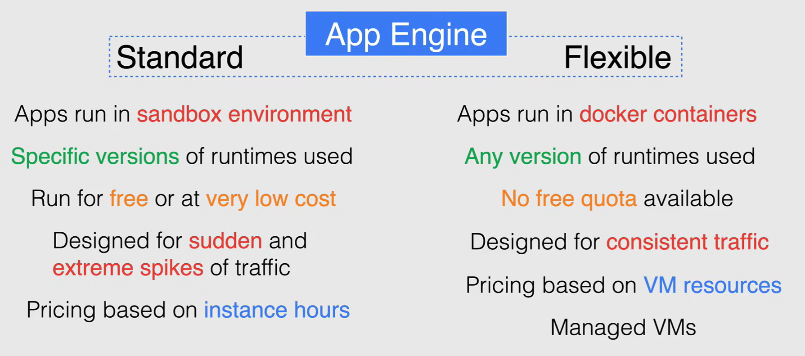
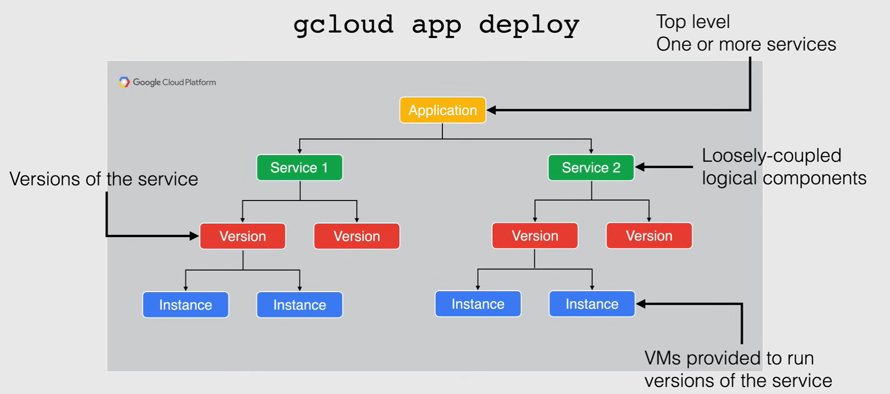
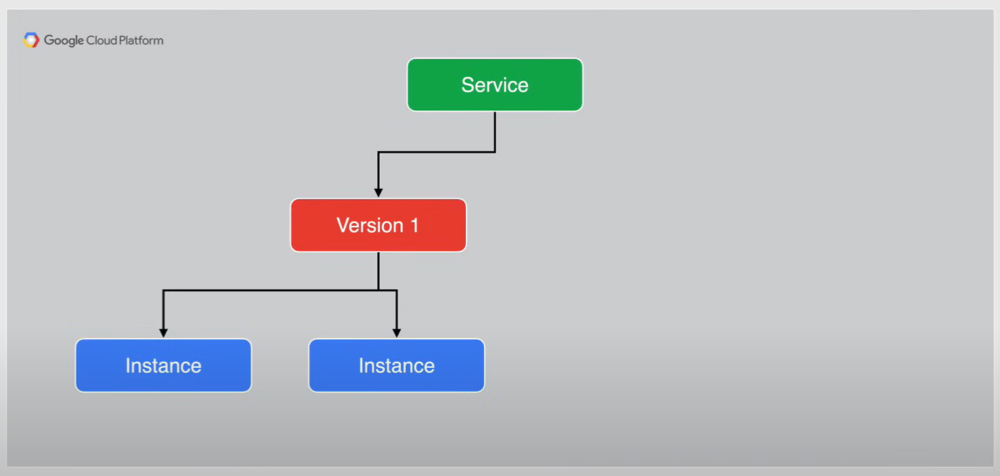
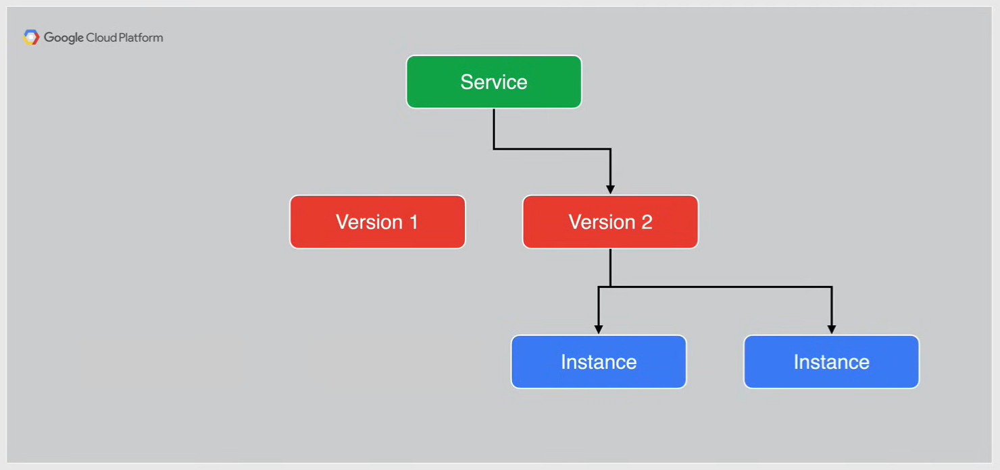
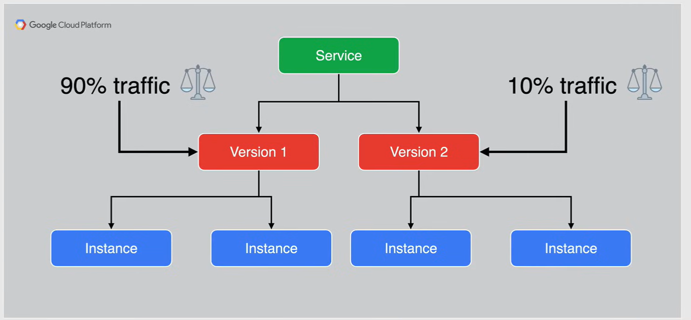
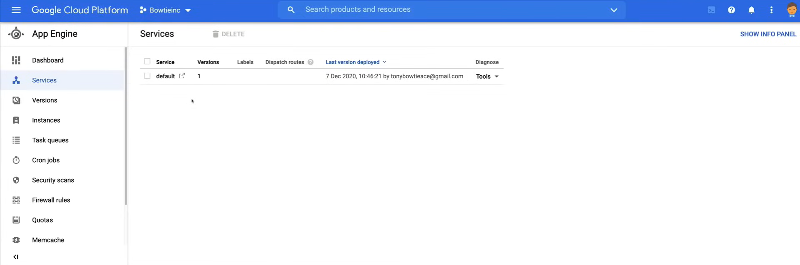
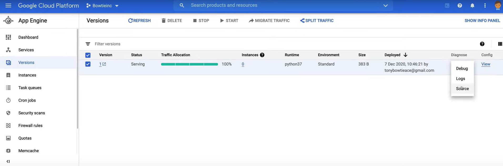
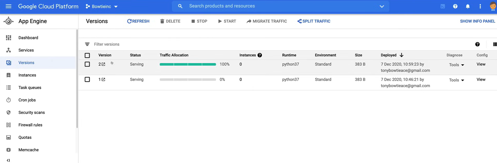
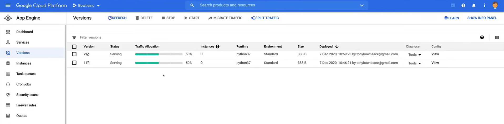

# App Engine Overview

**App Engine** is a *fully managed, serverless platform* for developing and hosting web applications at scale.

This is Google's *PaaS* offering that was designed for developers, so that they can develop their application and let App Engine do all the heavy lifting by taking care of provisioning the servers and scaling the instances needed based on demand.

App Engine gives you the flexibility of launching your *code* as is, or you can launch it as a *container*,and uses runtime environments of a variety of different programming languages, like Python, Java, nodeJS, Go, Ruby, PHP or .NET.

Applications deployed on App Engine that experience regular traffic fluctuations or newly deployed applications where you're simply unsure about the load are *auto-scaled accordingly and automatically*.

- Your apps scale up to the number of instances that are running to provide consistent performance or scale down to minimize idle instances and reduces costs.

- App Engine also has the capabilities of being able to deal with rapid scaling for sudden extreme spikes of traffic

Having *multiple versions* of your application within each service allows you to quickly switch between different versions of that application for rollbacks, testing or other temporary events.

- You can route traffic to one or more specific versions of your application by migrating or splitting traffic
- You can use traffic splitting to specify a percentage distribution of traffic across two or more of the versions within a service.
- Allows you to do AB testing or blue-green deployment between your versions when rolling out new features.
 
App Engine supports connecting to *back end storage services* such as Cloud Firestore, Cloud SQL and Cloud Storage, along with connecting to on premises databases and even external databases that are hosted on other public clouds.

App Engine is available in 2 separate flavors **standard** and **flexible** environments, and each environment offers their own set of features.

## Standard and Flexible Environments

App Engine is available in *standard* and *flexible* environments depending on your application needs, either one will support what you need for your workload, or you could even use both simultaneously.



- **Standard Environment**:
  - Applications run in a *secure sandbox environment*, allowing App Engine standard to distribute requests across multiple servers and scaling servers to meet traffic demands.
  - Your application runs with its own secure, reliable environment that is independent of the hardware operating system or physical location of the server.
  - The source code is written in *specific versions* of these supported programming languages
  - It is intended to run for *free* or at a *very low cost*, where you pay only for what you need and when you need it.
  - With App Engine standard, your application can scale to zero instances when there is no traffic.
  - App Engine standard is designed for *sudden* and *extreme spikes of traffic*, which require immediate scaling
  - Pricing for standard App Engine is based on *instance hours*.

- **Flexible Environment**:
  - The application instances run within Docker containers, that includes a custom runtime or source code written in other programming languages.
  - These docker containers are then run on Compute Engine flexible
  - It will *run any (version)* source code that is written in a version of any of the supported programming languages for App Engine flexible.
  - Unlike the standard environment, unfortunately there is *no free quota* for App Engine flexible as well.
  - App Engine flexible is designed for *consistent traffic* or for applications that experience regular traffic fluctuations
  - Pricing is **based on the VM resources** and not on instance hours like App Engine standard.
  - Where App Engine flexible really shines over App Engine standard are how the VMS are managed.
    - So in instances are health checked, healed is necessary and collocated with other services within the project.
    - The VMS operating system is updated and applied automatically.
    - VMS are restarted on a weekly basis to make sure any necessary operating system and security updates are applied.
    - SSH, along with root access, are available to the VM Instances running your containers.

## Deploying Applications



Deploying applications to App Engine is as simple as using the `gcloud app deploy` command.

- *Application*: This is command automatically builds a container image from your configuration file by using the cloud build service and then deploys that image to App Engine.

- *Services*: in App Engine application is made up of a single application resource that consists of one or more services. Each Service can be configured to use different run times and to operate with different performance settings.

  - Services and App Engine are used to factor your large applications into logical components that can securely share App Engine features and communicate with one another.
  - These App Engine services become a loosely coupled behaving like microservices.

- *Version*: within each service you deploy versions of that service, and each version then runs within one or more instances depending on how much traffic you configured it to handle.
  
  - Having multiple versions of your application within each service allows you to quickly switch between different versions of that application for rollbacks, testing or other temporary events.
  - You can route traffic to one or more specific versions of your application by migrating traffic to 1 specific version or splitting your traffic between 2 separate versions.

- *Instances*: then versions within your services run on one or more instances, by default App Engine scales your application to match the load.
  
  - Your applications will scale up the number of instances that are running to provide consistent performance or scale down to minimize idle instances and reduce costs.

## Managing Instances

Now when it comes to managing instances:

- App Engine can *automatically create and shut down* instances as traffic fluctuates.
- You can *specify a number of instances* to run regardless of the amount of traffic.
- You can also configure how and when new instances are created by *specifying new scaling type* for your application
  - how you do this is you specify the scaling type in your applications `app.yaml` file.

Now there are three different types of scaling choices to choose from:

- *Automatic Scaling*: it creates instances based on request rate, response latencies, and other application metrics.
  - You can specify threshold for each of these metrics as well as a minimum number instances to keep running at all times.
  - If you use automatic scaling each instance in your application has its own queue for incoming requests. Before the queues become long enough to have a visible effect on your app's latency, App Engine automatically creates one or more new instances to handle the load.

- *Basic Scaling*: it creates instances when your application receives requests.
  - Each instance is shut down when the application becomes idle.
  - Basic scaling is fantastic for intermittent workloads, or if you're looking to drive your application by user activity.
  - App Engine will try to keep your cost slow, even though it might result in higher latency as the volume of incoming requests increase.

- *Manual Scaling*: is where you specify the number of instances that continuously run regardless of the load.
  - So these are instances that are constantly running and this allows complex startup tasks on the instances to have already been completed when receiving requests and applications that rely on the state of the memory overtime.
  - So this is ideal for instances whose configuration scripts require some time to fully run their course.

## Traffic Migration

**Traffic migration** switches the request routing between the versions within a service of your application, moving traffic from one or more versions to a single new version.

So when deploying a new version with the same name of an existing version, it causes an immediate traffic migration, all instances of the old version are immediately shut down.

In App Engine standard you can choose to route requests to the target version, either immediately or gradually. You can also choose to enable warm up requests if you want the traffic *gradually migrated* to the a version.

Gradual traffic migration is non supported in app edge and flexible, and traffic is migrated immediately.

Now, one thing to note is that when you immediately migrate traffic to a new version without any running instances, then your application will have a spike in latency for loading requests while instances are being created.





## Traffic Splitting

Another way to manage traffic on App Engine is through **Traffic splitting**.

You can use traffic splitting to specify a percentage distribution of traffic across two or more of the versions within a service.

So in this example, if I am deploying a new version of my service, I can decide on how I want to distribute traffic to each version of my application.

So I decide that I want to keep my current version in play, but rule out the new version of my application to 10% of my users leaving the old version was still 90% of the traffic going to that version.



And so splitting traffic allows you to conduct A/B testing between your versions and provides control over the pace when rolling out features.

**NOTE:** when you've specified two or more versions for splitting, you must choose whether to split traffic by either IP address, each to be cookie, or do it randomly.

## Demo

A video demo of the following lab is available [here](https://youtu.be/jpno8FSqpc8?si=LXxFhqKwP3sMYMkw&t=62142).

In this demo you're going to build another application to deploy on app engine called serverless bow ties. This demo will run you through the ins and outs of deploying the website application on app engine along with managing it while experiencing no down time.

### Deploying the Application

1. Go to the **App Engine** section in the console.
2. To use the Cloud Shell, click on the **Activate Cloud Shell** button.
3. Upload the code inside [`01_App_Engine_Overview`](res\01_App_Engine_Overview) to the Cloud Shell.
   1. As we can see in the `app.yaml` file, the runtime is set to `python37`, and we have an `default_expiration` set to `2s` and it is due to a caching issue that happens with App Engine.
   2. To simulate traffic splitting between the two websites applications, we need to expire the cache.
   3. The first handler shows the files that will be uploaded to the CLoud Storage bucket, and the second stating what static files will be presented.
4. Run the following command to deploy the application:
   
    ```bash
    gcloud app deploy --version 1
    ```

The first time you deploy a version of your application, it will always deploy to the `default` service initially, and only then will you be able to deploy another name service to App Engin.

Now here where it says setting traffic split for service, this is referring to the configuration for traffic splitting being applied in the background, which I will be getting into a little bit later.

And lastly, the URL shown for the deployed service will always start with the name of your project, followed by `.us.r.app.spot.com` which is why your production Google recommends to run App Engine in a completely separate project before this demo, running it in the same project that we've been using will suffice.

1. Go to the **App Engine** section in the console.
2. Go to the **Services** section.

    
    

- Because this is a static website and application, we won't be using any instances, so this will always show a `0`.

3. Click on the `default` link to view the deployed application.

### App Engine Menu

Now there's a couple of things that I wanted to run through here on the left hand menu, just for your information.

1. Clickin on **Instances** and if we were running any instances, we are able to see a summary of those instances.
2. Clicking on **Task Queues**, here is where I can manage my task queues. But this is a legacy service that will soon be deprecated.
3. Clicking on **Cron Jobs** here, I can schedule any tasks that I need to run at any specific time on our recurring basis.
4. Clicking on **Firewall ruses** I can edit or add any firewall rules if I need to
   - And as you can see, the default firewall rule is open to the world. Now you probably notice meant hash as being one of the options here in the menu. But this is a legacy service that will soon be deprecated.
5. **Memcache** is a distributed in memory data store that is bundled into the python to runtime, acting as a cache for specific tasks.
   - And Google recommends moving to memory store for redis if you're planning on applying caching for your App Engine application. 
6. Under **Settings**, here's where you can change your settings for your application.
   - I can add in custom domains, any ssl certificates, setting up email for any applications that want to send email out to your users.

### Deploying the Second Version

Now, we can deploy the second version of the application.

1. Open the Cloud Shell and move inside the `sitev2` directory.
2. Run the same command as before to deploy the second version of the application:

    ```bash
    gcloud app deploy --version 2
    ```

3. Go to the **App Engine** section in the console.
4. Refresh the page and you will see the new version of the application.

    

### A/B Testing

Now we want to simulate an A/B test or Blue-Green deployment, so we want to split the traffic between the two versions of the application.

So in production, let's say that you would really see new version and inversion doesn't go according to plan. Can always go back to the previous version an app engine allows you to do that very easily.

1. Click on the version `1` in the list of **Versions** page.
2. Click on **Migrate Traffic**.

### Splitting Traffic

1. Go to the **App Engine** section in the console.
2. Go to the **Versions** section.
3. Click on the **Split Traffic** button and fill in the details as shown below:

   - **Split traffic by**: IP address
   - **Traffic allocation**
     - **Version** `1` and **Allocation** `50` 
     - **Version** `2` and **Allocation** `50`
   - Click on **Save**



To clean up click on the **Settings** section and then click on **Disable Application**.