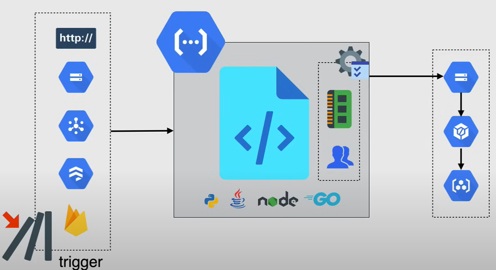
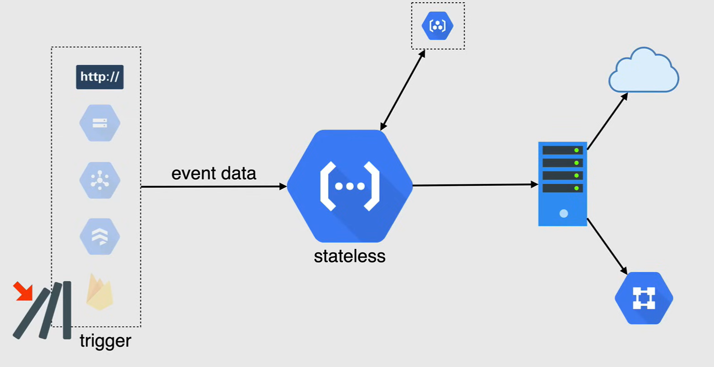
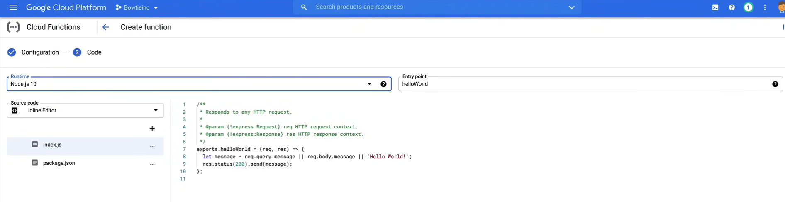

# Introduction to Cloud Functions

**Cloud Functions** are a *serverless* execution environment, i.e. like App Engine, there is no need to provision any servers or updating vms as the infrastructure is all handled by Google.

But unlike App Engine, we'll never see the servers, so the provisioning of resources happens when the code is executing.

Cloud Functions are a *Function as a Service (FaaS)* offering, and this is where you upload code that is purposely written in a supported programming language, and when your code is triggered, it is executed in a fully managed environment, and your build for when that code is executed. 

Cloud Functions run in a *runtime* environment and support many different run times, like Python, Java, nodeJS, Go and .NET core.

Cloud Functions are *event-driven*, so when something happens in your environment, you can choose whether or not you'd like to respond to this event.

- If you do, in your code can be executed in response to the event.

These *triggers* can be one of a few different types, such as HTTP, Pub/Sub, Cloud Storage, and now Firestore and Firebase, which are in beta and have yet to be seen in the exam.

Cloud Functions are *priced according to how long your function runs* and how many resources you provision for your function.

- If your function makes an outbound network request there are also additional data transfer fees.

Cloud Functions also include a perpetual free tier, which allows you 2 million implications or executions of your function.

## How Cloud Functions Work

Cloud Functions themselves are very simple, but have a few steps to execute before actually running.



1. After selecting the name in a region, you want your function to live in, you would then *select the trigger* you wish to use, and you can choose from the many I listed earlier:

   - HTTP,
   - Cloud Storage
   - Pub/Sub
   - Cloud Firestore
   - Firebase

    A trigger is a declaration that you're interested in a certain event or set of events, binding a function to a trigger allows you to capture and act on these events.

2. *Authentication/Configuration* in the next step, and can be selected with public access or configured through IAM.

   - Now there are some optional settings that can be configured where you would provide the amount of memory the function will need to run, networking preferences and even selection for a service account.

3. Once all the settings have been solidified, your written code can then be put into the function. 

    - The functions code supports a variety of languages as stated before, like Python, Java, nodeJS or Go.
    - When writing your code, there are two distinct types of Cloud Functions that you could use:
      - *HTTP functions*
        - You invoke them from standard HTTP requests.
        - These HTTP requests wait for the response and support handling of common HTTP request methods like GET, PUT, POST, DELETE, and OPTION.
        - When you use Cloud Functions, a TLS certificate, is automatically provisioned for you. So all HTTP functions can be invoked via secure connection.

      - *Background functions*
        - these are used to handle events from your GCP infrastructure, such as messages on a Pub/Sub topic or changes in a Cloud Storage bucket.

4. Now there are two things that will happen when deploying your code.

   1. First one is the binding of your trigger to your function.
      1. Once you bind a trigger, you cannot bind another one to the same function.
      2. Only one trigger can be found to a function at a time.

   2. The second thing that will happen when you deploy your function source code to Cloud Functions is that source code is stored in a cloud storage bucket as a zip file.
      1. Cloud Build then automatically build your code into a container image that pushes that image to container registry.
      2. Cloud Functions accesses this image when it needs to run the container to execute your function.
      3. The process of building the image is entirely automatic and requires no manual intervention.

And so at this point in the process, the building of your function is now complete, now that the function has been created, we now wait for an event to happen.

An **event** are things that happen within your cloud environment that you might want to take action off. These might be changes to data in Cloud SQL, files added to Cloud Storage or new VM being created.

When an event triggers the execution of your cloud function, data associated with the event is passed via the *functions parameters*, the type of events determines the parameters that are passed to your function.

- Cloud functions handles incoming requests by assigning them to instances of your function. Depending on the volume of requests, as well as the number of existing function instances, Cloud Functions may assign a request to an existing instance or create a new one.

- So the cloud function will grab the image from cloud registry and hand off the image along with the event data to the instance for processing. 

- Each instance of a function handles only one concurrent request at a time. This means that while your code is processing one request, there is no possibility of a second request being routed to the same instance.

- Thus, the original request can use the full amount of resources that you requested, and this is the memory that you assigned to your cloud function when deploying it.

To allow Google to automatically manage and scale the functions, he must be **stateless**. Functions are not meant to be persistent, nor is the data that is passed on to the function. So once the function has run and all data has been processed by the server, it is then passed on to either a VPC or to the Internet.



Now, by default, functions have public Internet access unless configured otherwise. Functions can also be private and used within your BPC, or must be configured before deployment. 

## Demo

A video demo of creating and deploying a cloud function is available [here](https://youtu.be/jpno8FSqpc8?si=R8dHjcw2Nb8agkZE&t=63537).

### Deploying a Function from the Console

1. Go to the **Cloud Functions** page in the Cloud Console.
2. Enable the Cloud Functions API.
3. Click **Create Function** and fill in the following fields:
   - **Function name**: `hello_world`
   - **Region**: `us-east1`
   - **Trigger Type**: `HTTP`
   - **Authentication**: `Allow unauthenticated invocations`
   - Leave the rest as default and click **Save**.

    

4. Click on **Deploy** and wait for the function to be deployed.

To trigger the function, we can click on the URL provided in the **Trigger** tab, or using the Cloud Shell.

```bash
gcloud functions describe hello_world --region=us-east1
```

The output will show the URL to trigger the function.

```bash
https://us-east1-<project-id>.cloudfunctions.net/hello_world
```

Clicking on the URL will trigger the function and return the output.

### Deploying a Function from the Command Line

1. Upload the code contained in [`02_Introduction_to_Cloud_Functions`](res\02_Introduction_to_Cloud_Functions) folder to the CLoud Shell.
2. Enter into the folder and run the following command to deploy the function.

    ```bash
    gcloud functions deploy you_called --runtime python38 --trigger-http --allow-unauthenticated
    ```

3. The function will be deployed and the URL to trigger the function will be provided, so trigger the function using the URL.

4. In the URL, add `?name=<your-name>` to pass the name as a parameter to the function.

    ```bash
    https://us-east1-<project-id>.cloudfunctions.net/you_called?name=John
    ```

Remember to delete the function after you are done with it.

```bash
gcloud functions delete you_called --region=us-east1
```
