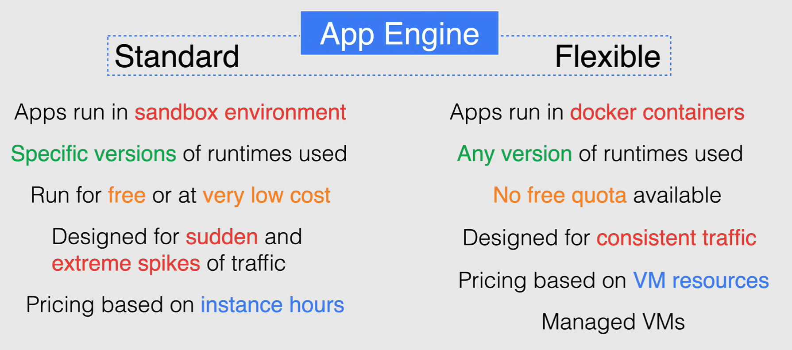
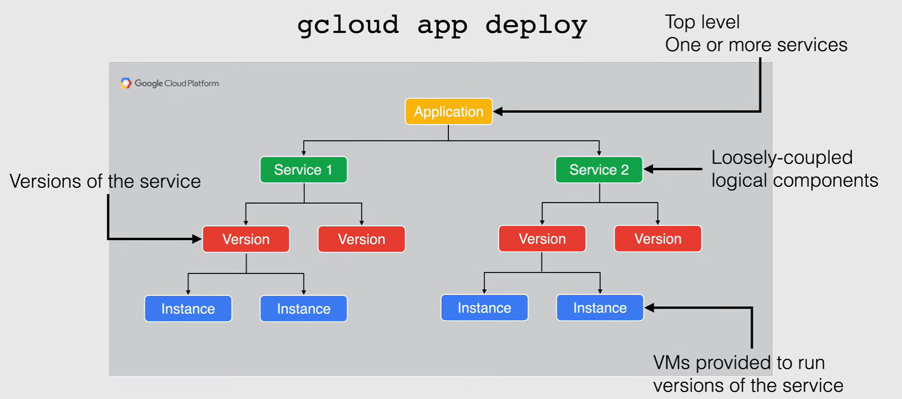
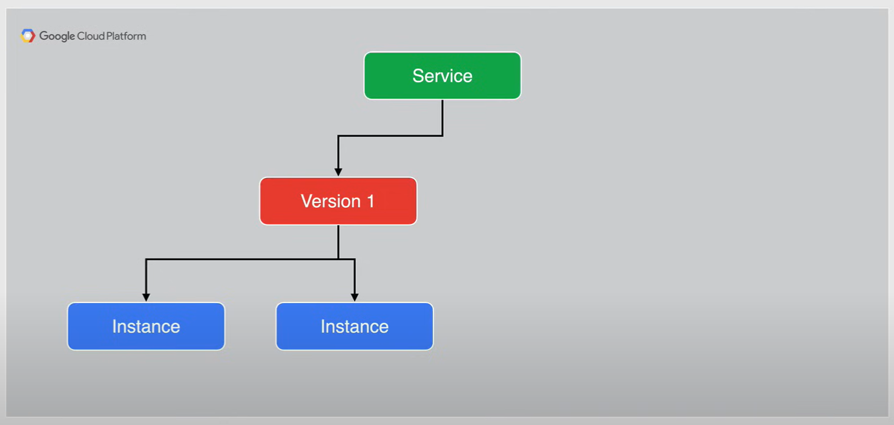
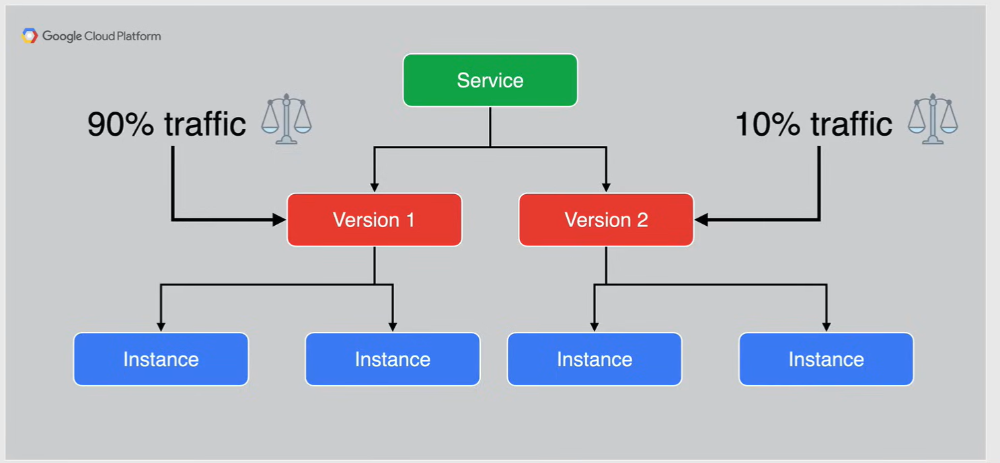
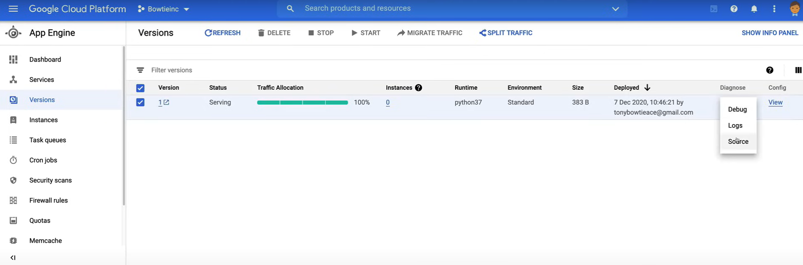
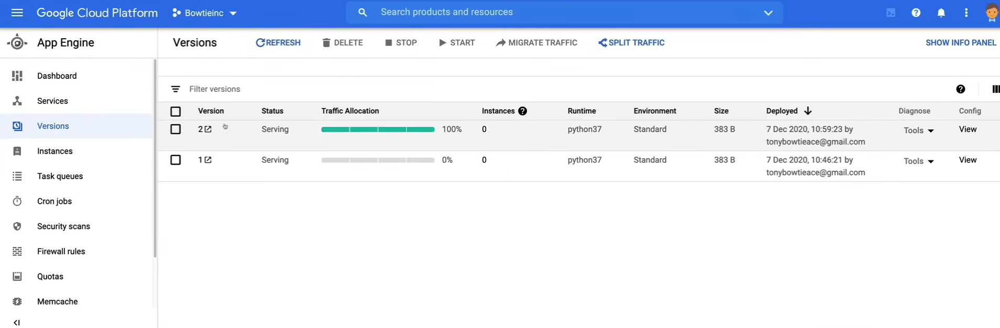

# App Engine Overview

**App Engine** è una piattaforma *serverless completamente gestita* per lo sviluppo e l'hosting di applicazioni web su larga scala.

Questa è l'offerta *PaaS* di Google progettata per gli sviluppatori, in modo che possano sviluppare la propria applicazione e lasciare che App Engine si occupi di tutte le operazioni complesse, occupandosi della fornitura dei server e della scalabilità delle istanze in base alla domanda.

App Engine ti offre la flessibilità di lanciare il tuo *codice* così com'è, oppure puoi lanciarlo come un *container*, utilizzando ambienti di runtime di una varietà di diversi linguaggi di programmazione, come Python, Java, nodeJS, Go, Ruby, PHP o .NET.

Le applicazioni distribuite su App Engine che subiscono fluttuazioni regolari del traffico o le nuove applicazioni appena distribuite, di cui non si è sicuri del carico, vengono *ridimensionate automaticamente in base alle necessità*.

- Le tue app si ridimensionano al numero di istanze in esecuzione per garantire prestazioni costanti o si riducono al minimo le istanze inutilizzate per ridurre i costi.

- App Engine ha anche la capacità di gestire la scalabilità rapida per improvvisi picchi di traffico estremi.

Avere *versioni multiple* della tua applicazione all'interno di ciascun servizio ti consente di passare rapidamente tra diverse versioni di quell'applicazione per rollback, test o altri eventi temporanei.

- Puoi instradare il traffico verso una o più versioni specifiche della tua applicazione migrando o suddividendo il traffico.
- Puoi utilizzare la suddivisione del traffico per specificare una distribuzione percentuale del traffico tra due o più delle versioni all'interno di un servizio.
- Ti consente di fare test A/B o di effettuare il rilascio graduale tra le tue versioni quando introduci nuove funzionalità.

App Engine supporta la connessione a *servizi di archiviazione di back-end* come Cloud Firestore, Cloud SQL e Cloud Storage, oltre alla connessione a database locali e persino a database esterni ospitati su altre cloud pubbliche.

App Engine è disponibile in 2 diverse varianti: ambienti **standard** e **flessibili**, e ogni ambiente offre il proprio set di funzionalità.

## Standard and Flexible Environments

App Engine è disponibile in due ambienti: *standard* e *flessibile*, a seconda delle esigenze della tua applicazione. Entrambi supportano ciò di cui hai bisogno per il tuo carico di lavoro, o puoi utilizzarli contemporaneamente.



- **Ambiente Standard**:
  - Le applicazioni vengono eseguite in un *ambiente sandbox sicuro*, che consente ad App Engine standard di distribuire le richieste su più server e di scalare i server per soddisfare le esigenze di traffico.
  - La tua applicazione viene eseguita in un ambiente sicuro e affidabile, indipendente dall'hardware, dal sistema operativo o dalla posizione fisica del server.
  - Il codice sorgente è scritto in *versioni specifiche* di questi linguaggi di programmazione supportati.
  - È progettato per essere eseguito *gratuitamente* o a *costi molto bassi*, pagando solo ciò di cui hai bisogno e quando ne hai bisogno.
  - Con App Engine standard, la tua applicazione può scalare a zero istanze quando non c'è traffico.
  - App Engine standard è progettato per *picchi improvvisi* e *elevati di traffico*, che richiedono una scalabilità immediata.
  - Il prezzo di App Engine standard si basa sulle *ore di istanza*.

- **Ambiente Flessibile**:
  - Le istanze dell'applicazione vengono eseguite all'interno di container Docker, che includono un runtime personalizzato o codice sorgente scritto in altri linguaggi di programmazione.
  - Questi container Docker vengono quindi eseguiti su Compute Engine flessibile.
  - Puoi eseguire qualsiasi versione di codice sorgente scritto in una delle lingue di programmazione supportate per App Engine flessibile.
  - A differenza dell'ambiente standard, purtroppo non esiste una quota gratuita per App Engine flessibile.
  - App Engine flessibile è progettato per il *traffico costante* o per le applicazioni che subiscono fluttuazioni regolari del traffico.
  - Il prezzo si basa sulle *risorse delle VM* e non sulle ore di istanza come App Engine standard.
  - Dove App Engine flessibile brilla rispetto ad App Engine standard è nella gestione delle VM.
    - Le istanze vengono controllate per la salute e ripristinate se necessario, e vengono collocate insieme ad altri servizi all'interno del progetto.
    - Il sistema operativo delle VM viene aggiornato e applicato automaticamente.
    - Le VM vengono riavviate settimanalmente per assicurarsi che vengano applicati gli aggiornamenti necessari del sistema operativo e della sicurezza.
    - SSH, insieme all'accesso root, è disponibile per le istanze delle VM che eseguono i tuoi container.

## Deploying Applications



Il deploy delle applicazioni su App Engine è semplice come utilizzare il comando `gcloud app deploy`.

- *Application*: Questo comando crea automaticamente un'immagine del container dal file di configurazione utilizzando il servizio di build cloud e quindi distribuisce quell'immagine su App Engine.

- *Services*: In App Engine, un'applicazione è composta da una risorsa di applicazione singola che consiste in uno o più servizi. Ogni servizio può essere configurato per utilizzare runtime diversi e operare con diverse impostazioni di prestazioni.

  - I servizi e App Engine vengono utilizzati per suddividere le grandi applicazioni in componenti logici che possono condividere in modo sicuro le funzionalità di App Engine e comunicare tra loro.
  - Questi servizi di App Engine diventano componenti debolmente accoppiati che si comportano come microservizi.

- *Version*: All'interno di ogni servizio, è possibile distribuire versioni di tale servizio, e ogni versione viene quindi eseguita in una o più istanze a seconda di quanto traffico è configurato per gestire.

  - Avere più versioni della tua applicazione all'interno di ciascun servizio ti consente di passare rapidamente tra diverse versioni di quell'applicazione per rollback, test o altri eventi temporanei.
  - Puoi instradare il traffico verso una o più versioni specifiche della tua applicazione migrando il traffico verso una versione specifica o suddividendo il traffico tra due versioni separate.

- *Instances*: Le versioni all'interno dei tuoi servizi vengono eseguite su una o più istanze. Per impostazione predefinita, App Engine scala la tua applicazione in base al carico.

  - Le tue applicazioni si ridimensionano aumentando il numero di istanze in esecuzione per garantire prestazioni costanti o si riducono al minimo le istanze inutilizzate per ridurre i costi.

## Managing Instances

Ora, per quanto riguarda la gestione delle istanze:

- App Engine può *creare e spegnere automaticamente* istanze in base alle fluttuazioni del traffico.
- Puoi *specificare un numero di istanze* da eseguire indipendentemente dalla quantità di traffico.
- Puoi anche configurare come e quando vengono create nuove istanze specificando un *nuovo tipo di scalabilità* per la tua applicazione
  - Per fare ciò, specifica il tipo di scalabilità nel file `app.yaml` della tua applicazione.

Ci sono tre diversi tipi di scalabilità tra cui scegliere:

- *Scalabilità automatica*: crea istanze in base al tasso di richieste, alle latenze di risposta e ad altre metriche dell'applicazione.
  - Puoi specificare una soglia per ciascuna di queste metriche, così come un numero minimo di istanze da mantenere in esecuzione in ogni momento.
  - Se utilizzi la scalabilità automatica, ogni istanza della tua applicazione ha la propria coda per le richieste in arrivo. Prima che le code diventino abbastanza lunghe da avere un effetto visibile sulla latenza dell'app, App Engine crea automaticamente una o più nuove istanze per gestire il carico.

- *Scalabilità di base*: crea istanze quando la tua applicazione riceve richieste.
  - Ogni istanza viene spenta quando l'applicazione diventa inattiva.
  - La scalabilità di base è fantastica per i carichi di lavoro intermittenti o se desideri far funzionare la tua applicazione in base all'attività dell'utente.
  - App Engine cercherà di mantenere bassi i tuoi costi, anche se potrebbe comportare un aumento della latenza all'aumentare del volume delle richieste in ingresso.

- *Scalabilità manuale*: qui specifici il numero di istanze che vengono eseguite continuamente indipendentemente dal carico.
  - Queste sono istanze che sono in esecuzione costante e ciò consente di completare già le complesse attività di avvio sulle istanze quando si ricevono richieste e applicazioni che dipendono dallo stato della memoria nel tempo.
  - Questo è ideale per le istanze le cui configurazioni richiedono del tempo per essere completamente eseguite.

## Migrazione del Traffico

**La migrazione del traffico** cambia il routing delle richieste tra le versioni all'interno di un servizio della tua applicazione, spostando il traffico da una o più versioni a una singola nuova versione.

Quindi, quando distribuisci una nuova versione con lo stesso nome di una versione esistente, si verifica una migrazione immediata del traffico, tutte le istanze della vecchia versione vengono immediatamente chiuse.

In App Engine standard puoi scegliere di instradare le richieste alla versione di destinazione, sia immediatamente che gradualmente. Puoi anche scegliere di abilitare le richieste di "warm up" se desideri che il traffico venga migrato gradualmente verso una versione.

La migrazione graduale del traffico non è supportata in App Engine flessibile, e il traffico viene migrato immediatamente.

Ora, una cosa da notare è che quando si migra immediatamente il traffico verso una nuova versione senza alcuna istanza in esecuzione, la tua applicazione avrà un picco di latenza per il caricamento delle richieste mentre vengono create le istanze.




## Traffic Splitting

Un altro modo per gestire il traffico su App Engine è attraverso **Traffic splitting**.

Puoi utilizzare il traffic splitting per specificare una distribuzione percentuale del traffico tra due o più delle versioni all'interno di un servizio.

Quindi, in questo esempio, se sto distribuendo una nuova versione del mio servizio, posso decidere come voglio distribuire il traffico su ciascuna versione della mia applicazione.

Decido quindi di mantenere in gioco la mia versione corrente, ma di indirizzare la nuova versione della mia applicazione al 10% degli utenti, lasciando che la vecchia versione riceva ancora il 90% del traffico.



La suddivisione del traffico ti consente di condurre test A/B tra le tue versioni e fornisce un controllo sul ritmo di distribuzione delle funzionalità.

**NOTA:** quando hai specificato due o più versioni per la suddivisione, devi scegliere se suddividere il traffico per indirizzo IP, per cookie o in modo casuale.

## Demo

A video demo of the following lab is available [here](https://youtu.be/jpno8FSqpc8?si=LXxFhqKwP3sMYMkw&t=62142).

In this demo you're going to build another application to deploy on app engine called serverless bow ties. This demo will run you through the ins and outs of deploying the website application on app engine along with managing it while experiencing no down time.

### Deploying the Application

1. Go to the **App Engine** section in the console.
2. To use the Cloud Shell, click on the **Activate Cloud Shell** button.
3. Upload the code inside [`01_App_Engine_Overview`](res\01_App_Engine_Overview) to the Cloud Shell.
   1. As we can see in the `app.yaml` file, the runtime is set to `python37`, and we have an `default_expiration` set to `2s` and it is due to a caching issue that happens with App Engine.
   2. To simulate traffic splitting between the two websites applications, we need to expire the cache.
   3. The first handler shows the files that will be uploaded to the CLoud Storage bucket, and the second stating what static files will be presented.
4. Run the following command to deploy the application:
   
    ```bash
    gcloud app deploy --version 1
    ```

The first time you deploy a version of your application, it will always deploy to the `default` service initially, and only then will you be able to deploy another name service to App Engin.

Now here where it says setting traffic split for service, this is referring to the configuration for traffic splitting being applied in the background, which I will be getting into a little bit later.

And lastly, the URL shown for the deployed service will always start with the name of your project, followed by `.us.r.app.spot.com` which is why your production Google recommends to run App Engine in a completely separate project before this demo, running it in the same project that we've been using will suffice.

1. Go to the **App Engine** section in the console.
2. Go to the **Services** section.

    
    

- Because this is a static website and application, we won't be using any instances, so this will always show a `0`.

3. Click on the `default` link to view the deployed application.

### App Engine Menu

Now there's a couple of things that I wanted to run through here on the left hand menu, just for your information.

1. Clickin on **Instances** and if we were running any instances, we are able to see a summary of those instances.
2. Clicking on **Task Queues**, here is where I can manage my task queues. But this is a legacy service that will soon be deprecated.
3. Clicking on **Cron Jobs** here, I can schedule any tasks that I need to run at any specific time on our recurring basis.
4. Clicking on **Firewall ruses** I can edit or add any firewall rules if I need to
   - And as you can see, the default firewall rule is open to the world. Now you probably notice meant hash as being one of the options here in the menu. But this is a legacy service that will soon be deprecated.
5. **Memcache** is a distributed in memory data store that is bundled into the python to runtime, acting as a cache for specific tasks.
   - And Google recommends moving to memory store for redis if you're planning on applying caching for your App Engine application. 
6. Under **Settings**, here's where you can change your settings for your application.
   - I can add in custom domains, any ssl certificates, setting up email for any applications that want to send email out to your users.

### Deploying the Second Version

Now, we can deploy the second version of the application.

1. Open the Cloud Shell and move inside the `sitev2` directory.
2. Run the same command as before to deploy the second version of the application:

    ```bash
    gcloud app deploy --version 2
    ```

3. Go to the **App Engine** section in the console.
4. Refresh the page and you will see the new version of the application.

    

### A/B Testing

Now we want to simulate an A/B test or Blue-Green deployment, so we want to split the traffic between the two versions of the application.

So in production, let's say that you would really see new version and inversion doesn't go according to plan. Can always go back to the previous version an app engine allows you to do that very easily.

1. Click on the version `1` in the list of **Versions** page.
2. Click on **Migrate Traffic**.

### Splitting Traffic

1. Go to the **App Engine** section in the console.
2. Go to the **Versions** section.
3. Click on the **Split Traffic** button and fill in the details as shown below:

   - **Split traffic by**: IP address
   - **Traffic allocation**
     - **Version** `1` and **Allocation** `50` 
     - **Version** `2` and **Allocation** `50`
   - Click on **Save**


To clean up click on the **Settings** section and then click on **Disable Application**.