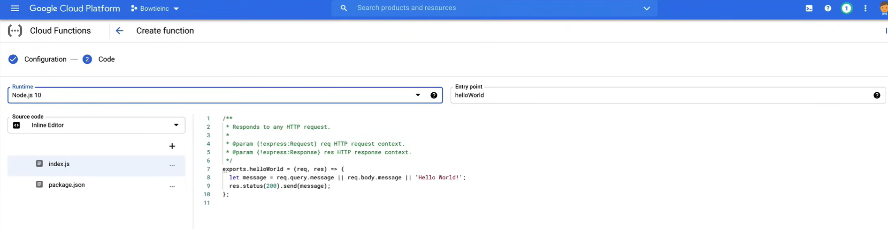

# Introduction to Cloud Functions

**Cloud Functions** sono un ambiente di esecuzione *serverless*, ovvero, come App Engine, non è necessario fornire alcun server o aggiornare le macchine virtuali poiché l'infrastruttura è gestita interamente da Google.

Ma a differenza di App Engine, non vedremo mai i server, quindi la fornitura di risorse avviene durante l'esecuzione del codice.

Cloud Functions sono un'offerta di *Function as a Service (FaaS)*, e qui si carica il codice scritto appositamente in un linguaggio di programmazione supportato, e quando il codice viene attivato, viene eseguito in un ambiente completamente gestito, e la tua build per quando viene eseguito quel codice.

Le Cloud Functions vengono eseguite in un ambiente di *runtime* e supportano molti runtime diversi, come Python, Java, nodeJS, Go e .NET core.

Le Cloud Functions sono *event-driven*, quindi quando accade qualcosa nel tuo ambiente, puoi scegliere se desideri o meno rispondere a questo evento.

- Se lo fai, il tuo codice può essere eseguito in risposta all'evento.

Questi *trigger* possono essere di diversi tipi, come HTTP, Pub/Sub, Cloud Storage e ora Firestore e Firebase, che sono in versione beta e non sono ancora stati visti nell'esame.

Le Cloud Functions sono *prezzate in base alla durata di esecuzione* della tua funzione e alle risorse che hai previsto per la tua funzione.

- Se la tua funzione effettua una richiesta di rete in uscita, sono previsti anche costi aggiuntivi per il trasferimento dei dati.

Le Cloud Functions includono anche un livello gratuito perpetuo, che consente 2 milioni di implicazioni o esecuzioni della tua funzione.

## How Cloud Functions Work

Le Cloud Functions stesse sono molto semplici, ma hanno alcuni passaggi da eseguire prima di essere effettivamente eseguite.


1. Dopo aver selezionato il nome di una regione in cui desideri che la tua funzione risieda, dovrai quindi *selezionare il trigger* che desideri utilizzare e puoi scegliere tra quelli che ho elencato in precedenza:

   - HTTP,
   - Cloud Storage
   - Pub/Sub
   - Cloud Firestore
   - Firebase

    Un trigger è una dichiarazione che indica che sei interessato a un determinato evento o a un insieme di eventi. Associare una funzione a un trigger ti consente di catturare e agire su questi eventi.

2. *Autenticazione/Configurazione* è il passaggio successivo e può essere selezionato con accesso pubblico o configurato tramite IAM.

   - Ora ci sono alcune impostazioni opzionali che possono essere configurate, in cui forniresti la quantità di memoria necessaria per eseguire la funzione, le preferenze di networking e persino la selezione di un account di servizio.

3. Una volta che tutte le impostazioni sono state definite, il tuo codice scritto può essere inserito nella funzione.

    - Il codice delle funzioni supporta una varietà di linguaggi, come Python, Java, nodeJS o Go.
    - Quando scrivi il tuo codice, ci sono due tipi distinti di Cloud Functions che potresti utilizzare:
      - *Funzioni HTTP*
        - Vengono invocate da richieste HTTP standard.
        - Queste richieste HTTP attendono la risposta e supportano la gestione dei metodi di richiesta HTTP comuni come GET, PUT, POST, DELETE e OPTION.
        - Quando usi le Cloud Functions, un certificato TLS viene automaticamente fornito. Quindi tutte le funzioni HTTP possono essere invocate tramite una connessione sicura.

      - *Funzioni di background*
        - Queste vengono utilizzate per gestire eventi nell'infrastruttura GCP, come messaggi su un argomento Pub/Sub o modifiche in un bucket di Cloud Storage.

4. Ora ci sono due cose che accadranno quando distribuisci il tuo codice.

   1. La prima è l'associazione del tuo trigger alla tua funzione.
      1. Una volta associato un trigger, non è possibile associarne un altro alla stessa funzione.
      2. Solo un trigger può essere associato a una funzione alla volta.

   2. La seconda cosa che accadrà quando distribuisci il codice sorgente della tua funzione su Cloud Functions è che il codice sorgente viene archiviato in un bucket di archiviazione cloud come file zip.
      1. Cloud Build quindi genera automaticamente il tuo codice in un'immagine del contenitore che viene caricata nel registro dei contenitori.
      2. Cloud Functions accede a questa immagine quando deve eseguire il contenitore per eseguire la tua funzione.
      3. Il processo di creazione dell'immagine è completamente automatico e non richiede intervento manuale.

E quindi, a questo punto del processo, la creazione della tua funzione è completa, ora che la funzione è stata creata, attendiamo che si verifichi un evento.

Un **evento** sono cose che accadono nel tuo ambiente cloud di cui potresti voler prendere un'azione. Questi potrebbero essere modifiche ai dati in Cloud SQL, file aggiunti a Cloud Storage o la creazione di una nuova VM.

Quando un evento attiva l'esecuzione della tua funzione cloud, i dati associati all'evento vengono passati tramite i *parametri delle funzioni*, il tipo di evento determina i parametri che vengono passati alla tua funzione.

- Le funzioni cloud gestiscono le richieste in arrivo assegnandole a istanze della tua funzione. A seconda del volume delle richieste e del numero di istanze di funzione esistenti, Cloud Functions può assegnare una richiesta a un'istanza esistente o crearne una nuova.

- Quindi la funzione cloud recupererà l'immagine dal registro cloud e passerà l'immagine insieme ai dati dell'evento all'istanza per l'elaborazione.

- Ogni istanza di una funzione gestisce solo una richiesta concorrente alla volta. Ciò significa che mentre il tuo codice sta elaborando una richiesta, non c'è possibilità che una seconda richiesta venga instradata alla stessa istanza.

- Pertanto, la richiesta originale può utilizzare l'intera quantità di risorse che hai richiesto, e questa è la memoria che hai assegnato alla tua funzione cloud durante la distribuzione.

Per consentire a Google di gestire e scalare automaticamente le funzioni, devono essere **stateless**. Le funzioni non sono destinate a essere persistenti, né i dati che vengono passati alla funzione. Quindi, una volta che la funzione è stata eseguita e tutti i dati sono stati elaborati dal server, vengono quindi passati a una VPC o a Internet.


Ora, per impostazione predefinita, le funzioni hanno accesso pubblico a Internet a meno che non venga configurato diversamente. Le funzioni possono anche essere private e utilizzate all'interno della tua BPC o devono essere configurate prima della distribuzione.

## Demo

A video demo of creating and deploying a cloud function is available [here](https://youtu.be/jpno8FSqpc8?si=R8dHjcw2Nb8agkZE&t=63537).

### Deploying a Function from the Console

1. Go to the **Cloud Functions** page in the Cloud Console.
2. Enable the Cloud Functions API.
3. Click **Create Function** and fill in the following fields:
   - **Function name**: `hello_world`
   - **Region**: `us-east1`
   - **Trigger Type**: `HTTP`
   - **Authentication**: `Allow unauthenticated invocations`
   - Leave the rest as default and click **Save**.

    

4. Click on **Deploy** and wait for the function to be deployed.

To trigger the function, we can click on the URL provided in the **Trigger** tab, or using the Cloud Shell.

```bash
gcloud functions describe hello_world --region=us-east1
```

The output will show the URL to trigger the function.

```bash
https://us-east1-<project-id>.cloudfunctions.net/hello_world
```

Clicking on the URL will trigger the function and return the output.

### Deploying a Function from the Command Line

1. Upload the code contained in [`02_Introduction_to_Cloud_Functions`](res\02_Introduction_to_Cloud_Functions) folder to the CLoud Shell.
2. Enter into the folder and run the following command to deploy the function.

    ```bash
    gcloud functions deploy you_called --runtime python38 --trigger-http --allow-unauthenticated
    ```

3. The function will be deployed and the URL to trigger the function will be provided, so trigger the function using the URL.

4. In the URL, add `?name=<your-name>` to pass the name as a parameter to the function.

    ```bash
    https://us-east1-<project-id>.cloudfunctions.net/you_called?name=John
    ```

Remember to delete the function after you are done with it.

```bash
gcloud functions delete you_called --region=us-east1
```
