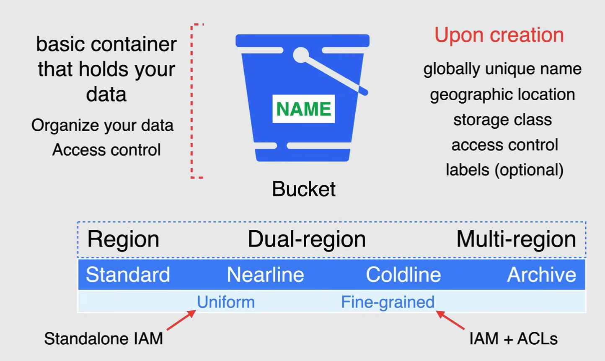
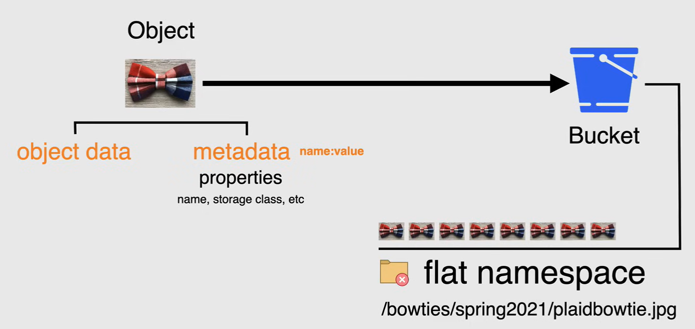
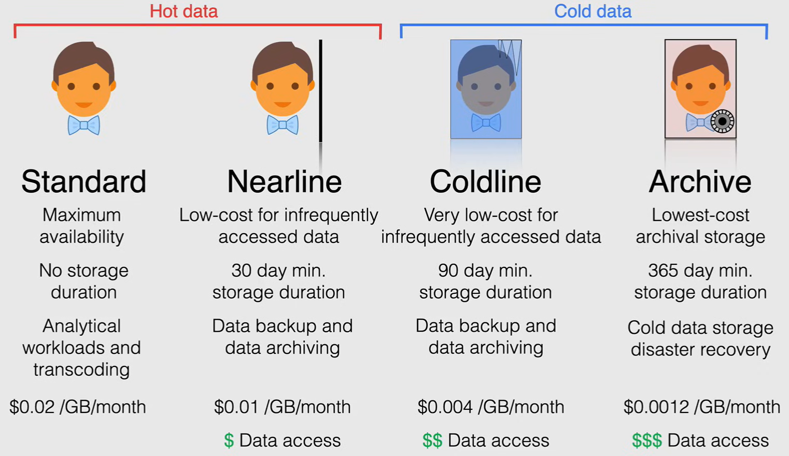
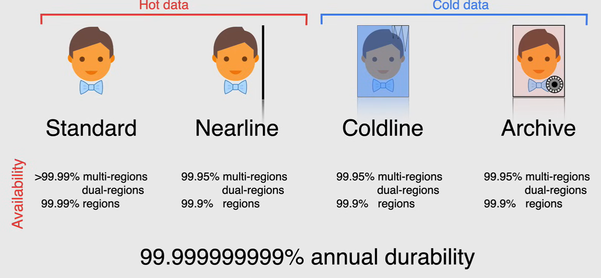
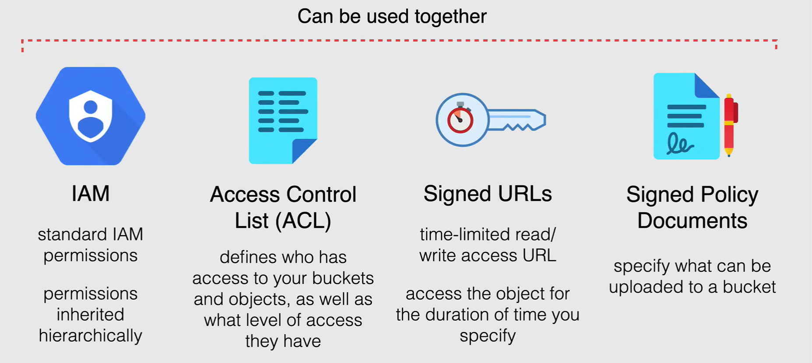
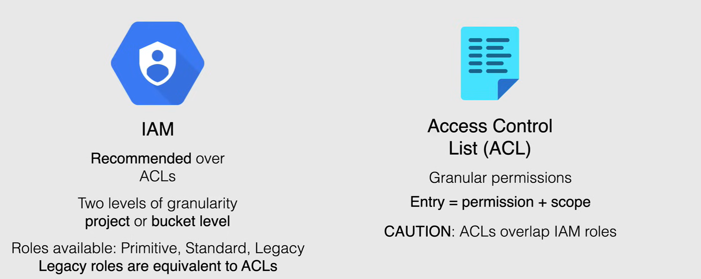
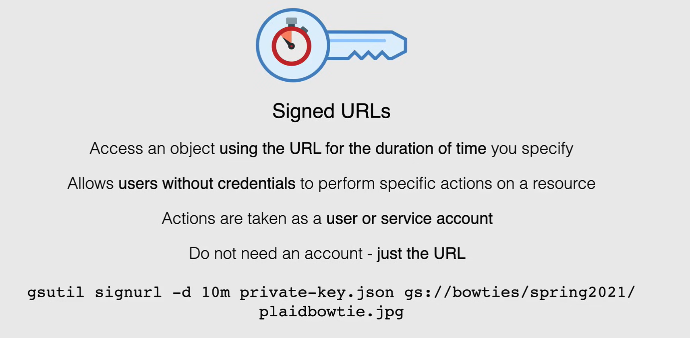

# Cloud Storage Storage Types

**Cloud storage** is a consistent, scalable, large capacity, highly durable *object storage*, and this is unlimited storage for objects with *no minimum object size*.

- But please remember that this is object storage and is not designed to store an operating system on, but the store full objects like pictures or videos.

Cloud storage has worldwide accessibility and worldwide *storage locations*.

- So anywhere that there is a region or zone, cloud storage is available from there and can be access at anytime through an Internet connection.

Cloud storage is great for *storing data* from data analytics jobs, text files with code, pictures, and videos.

Cloud storage excels for *content delivery*, *big datasets* and *backups*.

These are all stored as *objects* in *buckets*, and this is the heart of cloud storage.

## Cloud Storage Buckets

**Buckets** are the basic containers or construct that holds your data, everything that you store in cloud storage must be contained in a bucket.

- You can use buckets to organize your data and control access to your data, but unlike directories and folders, you cannot nest buckets.

- When you create a bucket, *you must specify a globally unique name* as every bucket resides in a single cloud storage name space.

- As well as a name you must specify a *geographic location* where the bucket ends contents are stored, and you have three available geography choices to choose from, from *region*. *dual region* and *multi region*.

    **NOTE:** choosing dual region and multi region is considered Geo-Redundant.

    - For dual region, Geo-Redundancy is achieved using a specific pair of Regions.
    - For multi region Geo-Redundancies achieved using a continent that contains two or more geographic places.
    
    Basically, the more regions your data is available, then greater you're availability for that data.

- After you've chosen a geographic location, a *default storage class* must be chosen, and this applies to objects added to the bucket, they don't have a storage class explicitly specified.

  - Standard
  - Nearline
  - Coldline
  - Archive



### Modifying Buckets

After you create a bucket, *you can still change its default storage class* to any class supported in the buckets location with some stipulations.

*You can only change the bucket name and location by deleting and recreating the bucket* as while once dual region is selected, it cannot be changed to multi region and when selecting multi region you will not be able to change the bucket to be dual region.

### Level of Access

Lastly you'll need to choose what level of access you want others to have on your bucket, whether you want to apply permissions *using uniform* or *fine grained access*.

- *Uniform Bucket Level Access* allows you to use `IAM alone` to manage permissions.
  - IAM applies permissions to all the objects contained inside the bucket for groups of objects with common name prefixes.

- *Fine grain option* enables you to use IAM and *Access Control* list or ACLs together to manage permissions. 
  - ACLs are a legacy Access Control system for cloud storage designed for interoperability with Amazon S3, for those of you who use AWS.
  - You can specify access and apply permissions at both the bucket level and per-individual object.

**NOTE:** labels are an optional item for bucket creation, like every other resource creation process in TCP.

## Cloud Storage Objects

**Objects** are the individual pieces of data or data trunks that you store in a cloud storage bucket.

There is no limit on the number of objects that you can create in a bucket, so you can think of objects kind of like files.

Objects have two components:

- **Object data**
  - Object data is typically a file that you want to store in cloud storage.
  - In this case, it is a picture of the flat bow time

- **Object metadata**
  - Object metadata is a collection of name value pairs that describe the various properties of that object.
  - An object's name is treated as a piece of object meta data in cloud storage and must be unique within the bucket.

Cloud storage uses a *flat namespace* space to store objects, which means that cloud storage isn't a file system hierarchy that sees all objects in a given bucket as independent with no relationship towards each other.

For convenience, tools such as the console and `gsutil` work with objects that use the slash character as if they were stored in a virtual hierarchy. For example, you can name one object `/bowties/spring2021/plaidbowtie.jpg`.

- When using the cloud console, you can then navigate to these objects as if they were in a hierarchical directory structure under the folders `bowties` and `spring2021`.



## Storage Classes

The storage class is set for an object affects the object's availability and pricing model.

So when you create a bucket, you can specify a default storage class for the bucket.

When you add objects to the bucket, they inherit this storage class unless explicitly set otherwise.



- **Standard storage**
  - It is considered best for hot data or frequently access data
  - It is best for short term use as it does not have any specified storage duration.
  - This is excellent for use in analytical workloads and transcoding.
  - The price for this storage class comes in at `0.02$` per gigabyte per month.

- **Nearline storage**
  - This is considered hot data as well.
  - It's a low cost storage class for storing infrequently access data.
  - It has a slightly lower availability of 30 day minimum storage duration.
  - It comes with a cost for data access.
  - It is ideal if you're looking to continuously add files, but only plan to access them once a month.
  - It is perfect for data backup and data archiving.
  - The price for this storage class comes in at a `0.01$` per gigabyte per month.

- **Coaldlien storage**
  - It is considered cold data as it enters into more of the longer term storage classes
  - It is a very low cost storage class for storing it frequently accessed data.
  - It comes with slightly lower availability than the airline storage, a 90 day minimum storage duration.
  - Ir comes with a cost for data access that is higher than the retrieval cost for a Nearline storage. 
  - It is ideal for data you plan to read or modify at most once 1/4.
  - It is perfect for data backup and data archiving.
  - The price for the storage class comes in at `0.004$` per gigabyte per month.

- **Archive storage**
  - It is the lowest cost, highly durable storage service for data archiving, online backup and disaster recovery.
  - It even coming in at a lowest cost, the data access is still available within milliseconds.
  - Archive storage comes in at a higher cost for data retrieval, as well as a 365 day minimum storage duration.
  - It is the best choice for data that you plan to access less than once a year.
  - Archive storage also comes with the highest price for data retrieval
  - It is ideal for archive data storage that's used for regulatory purposes or disaster recovery data in the event that there is an oopsies in your environment.
  - The price of the storage class comes in at a ridiculously low price per gigabyte per month at a fraction of a penny per gigabyte per month.



Now, when it comes to choosing your geographic location, this will determine the *availability* of your data.

- As you can you see the highest availability is the Standard multi region, whereas Archive has the lowest availability when stored in a regional setting.

Now when it comes to the *durability* of your data, meaning the measurement of how healthy and resilient your data is from data loss or data corruption, Google Cloud boasts 11-9 durability annually on all data stored in any storage class on cloud storage.

- So know that your data is stored safely and will be there holding the same integrity from the date stored.

## Access Control

Now when it comes to granting permissions to your cloud storage buckets and the objects within them, there are four different options to choose from.



- *AIM permissions*:
  - these are the standard permissions that control all your other resources in Google Cloud
  - they follow the same top down hierarchy that we discussed earlier.

- *Access Control List (ACLs)*:
  - these define who has access to your buckets and objects as well as what type of access they have and these can work in tandem with AIM permission.

- *Signed URLs*:
  - these are time limited read or write access URLa that can be created by you to give access to the object in question for the duration that you specify.

- *Signed Policy Documents*:
  - these are documents to specify what can be uploaded to a bucket.

### IAM and ACLs

Now, cloud storage offers two systems for granting users permission to access your buckets and objects, IAM and Access Control list.

The systems act in parallel in order for a user to access a cloud storage resource, only one of the systems needs to grant the user permission.

- **IAM** is always a recommended method when it comes to giving access to buckets and the objects within those buckets.
  - Granting rolls at the bucket level does not affect any existing roles that you granted at the project level and vice versa.
  - Giving you 2 levels of granularity to customize your permissions.
  - You can give a user permission to read objects in any bucket, but permissions to create objects only to 1 specific bucket.
  - The roles that are available through IAM are the primitive standard storage roles or the legacy roles which are equivalent to ACLs.

- **ACLS** are there if you need to customize access and really get granular with individual objects within a bucket.
  - They are used to define who has access to your buckets and objects, as well as what level of access they have.
  - Each ACL consists of one or more entries and gives a specific user or group the ability to perform specific actions.
  - Each entry consists of two pieces of information, in *permission*, which defines what actions can be performed and the *scope* which defines who can perform the specified actions.
  - ACL should be used as caution, as IAM roles and ACLs overlap.

Cloud storage will grant a broader permission, so if you allow specific users access to an object in a bucket and then an ACL is applied to that object to make it public, then it will be publicly accessible.



### Signed URLs

Now a *Signed URL* is an URL that provides limited permission and time to make a request.

Sign Urls contain authentication information, allowing users without credentials to perform specific actions on a resource.

When you generate a sign URL, you specify a user or service account, which must have sufficient permission to make the request that the sign URL will make.

After you generate a signed URL, ayone who possesses it can use the sign URL to perform specified actions, such as reading an object within the specified period of time.

Now, if you want to provide public access to a user who doesn't have an account, you can provide a signed URL for that user, which gives the user rewrite or delete access to that resource for a limited time.

You specify an expiration date wheen you create the sign URL, so anyone who knows the URL can access the resource until the expiration time for the URL is reached, or the key used to sign the URL is rotated.

The command to create the sign URL is:

```bash
gsutil signurl -d 10m privatekey.json gs://bowties/spring2021/plaidbowtie.jpg
```

And as you can see, has been assigned for a limited time of 10 minutes.


