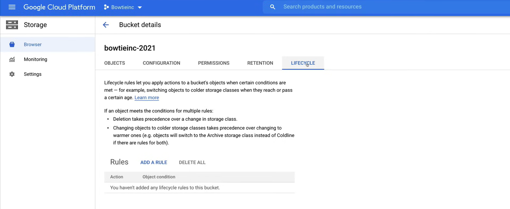
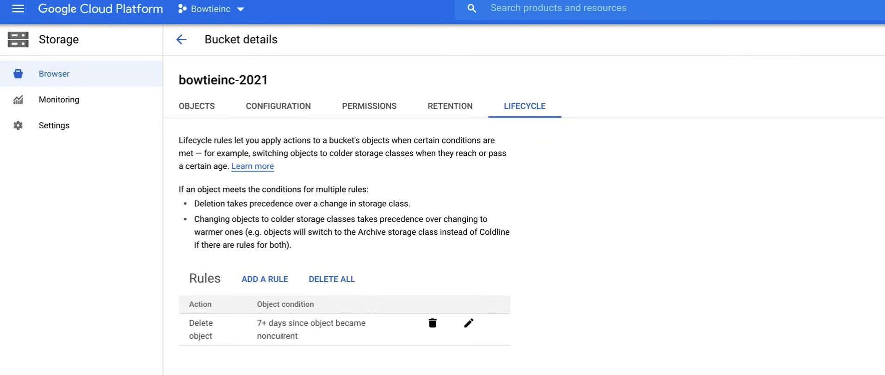

# Object Lifecycle Management and Versioning

*Object versioning and life cycle management* is a feature within cloud storage that is used to manage and sort through older files that need to be deleted along with files that are not in high need of regular access.

Knowing the capabilities of these two features can really help organize accumulated objects in storage buckets and cut down on costs.

## Versioning

Objects are **immutable**, which means that an uploaded object cannot change throughout its storage lifetime.

*Objects storage lifetime* is the time between a successful object creation or upload and successful object deletion, this means that you cannot edit objects in place.

Instead, objects are always replaced with a new version, so after the upload of the new object completes, the new version of the object is served to readers. This replacement marks the end of one object life cycle and the beginning of a new one.

To support the retrieval of objects that are deleted or replaced Cloud storage offers the object **versioning** feature.

Object versioning retains a non-current object version when the live object version gets replaced or deleted. Enabling object versioning increases storage costs, which can be partially mitigated by configuring object lifecycle management to delete older object versions.

Cloud storage uses two properties that together identify the version of an object.

- The **generation** which identifies the version of the object's data.
- The **metageneration** which identifies the version of the object's metadata.

These properties are always present with every version of the object, even if object versioning is not enabled. These properties can be used to enforce ordering of updates, so in order to enable object versioning, you would do that by enabling it on a bucket.

Once enabled, older versions remain in your bucket when a replacement or deletion occurs, so by default, when you replace an object, cloud storage deletes the old version and adds a new version.

These older versions retain the name of the object, but are uniquely identified by their generation number, when object versioning is created in older version of an object, you can use the generation number to refer to the older version. This allows you to restore a replaced object in your bucket or permanently delete older object versions.

So touching back on cost, these versions can really add up and start costing you some serious money if you have thousands of files with hundreds of versions, and this is where lifecycle management comes into play.


## Object Lifecycle Management

Cloud storage offers the **object life cycle management feature** in order to support some common use cases like setting a time to live or TTL for objects, retaining non current versions of objects, or down grading storage classes of objects to help manage costs.

In order to apply this feature to your objects, you would assign a lifecycle management configuration to a bucket. The configuration contains a set of rules which apply to current and feature objects in the bucket.

When an object meets the criteria of one of the rules, Cloud storage automatically performs the specified action on the object, and so some example use cases are shown here.

- So if you're looking to downgrade the storage class of objects holder than 365 days to ColdLine storage for compliance purposes, along with saving money, life cycle management is perfect for this.
- Another use case is when you want to delete objects created before January 1st of 2020. This is another great use case to save money.
- With keeping only the three most recent versions of each object in a bucket, with versioning enabled to keep front version objects building up.

Object lifecycle management has so many other use cases across a myriad of industries and when used correctly is a great way to achieve object management along with saving money.

### Lifecycle Management Configuration

Each life cycle management configuration contains a set of components, these are a set of *rules*, *conditions* and the *action* when the conditions are met.

- **Rules** are any set of conditions for any action.
- **Conditions** is something an object must meet before the action defined in the rule occurs on the object.
  - There are various conditions to choose from that allows you to get pretty granular.
- **Action** which is where you would have the option to delete or set storage clouds.
  - When you delete *current versions*, this will move the current version into a non current state.
  - When you delete a *non-current version* you will permanently delete the version and cannot get it back.

And so when you set the storage class it will transition the object to a different storage class, so when defining a rule you can specify any set of conditions for any action.

If you specify multiple conditions in a rule an object has to match all of the conditions for the action to be taken. So if you have 3 conditions and one of those conditions have not been met, then the action will not take place.

- If you specify multiple rules that contain the same action, the action is taken when an object matches the conditions in any of the rules.

If multiple rules have their conditions satisfied simultaneously for a single object, Cloud storage will either perform the delete action as it takes precedence over the set storage class action or the set storage class action that switches the object, to the storage class with the lowest at rest storage pricing takes precedence.

- So for example:
  - if you have one rule that deletes an object and another rule that changes the object storage class, but both rules use the exact same condition, the delete action always occurs when the condition is met
  - or if you have one rule that changes the object storage class to Nearline storage and another rule that changes the object storage class to CoaldLine storage, but both rules use the exact same condition, object storage class always changes to CoaldLine storage when the condition is met.


## Cloud Storage Considerations

When it comes to object life cycle management:

- Changes are in accordance to *object creation date*. 

- Once an object is deleted, it *cannot be undeleted*. 

- Lifecycle rules can take up to *24 hours* to take effect. 

- Test lifecycle rules in *development first*, before rolling them out into production.

## Demo

A video demo of the following lab is available [here](https://youtu.be/jpno8FSqpc8?si=nPTYdL_844LQ3PO_&t=66770).

Before doing this lab, do the lesson [03_Managing_Cloud_Storage_Access](03_Managing_Cloud_Storage_Access.md), to have all the necessary files in the bucket.

First turn on object versioning in the bucket, using the following command.

1. To see if versioning is enabled, run the following command:

    ```bash
    gsutil versioning get gs://bowtieinc-2021
    ```

    If it returns `gs://bowtieinc-2021: Suspended`, then versioning is not enabled.

2. To enable versioning, run the following command:

    ```bash
    gsutil versioning set on gs://bowtieinc-2021
    ```

    If we run the `gsutil versioning get gs://bowtieinc-2021` command again, it should return `gs://bowtieinc-2021: Enabled`.

Now we want to delete a file from the bucket.

1. Go to the **Storage** section in the console.
2. Go to the **Browser** tab.
3. Click on the bucket.
4. Select the file that you want to delete and click on the **Delete** button.

Technically, the file is not deleted, but a new version is created with a deletion marker.

To check the versions of the file, run the following command:

```bash
gsutil ls -a gs://bowtieinc-2021

# Output
# gs://bowtieinc-2021/fileofbowties.txt#1618320000000000
# gs://bowtieinc-2021/pinkelephant-bowtiw.jpg#1618320000000000
# gs://bowtieinc-2021/plaid-bowtie.jpg#1618320000000000
```

As you can see, the file is still there, and the number after the `#` is the **generation number**, that determines the version of the object's data.

To bring back the file, run the following command:

```bash
gsutil mv gs://bowtieinc-2021/fileofbowties.txt#1618320000000000 gs://bowtieinc-2021/fileofbowties.txt
```

### Versioning

Now we want to enter into the instance to do some versioning.

1. Run the following command to enter into the instance:

	```bash
	gcloud compute ssh bowtie-instance --zone=us-east1-b
	```

	Enter the password when prompted.

2. Create a new file:

	```bash
	sudo nano fileofbowties.txt
	```

	We should have the text `Learning to tie a bowtie takes time.` in the file.
	Append `V2` to the text and save the file.

3. Copy the file to the bucket:

	```bash
	gsutil cp fileofbowties.txt gs://bowtieinc-2021
	```

4. To check the version of the file in the bucket run:

	```bash
	gsutil ls -a gs://bowtieinc-2021

	# Output
	# gs://bowtieinc-2021/fileofbowties.txt#1618320000000001
	# gs://bowtieinc-2021/fileofbowties.txt#1618320000000000
	# gs://bowtieinc-2021/pinkelephant-bowtiw.jpg#1618320000000000
	# gs://bowtieinc-2021/plaid-bowtie.jpg#1618320000000000
	```

	Ast you can see, there are two versions of the file.

5. To promote the non-current version to the current version (i.e. make `V2` the non-current version), run the following command:

	```bash
	# Get the old generation number
	gsutil cp gs://bowtieinc-2021/fileofbowties.txt#1618320000000000 gs://bowtieinc-2021/fileofbowties.txt
	```

6. If we click on the link of the file in the console, we can see that there isn't the `V2` text.

### Add Lifecycle Policy to the Bucket

1. Go to the **Storage** section in the console.
2. Go to the **Browser** tab.
3. Click on the bucket.
4. Click on the **Lifecycle** tab.

	

5. CLick on the **Add rule** button and fill in the following information:

	- **Select an action**: `Delete object`
        - Click on the **Continue** button.
  	- **Select object conditions**
        - **Days since becoming non-current**: `7`
        - Click on the **Continue** button.
	- Click on the **Create** button.

6. As we can see the rule is applied.

	

Now, we want to create another rule to change the storage class of the objects.

1. Click on the **Add rule** button and fill in the following information:

	- **Select an action**: `Set storage class to Coldline`
		- Click on the **Continue** button.
  	- **Select object conditions**
		- **Age**: `90`
		- Click on the **Continue** button.
   - Click on the **Create** button.

2. As we can see the rule is applied.

	

To edit the Lifecycle Policy, we can also do it from editing the JSON file.

1. Save the lifecycle policy to a file:

	```bash
	gsutil lifecycle get gs://bowtieinc-2021 > lifecycle.json
	```

2. Open the file and edit it modifying the `age` to `120`.

	```bash
	sudo nano lifecycle.json
	```
	
	Modify the string `"condition": {"age": 90}` to `"condition": {"age": 120}`, save and exit.

3. To set the lifecycle policy from the file, run the following command:

	```bash
	gsutil lifecycle set lifecycle.json gs://bowtieinc-2021
	```