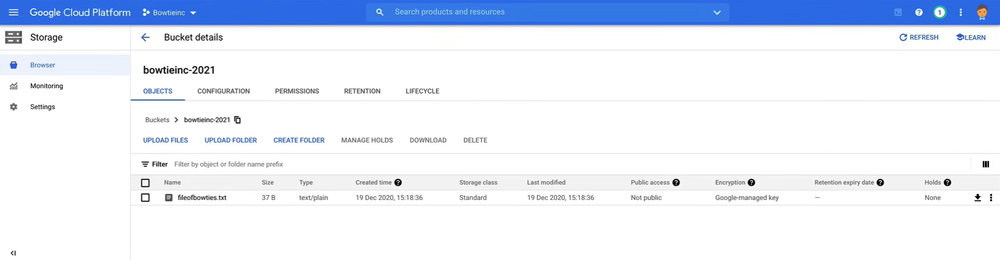
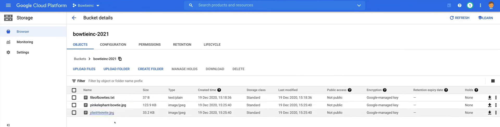
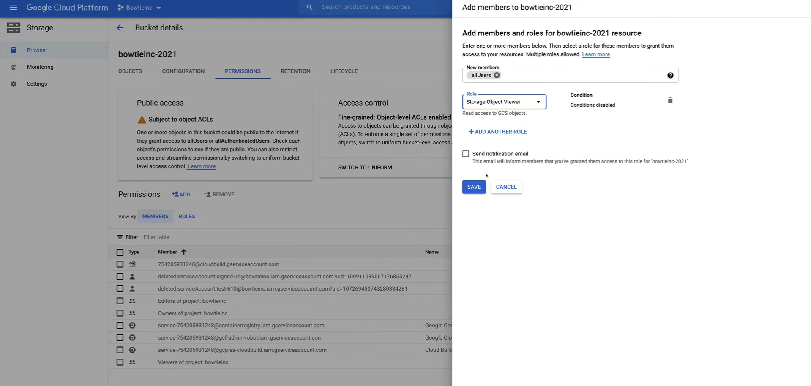
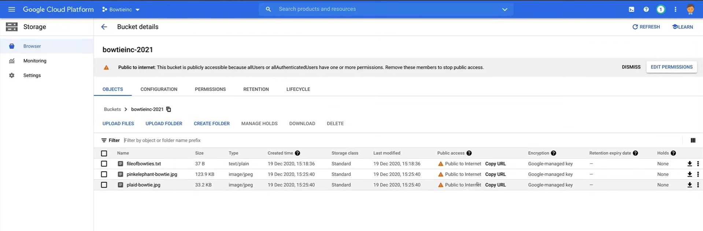
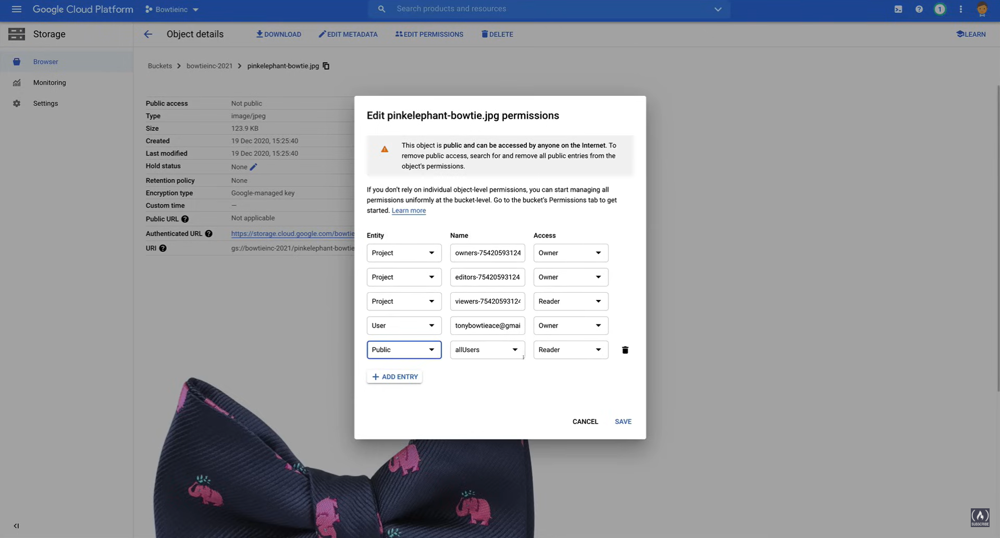
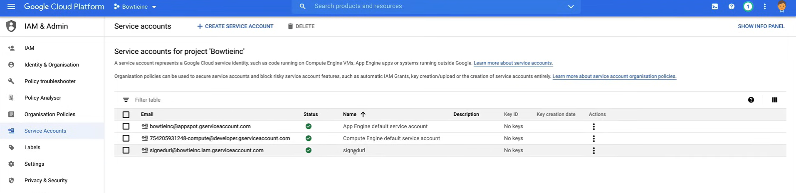

# Managing Cloud Storage Access

A video demo of the following lab is available [here](https://youtu.be/jpno8FSqpc8?si=xldo1U_GxfoWkZZ1&t=65523).


## Create a Storage Bucket

1. Go to the **Storage** section in the Google Cloud Console.
2. Go to the **Browser** tab.
3. Click on the **Create Bucket** button, and fill in the following details:
   - **Name your bucket**
     - **Name:** `bowtieinc-2021`
   - **Choose where to store your data**
     - **Location type:** `Region`
     - **Location:** `us-east1`
   - **Choose a default storage class**
     - **Storage class:** `Standard`
   - **Choose how to control access to objects**
     - **Access control model:** `Fine-grained`
   - **Advanced settings**
     - **Encryption:** `Google-managed key`
     - **Labels:** `environment:test`
   - Click on the **Create** button (we can do a price check by looking at the right side of the screen).

## Copy Files to the Bucket

Now we want to copy files from an instance to the bucket. So we need to create an instance first.

1. Go to the **Compute Engine** section in the Google Cloud Console.
2. Go to the **VM instances** tab. Make sure to have the `default` VPC network created.
3. Click on the **Create Instance** button, and fill in the following details:
   - **Name:** `bowtie-instance`
   - **Labels:** `environment:test`
   - **Region:** `us-east1`
   - **Zone:** `us-east1-b`
   - **Machine type:** `e2-micro`
   - **Boot disk**
     - **Image:** `Debian GNU/Linux 10 (buster)`
     - **Size (GB):** `10`
   - **Identity and API access**
     - **Service account:** `Compute Engine default service account`
     - **Access scopes:** `Set access for each API`
       - **Storage:** `Full`
   - Click on the **Create** button.

4. Open the Cloud Shell and run the following command to SSH into the instance:

    ```bash
    gcloud compute ssh bowtie-instance --zone=us-east1-b
    ```

5. Create a file:

    ```bash
    sudo nano fileofbowties.txt
    ```

    write some content to it:

    ```txt
    Learning to tie a bowtie takes time.
    ```

    and save the file.

6. Copy the file to the bucket:

    ```bash
    gsutil cp fileofbowties.txt gs://bowtieinc-2021
    ```

    

7. Copy the file in the [`res\03_Managing_Cloud_Storage_Access`](res\03_Managing_Cloud_Storage_Access) to the Instance.

8. Enter into the directory where the file is located and copy it to the bucket:

    ```bash
    gsutil cp *.jpg gs://bowtieinc-2021
    ```

    

## Make the Bucket Public

**NOTE:** Making a bucket public is not recommended, and should only be used on the rare occasion that you are hosting a static website.

1. Go to the **Storage** section in the Google Cloud Console.
2. Go to the **Browser** tab.
3. Click on the bucket name (`bowtieinc-2021`).
4. Go to the **Permissions** tab.
5. Click on the **Add** button near the **Permissions** section, and fill in the following details:
   - **New members:** `allUsers`
   - **Select a role:** `Storage Object Viewer`
   - Click on the **Save** button.

    

6. Go back to the **Browser** tab, and click on the **Refresh** button. Now you can click on the link of the file to see it in the browser.

    

7. To remove the public access, click on the **Permissions** tab of the bucket, and click on **Remove Public Permission**.

## Apply ACLs Permissions

1. Go to the **Storage** section in the Google Cloud Console.
2. Go to the **Browser** tab.
3. Click on the bucket name (`bowtieinc-2021`).
4. Click on the file `pinkelephant-bowtie.jpg`.
5. Click on the **Edit permissions** button.

    

    1. CLick on the **Add Entry** button.
    2. Fill in the following details:
       - **Entity:** `Public`
       - **Name:** `allUsers`
       - **Access:** `Reader`
    3. Click on the **Save** button.

6. Now you can click on the public link of the file to see it in the browser.
7. To remove the public access, using the command line, run the following command:

    ```bash
    gsutil acl ch -d AllUsers gs://bowtieinc-2021/pinkelephant-bowtie.jpg
    ```

## Create a Signed URL

To create a signed URL, we need first to create a private key and we can do that using a Service Account.

1. Go to the **IAM & Admin** section in the Google Cloud Console.
2. Go to the **Service Accounts** tab.
3. Click on the **Create Service Account** button, and fill in the following details:
   - **Service account details**
     - **Service account name:** `signedurl`
     - **Service account ID:** `signedurl`
     - **Service account description:** `Service account for bowtie`
     - Click on the **Create** button.
   - **Grant this service account access to project**
     - **Select a Role:** `Storage Object Viewer`
     - Click on the **Continue** button.
   - **Grant users access to this service account**
     - Leave it as is.
     - Click on the **Done** button.

    

4. Click on the 3 dots on the `Actions` column of the `signedurl` service account, and click on `Create key`.
     - Select the key type as `JSON` and click on the `Create` button.

5. Save the JSON file in the Cloud Shell using the CLoud Shell Editor, and rename the file `privatekey.json`.
6. Run the following command to generate a signed URL:

    ```bash
    gsutil signurl -d 10m privatekey.json gs://bowtieinc-2021/pinkelephant-bowtie.jpg
    ```

    If the command returns the error: `CommandException: The signurl command requires the pyopenssl library.`, run the following command to install the library:

    ```bash
    pip3 install pyopenssl
    ```

    and run the previous command again. The output will be a signed URL.

7. Now the `jpg` file can be accessed publicly using the signed URL. You can see it under the `Public URL` section of the `jpg` file in the bucket.
