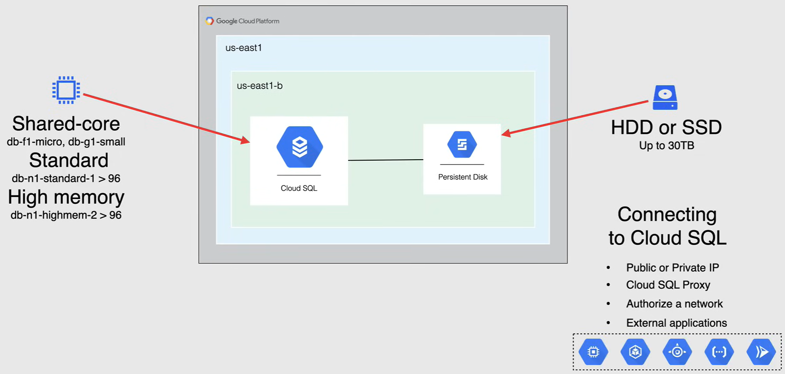
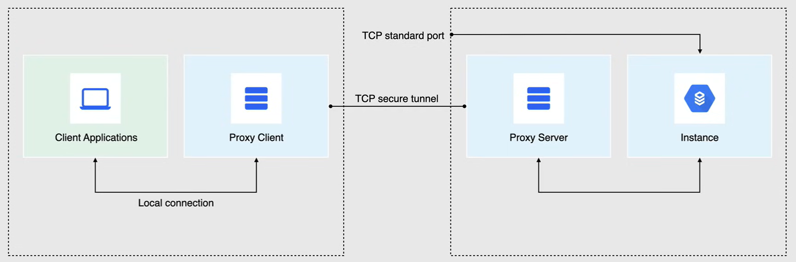
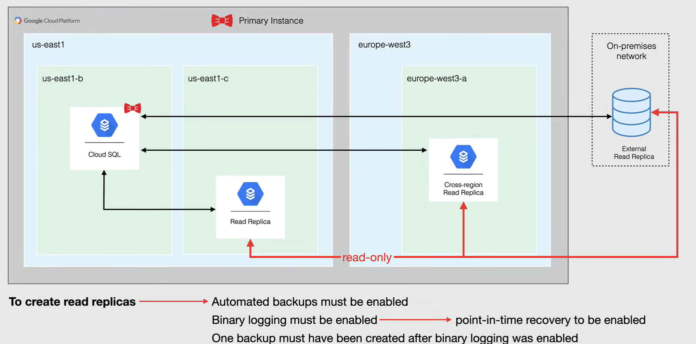
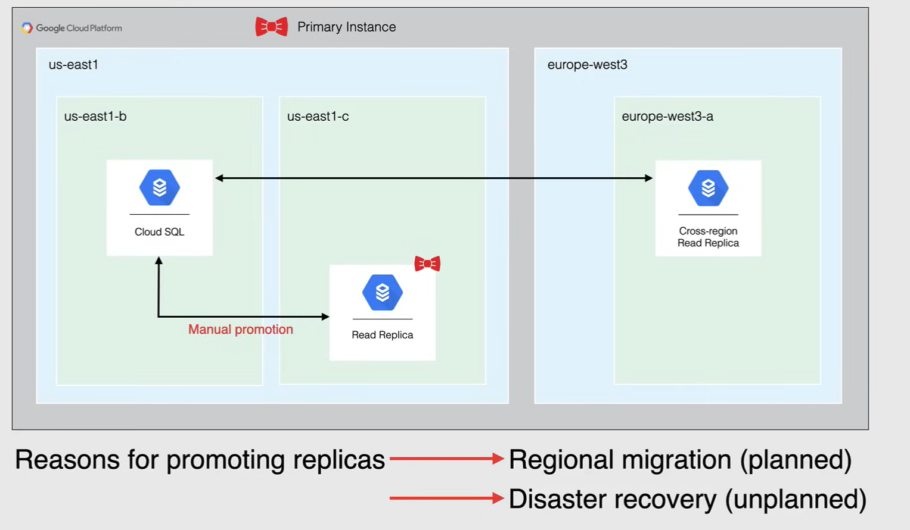
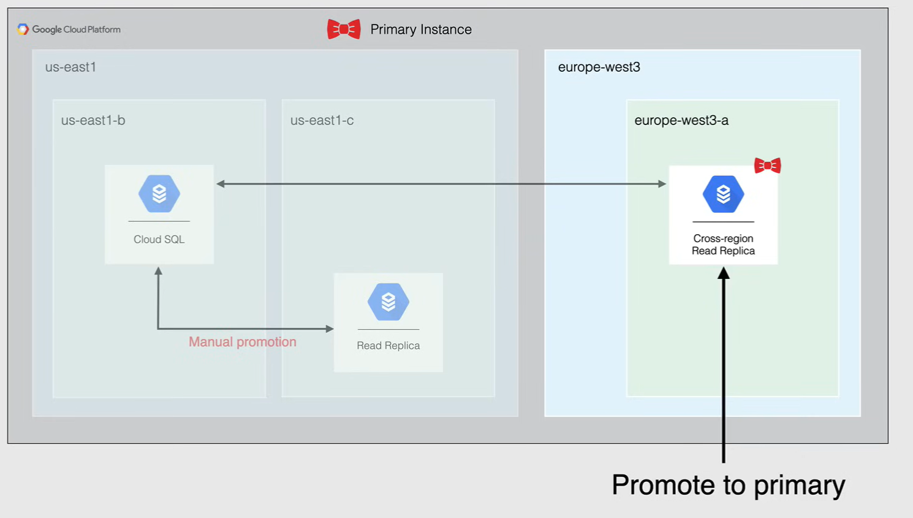
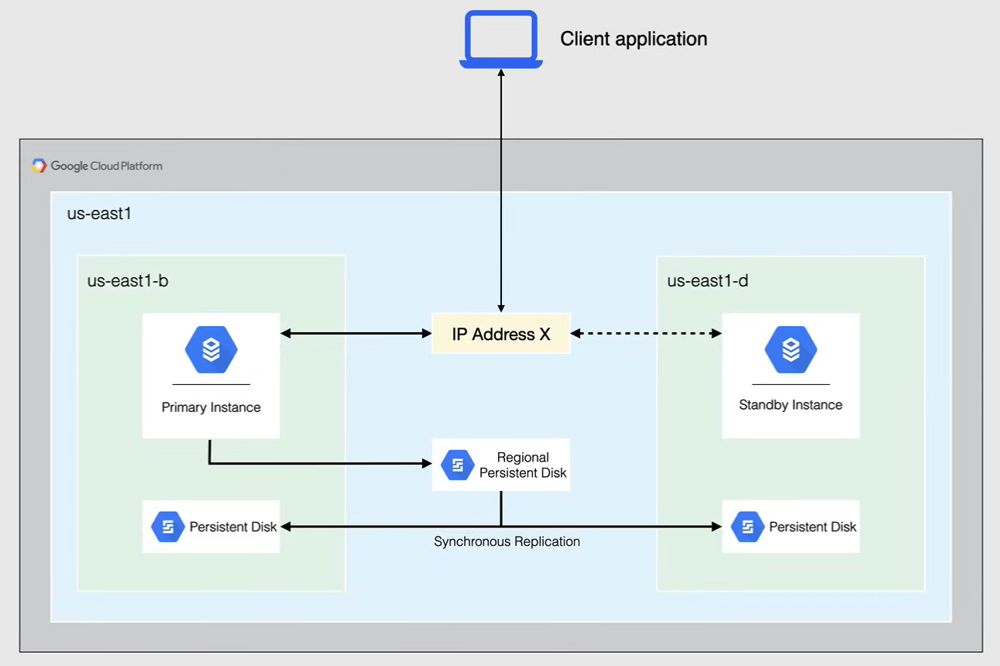
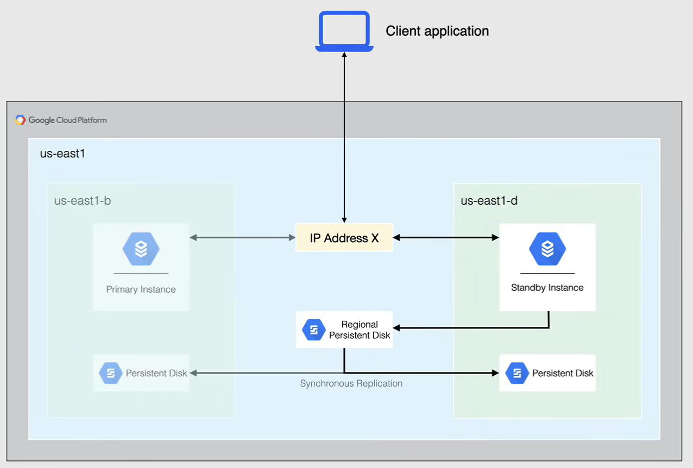
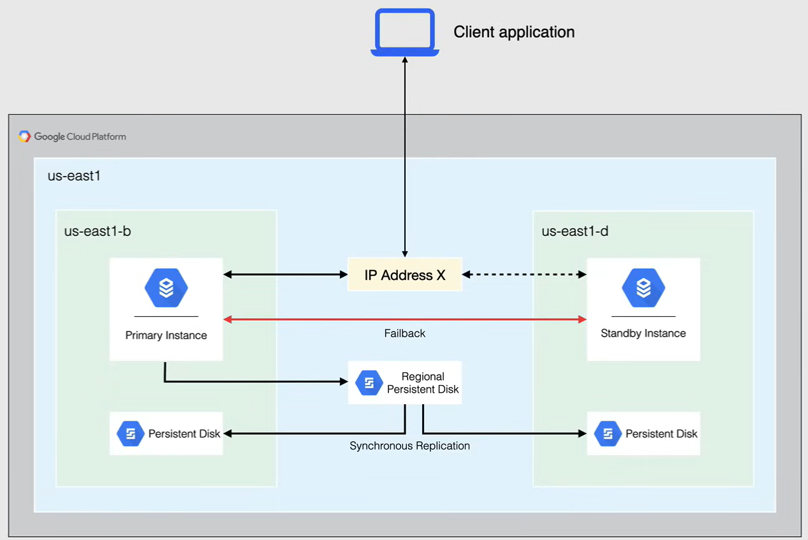
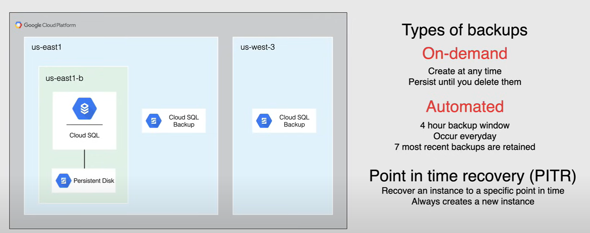

# Cloud SQL

Cloud SQL is a *fully managed, cloud native, relational database service* (RDBMS) that offers my sql postgres and sql server engines with built in support for replication.

Cloud SQL is a *Database as a Service (DBaaS)* offering from Google, where Google takes care of all the underlying infrastructure for the database, along with the operating system and the database software. 

Cloud SQL was designed for *low latency, transactional and relational database workloads*.

It's also available in three different flavors of databases, MySQL, PostgreSQL and SQL Server. And all of them support standard APIs for connectivity.

Cloud SQL offers *replication* using different types of re replicas.
It offers capabilities for *high availability*, for continuous access to your data.

Cloud SQL also offers *backups* in 2 different flavors and allows you to restore your database from these backups with the same amount of ease.

- On demand backups
- Automatic backups

Along with your backups, comes *point in time recovery*, for when you want to restore a database from a specific point in time.

Cloud SQL storage relies on connected, persistent disks in the same zone that are available in regular hard disk drives or SSDs that currently give you up to 30 terabytes of storage capacity, and because the same technologies lie in the background for persistent disks, *automatic storage increase* is available to resize your disks for more storage.

Cloud SQL also offers *encryption at rest* and in *transit* for securing data entering and leaving your instance.

When it comes to cost, you are *billed for cpu, memory and storage of the instance, along with egress traffic*.

- Please be aware that there is a licensing cost when it comes to Windows instances.

Cloud SQL instances are not available in the same instance types as Compute Engine, and are only available in the following CPU types:

- Shared-Core
- Standard
- High memory

When you see them, they will be clearly marked with a `db` the beginning of the cpu type, and *you cannot customize these instances* like you can with Compute Engine, and so memory will be predefined when choosing the instance type.

*Storage types* for Cloud SQL are only available in Hard Disk drives and SSDs. You are able to size them according to your needs, and is stated earlier can be sized up to 30 terabytes in size. When entering the danger zone of having a full disk, you do have the option of enabling *automatic storage increase* so you never have to worry about filling up your disk before that 30 terabyte limit.

When it comes to connecting to your Cloud SQL instance, you can configure it with a *Public* or *Private IP*, but know that after configuring the instance with a Private IP, **it cannot be changed**.

- Although connecting within private IP is preferred when connecting from a client on a resource with access to a VPC.
- It is always best practice to use private IP addresses for any database in your environment whenever you can.

Moving on to authentication options, the recommended method to connecting to your Cloud SQL instance is using *Cloud SQL Proxy*. The Cloud SQL Proxy allows you to authorize and secure your connections using IAM permissions, unless using the Cloud SQL Proxy connections to an instances public IP address are only allowed if the connection comes from an authorized network.

- Authorized networks are IP addresses or ranges that the user has specified as having permission to connect.
- Once you are authorized, you can connect to your instance through external clients or applications, and even other Google Cloud services like Compute Engine, GKE, App Engine, Cloud Functions and Cloud Run.

## Cloud SQL Proxy

Cloud SQL Proxy allows you to authorize and secure your connections using IAM permissions, the proxy validates connections using credentials for a user or service account and wrapping the connection in an SSL-TLS layer that is authorized for a Cloud SQL instance.

Using the Cloud SQL Proxy is the recommended method for authenticating connections to a Cloud SQL instance, as it is the most secure.

The client proxy is an open source library distributed as an executable binary and is available for Linux, Mac OS and windows.
The client proxy acts as an intermediary server that listens for incoming connections, wraps them in SSL or TLS, and then passes them to a Cloud SQL instance.

The Cloud SQL Proxy handles authentication with Cloud SQL, providing secure access to Cloud SQL instances without the need to manage allowed IP addresses or configure SSL connections.

- This is also the best solution for applications that hold ephemeral IPs.
- While the proxy can listen on any ports, it only creates outgoing connections to your Cloud SQL instance on port 33O7.

## Replication

When it comes to database replication, it's more than just copying your data from one database to another.

The primary reason for using replication is *to scale the use of data in a database without degrading performance*, other reasons include migrating data between regions and platforms and from an on premises database to Cloud SQL. You could also promote a replica if the original instance becomes corrupted.

When it comes to a Cloud SQL instance, the instance that is replicated is called the **primary instance** and the copies are called **Read Replicas**. The primary instance and Read Replicas all reside in Cloud SQL.

*Read Replicas are read only*, and you cannot write to them. It processes, queries, read requests and analytics traffic, thus reducing the load on the primary instance. Read Replicas can have more CPU's in memory than the primary instance that they cannot have any less. They can have up to 10 Read Replicas per primary instance. And you can connect to a replica directly using its connection name and IP address.

Cloud SQL supports the following types of replicas:

- *Read Replicas*
  - You would use it to offload work from a Cloud SQL instance. The read replica is an exact copy of the primary instance, and data and other changes on the primary instance are updated in almost real time on the read replica.
- *Cross Region Read Replicas*
  - A read replica is created in a different region from the primary instance, and you can create a cross region read replica the same way as you would create an inner region replica.
  - This improves read performance by making replicas available closer to your application region. It also provides additional disaster recovery capability to guard you against a regional failure.
  - It also lets you migrate data from one region to another with minimum downtime.
- *External Read Replicas*
  - These are external MySQL instances that replicate from a Cloud SQL primary instance.
  - For example, a MySQL instance running on Compute Engine is considered an external instance
- *Cloud SQL Replicas* when replicating from an external server

**NOTE:** before you can create a read replica of a primary Cloud SQL instance, the instance must be the following requirement:

- Automated backups must be enabled
- Binary logging must be enabled
  - which requires point in time recovery to be enabled
- At least one backup must have been created after binary logging was enabled.

### Promoting Replicas

So when you have re replicas in your environment, it gives you the flexibility of promoting those replicas if needed.

*Promoting replicas* is a feature that can be used for when your primary database becomes corrupted or unreachable.

You can promote an *in-region* read replica or *cross-region* replica, depending on where you have your Read Replicas hosted. So when you promote the read replica, the instance stops replication and converts the instance to a standalone Cloud SQL primary instance, with read and write capabilities.

**NOTE:**

- this cannot be undone
- when your new primary instance has started, your other Read Replicas are not transferred over from the old primary instance. You will need to reconnect your other Read Replicas to your new primary instance.

And as you can see in tho following schema, promoting the replica is done manually and intentionally, whereas high availability has a standby instance that automatically becomes the primary, in case of a failure or zonal outage.

When it comes to promoting cross-region replicas, there are two common scenarios for promotion. 

- **Regional migration**, which performs a planned migration of a database to a different region
- **Disaster recovery** where you would fail over a database to another region in the event that the primary instances region becomes unavailable.

Both use cases involve setting up cross region replication and then promoting the replica.
The *main difference between them* is whether the promotion of the replica is planned or unplanned.

If you're promoting your replicas for a regional migration, you can use a cross-region replica to migrate your database to another region with minimal downtime, and this is so you can create a replica in another region wait until the replication catches up, promote it, and then direct your applications to the newly promoted instance.

The steps involved in promotion are the same as for promoting an inner region replica.

When you're promoting replicas for disaster recovery, cross-region replicas can be used as part of this disaster recovery procedure, can promote a cross-region replica to failover to another region should the primary instances region come unavailable for an extended period of time.

So in this example, the entire `us-east1` region has gone down, yet the read replica in the `europe` region is still up and running, and although there may be a little bit more latency for your customers in North America, I'm able to promote this read replica connected to the needed resources and get back to business.

## High Availability

Cloud SQL offers HA capabilities out of the box.

The HA configuration sometimes called a *cluster* provides data redundancy, so a Cloud SQL instance configured for HA is also called a regional instance and is located in a primary and secondary zone, within the configured region.

Within a regional instance, the configuration is made up of a **primary instance** and a **standby instance**, and through **synchronous replication** to each zone's persistent disk, all rights made to the primary instance are also made to the standby instance.

Each second, the primary instance writes to a system database as a heartbeat signal, if multiple heartbeats are detected, failover is initiated.

If an HA configured instance becomes unresponsive, Cloud SQL automatically switches to serving data from the standby instance, and this is called a **failover**.

In this example, the primary instance or zone fails and failover is initiated.

So if the primary instance is unresponsive for approximately 60 seconds, or the zone, containing the primary instance, experiences and outage failover will initiate.

Standby instance immediately starts serving data upon reconnection through a shared static IP address with the primary instance, and the standby instance now serves data from the secondary zone. 

When the primary instance is available again, a **failback** will happen, and this is when traffic will be redirected back to the primary instance.

The standby instance, will go back into standby mode, as well the regional persistent disk will pick up replication to the persistent disk in that same zone.

With regards to billing, an HA configured instance is charged at double the price of a standalone instance, this includes CPU Ram and storage.

**NOTE:**

- The standby instance cannot be used for read queries, and this is where it differs from Read Replicas.
- Automatic backups and point-in-time recovery must be enabled for high availability.

## Backups

The **backups** help you restore lost data to your Cloud SQL instance, you can also restore an instance that is having problems from a backup. You enable backups for any instance that contains necessary data.

Backups protect your data from loss or damage, enabling automated backups, along with binary logging is also required for some operations, such as clone and replica creation.

By default, Cloud SQL *stores backup data in two regions for redundancy*, one region can be the same region that the instance is in, and the other is a different region. If there are two regions in a continent, the backup data remains on the same continent.

Cloud SQL also lets you select a custom location for your backup data, and this is great if you need to comply with data residency regulations for your business.

Cloud SQL performs two *types* of backups:

- **On-demand backups**
  - You can create a backup at anytime.
  - This is useful for when you're making risk changes that may go sideways.
  - You can always create on demand backups for any instance, whether the instance has automatic backups enabled or not.
  - These backups persist until you delete them, or until their instance is deleted.
- **Automated backups**
  - These use a four hour backup window.
  - These backup start during the backup window.
  - When possible, you should schedule your backups when your instance has the least activity.
  - Automated backups occur every day when your instances running at anytime in the 36 hour window, and by default up to seven most recent backups for retain.
  - You can also configure how many automated backups to retain from one to 365.

### Point in Time Recovery

**Point in time recovery** (PITR) helps you recover an instance to a specific point in time, for example, if an error causes a loss of data, you can recover a database to its state before the error happened.

A point in time recovery always creates a new instance, and *you cannot perform a point in time recovery to an existing instance*.

A point in time recovery is *enabled by default when you create a new Cloud SQL instance*, and so when it comes to billing by default, Cloud SQL retains seven days of automated backups, plus all on-demand backups for an instance.

