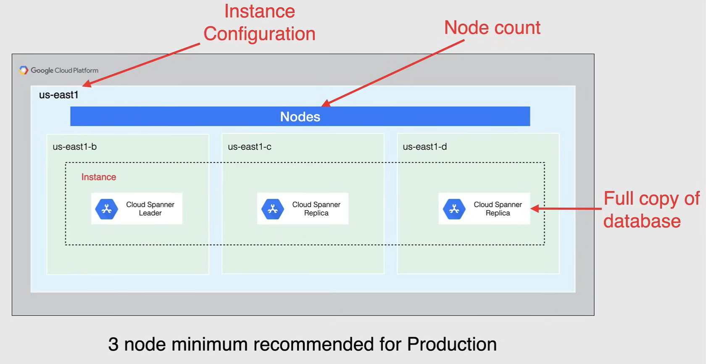
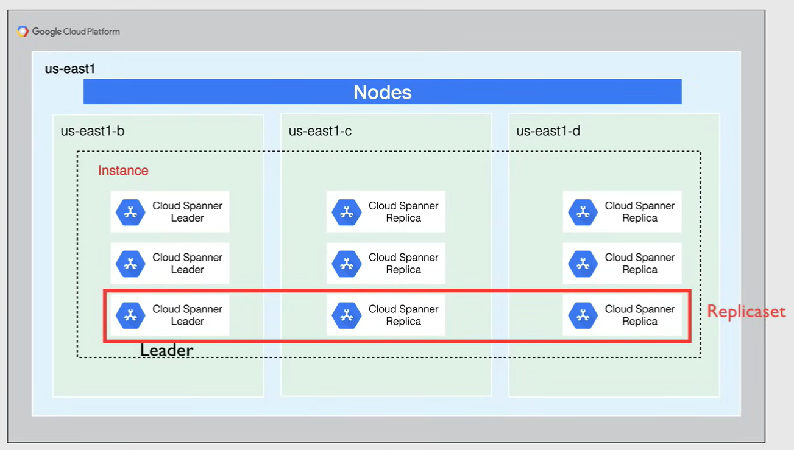

# Cloud Spanner

Cloud Spanner is a Google clouds global relational database, that is the same in some ways as Cloud SQL, when it comes to ACID transactions, SQL querying and strong consistency, but differs in the way that *data is handled under the hood* than Cloud SQL.

- **Cloud Spanner** is a *fully managed relational database service* that is both *strongly consistent* and *horizontally scalable*.

- Cloud Spanner is another Database as a Service (*DBaaS*) offering from Google, and so it strips away all the headaches of setting up and maintaining the infrastructure and software needed to run your database in the cloud.

- *Supports schemas, ACID transactions, SQL querying*.
  - Being strongly consistent in this context is when data will get passed on to all the replicas as soon as a write request comes to one of the replicas of the database.
  - Cloud Spanner uses *truetime*, a highly available, distributed atomic clock system that is provided to applications on all Google servers.
  - It applies a timestamp to every transaction on commit, and so transactions in other regions are always executed sequentially.

- *GLobal Distributed*
  - Cloud Spanner can distribute and manage data at a global scale and support globally consistent reads along with strongly consistent distributed transactions.

- Handles *replicas* and *sharding*
  - Cloud Spanner handles any replicas that are needed for availability of your data and optimizes performance by automatically sharding the data based on request load and size of the data.

- Synchronous *data replication*
  - Part of why Cloud Spanners high availability is due to its automatic synchronous data replication between all replicas and independent zones.

- *Automatic scaling* and *node redundancy*
  - Cloud Spanner scales horizontally automatically within regions, but it can also scale across regions for workloads that have higher availability requirements, making data available faster to users and in global scale, along with known redundancy, quietly added for every node deployed in the instance.

- Up to *5 nines availability*
  - it's available to achieve 5 nines availability on a multi regional instance and 4 nines availability on a regional instance.

- Data layer *encryption*, *audit logging* and *IAM integration*
  - Cloud Spanners is highly secured and offers data layer encryption, audit logging and IAM integration.

- Cloud Spanner was designed to fit the needs of specific industries such as financial services, ad tech, retail and global supply chain, along with gaming.

- *Pricing* for Cloud Spanner, comes in at $0.90 per node per hour with the cost of storage coming in at $0.30 per gigabyte per month.
  - Definitely not cheap, but the features are plentiful.

## Instance (Note required for the exam)

To use Cloud Spanner, you must first create a **Cloud Spanner instance**.

This instance is an allocation of resources that is used by Cloud Spanner databases created in that instance.

Instance creation includes two important choices:

- The **instance configuration**
  - These choices determine the location and the amount of the instances CPU and memory allow with its storage resources.
  - Your configuration choice is permanent for an instance, and only the note count can be changed later if needed.
  - An instance configuration defines the geographic placement and replication of the database in that instance, either regional or multi region.
  - **NOTE:** When you choose a multi zone configuration, it allows you replicate the databases data, not just in multiple zones, but in multiple zones across multiple regions.

- The **node count**
  - This determines the number of nodes to allocate to that instance.
  - These nodes allocate the amount of CPU, memory and storage needed for your instance to either increase throughput or storage capacity.

There is no instance types to choose from like Cloud SQL, and so when you need more power, you simply add another node.

For any regional configuration, Cloud Spanner maintains exactly three read/write replicas, each within a different zone in that region.

Each read/write replica contains a full copy of your operational database that is able to serve read/write and read only requests.

Cloud Spanner users replicas in different zones, so then, if these single zone failure occurs, your database remains available.

In a multi region instance configuration, the instance is allotted a combination of four read/write and read only replicas.

**NOTE:** A 3 node configuration minimum is what is recommended for production by Google.

As Cloud Spanner gets populated with data, sharding happens, which is also known as a **split**, Cloud Spanner creates replicas of each database split to improve performance and availability.

All of the data in a split is physically stored together in a replica.

Cloud Spanner serves each replica out of an independent failure zone, and within each replica set, one replica is elected to act as the **leader**.

Leader replica are responsible for handling rights, while any read/write or read only replica conserving read requests without communicating with the leader. 

## Performance

- Each Cloud Spanner node can provide up to 10,000 queries per second, or QPS of reads, or 2000 QPS of writes.
- Each node provides up to two terabytes of storage.
  - If you need to scale up the serving and storage resources in your instance you *add more nodes to that instance*
- Adding a node does not increase the number of replicas, but rather increases the resources each replica has in the instance
  - Adding notes gives each replica or CPU and RAM, which *increases the replicas throughput*
- If you're looking to *scale up automatically*, you can scale the numbers of nodes in your instance based on the cloud monitoring metrics on CPU or storage utilization in conjunction with using Cloud Functions to trigger.
  - So when you are deciding on a relational database that provides global distribution and horizontally scalable that handles transactional workloads in Google Cloud, Cloud Spanner will always be the obvious choice over Cloud SQL.