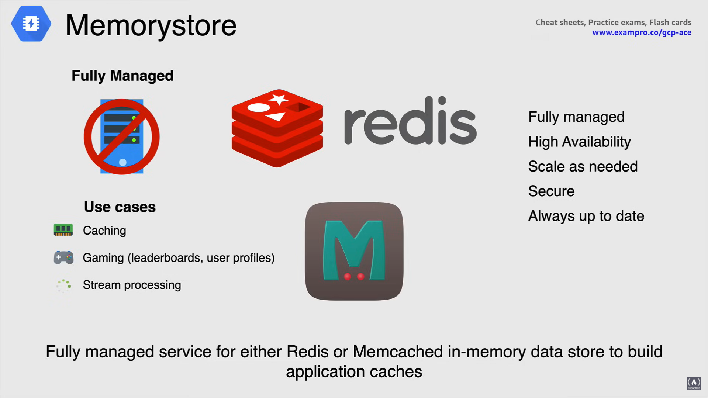

# NoSQL Databases

There are four managed NoSQL databases available in Google Cloud:

- Cloud Bigtable
- Cloud Datastore
- Firestore
- Memorystore

## Cloud BigTable

Cloud BigTable is a fully managed wide column, NoSQL database, designed for terabyte and petabyte scale workloads that offers low latency and high throughput.

- BigTable is *built for real time application serving workloads*, as well as large scale analytical workloads.

- Cloud BigTable is a *regional service*, and if using replication, a copy is stored in a different zone or region for durability (*automated replication*).

- Cloud BigTable is designed for storing very *large amounts of single-keyed data* while still being able to provide very low latency

- Throughput scales linearly, you can increase the queries per second by *adding more BigTable nodes when you need them*.

- BigTables throughput can be dynamically adjusted by adding or removing cluster nodes (*cluster resizing*) without restarting, meaning you can increase the size of a BigTable cluster for just a few hours, to handle a large load, and then reduce the cluster size again and do it all without any downtime.

- BigTables and *ideal source for MapReduce operations* and integrates easily with all the existing big data tools, such as Hadoop, Dataproc and Dataflow, along with Apache Hbase.

- When it comes to price, BigTable is definitely no joke. Pricing for bigtable starts at $0.65 per hour per node, or over $450 a month, for a one node configuration with no data.

Now you can use the table to store and query all of the following types of data:

- CPU and memory usage overtime for multiple servers,
- *Marketing data* such as purchase histories and customer preferences
- *Financial data* such as transaction histories, stock prices and currency exchange rates
- *IoT data* or Internet of things such as your ports from energy meters and home appliances. 
- *Graph data* such as information about how users are connected to one another. 

Cloud BigTable *excels as a storage engine*, as it can:

- *batch Mapreduce operations*,
- *stream processing or analytics*,
- *being used for storage for machine learning applications*.

## Cloud Datastore

**Cloud Datastore** is a *highly scalable, NoSQL document database built for automatic scaling, high performance and ease of application development.*

- Datastore is redundant within your location to minimize impact from points of failures, and therefore can offer *high availability of reads and writes*.

- Cloud Datastored can execute *atomic transactions*, where a set of operations are all succeed or none will occur.

- Cloud Datastore uses a distributed architecture to *automatically manage scaling* so you never have to worry about scaling manually.

- Cloud Datastore is that it has a SQL like query language that's available called *GQL*. It match roughly to SQL, however, a SQL role column lookup is limited to a single value, whereas in GQL, a property can be multiple value property.

- This *consistency model* allows an application to handle large amounts of data and users while still being able to deliver a great user experience.

- Data is *automatically encrypted* before it is written to disk and automatically decrypted when read by an authorized user.

**Firestore** *is the newest version of Datastore* and introduces several improvements over Datastore.

- Existing Datastore users can access these improvements by creating a new Firestored database instance in Datastore mode and in the near future all existing Datastore databases will be automatically upgraded to Firestore in Datastore mode. 

**Datastore emulator** provides a local emulation of the production Datastore environment so that you can use to develop and test your application locally.

This is a component of the Google Cloud SDK `gcloud` cloud tool and can be installed by using the `gcloud components install` command that we discussed earlier on in the course.

Moving on to *use cases* for Datastore, it is ideal for applications that rely on highly available structured data at scale.

- *Product catalogs* that provide real time inventory and product details for a retailer.
- *User profiles* that deliver a customized experience based on the user's past activities and preferences.
- *Transactions based on ACID properties*, for example, transferring funds from one bank account to another.

## Firestore for Firebase

**Firestore for Firebase** is a flexible, scalable, NoSQL cloud database to store and sync data for client and server side development, and is available for native C++, Unity, nodeJS, Java, Go and Python SDKs, in addition to REST and RPC APIs.

Cloud Firestore store data in *documents* that contain fields mapping to values. 

These documents are stored in *collections* which are containers for your documents that you can use to organize your data and build queries.
Documents support many different data types as well, you can also create sub collections within documents and build hierarchical data structures.

- Cloud Firestore is **serverless** with absolutely no servers to manage, update or maintain.

- With *automatic multi-region replication* and strong consistency, Google is able to hold a 5-nines availability guarantee.

- When it comes to querying in Cloud Firestore, it is *expressive*, efficient and flexible.
  - You can create shallow queries to retrieve data at the document level without needing to retrieve the entire collection or any nested sub collection.

- Cloud Firestore uses *data synchronization to update data in real time* for any connected device as well.

- It also *caches data* that your application is actively using, so that the application can write, read, listen to and query data, even if the device is **offline**.
  - When the device comes back online, Cloud Firestore synchronizes any local changes back to Cloud Firestore.

- You can also secure your data in Cloud Firestore with Firebase *authentication* and Cloud Firestore security rules for Android, IOS and javascript where you can use IAM for server side languages.

- When it comes to cost, Firestore falls into the always available *free tier*, where you can use 1 database holding 5 gigabytes, or if you need more, you can move into their *paid option*.
  - Firebase also has another database, sharing similar features like:
    - having no servers to deploy and maintain
    - real time updates
    - free tier
  
    This database is called **Realtime database**, and is used for more basic querying, simple data structure and keeping things to one database (it is a sort of *Firestore light*).

You can use both databases within the same fire based application or project as both can store the same types of data, client libraries, work in a similar manner, and both hold real time updates.

**Firebase is a development platform and not a database service**.

Firebase is a mobile application development platform that provides tools and cloud services to help enable developers to develop applications faster and more easily.

Since it ties in nicely with firestorm, it becomes the perfect platform for mobile application development.

## Memorystore

**Memorystore** is a fully managed service for Google Cloud for either Redis or Memcached in memory Datastore to build application caches.

This is a common service used in many production environments, specifically when the need for caching arises.

- *Fully Managed:* Memorystore automates the administration tasks for reticent Memcached, like enabling high availability, failover hatching and monitoring, so you don't have to.

- *High Availability:* When it comes to Memorystore for Redis instances in the standard tier, these are replicated across zones, monitored for health and have fast automatic failover.
  - Standard tier instances also provide an SLA of 3-nines availability.

- *Scale as needed:* Memorystore for Redis also provides the ability to scale instant sizes seamlessly so that you can start small and increase the size of the instance as needed.

- *Secure:* Memorystore is protected from the Internet using VPC networks and private IP, and also comes with IAM integration.
- Systems are monitored around the clock, ensuring that your data is protected at all times

- *Always up to date:* the versions are always kept up to date with the latest critical patches, ensuring your instances are secure.

When it comes to these cases:

- *Caching*: This is the main reason to use Memorystore as it provides low leaks the access and high throughput for heavily access data compared to accessing the data from a disk.
  - Examples of caching is session management frequently access queries, scripts or pages.

- *Gaming*: when using Memorystore for leaderboards and gaming, this is a common use case in the gaming industry as well as using it for player profiles.

- *Stream processing:* Memorystore is also a perfect solution for stream processing combined with Dataflow, Memorystore for Redis provides a scalable, fast in Memorystore for storing intermediate data that thousands of clients can access with very low latency.

