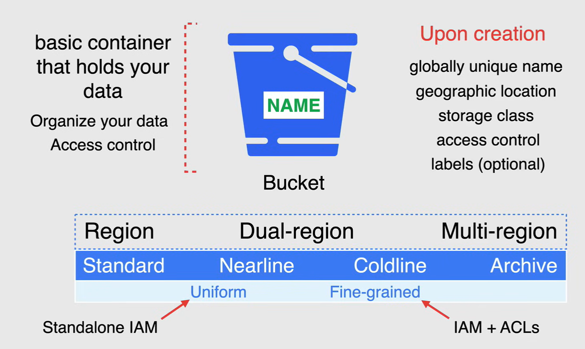
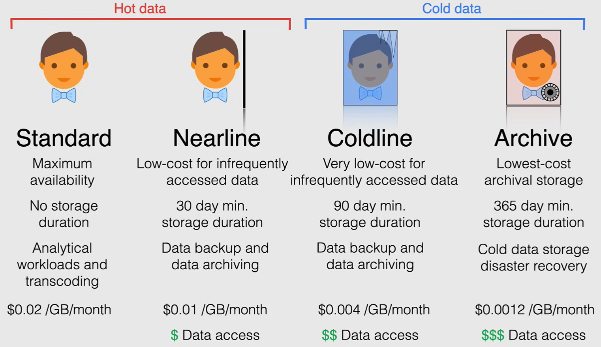
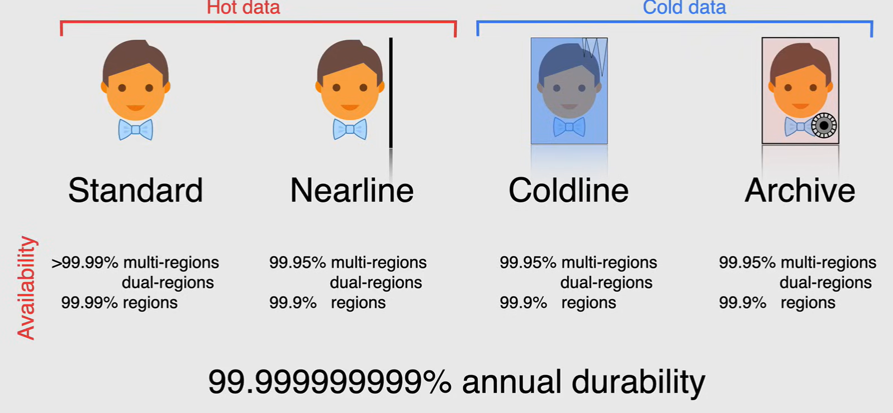
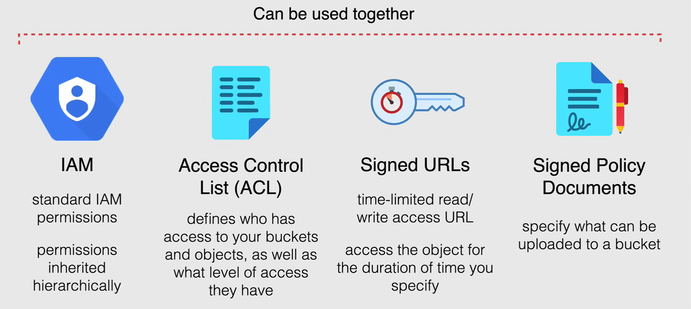

# Cloud Storage Storage Types

**Cloud storage** è un sistema di archiviazione di oggetti coerente, scalabile, ad alta capacità e altamente durevole, e offre uno spazio di archiviazione illimitato per gli oggetti senza una dimensione minima dell'oggetto.

- Tuttavia, ricorda che si tratta di un archivio di oggetti e non è progettato per archiviare un sistema operativo, ma per archiviare oggetti completi come immagini o video.

Cloud storage è accessibile in tutto il mondo e ha *posizioni di archiviazione* in tutto il mondo.

- Quindi, ovunque ci sia una regione o una zona, è possibile accedere a cloud storage da lì in qualsiasi momento tramite una connessione Internet.

Cloud storage è ottimo per archiviare dati da lavori di analisi dei dati, file di testo con codice, immagini e video.

Cloud storage eccelle nella *distribuzione di contenuti*, *grandi set di dati* e *backup*.

Tutti questi sono archiviati come *oggetti* in *bucket*, che rappresentano il cuore di cloud storage.

## Cloud Storage Buckets

**I bucket** sono i contenitori di base o la struttura che contiene i tuoi dati, tutto ciò che archivi in Cloud Storage deve essere contenuto in un bucket.

- Puoi utilizzare i bucket per organizzare i tuoi dati e controllare l'accesso ai tuoi dati, ma a differenza di directory e cartelle, non puoi nidificare i bucket.

- Quando crei un bucket, *devi specificare un nome univoco a livello globale* poiché ogni bucket risiede in un singolo spazio dei nomi di Cloud Storage.

- Oltre al nome, devi specificare una *posizione geografica* in cui vengono archiviati i contenuti del bucket, e hai tre scelte geografiche disponibili, *regione*, *dual region* e *multi region*.

  **NOTA:** la scelta di dual region e multi region è considerata Geo-Redundant.

  - Per la dual region, la Geo-Redundancy viene raggiunta utilizzando una coppia specifica di regioni.
  - Per la multi region, la Geo-Redundancy viene raggiunta utilizzando un continente che contiene due o più luoghi geografici.
  
  Fondamentalmente, più regioni sono disponibili per i tuoi dati, maggiore è la disponibilità di quei dati.

- Dopo aver scelto una posizione geografica, devi scegliere una *classe di archiviazione predefinita*, e questa si applica agli oggetti aggiunti al bucket, che non hanno una classe di archiviazione specificata esplicitamente.

  - Standard
  - Nearline
  - Coldline
  - Archive



### Modifying Buckets

Dopo aver creato un bucket, *puoi comunque modificare la sua classe di archiviazione predefinita* in qualsiasi classe supportata nella posizione del bucket con alcune limitazioni.

*Puoi cambiare solo il nome e la posizione del bucket eliminando e ricreando il bucket* poiché una volta selezionata la dual region, non è possibile cambiarla in multi region e quando si seleziona la multi region, non sarà possibile cambiare il bucket in dual region.

### Level of Access

Infine, dovrai scegliere il livello di accesso che desideri concedere agli altri sul tuo bucket, che tu voglia applicare le autorizzazioni *utilizzando l'accesso uniforme* o l'accesso *dettagliato*.

- L'*Accesso uniforme a livello di bucket* ti consente di utilizzare solo `IAM` per gestire le autorizzazioni.
  - IAM applica le autorizzazioni a tutti gli oggetti contenuti nel bucket per gruppi di oggetti con prefissi di nome comuni.

- L'opzione *dettagliata* ti consente di utilizzare IAM e *Access Control List* o ACL insieme per gestire le autorizzazioni.
  - Le ACL sono un sistema di controllo degli accessi legacy per il cloud storage progettato per l'interoperabilità con Amazon S3, per coloro che utilizzano AWS.
  - Puoi specificare l'accesso e applicare autorizzazioni sia a livello di bucket che per singoli oggetti.

**NOTA:** le etichette sono un elemento opzionale per la creazione del bucket, come ogni altro processo di creazione delle risorse in GCP.

## Cloud Storage Objects

**Gli oggetti** sono i singoli pezzi di dati o tronchi di dati che archivi in un bucket di cloud storage.

Non c'è limite al numero di oggetti che puoi creare in un bucket, quindi puoi pensare agli oggetti come a dei file.

Gli oggetti hanno due componenti:

- **Dati dell'oggetto**
  - I dati dell'oggetto sono tipicamente un file che desideri archiviare in cloud storage.
  - In questo caso, si tratta di un'immagine dell'arco piatto.

- **Metadati dell'oggetto**
  - I metadati dell'oggetto sono una collezione di coppie nome-valore che descrivono le varie proprietà di quell'oggetto.
  - Il nome di un oggetto è trattato come un pezzo di metadati dell'oggetto in cloud storage e deve essere univoco all'interno del bucket.

Cloud storage utilizza uno *spazio dei nomi piatto* per archiviare gli oggetti, il che significa che cloud storage non è una gerarchia di file system che vede tutti gli oggetti in un determinato bucket come indipendenti e senza relazione tra loro.

Per comodità, strumenti come la console e `gsutil` lavorano con oggetti che utilizzano il carattere slash come se fossero archiviati in una gerarchia virtuale. Ad esempio, puoi nominare un oggetto `/bowties/spring2021/plaidbowtie.jpg`.

- Utilizzando la console di cloud, puoi quindi navigare in questi oggetti come se fossero in una struttura di directory gerarchica sotto le cartelle `bowties` e `spring2021`.


## Storage Classes

La classe di archiviazione impostata per un oggetto influisce sulla disponibilità e sul modello di pricing dell'oggetto.

Quindi, quando crei un bucket, puoi specificare una classe di archiviazione predefinita per il bucket.

Quando aggiungi oggetti al bucket, ereditano questa classe di archiviazione a meno che non venga esplicitamente impostata diversamente.



- **Standard storage**
  - È considerato il migliore per i dati caldi o i dati a cui si accede frequentemente.
  - È ideale per l'uso a breve termine in quanto non ha una durata di archiviazione specificata.
  - Questo è eccellente per l'utilizzo in carichi di lavoro analitici e transcodifica.
  - Il prezzo per questa classe di archiviazione è di `0.02$` per gigabyte al mese.

- **Nearline storage**
  - Anche questo è considerato un dato caldo.
  - È una classe di archiviazione a basso costo per l'archiviazione di dati a cui si accede raramente.
  - Ha una durata di archiviazione minima di 30 giorni.
  - Ha un costo per l'accesso ai dati.
  - È ideale se si desidera continuare ad aggiungere file, ma si prevede di accedervi solo una volta al mese.
  - È perfetto per il backup dei dati e l'archiviazione dei dati.
  - Il prezzo per questa classe di archiviazione è di `0.01$` per gigabyte al mese.

- **Coldline storage**
  - È considerato un dato freddo in quanto rientra nelle classi di archiviazione a lungo termine.
  - È una classe di archiviazione a costo molto basso per l'archiviazione di dati a cui si accede frequentemente.
  - Ha una durata di archiviazione minima di 90 giorni.
  - Ha un costo per l'accesso ai dati leggermente superiore rispetto alla classe Nearline.
  - È ideale per i dati che si prevede di leggere o modificare al massimo una volta ogni 1/4.
  - È perfetto per il backup dei dati e l'archiviazione dei dati.
  - Il prezzo per questa classe di archiviazione è di `0.004$` per gigabyte al mese.

- **Archive storage**
  - È il servizio di archiviazione a costo più basso e altamente durevole per l'archiviazione dei dati, il backup online e il ripristino in caso di disastro.
  - Anche se ha un costo più basso, l'accesso ai dati è comunque disponibile entro millisecondi.
  - L'archiviazione di tipo Archive ha un costo più elevato per il recupero dei dati, nonché una durata di archiviazione minima di 365 giorni.
  - È la scelta migliore per i dati a cui si prevede di accedere meno di una volta all'anno.
  - L'archiviazione di tipo Archive ha anche il prezzo più alto per il recupero dei dati.
  - È ideale per l'archiviazione di dati di archivio utilizzati per scopi normativi o per il ripristino dei dati in caso di errori nell'ambiente.
  - Il prezzo per questa classe di archiviazione è ridicolmente basso, con un costo di una frazione di centesimo per gigabyte al mese.



Ora, quando si tratta di scegliere la posizione geografica, questa determinerà la *disponibilità* dei tuoi dati.

- Come puoi vedere, la disponibilità più alta è la multi regione Standard, mentre Archive ha la disponibilità più bassa quando archiviato in un contesto regionale.

Ora, per quanto riguarda la *durabilità* dei tuoi dati, ovvero la misura di quanto siano sani e resilienti i tuoi dati da perdita o corruzione dei dati, Google Cloud garantisce una durabilità di 11-9 annualmente su tutti i dati archiviati in qualsiasi classe di archiviazione su Cloud Storage.

- Quindi sappi che i tuoi dati sono archiviati in modo sicuro e saranno lì mantenendo la stessa integrità dalla data di archiviazione.

## Access Control

Ora, quando si tratta di concedere autorizzazioni ai tuoi bucket di archiviazione cloud e agli oggetti al loro interno, ci sono quattro diverse opzioni tra cui scegliere.



- *AIM permissions*:
  - queste sono le autorizzazioni standard che controllano tutte le altre risorse in Google Cloud
  - seguono la stessa gerarchia dall'alto verso il basso di cui abbiamo discusso in precedenza.

- *Access Control List (ACL)*:
  - queste definiscono chi ha accesso ai tuoi bucket e agli oggetti, nonché che tipo di accesso hanno e possono funzionare in tandem con le autorizzazioni AIM.

- *Signed URLs*:
  - sono URL di accesso in lettura o scrittura a tempo limitato che puoi creare per dare accesso all'oggetto in questione per la durata che specifici.

- *Signed Policy Documents*:
  - sono documenti che specificano cosa può essere caricato in un bucket.

### IAM and ACLs

Ora, Cloud Storage offre due sistemi per concedere agli utenti il permesso di accedere ai tuoi bucket e oggetti, IAM e Access Control List (ACL).

I sistemi agiscono in parallelo, quindi affinché un utente possa accedere a una risorsa di Cloud Storage, solo uno dei sistemi deve concedere l'utente.

- **IAM** è sempre un metodo consigliato quando si tratta di concedere l'accesso a bucket e agli oggetti all'interno di quei bucket.
  - La concessione di ruoli a livello di bucket non influisce su eventuali ruoli esistenti concessi a livello di progetto e viceversa.
  - Ti offre 2 livelli di granularità per personalizzare le tue autorizzazioni.
  - Puoi concedere a un utente il permesso di leggere gli oggetti in qualsiasi bucket, ma i permessi per creare oggetti solo in un bucket specifico.
  - I ruoli disponibili tramite IAM sono i ruoli di archiviazione standard primitivi o i ruoli legacy che sono equivalenti alle ACL.

- **ACL** sono utilizzate se è necessario personalizzare l'accesso e ottenere una granularità reale con singoli oggetti all'interno di un bucket.
  - Vengono utilizzate per definire chi ha accesso ai tuoi bucket e oggetti, nonché il livello di accesso che hanno.
  - Ogni ACL è composta da una o più voci e conferisce a un utente o a un gruppo specifico la possibilità di eseguire azioni specifiche.
  - Ogni voce è composta da due informazioni, il *permesso*, che definisce le azioni che possono essere eseguite, e lo *scope*, che definisce chi può eseguire le azioni specificate.
  - Le ACL dovrebbero essere utilizzate con cautela, poiché i ruoli IAM e le ACL si sovrappongono.

Cloud Storage concederà un permesso più ampio, quindi se consenti a utenti specifici di accedere a un oggetto in un bucket e successivamente viene applicata un'ACL a quell'oggetto per renderlo pubblico, sarà accessibile pubblicamente.


### Signed URLs

Ora, un *Signed URL* è un URL che fornisce autorizzazioni limitate e un tempo limitato per effettuare una richiesta.

Gli URL firmati contengono informazioni di autenticazione, consentendo agli utenti senza credenziali di eseguire azioni specifiche su una risorsa.

Quando generi un URL firmato, specifici un utente o un service account, che deve avere le autorizzazioni sufficienti per effettuare la richiesta che l'URL firmato effettuerà.

Dopo aver generato un URL firmato, chiunque lo possieda può utilizzarlo per eseguire azioni specificate, come la lettura di un oggetto entro il periodo di tempo specificato.

Ora, se desideri fornire accesso pubblico a un utente che non ha un account, puoi fornire un URL firmato per quell'utente, che dà all'utente l'accesso alla riscrittura o all'eliminazione di quella risorsa per un tempo limitato.

Specifichi una data di scadenza quando crei l'URL firmato, quindi chiunque conosca l'URL può accedere alla risorsa fino a quando non viene raggiunto il tempo di scadenza per l'URL, o la chiave utilizzata per firmare l'URL viene ruotata.

Il comando per creare l'URL firmato è:

```bash
gsutil signurl -d 10m privatekey.json gs://bowties/spring2021/plaidbowtie.jpg
```

E come puoi vedere, è stato assegnato per un tempo limitato di 10 minuti.


