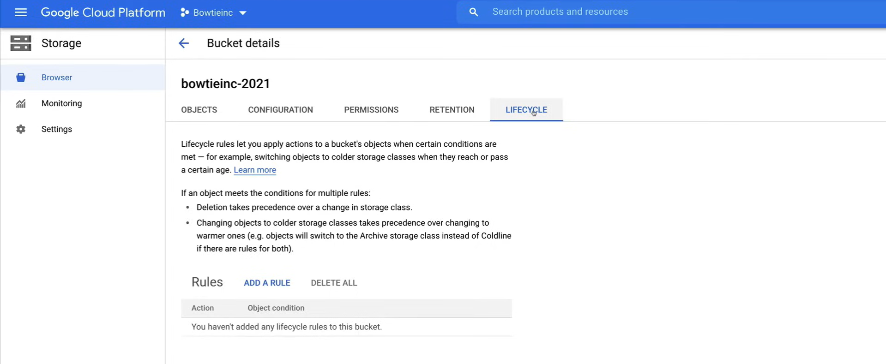
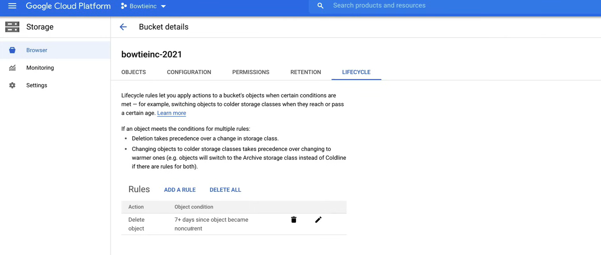
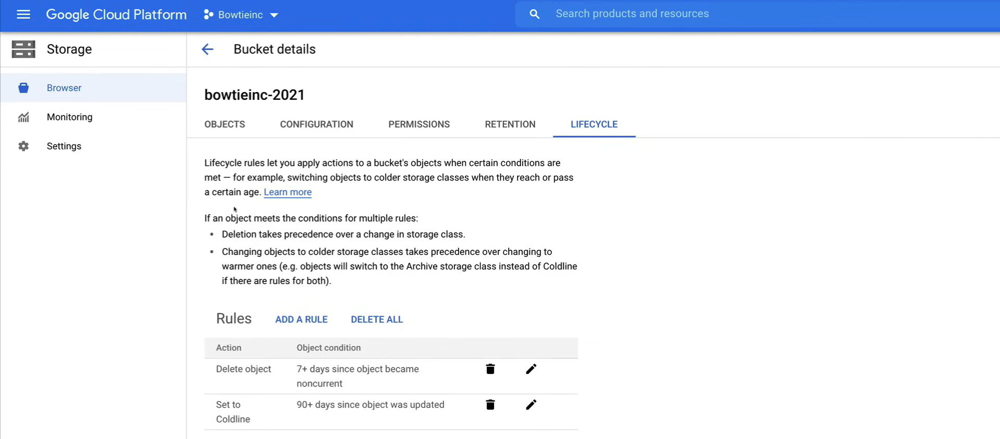

# Object Lifecycle Management and Versioning

*Lifecycle management e versioning degli oggetti* è una funzionalità all'interno di Cloud Storage che viene utilizzata per gestire e ordinare i file più vecchi che devono essere eliminati insieme ai file che non necessitano di un accesso regolare.

Conoscere le capacità di queste due funzionalità può davvero aiutare a organizzare gli oggetti accumulati nei bucket di archiviazione e ridurre i costi.

## Versioning

Gli oggetti sono **immutabili**, il che significa che un oggetto caricato non può cambiare durante la sua vita di archiviazione.

La **vita di archiviazione degli oggetti** è il tempo tra la creazione o il caricamento di un oggetto e la sua eliminazione. Ciò significa che non è possibile modificare gli oggetti sul posto.

Invece, gli oggetti vengono sempre sostituiti con una nuova versione. Dopo il completamento del caricamento del nuovo oggetto, la nuova versione dell'oggetto viene servita ai lettori. Questa sostituzione segna la fine di un ciclo di vita dell'oggetto e l'inizio di uno nuovo.

Per supportare il recupero di oggetti eliminati o sostituiti, Cloud Storage offre la funzionalità di **versioning** degli oggetti.

Il versioning degli oggetti conserva una versione non corrente quando la versione attiva dell'oggetto viene sostituita o eliminata. L'abilitazione del versioning degli oggetti aumenta i costi di archiviazione, che possono essere parzialmente mitigati configurando la gestione del ciclo di vita degli oggetti per eliminare le versioni più vecchie degli oggetti.

Cloud Storage utilizza due proprietà che identificano insieme la versione di un oggetto.

- La **generazione** che identifica la versione dei dati dell'oggetto.
- La **metagenerazione** che identifica la versione dei metadati dell'oggetto.

Queste proprietà sono sempre presenti con ogni versione dell'oggetto, anche se il versioning degli oggetti non è abilitato. Queste proprietà possono essere utilizzate per imporre l'ordine degli aggiornamenti. Per abilitare il versioning degli oggetti, è necessario abilitarlo su un bucket.

Una volta abilitato, le versioni precedenti rimangono nel bucket quando si verifica una sostituzione o una eliminazione. Di default, quando si sostituisce un oggetto, Cloud Storage elimina la vecchia versione e aggiunge una nuova versione.

Queste versioni precedenti mantengono il nome dell'oggetto, ma sono identificate in modo univoco dal loro numero di generazione. Quando viene creata una versione precedente di un oggetto, è possibile utilizzare il numero di generazione per fare riferimento alla versione precedente. Ciò consente di ripristinare un oggetto sostituito nel bucket o eliminare definitivamente le versioni precedenti degli oggetti.

Quindi, tornando al costo, queste versioni possono davvero accumularsi e iniziare a costarti seriamente se hai migliaia di file con centinaia di versioni, ed è qui che entra in gioco la gestione del ciclo di vita degli oggetti.


## Object Lifecycle Management

Cloud storage offre la funzionalità di **gestione del ciclo di vita degli oggetti** al fine di supportare alcuni casi d'uso comuni come impostare un tempo di vita o TTL per gli oggetti, conservare le versioni non correnti degli oggetti o ridurre la classe di archiviazione degli oggetti per aiutare a gestire i costi.

Per applicare questa funzionalità agli oggetti, è necessario assegnare una configurazione di gestione del ciclo di vita a un bucket. La configurazione contiene un insieme di regole che si applicano agli oggetti correnti e futuri nel bucket.

Quando un oggetto soddisfa i criteri di una delle regole, Cloud Storage esegue automaticamente l'azione specificata sull'oggetto. Ecco alcuni esempi di casi d'uso:

- Se si desidera ridurre la classe di archiviazione degli oggetti più vecchi di 365 giorni a ColdLine storage per motivi di conformità, oltre a risparmiare denaro, la gestione del ciclo di vita è perfetta per questo.
- Un altro caso d'uso è quando si desidera eliminare gli oggetti creati prima del 1° gennaio 2020. Anche questo è un ottimo caso d'uso per risparmiare denaro.
- Mantenere solo le tre versioni più recenti di ciascun oggetto in un bucket, con il versioning abilitato per evitare l'accumulo di oggetti di versioni precedenti.

La gestione del ciclo di vita degli oggetti ha molti altri casi d'uso in una miriade di settori e, se utilizzata correttamente, è un ottimo modo per gestire gli oggetti e risparmiare denaro.

### Lifecycle Management Configuration

Ogni configurazione di gestione del ciclo di vita contiene un insieme di componenti, che sono un insieme di *regole*, *condizioni* e l'*azione* quando le condizioni vengono soddisfatte.

- **Regole** sono qualsiasi insieme di condizioni per qualsiasi azione.
- **Condizioni** è ciò che un oggetto deve soddisfare prima che l'azione definita nella regola si verifichi sull'oggetto.
	- Ci sono varie condizioni tra cui scegliere che ti consentono di essere molto dettagliato.
- **Azione** è dove avresti l'opzione di eliminare o impostare le classi di archiviazione.
	- Quando si eliminano le *versioni correnti*, ciò sposta la versione corrente in uno stato non corrente.
	- Quando si elimina una *versione non corrente*, si elimina definitivamente la versione e non è possibile recuperarla.

E quindi, quando si imposta la classe di archiviazione, l'oggetto verrà trasferito in una classe di archiviazione diversa, quindi quando si definisce una regola è possibile specificare qualsiasi insieme di condizioni per qualsiasi azione.

Se si specificano più condizioni in una regola, un oggetto deve soddisfare tutte le condizioni affinché l'azione venga eseguita sull'oggetto. Quindi, se si hanno 3 condizioni e una di queste condizioni non è stata soddisfatta, l'azione non verrà eseguita.

- Se si specificano più regole che contengono la stessa azione, l'azione viene eseguita quando un oggetto soddisfa le condizioni in una qualsiasi delle regole.

Se più regole hanno le loro condizioni soddisfatte contemporaneamente per un singolo oggetto, Cloud Storage eseguirà l'azione di eliminazione in quanto ha la precedenza sull'azione di impostazione della classe di archiviazione o l'azione di impostazione della classe di archiviazione che passa l'oggetto alla classe di archiviazione con il costo di archiviazione a riposo più basso.

- Quindi, ad esempio:
	- se si ha una regola che elimina un oggetto e un'altra regola che cambia la classe di archiviazione dell'oggetto, ma entrambe le regole utilizzano la stessa condizione, l'azione di eliminazione si verifica sempre quando la condizione viene soddisfatta
	- oppure se si ha una regola che cambia la classe di archiviazione dell'oggetto in Nearline storage e un'altra regola che cambia la classe di archiviazione dell'oggetto in ColdLine storage, ma entrambe le regole utilizzano la stessa condizione, la classe di archiviazione dell'oggetto cambia sempre in ColdLine storage quando la condizione viene soddisfatta.


## Cloud Storage Considerations

Quando si tratta di gestione del ciclo di vita degli oggetti:

- Le modifiche sono in base alla *data di creazione dell'oggetto*.

- Una volta eliminato un oggetto, *non può essere ripristinato*.

- Le regole del ciclo di vita possono impiegare fino a *24 ore* per entrare in vigore.

- Testare le regole del ciclo di vita in *ambiente di sviluppo* prima di implementarle in produzione.

## Demo

A video demo of the following lab is available [here](https://youtu.be/jpno8FSqpc8?si=nPTYdL_844LQ3PO_&t=66770).

Before doing this lab, do the lesson [03_Managing_Cloud_Storage_Access](03_Managing_Cloud_Storage_Access.md), to have all the necessary files in the bucket.

First turn on object versioning in the bucket, using the following command.

1. To see if versioning is enabled, run the following command:

    ```bash
    gsutil versioning get gs://bowtieinc-2021
    ```

    If it returns `gs://bowtieinc-2021: Suspended`, then versioning is not enabled.

2. To enable versioning, run the following command:

    ```bash
    gsutil versioning set on gs://bowtieinc-2021
    ```

    If we run the `gsutil versioning get gs://bowtieinc-2021` command again, it should return `gs://bowtieinc-2021: Enabled`.

Now we want to delete a file from the bucket.

1. Go to the **Storage** section in the console.
2. Go to the **Browser** tab.
3. Click on the bucket.
4. Select the file that you want to delete and click on the **Delete** button.

Technically, the file is not deleted, but a new version is created with a deletion marker.

To check the versions of the file, run the following command:

```bash
gsutil ls -a gs://bowtieinc-2021

# Output
# gs://bowtieinc-2021/fileofbowties.txt#1618320000000000
# gs://bowtieinc-2021/pinkelephant-bowtiw.jpg#1618320000000000
# gs://bowtieinc-2021/plaid-bowtie.jpg#1618320000000000
```

As you can see, the file is still there, and the number after the `#` is the **generation number**, that determines the version of the object's data.

To bring back the file, run the following command:

```bash
gsutil mv gs://bowtieinc-2021/fileofbowties.txt#1618320000000000 gs://bowtieinc-2021/fileofbowties.txt
```

### Versioning

Now we want to enter into the instance to do some versioning.

1. Run the following command to enter into the instance:

	```bash
	gcloud compute ssh bowtie-instance --zone=us-east1-b
	```

	Enter the password when prompted.

2. Create a new file:

	```bash
	sudo nano fileofbowties.txt
	```

	We should have the text `Learning to tie a bowtie takes time.` in the file.
	Append `V2` to the text and save the file.

3. Copy the file to the bucket:

	```bash
	gsutil cp fileofbowties.txt gs://bowtieinc-2021
	```

4. To check the version of the file in the bucket run:

	```bash
	gsutil ls -a gs://bowtieinc-2021

	# Output
	# gs://bowtieinc-2021/fileofbowties.txt#1618320000000001
	# gs://bowtieinc-2021/fileofbowties.txt#1618320000000000
	# gs://bowtieinc-2021/pinkelephant-bowtiw.jpg#1618320000000000
	# gs://bowtieinc-2021/plaid-bowtie.jpg#1618320000000000
	```

	Ast you can see, there are two versions of the file.

5. To promote the non-current version to the current version (i.e. make `V2` the non-current version), run the following command:

	```bash
	# Get the old generation number
	gsutil cp gs://bowtieinc-2021/fileofbowties.txt#1618320000000000 gs://bowtieinc-2021/fileofbowties.txt
	```

6. If we click on the link of the file in the console, we can see that there isn't the `V2` text.

### Add Lifecycle Policy to the Bucket

1. Go to the **Storage** section in the console.
2. Go to the **Browser** tab.
3. Click on the bucket.
4. Click on the **Lifecycle** tab.

	

5. CLick on the **Add rule** button and fill in the following information:

	- **Select an action**: `Delete object`
        - Click on the **Continue** button.
  	- **Select object conditions**
        - **Days since becoming non-current**: `7`
        - Click on the **Continue** button.
	- Click on the **Create** button.

6. As we can see the rule is applied.

	

Now, we want to create another rule to change the storage class of the objects.

1. Click on the **Add rule** button and fill in the following information:

	- **Select an action**: `Set storage class to Coldline`
		- Click on the **Continue** button.
  	- **Select object conditions**
		- **Age**: `90`
		- Click on the **Continue** button.
   - Click on the **Create** button.

2. As we can see the rule is applied.

	

To edit the Lifecycle Policy, we can also do it from editing the JSON file.

1. Save the lifecycle policy to a file:

	```bash
	gsutil lifecycle get gs://bowtieinc-2021 > lifecycle.json
	```

2. Open the file and edit it modifying the `age` to `120`.

	```bash
	sudo nano lifecycle.json
	```
	
	Modify the string `"condition": {"age": 90}` to `"condition": {"age": 120}`, save and exit.

3. To set the lifecycle policy from the file, run the following command:

	```bash
	gsutil lifecycle set lifecycle.json gs://bowtieinc-2021
	```