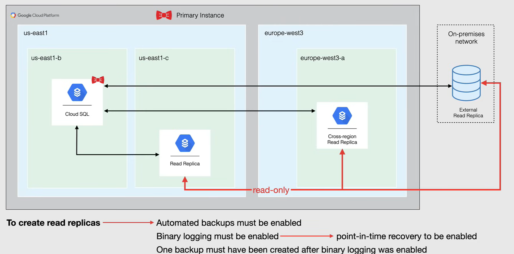
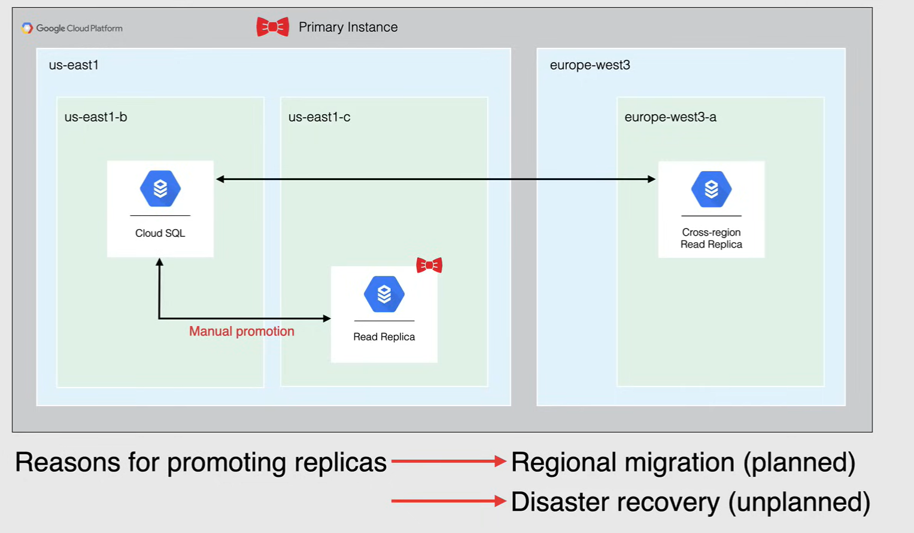
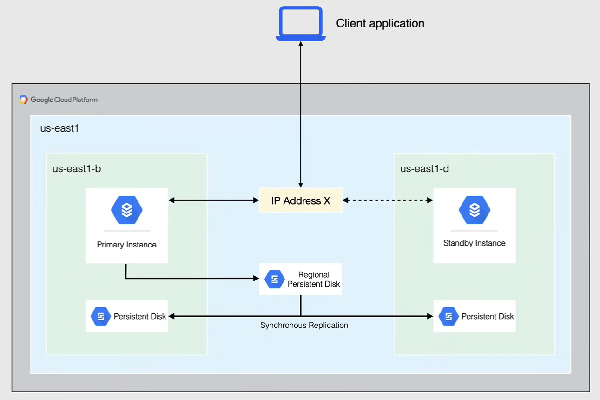
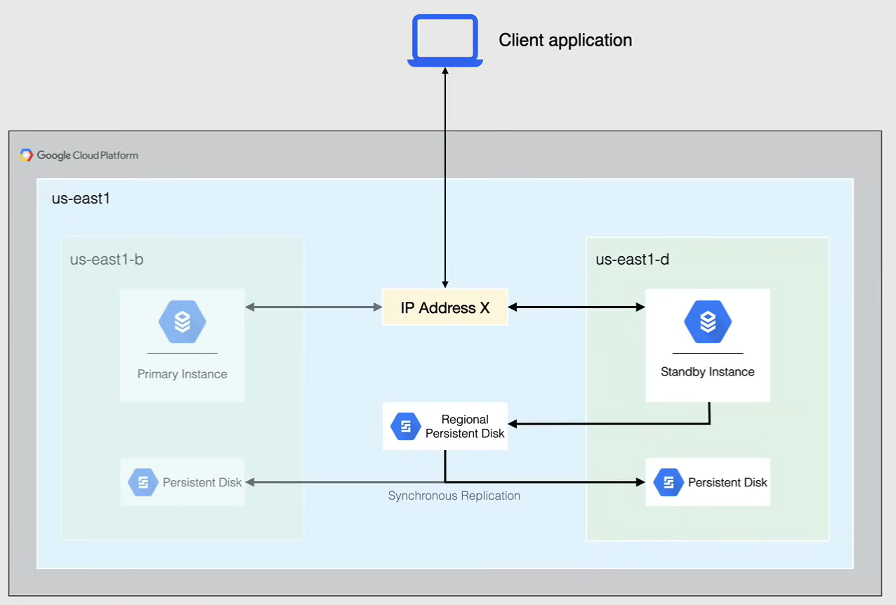
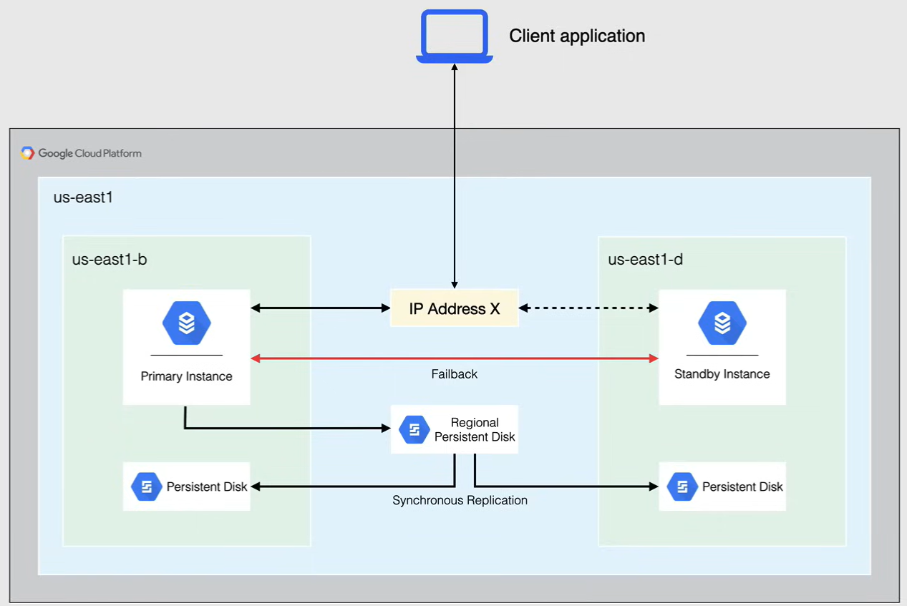

# Cloud SQL

Cloud SQL è un *servizio di database relazionale (RDBMS) completamente gestito e nativo del cloud* che offre motori MySQL, PostgreSQL e SQL Server con supporto integrato per la replica.

Cloud SQL è un'offerta di *Database as a Service (DBaaS)* da Google, in cui Google si occupa di tutta l'infrastruttura sottostante per il database, insieme al sistema operativo e al software del database.

Cloud SQL è stato progettato per *carichi di lavoro di database transazionali e relazionali a bassa latenza*.

È disponibile in tre diverse varianti di database: MySQL, PostgreSQL e SQL Server. E tutti supportano API standard per la connettività.

Cloud SQL offre *replica* utilizzando diversi tipi di repliche.
Offre funzionalità per *alta disponibilità*, per un accesso continuo ai dati.

Cloud SQL offre anche *backup* in 2 diverse varianti e consente di ripristinare il database da questi backup con la stessa facilità.

- Backup su richiesta
- Backup automatici

Insieme ai backup, viene fornito il *recupero a un punto nel tempo*, per quando si desidera ripristinare un database da un punto specifico nel tempo.

Lo storage di Cloud SQL si basa su dischi persistenti connessi nella stessa zona, disponibili in unità disco rigido tradizionali o SSD che attualmente offrono una capacità di archiviazione fino a 30 terabyte, e poiché le stesse tecnologie sono presenti sullo sfondo per i dischi persistenti, è disponibile l'*aumento automatico dello storage* per ridimensionare i dischi per ottenere più spazio di archiviazione.

Cloud SQL offre anche *crittografia a riposo* e *in transito* per proteggere i dati in ingresso e in uscita dall'istanza.

Per quanto riguarda i costi, si paga per la CPU, la memoria e lo storage dell'istanza, insieme al traffico in uscita.

- Si prega di notare che c'è un costo di licenza per le istanze Windows.

Le istanze di Cloud SQL non sono disponibili negli stessi tipi di istanze di Compute Engine e sono disponibili solo nei seguenti tipi di CPU:

- Shared-Core
- Standard
- High memory

Quando li si vede, saranno chiaramente contrassegnati con un `db` all'inizio del tipo di CPU, e *non è possibile personalizzare queste istanze* come si può fare con Compute Engine, quindi la memoria sarà predefinita quando si sceglie il tipo di istanza.

I *tipi di storage* per Cloud SQL sono disponibili solo in unità disco rigido e SSD. È possibile dimensionarli in base alle proprie esigenze e, come già detto, possono essere dimensionati fino a 30 terabyte di capacità. Quando si raggiunge la zona pericolosa di un disco pieno, si ha la possibilità di abilitare *l'aumento automatico dello storage* in modo da non doversi preoccupare di riempire il disco prima di raggiungere il limite di 30 terabyte.

Per quanto riguarda la connessione all'istanza di Cloud SQL, è possibile configurarla con un IP *pubblico* o *privato*, ma si tenga presente che dopo aver configurato l'istanza con un IP privato, **non può essere modificato**.

- Sebbene la connessione tramite IP pubblico all'indirizzo IP pubblico di un'istanza sia consentita solo se la connessione proviene da una rete autorizzata.
- È sempre una buona pratica utilizzare indirizzi IP privati per qualsiasi database nel proprio ambiente quando possibile.

Passando alle opzioni di autenticazione, il metodo consigliato per connettersi all'istanza di Cloud SQL è utilizzare *Cloud SQL Proxy*. Cloud SQL Proxy consente di autorizzare e proteggere le connessioni utilizzando le autorizzazioni IAM, a meno che le connessioni tramite Cloud SQL Proxy all'indirizzo IP pubblico di un'istanza siano consentite solo se la connessione proviene da una rete autorizzata.

- Le reti autorizzate sono indirizzi IP o intervalli specificati dall'utente come autorizzati a connettersi.
- Una volta autorizzati, è possibile connettersi all'istanza tramite client esterni o applicazioni, nonché ad altri servizi di Google Cloud come Compute Engine, GKE, App Engine, Cloud Functions e Cloud Run.

## Cloud SQL Proxy

Cloud SQL Proxy consente di autorizzare e proteggere le connessioni utilizzando le autorizzazioni IAM, il proxy convalida le connessioni utilizzando le credenziali per un utente o un service account e avvolge la connessione in uno strato SSL-TLS autorizzato per un'istanza di Cloud SQL.

L'utilizzo di Cloud SQL Proxy è il metodo consigliato per autenticare le connessioni a un'istanza di Cloud SQL, in quanto è il più sicuro.

Il client proxy è una libreria open source distribuita come un binario eseguibile ed è disponibile per Linux, Mac OS e Windows.
Il client proxy agisce come un server intermedio che ascolta le connessioni in ingresso, le avvolge in SSL o TLS e quindi le passa a un'istanza di Cloud SQL.

Cloud SQL Proxy gestisce l'autenticazione con Cloud SQL, fornendo accesso sicuro alle istanze di Cloud SQL senza la necessità di gestire gli indirizzi IP consentiti o configurare le connessioni SSL.

- Questa è anche la soluzione migliore per le applicazioni che utilizzano indirizzi IP effimeri.
- Sebbene il proxy possa ascoltare su qualsiasi porta, crea solo connessioni in uscita verso l'istanza di Cloud SQL sulla porta 3307.

## Replication

Quando si tratta di replicazione del database, si tratta di più che copiare i dati da un database a un altro.

La ragione principale per utilizzare la replicazione è *scalare l'uso dei dati in un database senza degradare le prestazioni*, altre ragioni includono la migrazione dei dati tra regioni e piattaforme e da un database in locale a Cloud SQL. È anche possibile promuovere una replica se l'istanza originale diventa corrotta.

Per quanto riguarda un'istanza di Cloud SQL, l'istanza che viene replicata viene chiamata **istanza primaria** e le copie vengono chiamate **repliche di lettura**. L'istanza primaria e le repliche di lettura risiedono tutte in Cloud SQL.

*Le repliche di lettura sono di sola lettura*, e non è possibile scriverci. Elaborano le richieste di query, di lettura e di traffico di analisi, riducendo così il carico sull'istanza primaria. Le repliche di lettura possono avere più CPU e memoria rispetto all'istanza primaria, ma non possono avere meno. È possibile avere fino a 10 repliche di lettura per ogni istanza primaria. E si può connettersi direttamente a una replica utilizzando il suo nome di connessione e l'indirizzo IP.

Cloud SQL supporta i seguenti tipi di repliche:

- *Repliche di lettura*
  - Si utilizzano per alleggerire il lavoro da un'istanza di Cloud SQL. La replica di lettura è una copia esatta dell'istanza primaria e i dati e le altre modifiche sull'istanza primaria vengono aggiornati quasi in tempo reale sulla replica di lettura.
- *Repliche di lettura tra regioni*
  - Una replica di lettura viene creata in una regione diversa rispetto all'istanza primaria e è possibile creare una replica di lettura tra regioni allo stesso modo in cui si creerebbe una replica tra regioni interne.
  - Ciò migliora le prestazioni di lettura rendendo le repliche disponibili più vicine alla regione dell'applicazione. Fornisce anche una capacità di ripristino da disastro aggiuntiva per proteggere contro un guasto regionale.
  - Consente anche di migrare i dati da una regione all'altra con un tempo di inattività minimo.
- *Repliche di lettura esterne*
  - Si tratta di istanze MySQL esterne che replicano da un'istanza primaria di Cloud SQL.
  - Ad esempio, un'istanza MySQL in esecuzione su Compute Engine è considerata un'istanza esterna.
- *Repliche di Cloud SQL* quando si replica da un server esterno

**NOTA:** prima di poter creare una replica di lettura di un'istanza primaria di Cloud SQL, l'istanza deve soddisfare i seguenti requisiti:

- I backup automatici devono essere abilitati
- La registrazione binaria deve essere abilitata
  - che richiede l'abilitazione del ripristino a un punto nel tempo
- Deve essere stato creato almeno un backup dopo l'abilitazione della registrazione binaria.

### Promoting Replicas

Quindi, quando hai più repliche nel tuo ambiente, ti offre la flessibilità di promuovere quelle repliche se necessario.

*Promuovere le repliche* è una funzionalità che può essere utilizzata quando il tuo database primario diventa corrotto o non raggiungibile.

Puoi promuovere una replica di lettura *in-region* o una replica di lettura *cross-region*, a seconda di dove hai ospitate le tue repliche di lettura. Quindi, quando promuovi la replica di lettura, l'istanza interrompe la replica e converte l'istanza in un'istanza primaria standalone di Cloud SQL, con capacità di lettura e scrittura.

**NOTA:**

- ciò non può essere annullato
- quando la tua nuova istanza primaria è avviata, le altre repliche di lettura non vengono trasferite dalla vecchia istanza primaria. Dovrai riconnettere le altre repliche di lettura alla tua nuova istanza primaria.

E come puoi vedere nello schema seguente, la promozione della replica viene effettuata manualmente e intenzionalmente, mentre l'alta disponibilità ha un'istanza standby che diventa automaticamente primaria in caso di guasto o interruzione zonale.

Quando si tratta di promuovere repliche cross-region, ci sono due scenari comuni per la promozione.

- **Migrazione regionale**, che esegue una migrazione pianificata di un database in una diversa regione
- **Ripristino da disastro**, in cui si esegue il failover di un database in un'altra regione nel caso in cui la regione delle istanze primarie diventi non disponibile.

Entrambi i casi d'uso prevedono la configurazione della replica cross-region e quindi la promozione della replica.
*La differenza principale tra loro* è se la promozione della replica è pianificata o non pianificata.

Se stai promuovendo le tue repliche per una migrazione regionale, puoi utilizzare una replica cross-region per migrare il tuo database in un'altra regione con un tempo di inattività minimo, in modo da poter creare una replica in un'altra regione, attendere che la replica si aggiorni, promuoverla e quindi indirizzare le tue applicazioni alla nuova istanza promossa.

I passaggi coinvolti nella promozione sono gli stessi per la promozione di una replica interna alla regione.

Quando promuovi repliche per il ripristino da disastro, le repliche cross-region possono essere utilizzate come parte di questa procedura di ripristino da disastro, possono promuovere una replica cross-region per il failover in un'altra regione nel caso in cui la regione delle istanze primarie diventi non disponibile per un periodo di tempo prolungato.

Quindi, in questo esempio, l'intera regione `us-east1` è andata giù, ma la replica di lettura nella regione `europe` è ancora attiva e funzionante, e sebbene possa esserci un po' più di latenza per i tuoi clienti in Nord America, sono in grado di promuovere questa replica di lettura collegata alle risorse necessarie e tornare al lavoro.

## High Availability

Cloud SQL offre funzionalità di alta disponibilità (HA) di serie.

La configurazione HA, talvolta chiamata *cluster*, fornisce ridondanza dei dati. Pertanto, un'istanza di Cloud SQL configurata per l'HA è chiamata anche istanza regionale e si trova in una zona primaria e una zona secondaria all'interno della regione configurata.

All'interno di un'istanza regionale, la configurazione è composta da un'**istanza primaria** e un'**istanza standby**. Attraverso la **replicazione sincrona** su disco persistente di ogni zona, tutti i diritti effettuati sull'istanza primaria vengono effettuati anche sull'istanza standby.

Ogni secondo, l'istanza primaria scrive su un database di sistema come segnale di battito cardiaco. Se vengono rilevati più battiti cardiaci, viene avviato il failover.

Se un'istanza configurata per l'HA diventa non rispondente, Cloud SQL passa automaticamente a servire i dati dall'istanza standby. Questo viene chiamato **failover**.

In questo esempio, l'istanza primaria o la zona fallisce e viene avviato il failover.

Quindi, se l'istanza primaria non risponde per circa 60 secondi o se la zona che contiene l'istanza primaria subisce un'interruzione, verrà avviato il failover.

L'istanza standby inizia immediatamente a servire i dati al momento della riconnessione tramite un indirizzo IP statico condiviso con l'istanza primaria, e l'istanza standby ora serve i dati dalla zona secondaria.

Quando l'istanza primaria è nuovamente disponibile, avverrà un **failback**, e in questo momento il traffico verrà ridirezionato nuovamente all'istanza primaria.

L'istanza standby tornerà in modalità standby e il disco persistente regionale riprenderà la replica sul disco persistente nella stessa zona.

Per quanto riguarda la fatturazione, un'istanza configurata per l'HA viene addebitata al doppio del prezzo di un'istanza autonoma, compresi CPU, RAM e storage.

**NOTA:**

- L'istanza standby non può essere utilizzata per le query di lettura, ed è qui che si differenzia dalle repliche di lettura.
- Il backup automatico e il ripristino a un punto nel tempo devono essere abilitati per l'alta disponibilità.

## Backups

I **backup** ti aiutano a ripristinare i dati persi nella tua istanza Cloud SQL, puoi anche ripristinare un'istanza che sta avendo problemi da un backup. Abiliti i backup per qualsiasi istanza che contiene dati necessari.

I backup proteggono i tuoi dati da perdite o danni, l'abilitazione dei backup automatici, insieme alla registrazione binaria, è anche richiesta per alcune operazioni, come la creazione di cloni e repliche.

Di default, Cloud SQL *memorizza i dati di backup in due regioni per la ridondanza*, una regione può essere la stessa regione in cui si trova l'istanza e l'altra è una regione diversa. Se ci sono due regioni in un continente, i dati di backup rimangono nello stesso continente.

Cloud SQL ti consente anche di selezionare una posizione personalizzata per i tuoi dati di backup, ed è ottimo se devi rispettare le normative sulla residenza dei dati per la tua attività.

Cloud SQL esegue due *tipi* di backup:

- **Backup su richiesta**
  - Puoi creare un backup in qualsiasi momento.
  - Questo è utile quando stai apportando modifiche rischiose che potrebbero andare male.
  - Puoi sempre creare backup su richiesta per qualsiasi istanza, che abbia o meno i backup automatici abilitati.
  - Questi backup persistono fino a quando non li elimini o fino a quando l'istanza viene eliminata.
- **Backup automatici**
  - Questi utilizzano una finestra di backup di quattro ore.
  - Questi backup iniziano durante la finestra di backup.
  - Quando possibile, dovresti pianificare i tuoi backup quando l'istanza ha meno attività.
  - I backup automatici si verificano ogni giorno quando le tue istanze sono in esecuzione in qualsiasi momento nella finestra di 36 ore e, per impostazione predefinita, vengono conservati fino a sette backup più recenti.
  - Puoi anche configurare quanti backup automatici conservare da uno a 365.

### Point in Time Recovery

**Point in time recovery** (PITR) ti aiuta a ripristinare un'istanza a un punto specifico nel tempo, ad esempio, se si verifica un errore che causa la perdita di dati, è possibile ripristinare un database al suo stato precedente all'errore.

Un ripristino a un punto nel tempo crea sempre una nuova istanza e *non è possibile eseguire un ripristino a un punto nel tempo su un'istanza esistente*.

Il ripristino a un punto nel tempo è *abilitato per impostazione predefinita quando si crea una nuova istanza di Cloud SQL*, e quindi per quanto riguarda la fatturazione, Cloud SQL conserva per impostazione predefinita sette giorni di backup automatici, oltre a tutti i backup su richiesta per un'istanza.

