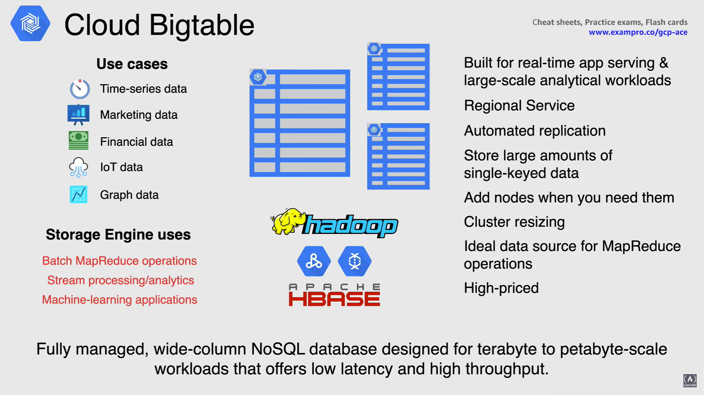

# NoSQL Databases

Ecco quattro database NoSQL gestiti disponibili in Google Cloud:

- Cloud Bigtable
- Cloud Datastore
- Firestore
- Memorystore

## Cloud BigTable

Cloud BigTable è un database NoSQL a colonne larghe completamente gestito, progettato per carichi di lavoro su scala di terabyte e petabyte che offre bassa latenza e alto throughput.

- BigTable è *progettato per carichi di lavoro di servizio di applicazioni in tempo reale*, così come per carichi di lavoro analitici su larga scala.

- Cloud BigTable è un *servizio regionale*, e se si utilizza la replica, una copia viene archiviata in una diversa zona o regione per garantire la durabilità (*replicazione automatica*).

- Cloud BigTable è progettato per archiviare *grandi quantità di dati con chiave singola* pur fornendo una latenza molto bassa.

- Il throughput scala linearmente, è possibile aumentare le query al secondo aggiungendo più nodi BigTable quando necessario.

- Il throughput di BigTable può essere regolato dinamicamente aggiungendo o rimuovendo nodi del cluster (*ridimensionamento del cluster*) senza riavviare, il che significa che è possibile aumentare la dimensione di un cluster BigTable per poche ore, per gestire un carico elevato, e quindi ridurre nuovamente la dimensione del cluster senza alcun tempo di inattività.

- BigTable è un'ottima fonte per operazioni di *MapReduce* e si integra facilmente con tutti gli strumenti esistenti per il big data, come Hadoop, Dataproc e Dataflow, insieme ad Apache Hbase.

- Per quanto riguarda il prezzo, BigTable non è certo uno scherzo. Il prezzo di BigTable parte da $0.65 all'ora per nodo, o oltre $450 al mese, per una configurazione con un solo nodo senza dati.

Ora puoi utilizzare la tabella per archiviare e interrogare tutti i seguenti tipi di dati:

- Utilizzo di CPU e memoria nel tempo per più server,
- *Dati di marketing* come cronologie degli acquisti e preferenze dei clienti
- *Dati finanziari* come cronologie delle transazioni, prezzi delle azioni e tassi di cambio delle valute
- *Dati IoT* o Internet delle cose come le letture dai contatori energetici e dagli elettrodomestici domestici.
- *Dati grafici* come informazioni su come gli utenti sono collegati tra loro.

Cloud BigTable *eccelle come motore di archiviazione*, in quanto può:

- *Operazioni di batch MapReduce*,
- *Elaborazione in streaming o analisi*,
- *Essere utilizzato come archiviazione per applicazioni di apprendimento automatico*.

## Cloud Datastore

**Cloud Datastore** è un *database di documenti NoSQL altamente scalabile, costruito per la scalabilità automatica, l'alta performance e la facilità di sviluppo delle applicazioni*.

- Datastore è ridondante all'interno della tua posizione per ridurre al minimo l'impatto dei punti di guasto e quindi può offrire *alta disponibilità di letture e scritture*.

- Cloud Datastore può eseguire *transazioni atomiche*, in cui un insieme di operazioni ha successo o nessuna operazione avviene.

- Cloud Datastore utilizza un'architettura distribuita per *gestire automaticamente la scalabilità* in modo da non doverti preoccupare di scalare manualmente.

- Un vantaggio di Cloud Datastore è che ha un linguaggio di query simile a SQL chiamato *GQL*. Si avvicina approssimativamente a SQL, tuttavia, una ricerca di colonna di ruolo SQL è limitata a un singolo valore, mentre in GQL una proprietà può essere una proprietà a valori multipli.

- Questo *modello di consistenza* consente a un'applicazione di gestire grandi quantità di dati e utenti pur essendo in grado di offrire un'ottima esperienza utente.

- I dati vengono *crittografati automaticamente* prima di essere scritti su disco e decrittografati automaticamente quando vengono letti da un utente autorizzato.

**Firestore** *è la versione più recente di Datastore* e introduce diverse migliorie rispetto a Datastore.

- Gli utenti esistenti di Datastore possono accedere a queste migliorie creando una nuova istanza di database Firestore in modalità Datastore e in futuro tutte le basi di dati esistenti di Datastore verranno automaticamente aggiornate a Firestore in modalità Datastore.

**Datastore emulator** fornisce un'emulazione locale dell'ambiente di produzione di Datastore che puoi utilizzare per sviluppare e testare la tua applicazione in locale.

Questo è un componente dello strumento cloud `gcloud` del Google Cloud SDK e può essere installato utilizzando il comando `gcloud components install` che abbiamo discusso in precedenza nel corso.

Passando ai *casi d'uso* per Datastore, è ideale per applicazioni che si basano su dati strutturati altamente disponibili su larga scala.

- *Cataloghi di prodotti* che forniscono inventario in tempo reale e dettagli sui prodotti per un rivenditore.
- *Profili utente* che offrono un'esperienza personalizzata in base alle attività e alle preferenze passate dell'utente.
- *Transazioni basate sulle proprietà ACID*, ad esempio, il trasferimento di fondi da un conto bancario a un altro.

## Firestore for Firebase

**Firestore for Firebase** è un database cloud NoSQL flessibile e scalabile per archiviare e sincronizzare dati per lo sviluppo lato client e server, ed è disponibile per SDK nativi C++, Unity, nodeJS, Java, Go e Python, oltre a REST e API RPC.

Cloud Firestore archivia i dati in *documenti* che contengono campi che mappano valori.

Questi documenti sono archiviati in *collezioni* che sono contenitori per i tuoi documenti che puoi utilizzare per organizzare i tuoi dati e creare query.
I documenti supportano anche molti tipi di dati diversi, è possibile creare anche sottocollezioni all'interno dei documenti e creare strutture dati gerarchiche.

- Cloud Firestore è **serverless** senza server da gestire, aggiornare o mantenere.

- Con *replicazione multi-regione automatica* e consistenza forte, Google è in grado di garantire un'alta disponibilità del 99,999%.

- Per quanto riguarda le query in Cloud Firestore, è *espressivo*, efficiente e flessibile.
  - È possibile creare query superficiali per recuperare dati a livello di documento senza dover recuperare l'intera collezione o eventuali sottocollezioni nidificate.

- Cloud Firestore utilizza *sincronizzazione dei dati per aggiornare i dati in tempo reale* per qualsiasi dispositivo connesso.

- Vengono anche *memorizzati nella cache i dati* che l'applicazione sta utilizzando attivamente, in modo che l'applicazione possa scrivere, leggere, ascoltare e interrogare i dati, anche se il dispositivo è **offline**.
  - Quando il dispositivo torna online, Cloud Firestore sincronizza eventuali modifiche locali su Cloud Firestore.

- È anche possibile proteggere i dati in Cloud Firestore con l'autenticazione di Firebase e le regole di sicurezza di Cloud Firestore per Android, iOS e JavaScript, dove è possibile utilizzare IAM per i linguaggi lato server.

- Per quanto riguarda il costo, Firestore rientra nella *tier gratuita sempre disponibile*, in cui è possibile utilizzare 1 database con una capacità di 5 gigabyte, o se ne hai bisogno di più, puoi passare alla loro *opzione a pagamento*.
  - Firebase ha anche un altro database, con funzionalità simili come:
    - nessun server da distribuire e mantenere
    - aggiornamenti in tempo reale
    - tier gratuita
    
    Questo database si chiama **Realtime Database** ed è utilizzato per query più semplici, strutture dati semplici e mantenere tutto in un unico database (è una sorta di *Firestore light*).

È possibile utilizzare entrambi i database all'interno della stessa applicazione o progetto Firebase, in quanto entrambi possono archiviare gli stessi tipi di dati, librerie client, funzionano in modo simile e supportano gli aggiornamenti in tempo reale.

**Firebase è una piattaforma di sviluppo e non un servizio di database**.

Firebase è una piattaforma di sviluppo di applicazioni mobili che fornisce strumenti e servizi cloud per aiutare i developer a sviluppare applicazioni in modo più rapido e facile.

Poiché si integra perfettamente con Firestore, diventa la piattaforma ideale per lo sviluppo di applicazioni mobili.

## Memorystore

**Memorystore** è un servizio completamente gestito per Google Cloud per Redis o Memcached in memoria Datastore per creare cache di applicazioni.

Questo è un servizio comune utilizzato in molti ambienti di produzione, specificamente quando si presenta la necessità di memorizzare nella cache.

- *Completamente gestito:* Memorystore automatizza le attività di amministrazione per Memcached, come l'abilitazione dell'alta disponibilità, il failover e il monitoraggio, in modo da non doverlo fare tu.

- *Alta disponibilità:* Per quanto riguarda le istanze Memorystore per Redis nella modalità standard, queste vengono replicate tra le zone, monitorate per la salute e hanno un failover automatico veloce.
  - Le istanze della modalità standard offrono anche un SLA di disponibilità di 3-nove.

- *Scala secondo necessità:* Memorystore per Redis offre anche la possibilità di scalare le dimensioni delle istanze in modo trasparente, in modo da poter iniziare con una dimensione ridotta e aumentare la dimensione dell'istanza secondo necessità.

- *Sicurezza:* Memorystore è protetto da Internet utilizzando reti VPC e IP privati, ed è anche dotato di integrazione IAM.
- I sistemi vengono monitorati 24 ore su 24, garantendo che i tuoi dati siano protetti in ogni momento.

- *Sempre aggiornato:* le versioni sono sempre mantenute aggiornate con le ultime patch critiche, garantendo che le tue istanze siano sicure.

Per quanto riguarda questi casi:

- *Memorizzazione nella cache:* Questo è il motivo principale per utilizzare Memorystore in quanto fornisce un accesso a bassa latenza e un'elevata velocità di trasferimento per i dati ad accesso frequente rispetto all'accesso ai dati da un disco.
  - Esempi di memorizzazione nella cache sono la gestione delle sessioni, le query di accesso frequente, gli script o le pagine.

- *Gaming:* quando si utilizza Memorystore per classifiche e giochi, questo è un caso d'uso comune nell'industria dei giochi, così come l'utilizzo per i profili dei giocatori.

- *Elaborazione in streaming:* Memorystore è anche una soluzione perfetta per l'elaborazione in streaming combinata con Dataflow. Memorystore per Redis fornisce un'archiviazione scalabile e veloce in Memorystore per memorizzare dati intermedi a cui possono accedere migliaia di client con una latenza molto bassa.

