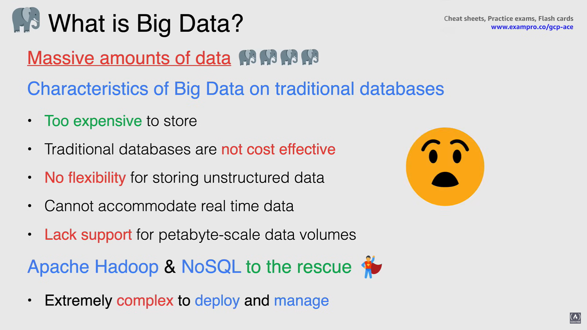
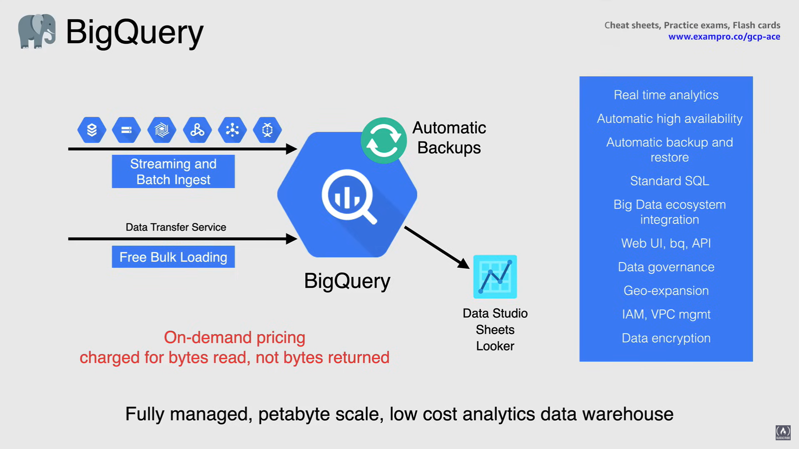
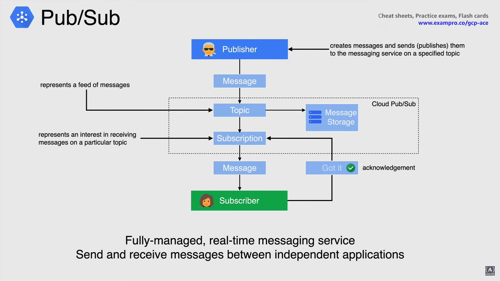
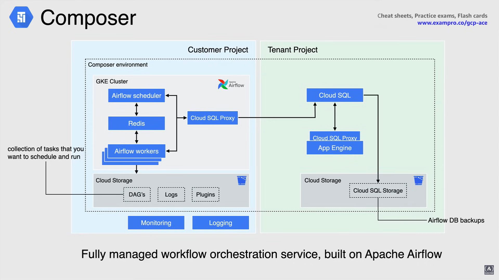
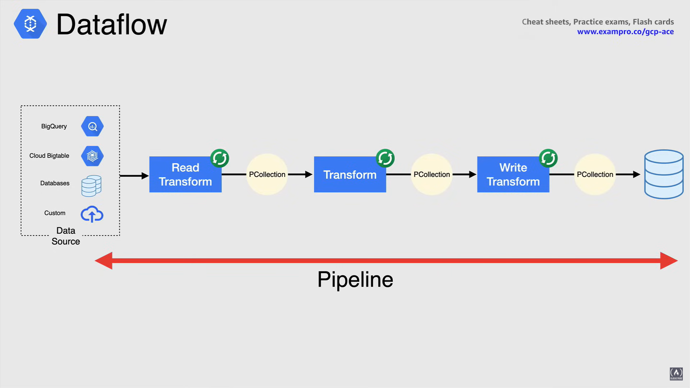
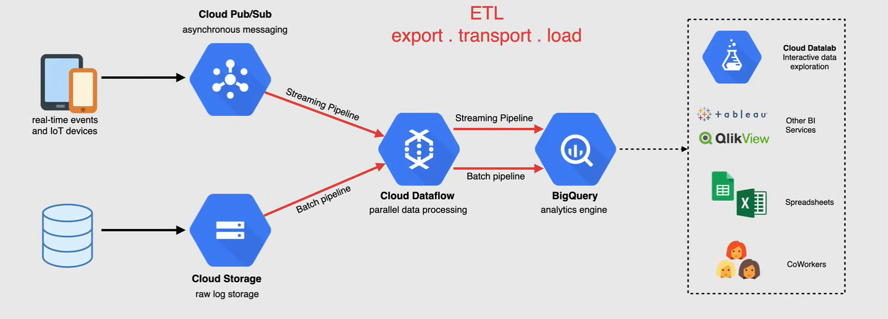
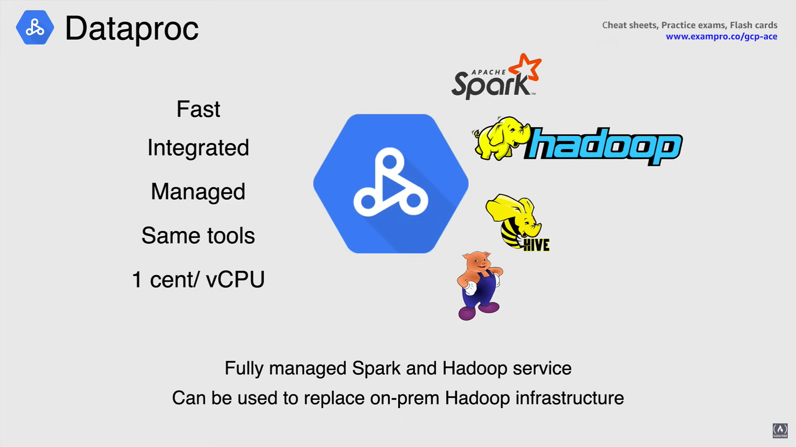
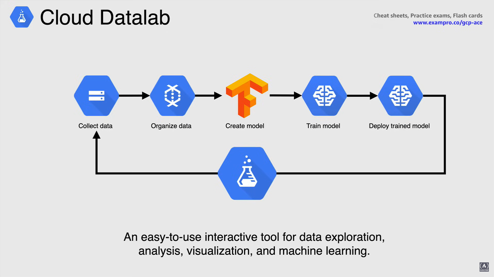
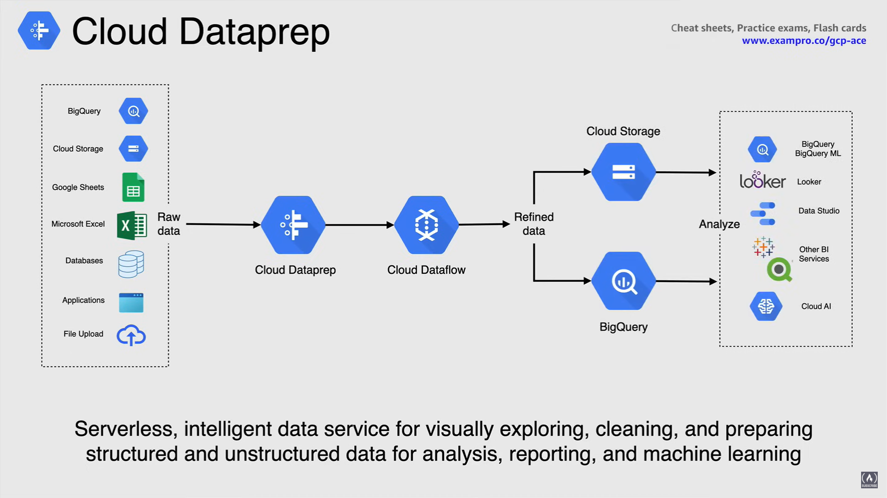

# Big Data Services

## What is Big Data?

Big Data refers to **massive amounts of data** that would typically be too *expensive to store*, manage and analyze using traditional database systems, either relational or monolithic.

As the amount of data that we have been seeing over the past few years has started to increase, these systems have become very inefficient because of their lack of flexibility for storing unstructured data such as images, text or video.

As well as accommodating high velocity or real time data, or scaling to support very large petabyte scale data volumes.

For this reason, the past few years has seen the mainstream adoption of new approaches to managing and processing Big Data, including Apache Hadoop and NoSQL database systems.

However, those options often prove to be complex to deploy, manage and use in an on-premises situation.

## Why is Big Data so important?

The ability to consistently get business value from data fast and efficiently is now becoming the de facto of successful organizations across every industry.

The more data a company has access to, the more business insights and business value they're able to achieve, like:

- Gain useful **insights**
- **Increase revenue**
- Get or retain **customers**
- **Improve operations**
- Better with **Machine Learning**
  - because machine learning models get more efficient as they are trained with more data, machine learning and Big Data are highly complementary.

Big Data breaks some really great value to the table that is impossible for any organization to turn down.

## Big Data Services on Google Cloud

### BigQuery

*BigQuery is a fully managed server list data warehouse that enables scalable analysis over petabytes of data*. 

This service supports querying using SQL and holds built in machine learning capabilities.

You start by ingesting data into BigQuery and then you are able to take advantage of all the power it provides.

So Big Data would ingest that data by doing a *batch upload* or *by streaming it in real time* and you can use any of the currently available Google Cloud services to load data into BigQuery.

You can take a manual batch ingestion approach or stream using Pub/Sub ETL data and with BigQuery data transfer service you can automatically transfer data from external Google data sources and partner SaaS applications to BigQuery on a scheduled and fully managed basis.

**NOTE:** Batch and export is free.

- **Real-time analytics**
  - BigQuery's high-speed streaming API provides an incredible foundation for *real time analytics* making business data immediately available for analysis and you can also leverage Pub/Sub and Dataflow to stream data into BigQuery.

- **Automatic high availability**
  - BigQuery transparently and *automatically provides highly durable replicated storage* in multiple locations for high availability.

- **Automatic backup and restore**
  - As well as being able to achieve easy resource BigQuery keeps a 7 day history of changes in case something were to go wrong.

- **Standard SQL**
  - BigQuery supports standard SQL querying which reduces the need for code rewrites. You can simply use it as you would for querying any other sequel compliant database.

- **BigData ecosystem integration**
  - With Dataproc and Dataflow in query provides integration with the Apache Big Data ecosystem allowing existing Hadoop, Spark and Beam Workloads to read or write data directly from BigQuery using the Storage API.

- **Web UI, `bq`, API**
  - BigQuery also makes it very easy to access this data by using the cloud console using the `bq` command line tool or making calls to the BigQuery REST API, using a variety of client libraries such as Java, .NET or Python.
  - They're also a variety of 3rd party tools that you can use to interact with BigQuery when visualizing the data or loading the data.

- **Data Governance**
  - BigQuery provides strong security and governance controls with fine grain controls through integration with identity and access management.

- **Geo-expansion** 
  - BigQuery gives you the option of geographic data control without the headaches of setting up and managing clusters and other computing resources in different zones and regions.

- **IAM, VPC management**

- **Data Encryption**
  - BigQuery also provides fine grain identity and access management and rest assured that your data is always encrypted at rest and in transit.

*The way the BigQuery calculates **billing** charges is by queries and by storage.*

Storing data and BigQuery is comparable in price with storing data in Cloud Storage, which makes it an easy decision for storing data in the query.

There is no upper limit to the amount of data that can be stored in BigQuery, so if tables are not edited for 90 days, the price of storage for that table drops by 50%.

Query costs are also available as on demand and flat rate pricing, and when it comes to on-demand pricing, you're only charged four bytes read, not bytes return.

In the end, BigQuery scales seamlessly to store and analyze petabytes, to exabytes of data with ease.

### Pub/Sub

**Pub/Sub** is a *fully-managed real time messaging service that allows you to send and receive messages between independent applications*.

It acts as messaging oriented middleware or event ingestion and delivery for streaming analytics pipelines.

A **publisher** application *creates and send messages to a topic*, **subscriber** applications, *create a subscription to a topic and receives messages from it*. 

1. The publisher creates messages and sends them to the messaging service on a specified topic.

   - A **topic** is a named entity that represents a feed of messages.

2. A publisher application creates a topic in the Pub/Sub service and sends messages to that topic.

   - A message contains a payload and optional attributes that describe the content.

3. Service as a whole ensures that published messages are retained on behalf of subscriptions, and so a published message is retained for a subscription in a message queue (shown here as Message Storage), until it is acknowledged by any subscriber consuming messages from that subscription.

4. Pub/Sub then forwards messages from a topic to all of its subscriptions individually.

5. A subscriber then receives messages either by Pub/Sub pushing them to the subscribers chosen endpoint or by the subscriber pulling them from the service.

6. The subscriber then sends an acknowledgement to the Pub/Sub service for each received message.

7. The service then removes acknowledged messages from the subscriptions message queue.

Some of the **use cases** for Pub/Sub is balancing large task queues, distributing event notifications and real time data streaming from various sources.

### Composer

**Composer** is a *managed workflow orchestration service that is built on Apache Airflow*.

- This is a workflow automation tool for developers that's based on the open source Apache Airflow project.

Similar to an on-premises deployment, Cloud Composer deploys multiple components to run Airflow in the cloud.

Airflow is a platform created by the community to programmatically author, schedule and monitor workflows.

The Airflow scheduler, as you see here, executes the tasks on an array of workers while following the specified dependencies and storing the data in a database and having a UI component for easy management.

In data analytics, a **workflow** represents *a series of tasks for ingesting, transforming analyzing or utilizing data*.

In Airflow, workflows are created using **DAGs**, which are a *collection of tasks that you want to schedule and run*, and organizes these tasks to ensure that each task is executed at the right time, in the right order, or with the right issue handling.

In order to run the specialized workflows, provision environments are needed, and so Composer deploys these self contained environments on Google Kubernetes Engine that work with other Google Cloud services using connectors built into Airflow.

The beauty of Composer is that you can create one or more of these environments in a single Google Cloud project using any supported region without having to do all the heavy lifting of creating a full blown Apache Airflow environment.

### Dataflow

**Dataflow** is a *serverless, fully managed processing service for executing Apache Beam pipelines for batch and real time data streaming*.

The Apache Beam SDK is an open source programming model that enables you to develop both batch and streaming pipelines.

Using one of the Apache Beam SDKs you build a program that defines the pipeline, then one of Apache Beams supported distributed processing backends, such as Dataflow, execute that pipeline.

The Dataflow service then takes care of all the low level details like coordinating individual workers, sharding data sets, auto scaling and exactly once processing.

*In its simplest form, Google Cloud Dataflow reads the data from a source, transforms it and then writes the data back to a sync.*

Now getting a bit more granular with how this pipeline works:

1. Dataflow reads the data presented from a data source.

2. Once the data has been read, it is put together into a *collection of datasets* called **Pcollection**, and this allows the data to be read, distributed and processed across multiple machines.

3. Now at each step in which the data is transformed, a new Pcollection is created, and once the final collection has been created, it is written to a **Sync**, and this is the full pipeline of how data goes from source to Sync.

This pipeline within Dataflow is called a **job**.

And finally, here is a high level overview of what Dataflow job would look like when you involve other services within Google Cloud. Put together in an end-to-end solution from retrieving the data to visualizing it.

And finally, when it comes to **pricing**, Dataflow jobs are *billed in per second increments*, so your only charge for when you are processing your data.

### Dataproc

**Dataproc** is a fast and easy way to run Spark, Hadoop, Hive or Pig on Google Cloud.

- In an on premises environment, it takes 5 to 30 minutes to create Spark and Hadoop clusters.

- Data crop clusters take 90 seconds or less on average to be built in Google Cloud.

Dataproc has built in integration with other Google Cloud platform services and use Spark and Hadoop clusters without any admin assistance. So when you're done with a cluster, you can simply turn it off so you don't spend money on an idle cluster.

As well there's no need to worry about data loss because Dataproc is integrated with Cloud Storage, BigQuery and Cloud BigTable.

The great thing about Dataproc is you don't need to learn new tools or API to use it, Spark, Hadoop, Pig and Hive are all supported and frequently updated.

And when it comes to **pricing**, your build at $0.01 per vCPU in your cluster, per hour on top of the other resources you use. You also hunt the flexibility of using preemptible instances for even lower compute cost.

#### Dataproc vs Dataflow

Although Cloud Dataproc and Cloud Dataflow can both be used to implement ETL data warehousing solutions, they each have their strengths and weaknesses.

With Dataproc, you can easily spin up clusters through the console, the SDK or the API, and turn it off when you don't need it.

With Dataflow, it is serverless and fully managed, so there are never any servers to worry about.

When it comes to having any dependencies to tools in the Hadoop or Spark ecosystem, Dataproc would be the way to go.

But if you're looking to make your jobs more portable across different execution engines, Apache Beam allows you to do this and is only available on Dataflow.

### Cloud Datalab

**Cloud Datalab** is an interactive developer tool created to explore, analyze, transform and visualize data and build machine learning models from your data.

Datalab uses open source Jupiter notebooks, well known format used in the world of data science.

It runs on compute engine and connects to multiple cloud services easily, so you can focus on your data science tasks.

It also integrates with all of the Google services that help you simplify data-processing like Bigquery and Cloud Storage.

Cloud Datalab is packaged as a container and run in a vm instance.

Cloud Datalab uses notebooks instead of text files containing code, notebooks bring together code, documentation written as markdown, and the result of code execution, whether it's text, image or html or javascript.

Like a code editor or IDE, notebooks help you write code, and they allow you to execute code in an interactive and iterative manner, rendering the results alongside the code.

Cloud Datalab notebooks can be stored in Google cloud source repository, this git is cloned on to persistent disk when attached to the VM.

### Dataprep

When it comes to prepping your data before consumption, whether it be data cleansing, cleaning, prepping or alteration, this is where Dataprep hits it out of the park.

**Dataprep** is a *serverless, intelligent data service for visually exploring, cleaning and preparing structured and unstructured data for analysis reporting and machine learning*.

It automatically detects schemas, data types, possible joins and anomalies, such as missing values, outliers and duplicates, say you don't have to.

The architecture that I'm about to show you is how Dataprep shines.

1. The raw data that's available from various different sources is ingested into Cloud Dataprep to clean and prepare the data.

2. Dataprep then sends the data off to cloud Dataflow to refine that data.

3. Then sent off to Cloud Storage or BigQuery for storage

4. Then they are analyzed by one of the many available BI tools.

