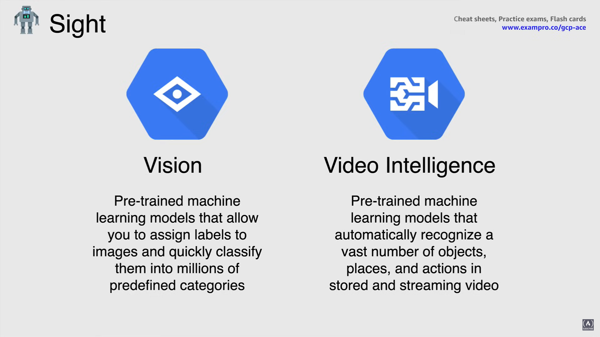
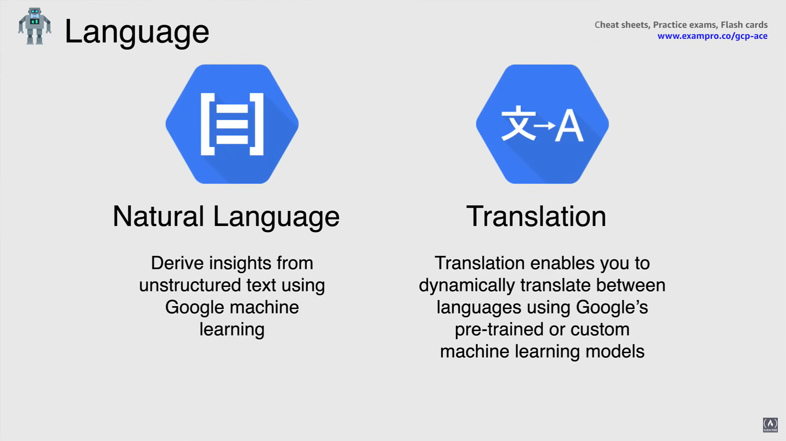
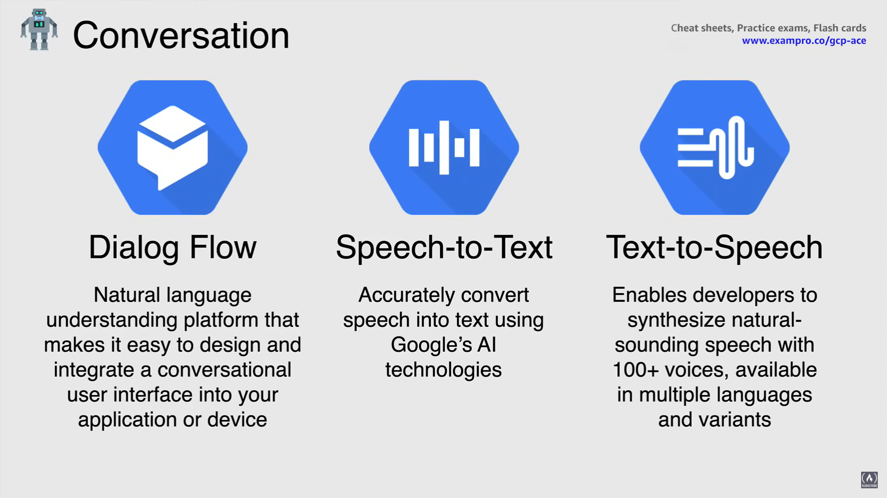
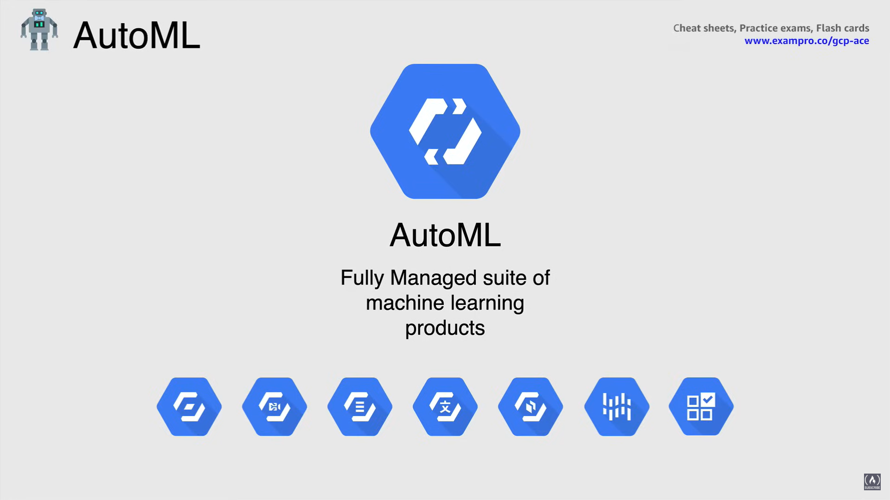

# Machine Learning Services

## What is Machine Learning?

Machine Learning is functionality that helps *enable software to perform tasks without any explicit programming or rules*.

Traditionally considered a subcategory of Artificial Intelligence, Machine Learning involves statistical techniques such as Deep Learning, also known as Neural Networks that are inspired by theories about how the human brain processes information.

- It is trained to **recognize patterns** in collected data *using algorithmic models*.
- Collected data includes video, images, speech or text.
- Because Machine Learning is very expensive to run on premises, *Cloud is an efficient place for Machine Learning* due to the use of massive computation and scale.
- Machine Learning is always better with big data.

## What can Machine Learning do for us?

- It can categorize images such as photos, faces or satellite imagery.
- It can look for keywords in text documents or emails.
- It can flag, potentially fraudulent transactions when it comes to credit cards or debit cards.
- It can enable software to respond accurately to voice commands.
- It can also translate languages in text or audio.

These are just some of the common functions that Machine Learning can do for us. 

## Machine Learning Platforms

Machine Learning has been a cornerstone of Google's internal systems for years, primarily because their need to automate data driven systems on a massive scale. 

In doing this has provided unique insight into the right techniques,  infrastructure and frameworks that help their customers get optimal value out of Machine Learning.

The originally developed open source framework for use inside of Google, called Tensorflow, is now the standard in the data science community.

In addition, to heavily contributing to the academic and open source communities, Google's Machine Learning researchers helped bring that functionality into Google products such as GSuite, Search and Photos, in addition to Google's internal operations, when it comes to data center automation.

## Machine Learning Services

### Sight API Services

- The **Vision API** offers powerful, pre-trained Machine Learning models that allow you to assign labels to images and quickly classify them into millions of predefined categories.

  - Vision API can reprinted and handwritten text, you can detect objects and faces and build metadata into an image catalog of your choice.

- **Video Intelligence** it has pre-trained Machine Learning models that automatically recognizes more than 20,000 objects, places and actions in stored and streaming video.
  - You can gain insights from video in near real time, using the video intelligence streaming video APIs and trigger events based on objects detected.
  - You can easily search a video catalog the same way you search text documents and extract metadata that can be used to index organize and search video content.

### Language API Services

- **Natural Language API** uses Machine Learning to reveal the structure and meaning of text.
  - You can extract information about people, places and events, and better understand social media sentiment and customer conversations.
  - Natural Language enables you to analyze text and also integrate it with your document storage on Cloud Storage.

- **Translation API** it enables you to dynamically translate between languages using Google's pre-train or custom Machine Learning models.
  - Translation API instantly translates text into more than 100 languages for your website and apps with optional customization features.

### Conversation API Services

- **Dialog Flow** is a natural language understanding platform that makes it easy to design and integrate a conversational user interface into your application or device.
  - It could be a mobile app, a web application, a bot or an interactive voice response system.
  - Using Dialog Flow, you can provide new and engaging ways for users to interact with your product.
  - Dialog Flow can analyze multiple types of input from your customers, including text or audio inputs, like from a phone or voice recording.
  - It can also respond to your customers in a couple of ways, either through text or with synthetic speech.

- **Speech-to-Text API** accurately converts speech into text.
  - You can transcribe content with accurate captions and deliver better user experience in products, through voice commands.

- **Text-to-speech API** enables developers to synthesize natural sounding speech with over 100 different voices available in multiple languages and variants.
  - Text to speech allows you to create lifelike interactions with your users across many applications and devices.

### AutoML

**AutoML** is a suite of Machine Learning products that enables developers with very limited Machine Learning expertise to train high quality models specific to their business needs.

In other words, using AutoML allows making Deep Learning easier to use and relies on Google's state of the art transfer learning and neural architecture search technology.

So you can now generate high quality training data and be able to deploy new models based on your data in minutes.

AutoML is available for vision, video intelligence, translation, natural language, tables, inference and recommendation APIs.

