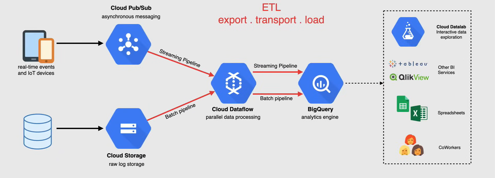
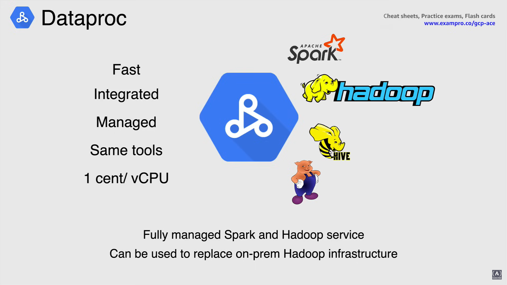

# Big Data Services

## What is Big Data?

Big Data si riferisce a **enormi quantità di dati** che sarebbero tipicamente troppo *costosi da archiviare*, gestire e analizzare utilizzando sistemi di database tradizionali, sia relazionali che monolitici.

Poiché la quantità di dati che abbiamo visto aumentare negli ultimi anni è diventata sempre più grande, questi sistemi sono diventati molto inefficienti a causa della loro mancanza di flessibilità nel memorizzare dati non strutturati come immagini, testo o video.

Inoltre, devono essere in grado di gestire dati ad alta velocità o in tempo reale e di scalare per supportare volumi di dati molto grandi, nell'ordine dei petabyte.

Per questo motivo, negli ultimi anni si è diffusa l'adozione di nuovi approcci per la gestione e l'elaborazione dei Big Data, tra cui Apache Hadoop e i sistemi di database NoSQL.

Tuttavia, queste opzioni spesso si rivelano complesse da implementare, gestire e utilizzare in un ambiente on-premises.

## Why is Big Data so important?

La capacità di ottenere in modo coerente valore aziendale dai dati in modo rapido ed efficiente sta diventando sempre più la norma per le organizzazioni di successo in ogni settore.

Più dati un'azienda ha accesso, più insight aziendali e valore aziendale riescono a ottenere, come ad esempio:

- Ottenere utili **insight**
- **Aumentare il fatturato**
- Ottenere o mantenere **clienti**
- **Migliorare le operazioni**
- Migliorare con **Machine Learning**
  - perché i modelli di machine learning diventano più efficienti man mano che vengono addestrati con più dati, il machine learning e il Big Data sono altamente complementari.

Il Big Data porta un grande valore che è impossibile per qualsiasi organizzazione rifiutare.

## Big Data Services on Google Cloud

### BigQuery

*BigQuery* è un *data warehouse completamente gestito senza server* che consente l'analisi scalabile su petabyte di dati.

Questo servizio supporta le interrogazioni utilizzando SQL e dispone di funzionalità integrate di machine learning.

Iniziando con l'ingestione dei dati in BigQuery, è possibile sfruttare tutta la potenza che offre.

Quindi, Big Data acquisisce quei dati effettuando un *caricamento batch* o *trasmettendoli in tempo reale*, e è possibile utilizzare uno qualsiasi dei servizi Google Cloud attualmente disponibili per caricare i dati in BigQuery.

È possibile adottare un approccio di ingestione batch manuale o effettuare lo streaming utilizzando Pub/Sub ETL e con il servizio di trasferimento dati di BigQuery è possibile trasferire automaticamente i dati da origini dati esterne di Google e applicazioni SaaS partner a BigQuery su base pianificata e completamente gestita.

**NOTA:** Il caricamento e l'esportazione batch sono gratuiti.

- **Analisi in tempo reale**
  - L'API di streaming ad alta velocità di BigQuery fornisce una base incredibile per l'*analisi in tempo reale*, rendendo immediatamente disponibili i dati aziendali per l'analisi. È anche possibile sfruttare Pub/Sub e Dataflow per lo streaming dei dati in BigQuery.

- **Alta disponibilità automatica**
  - BigQuery fornisce in modo trasparente e *automatico uno storage replicato altamente durevole* in più posizioni per garantire l'alta disponibilità.

- **Backup e ripristino automatici**
  - Oltre alla possibilità di ottenere facilmente risorse, BigQuery conserva un registro delle modifiche degli ultimi 7 giorni nel caso in cui dovesse accadere qualcosa di sbagliato.

- **SQL standard**
  - BigQuery supporta l'interrogazione SQL standard, riducendo la necessità di riscrivere il codice. Puoi semplicemente usarlo come faresti per interrogare qualsiasi altro database conforme a SQL.

- **Integrazione con l'ecosistema Big Data**
  - Con Dataproc e Dataflow, BigQuery offre integrazione con l'ecosistema Apache Big Data, consentendo a workload esistenti di Hadoop, Spark e Beam di leggere o scrivere dati direttamente da BigQuery utilizzando l'API di archiviazione.

- **Web UI, `bq`, API**
  - BigQuery rende anche molto facile accedere a questi dati utilizzando la console cloud, utilizzando lo strumento da riga di comando `bq` o effettuando chiamate all'API REST di BigQuery, utilizzando una varietà di librerie client come Java, .NET o Python. 
  - Ci sono anche una varietà di strumenti di terze parti che è possibile utilizzare per interagire con BigQuery durante la visualizzazione o il caricamento dei dati.

- **Governance dei dati**
  - BigQuery fornisce robusti controlli di sicurezza e governance con controlli granulari tramite l'integrazione con l'identity and access management.

- **Espansione geografica**
  - BigQuery offre la possibilità di controllare i dati geografici senza i problemi di configurazione e gestione di cluster e altre risorse di calcolo in diverse zone e regioni.

- **IAM, gestione VPC**

- **Crittografia dei dati**
  - BigQuery fornisce anche un'identità e un accesso management granulari e puoi stare tranquillo sapendo che i tuoi dati sono sempre crittografati a riposo e in transito.

*Il modo in cui BigQuery calcola i costi di **fatturazione** è tramite le interrogazioni e lo storage*.

Archiviare i dati in BigQuery ha un prezzo paragonabile all'archiviazione dei dati in Cloud Storage, il che rende facile la decisione di archiviare i dati in BigQuery.

Non c'è un limite superiore alla quantità di dati che possono essere archiviati in BigQuery, quindi se le tabelle non vengono modificate per 90 giorni, il prezzo dello storage per quella tabella diminuisce del 50%.

I costi delle interrogazioni sono disponibili sia come tariffe a consumo che a tariffa fissa, e per quanto riguarda la tariffazione a consumo, ti vengono addebitati solo i byte letti, non i byte restituiti.

Alla fine, BigQuery si scala in modo trasparente per archiviare e analizzare petabyte, fino a exabyte di dati con facilità.

### Pub/Sub

**Pub/Sub** è un *servizio di messaggistica in tempo reale completamente gestito che consente di inviare e ricevere messaggi tra applicazioni indipendenti*.

Agisce come middleware orientato ai messaggi o come ingresso ed erogazione di eventi per i flussi di analisi in streaming.

Un'applicazione **publisher** *crea e invia messaggi a un topic*, mentre le applicazioni **subscriber** *creano una sottoscrizione a un topic e ricevono messaggi da esso*.

1. Il publisher crea messaggi e li invia al servizio di messaggistica su un topic specificato.

  - Un **topic** è un'entità nominata che rappresenta un feed di messaggi.

2. Un'applicazione publisher crea un topic nel servizio Pub/Sub e invia messaggi a quel topic.

  - Un messaggio contiene un payload e attributi opzionali che descrivono il contenuto.

3. Il servizio, nel suo complesso, garantisce che i messaggi pubblicati siano conservati per conto delle sottoscrizioni, quindi un messaggio pubblicato viene conservato per una sottoscrizione in una coda di messaggi (mostrata qui come Message Storage), fino a quando non viene confermato da qualsiasi subscriber che consuma messaggi da quella sottoscrizione.

4. Pub/Sub inoltra quindi i messaggi da un topic a tutte le sue sottoscrizioni individualmente.

5. Un subscriber riceve quindi i messaggi o tramite il push di Pub/Sub verso l'endpoint scelto dal subscriber o tramite il pull del subscriber dal servizio.

6. Il subscriber invia quindi una conferma al servizio Pub/Sub per ogni messaggio ricevuto.

7. Il servizio rimuove quindi i messaggi confermati dalla coda dei messaggi della sottoscrizione.

Alcuni dei **casi d'uso** per Pub/Sub includono il bilanciamento di code di grandi dimensioni, la distribuzione di notifiche di eventi e lo streaming di dati in tempo reale da varie fonti.

### Composer

**Composer** è un *servizio di orchestrazione di flussi di lavoro gestito basato su Apache Airflow*.

- Si tratta di uno strumento di automazione dei flussi di lavoro per sviluppatori basato sul progetto open source Apache Airflow.

Analogamente a un'implementazione in locale, Cloud Composer distribuisce più componenti per eseguire Airflow nel cloud.

Airflow è una piattaforma creata dalla comunità per creare, pianificare e monitorare in modo programmato i flussi di lavoro.

Lo scheduler di Airflow, come si può vedere qui, esegue i task su un array di worker seguendo le dipendenze specificate e memorizzando i dati in un database e con un componente UI per una gestione facile.

Nell'analisi dei dati, un **flusso di lavoro** rappresenta *una serie di task per l'acquisizione, la trasformazione, l'analisi o l'utilizzo dei dati*.

In Airflow, i flussi di lavoro vengono creati utilizzando **DAG** (Directed Acyclic Graph), che sono una *raccolta di task che si desidera pianificare ed eseguire*, e organizzano questi task per garantire che ciascun task venga eseguito al momento giusto, nell'ordine corretto o con la gestione corretta degli errori.

Per eseguire i flussi di lavoro specializzati, sono necessari ambienti di provisioning, quindi Composer distribuisce questi ambienti autonomi su Google Kubernetes Engine che funzionano con altri servizi di Google Cloud utilizzando i connettori integrati in Airflow.

La bellezza di Composer è che è possibile creare uno o più di questi ambienti in un singolo progetto di Google Cloud utilizzando qualsiasi regione supportata senza dover fare tutto il lavoro pesante di creare un ambiente Apache Airflow completo.

### Dataflow

**Dataflow** è un *servizio di elaborazione senza server e completamente gestito per l'esecuzione di pipeline Apache Beam per il batch e lo streaming di dati in tempo reale*.

L'SDK Apache Beam è un modello di programmazione open source che consente di sviluppare pipeline sia per il batch che per lo streaming.

Utilizzando uno degli SDK Apache Beam, si crea un programma che definisce la pipeline, quindi uno dei backend di elaborazione distribuita supportati da Apache Beam, come Dataflow, esegue quella pipeline.

Il servizio Dataflow si occupa quindi di tutti i dettagli a basso livello come il coordinamento dei singoli worker, la suddivisione dei set di dati, il ridimensionamento automatico e l'elaborazione esattamente una volta.

*Nella sua forma più semplice, Google Cloud Dataflow legge i dati da una sorgente, li trasforma e quindi scrive i dati in un sink*.

Ora, andando un po' più nel dettaglio su come funziona questa pipeline:

1. Dataflow legge i dati presentati da una sorgente.

2. Una volta letti i dati, vengono messi insieme in una *collezione di dataset* chiamata **Pcollection**, e questo consente ai dati di essere letti, distribuiti ed elaborati su più macchine.

3. Ogni volta che i dati vengono trasformati, viene creata una nuova Pcollection, e una volta creata la collezione finale, viene scritta in un **sink**, e questa è l'intera pipeline di come i dati passano dalla sorgente al sink.

Questa pipeline all'interno di Dataflow viene chiamata **job**.

E infine, ecco una panoramica generale di come apparirebbe un job Dataflow quando si coinvolgono altri servizi all'interno di Google Cloud. Unendo tutto in una soluzione end-to-end, dal recupero dei dati alla loro visualizzazione.

E infine, per quanto riguarda la **tariffazione**, i job Dataflow vengono *fatturati in incrementi di secondo*, quindi si paga solo quando si elaborano i dati.

### Dataproc

**Dataproc** è un modo rapido e facile per eseguire Spark, Hadoop, Hive o Pig su Google Cloud.

- In un ambiente in loco, ci vogliono da 5 a 30 minuti per creare cluster Spark e Hadoop.

- I cluster Dataproc richiedono in media 90 secondi o meno per essere creati su Google Cloud.

Dataproc ha un'integrazione integrata con altri servizi della piattaforma Google Cloud e utilizza cluster Spark e Hadoop senza alcuna assistenza amministrativa. Quindi, quando hai finito con un cluster, puoi semplicemente spegnerlo per non spendere soldi su un cluster inattivo.

Inoltre, non c'è bisogno di preoccuparsi della perdita di dati perché Dataproc è integrato con Cloud Storage, BigQuery e Cloud BigTable.

La cosa fantastica di Dataproc è che non è necessario imparare nuovi strumenti o API per usarlo, Spark, Hadoop, Pig e Hive sono tutti supportati e aggiornati frequentemente.

E per quanto riguarda la **tariffazione**, paghi $0.01 per vCPU nel tuo cluster, per ora, oltre alle altre risorse che utilizzi. Hai anche la flessibilità di utilizzare istanze preemptible per un costo di calcolo ancora più basso.

#### Dataproc vs Dataflow

Anche se Cloud Dataproc e Cloud Dataflow possono entrambi essere utilizzati per implementare soluzioni di data warehousing ETL, ognuno ha i suoi punti di forza e di debolezza.

Con Dataproc, è possibile creare facilmente cluster tramite la console, l'SDK o l'API e spegnerli quando non sono necessari.

Con Dataflow, è senza server e completamente gestito, quindi non ci sono mai server di cui preoccuparsi.

Quando si tratta di dipendenze da strumenti nell'ecosistema Hadoop o Spark, Dataproc sarebbe la scelta giusta.

Ma se si desidera rendere i propri job più portabili su diversi motori di esecuzione, Apache Beam consente di farlo ed è disponibile solo su Dataflow.

### Cloud Datalab

**Cloud Datalab** è uno strumento interattivo per sviluppatori creato per esplorare, analizzare, trasformare e visualizzare dati e costruire modelli di machine learning dai tuoi dati.

Datalab utilizza i notebook open source Jupiter, un formato ben noto nel mondo della scienza dei dati.

Viene eseguito su Compute Engine e si connette facilmente a più servizi cloud, in modo da poterti concentrare sulle tue attività di data science.

Integra anche tutti i servizi Google che ti aiutano a semplificare l'elaborazione dei dati, come BigQuery e Cloud Storage.

Cloud Datalab è confezionato come un container e viene eseguito in un'istanza VM.

Cloud Datalab utilizza i notebook invece di file di testo contenenti codice, i notebook combinano codice, documentazione scritta come markdown e il risultato dell'esecuzione del codice, che sia testo, immagine o HTML o JavaScript.

Come un editor di codice o un IDE, i notebook ti aiutano a scrivere codice e ti consentono di eseguire il codice in modo interattivo e iterativo, visualizzando i risultati accanto al codice.

I notebook di Cloud Datalab possono essere archiviati nel repository di origine di Google Cloud, questo git viene clonato su disco persistente quando viene collegato alla VM.

### Dataprep

Quando si tratta di preparare i dati prima del consumo, che si tratti di pulizia, preparazione o modifica dei dati, è qui che Dataprep eccelle.

**Dataprep** è un *servizio dati intelligente e senza server per esplorare, pulire e preparare dati strutturati e non strutturati per analisi, reportistica e machine learning*.

Rileva automaticamente gli schemi, i tipi di dati, i possibili join e le anomalie, come valori mancanti, valori anomali e duplicati, in modo da non doverlo fare manualmente.

L'architettura che sto per mostrarti è come Dataprep si distingue.

1. I dati grezzi provenienti da diverse fonti vengono inglobati in Cloud Dataprep per pulire e preparare i dati.

2. Dataprep invia quindi i dati a Cloud Dataflow per raffinare quei dati.

3. Vengono quindi inviati a Cloud Storage o BigQuery per lo storage.

4. Vengono quindi analizzati da uno dei tanti strumenti BI disponibili.

