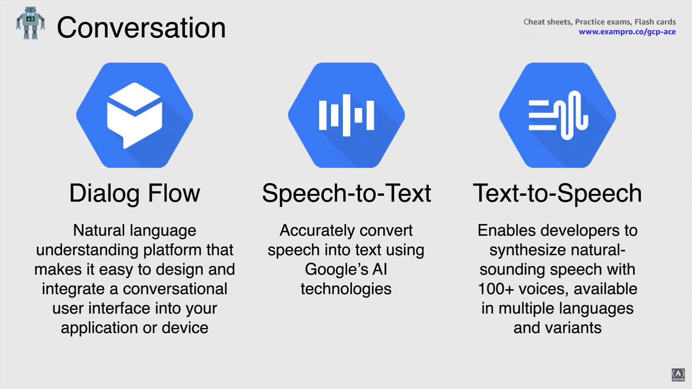
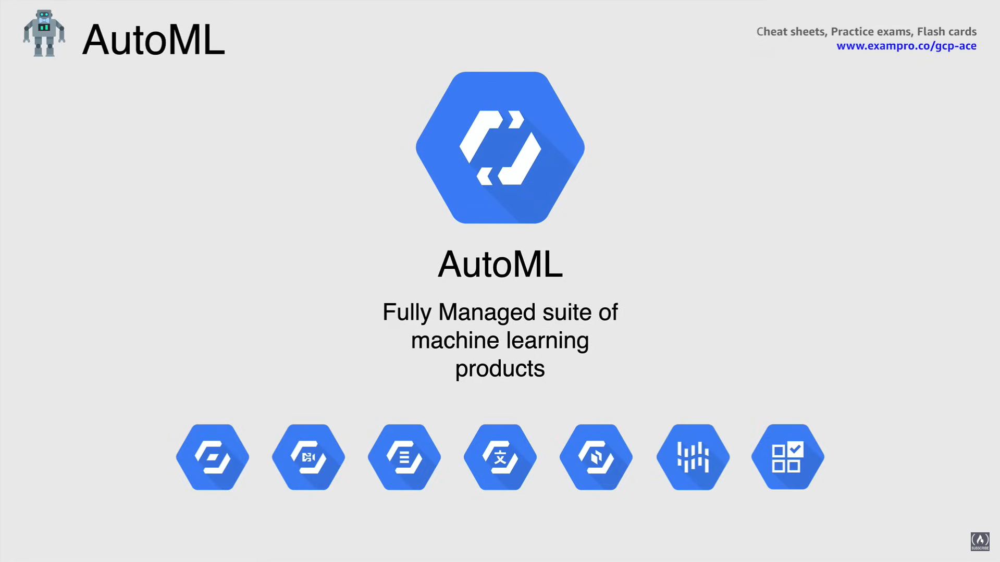

# Machine Learning Services

## What is Machine Learning?

La Machine Learning è una funzionalità che aiuta a *abilitare il software a svolgere compiti senza alcuna programmazione esplicita o regole*.

Tradizionalmente considerata una sottocategoria dell'Intelligenza Artificiale, la Machine Learning coinvolge tecniche statistiche come il Deep Learning, noto anche come Reti Neurali, che sono ispirate alle teorie su come il cervello umano elabora le informazioni.

- Viene addestrata per **riconoscere pattern** nei dati raccolti *utilizzando modelli algoritmici*.
- I dati raccolti includono video, immagini, discorsi o testo.
- Poiché la Machine Learning è molto costosa da eseguire in locale, *il Cloud è un luogo efficiente per la Machine Learning* grazie all'uso di calcolo e scala massicci.
- La Machine Learning è sempre migliore con big data.

## What can Machine Learning do for us?

- Può categorizzare immagini come foto, volti o immagini satellitari.
- Può cercare parole chiave in documenti di testo o email.
- Può individuare transazioni potenzialmente fraudolente quando si tratta di carte di credito o di debito.
- Può consentire al software di rispondere in modo accurato ai comandi vocali.
- Può anche tradurre lingue in testo o audio.

Queste sono solo alcune delle funzioni comuni che la Machine Learning può svolgere per noi.

## Machine Learning Platforms

La Machine Learning è stata una pietra angolare dei sistemi interni di Google per anni, principalmente a causa della loro necessità di automatizzare sistemi basati sui dati su larga scala.

Nel fare ciò, ha fornito una visione unica sulle tecniche corrette, l'infrastruttura e i framework che aiutano i loro clienti a ottenere il massimo valore dalla Machine Learning.

Il framework open source originariamente sviluppato per l'uso all'interno di Google, chiamato Tensorflow, è ora lo standard nella comunità della scienza dei dati.

Inoltre, contribuendo in modo significativo alle comunità accademiche e open source, i ricercatori di Machine Learning di Google hanno contribuito a portare questa funzionalità nei prodotti di Google come GSuite, Search e Photos, oltre alle operazioni interne di Google, quando si tratta di automazione dei data center.

## Machine Learning Services

### Sight API Services

- L'**API Vision** offre potenti modelli di Machine Learning pre-addestrati che ti consentono di assegnare etichette alle immagini e classificarle rapidamente in milioni di categorie predefinite.

  - L'API Vision può riconoscere testo stampato e scritto a mano, puoi rilevare oggetti e volti e costruire metadati in un catalogo di immagini a tua scelta.

- **Video Intelligence** ha modelli di Machine Learning pre-addestrati che riconoscono automaticamente più di 20.000 oggetti, luoghi e azioni in video archiviati e in streaming.
  - Puoi ottenere informazioni dai video in tempo quasi reale, utilizzando le API di streaming video di video intelligence e attivare eventi in base agli oggetti rilevati.
  - Puoi cercare facilmente un catalogo video allo stesso modo in cui cerchi documenti di testo ed estrarre metadati che possono essere utilizzati per indicizzare, organizzare e cercare contenuti video.

### Language API Services

- **Natural Language API** utilizza il Machine Learning per rivelare la struttura e il significato del testo.
  - Puoi estrarre informazioni su persone, luoghi ed eventi, e comprendere meglio il sentimento dei social media e le conversazioni dei clienti.
  - Natural Language ti permette di analizzare il testo e di integrarlo anche con la tua archiviazione di documenti su Cloud Storage.

- **Translation API** ti permette di tradurre dinamicamente tra lingue utilizzando i modelli pre-addestrati di Google o i modelli personalizzati di Machine Learning.
  - Translation API traduce istantaneamente il testo in più di 100 lingue per il tuo sito web e le tue app con funzionalità di personalizzazione opzionali.

### Servizi API di Conversazione

- **Dialog Flow** è una piattaforma di comprensione del linguaggio naturale che facilita la progettazione e l'integrazione di un'interfaccia utente conversazionale nella tua applicazione o dispositivo.
  - Può essere un'app mobile, un'applicazione web, un bot o un sistema di risposta vocale interattivo.
  - Utilizzando Dialog Flow, puoi fornire nuovi e coinvolgenti modi per gli utenti di interagire con il tuo prodotto.
  - Dialog Flow può analizzare diversi tipi di input dai tuoi clienti, inclusi input testuali o audio, come da una telefonata o una registrazione vocale.
  - Può anche rispondere ai tuoi clienti in diversi modi, sia tramite testo che con voce sintetica.

- **API Speech-to-Text** converte accuratamente il parlato in testo.
  - Puoi trascrivere contenuti con sottotitoli accurati e offrire una migliore esperienza utente nei prodotti, attraverso comandi vocali.

- **API Text-to-Speech** consente agli sviluppatori di sintetizzare una voce naturale con oltre 100 voci diverse disponibili in più lingue e varianti.
  - La conversione da testo a voce ti permette di creare interazioni realistiche con i tuoi utenti in molte applicazioni e dispositivi.

### AutoML

**AutoML** è una suite di prodotti di Machine Learning che consente agli sviluppatori con una conoscenza molto limitata del Machine Learning di addestrare modelli di alta qualità specifici per le esigenze del loro business.

In altre parole, utilizzando AutoML si rende più semplice l'uso del Deep Learning e si basa sulla tecnologia all'avanguardia di Google per l'apprendimento di trasferimento e la ricerca di architetture neurali.

Quindi, ora puoi generare dati di addestramento di alta qualità e essere in grado di distribuire nuovi modelli basati sui tuoi dati in pochi minuti.

AutoML è disponibile per visione, intelligenza video, traduzione, linguaggio naturale, tabelle, inferenza e API di raccomandazione.

