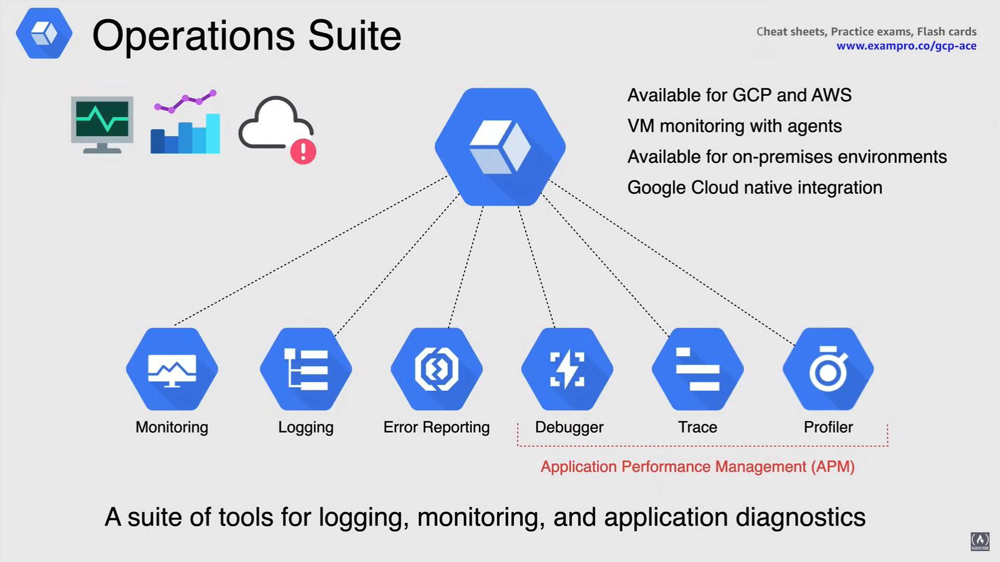
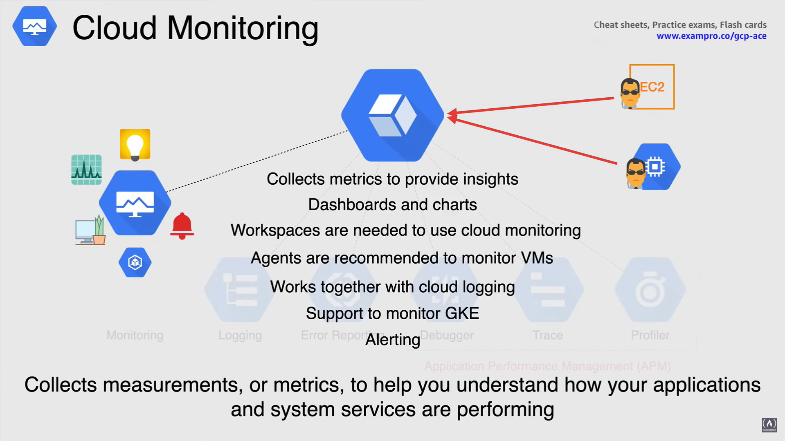
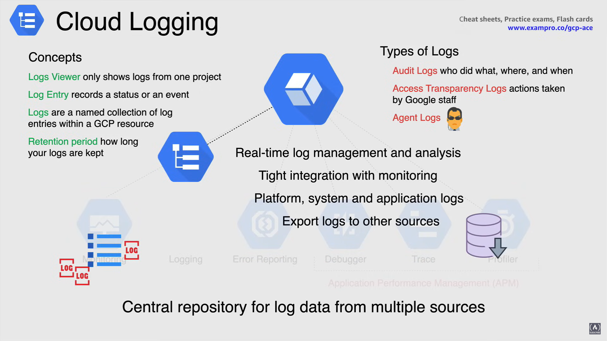
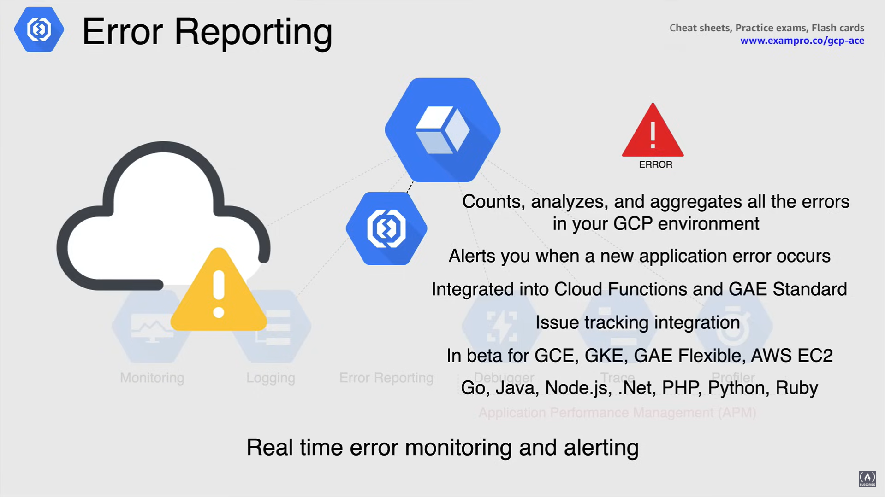
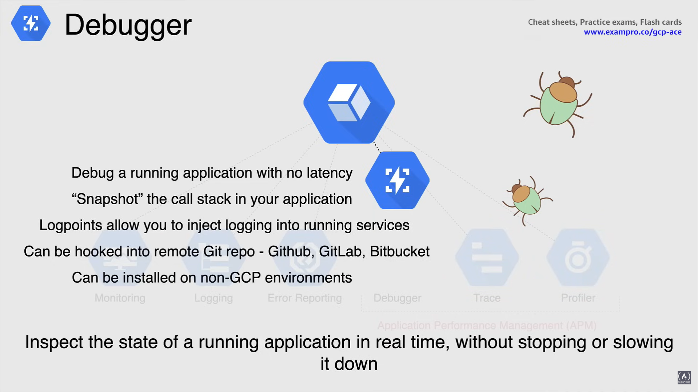
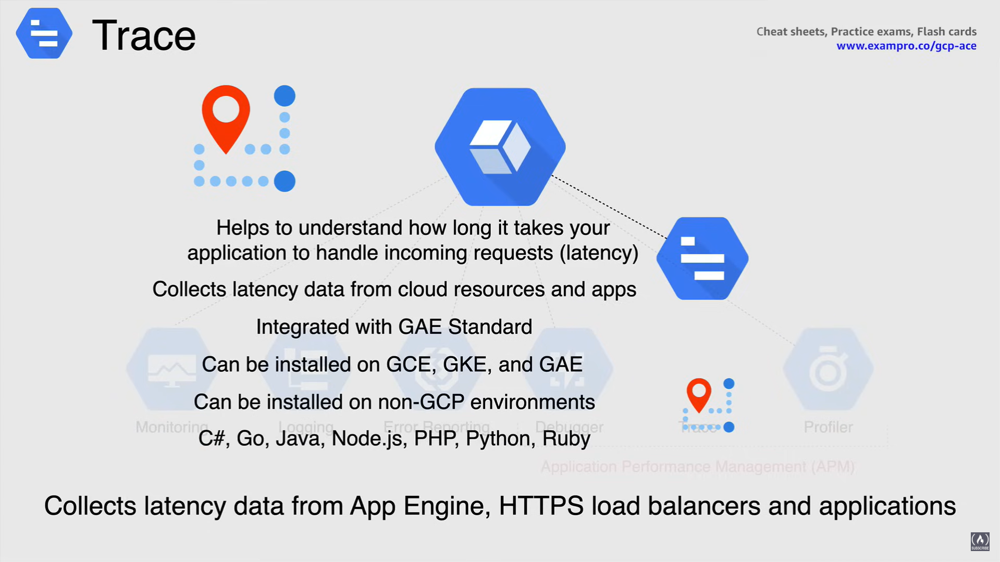
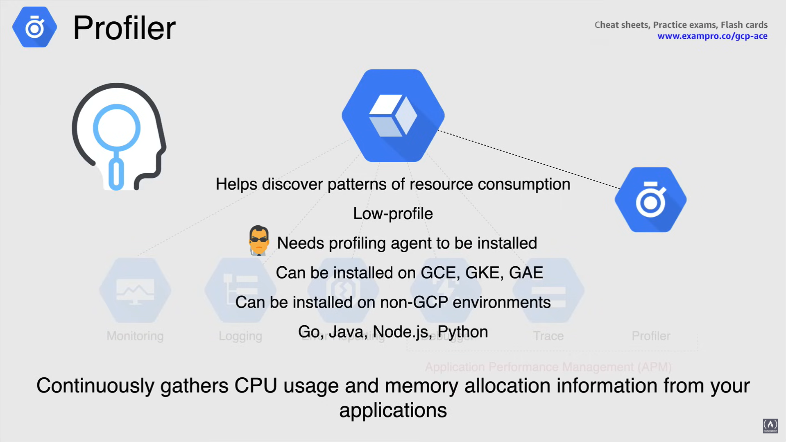

# Operations Suite

**Operation Suite** is a suite of tools used on the Google Cloud platform that allows you to operate, monitor (diagnostics) and troubleshoot (logging) your environment (previously known as Stackdriver).

Operation Suite ingest this data and generates insights using dashboards, charts and alerts.

- *Available for GCP and AWS:* This suite of tools are available for both GCP and AWS, you can connect to AWS using an AWS role and GCP service account.

- *VM monitoring with agents:* You can also monitor VMs with specific agents that, again, both run on GCP for Compute Engine and AWS EC2.

Operation Suite also allows the added functionality of **monitoring** any applications that's running on those VMs.

- *Available for on-premises environments:* Operation Suite is also available for any on premises infrastructure or hybrid cloud environment.

- *Google CLoud native integration:* Operation Suite has a native integration within GCP out of the box, so there's no real configurations that you need to do and integrate with almost all the resources on Google Cloud, such as the previously mentioned Compute Engine, GKE, App Engine and BigQuery.

  - You can find and fix issues faster due to the many different tools.

Operation Suite can reduce down time with real time learning.

You can also find support from a growing partner ecosystem of technology integration tools to expand your operations security and compliance capabilities.

Now the operations we comprises of six available products that covers the gamut of all the available tools you will need that allows you to monitor troubleshoot and improve application performance on your Google Cloud environment.

## Cloud Monitoring

**Cloud Monitoring** collects measurements or metrics to help you understand how your applications and system services are performing.

Giving you the information about the source of the measurements, timestamp values and information of those values that can be broken down through time series data.

Cloud Monitoring can then take the data provided and use predefined dashboards that require no setup or configuration effort.

- Cloud Monitoring also gives you the flexibility to create custom dashboards that display the content you select.
- You can use the widgets available or you can install a dashboard configuration that is sorted in Github.

In order for you to start using Cloud Monitoring you need to configure a **workspace**.

- Workspaces organized monitoring information in Cloud Monitoring. This is a single pane of glass where you can view everything that you're monitoring in your environment.

- It is also best practice to use a multi project workspace so you can monitor multiple projects from a single pane of glass.

Cloud Monitoring has an agent and this gather system and application metrics from your VM and sends them to Cloud Monitoring. You can monitor your VMs without the agent, but you will only get specific metrics such as CPU, disk traffic, network traffic and up time.

- Using the agent is optional but is recommended by Google and with the agent it allows you to monitor many 3rd party applications.

**NOTE:** Cloud Logging has an agent as well and works well together with Cloud Monitoring, to create visualize and alert on metrics based on log data.

Cloud Monitoring is also available for GKE and this will allow you to monitor your clusters as it manages the monitoring and login together.

- This will monitor clusters, infrastructure, its workloads and services as well as your nodes, pods and containers.

When it comes to alerting this is defined by **policies** and **conditions**.

- So in the learning policy defines the conditions under which a services considered unhealthy.

- When these conditions are meant, the policy is triggered and it opens a new incident and sends off a notification.

- A policy belongs to an individual workspace, and each workspace can contain up to 500 policies.

- Now conditions determine what an alerting policy is triggered so all conditions watch for three separate things:

  1. **metric**
  2. **behavior**
  3. **a period of time**

- Describing a condition includes a metric to be measured in a test for determining when the metric reaches a state that you want to know about.

- So when an alert is triggered, you could be notified using notification channels such as email SMS as well as 3rd party tools such as page or duty and slack.

## Cloud Logging

Cloud Logging is a central repository for log data from multiple sources, and as described earlier, logging can come not just from Google but with AWS as well as on premises environments.

- Cloud Logging handles *real time log management and analysis*
- It has *tight integration with Cloud Monitoring*.
- It collects platform, system and application logs.
- You also have the option of exporting logs to other sources such as long term storage like Cloud Storage or for analysis like BigQuery. You can also export to 3rd party tools as well.

Now diving into the concepts of Cloud Logging, these are associated primarily with GCP projects.

- **Logs Viewer** only shows logs from one specific project.
- **Log Entry** records a status or an event.
  - A project receives log entries with services being used, produced log entries.
- **Logs** are a named collection of log entries within a Google Cloud Resource.

**NOTE:** Each Log Entry includes the name of its log. Logs only exist if they have log entries.

- **Retention period** is the length of time for which your logs are kept.

So digging into the types of logs that Cloud Logging handles, there are three different types of logs.

- **Audit logs**
  - These are logs that define who did what, where and when
  - They also show admin activity and data access as well as system events
- **Transparency logs**
  - These are logs for actions taken by Google.
  - When Google staff is accessing your data due to a support ticket, the actions that are taken by the Google staff are logged within Cloud Logging.
- **Agent logs**
  - These are the logs that come from agents that are installed on VMs.
  - The logging agent sends system and 3rd party logs on the VM instance to Cloud Logging.

## Error Reporting

Error Reporting looks at real time error monitoring and alerting. It counts, analyzes and aggregates the errors that happen in your GCP environment and then alerts you when a new application error occurs.

Details of the error can be sent through the API and notifications are still in beta.

Error Reporting is integrated into Cloud Functions and Google App Engine standard, which is enabled automatically.

Error Reporting isn't beta for Compute Engine, Kubernetes Engine and App Engine flexible as well as AWS EC2.

Error Reporting can be installed in a variety of languages such as Go, Java .NET, nodeJS, Python, PHP and Ruby. 

## Debugger

**Debugger** is a tool to debug a running application without slowing it down. It captures and inspects the call stack and local variables in your application.

This is also known as taking a **snapshot**, once the snapshot has been taken, a log point can be injected to allow you to start debugging.

Debugger can be used with or without access to your application source code, and if your repo is not local, it can be hooked into a remote git repo, such as GitHub, GitLab or BitBucket.

Debugger is integrated with Google App Engine automatically, and can be installed on Google Compute Engine, GKE and Google App Engine, and Cloud Run.

**NOTE:** installation on these products is all dependent on the library.

Debugger can be installed like trace on non-GCP environments, and is available to be installed using a variety of different languages.

## Trace

**Trace** helps you understand how long it takes your application to handle incoming requests from users and applications.

Trace collects latency data from App Engine, HTTPS load balancers and applications using the Trace API.

This is also integrated with Google App Engine standard and is applied automatically, so you would use Trace for something like a website that is taking forever to load, to troubleshoot that specific issue.

Trace can be installed on Google Compute Engine, Google Kubernetes Engine and Google App Engine. It can also be installed on non-GCP environments, and it can reinstall using a variety of different languages.

## Profiler

**Profiler** gathers cpu usage and memory allocation information from your applications continuously, and this helps you discover patterns of resource consumption to help you better troubleshoot.

Profilers is low profile and therefore won't take up a lot of memory or CPU on your system, as well in order to use Profiler and agent needs to be installed.

Profiler can be installed on Compute Engine, GKE and App Engine as well, and of course, it can be installed on non-GCP environments and Profiler can be installed using the following languages to Go, Java, nodeJS and Python.

