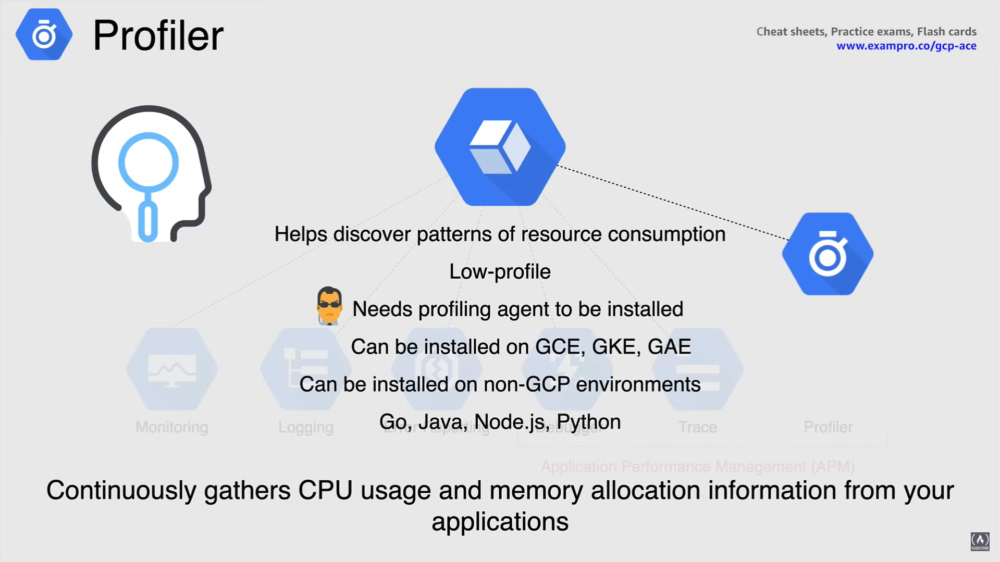

# Operations Suite

**Operations Suite** è una suite di strumenti utilizzata sulla piattaforma Google Cloud che ti permette di operare, monitorare (diagnostica) e risolvere problemi (logging) nel tuo ambiente (precedentemente conosciuta come Stackdriver).

Operations Suite acquisisce questi dati e genera approfondimenti utilizzando dashboard, grafici e avvisi.

- *Disponibile per GCP e AWS:* Questa suite di strumenti è disponibile sia per GCP che per AWS, puoi connetterti ad AWS utilizzando un ruolo AWS e un account di servizio GCP.

- *Monitoraggio delle VM con agenti:* Puoi anche monitorare le VM con agenti specifici che funzionano sia su GCP per Compute Engine che su AWS EC2.

Operations Suite consente anche la funzionalità aggiuntiva di **monitoraggio** di qualsiasi applicazione in esecuzione su quelle VM.

- *Disponibile per ambienti on-premises:* Operations Suite è disponibile anche per qualsiasi infrastruttura on-premises o ambiente cloud ibrido.

- *Integrazione nativa con Google Cloud:* Operations Suite ha un'integrazione nativa con GCP, quindi non ci sono configurazioni reali da fare e si integra con quasi tutte le risorse su Google Cloud, come i precedentemente menzionati Compute Engine, GKE, App Engine e BigQuery.

  - Puoi trovare e risolvere problemi più velocemente grazie ai molti strumenti diversi.

Operations Suite può ridurre i tempi di inattività con l'apprendimento in tempo reale.

Puoi anche trovare supporto da un ecosistema di partner in crescita con strumenti di integrazione tecnologica per espandere le tue capacità di sicurezza e conformità delle operazioni.

Ora le operazioni comprendono sei prodotti disponibili che coprono l'intera gamma di strumenti necessari per monitorare, risolvere problemi e migliorare le prestazioni delle applicazioni nel tuo ambiente Google Cloud.

## Cloud Monitoring

**Cloud Monitoring** raccoglie misurazioni o metriche per aiutarti a capire come stanno performando le tue applicazioni e i servizi di sistema.

Fornendoti informazioni sulla fonte delle misurazioni, valori temporali e informazioni su quei valori che possono essere suddivisi tramite dati in serie temporali.

Cloud Monitoring può quindi prendere i dati forniti e utilizzare dashboard predefinite che non richiedono configurazione.

- Cloud Monitoring ti offre anche la flessibilità di creare dashboard personalizzate che visualizzano il contenuto che selezioni.
- Puoi utilizzare i widget disponibili o installare una configurazione di dashboard memorizzata su GitHub.

Per iniziare a usare Cloud Monitoring, devi configurare un **workspace**.

- I workspace organizzano le informazioni di monitoraggio in Cloud Monitoring. Questo è un'unica vista dove puoi vedere tutto ciò che stai monitorando nel tuo ambiente.

- È anche una buona pratica usare un workspace multi-progetto così puoi monitorare più progetti da un'unica vista.

Cloud Monitoring ha un agente che raccoglie metriche di sistema e applicazioni dalla tua VM e le invia a Cloud Monitoring. Puoi monitorare le tue VM senza l'agente, ma otterrai solo metriche specifiche come CPU, traffico del disco, traffico di rete e tempo di attività.

- L'uso dell'agente è opzionale ma raccomandato da Google e con l'agente puoi monitorare molte applicazioni di terze parti.

**NOTA:** Cloud Logging ha anche un agente e funziona bene insieme a Cloud Monitoring, per creare visualizzazioni e avvisi sulle metriche basate sui dati di log.

Cloud Monitoring è disponibile anche per GKE e ti permetterà di monitorare i tuoi cluster poiché gestisce il monitoraggio e il logging insieme.

- Monitorerà i cluster, l'infrastruttura, i carichi di lavoro e i servizi così come i nodi, i pod e i container.

Per quanto riguarda l'allerta, questa è definita da **policy** e **condition**.

- Una policy di allerta definisce le condizioni in base alle quali un servizio è considerato non in salute.
- Quando queste condizioni sono soddisfatte, la policy viene attivata, apre un nuovo incidente e invia una notifica.
- Una policy appartiene a un singolo workspace, e ogni workspace può contenere fino a 500 policy.
- Le condition determinano quando una policy di allerta viene attivata, quindi tutte le condition monitorano tre cose separate:

  1. **metrica**
  2. **comportamento**
  3. **un periodo di tempo**

- Descrivere una condition include una metrica da misurare e un test per determinare quando la metrica raggiunge uno stato di cui vuoi essere informato.
- Quando un avviso viene attivato, puoi essere notificato tramite canali di notifica come email, SMS e strumenti di terze parti come PagerDuty e Slack.

## Cloud Logging

Cloud Logging è un repository centrale per i dati di log provenienti da più fonti, e come descritto in precedenza, i log possono provenire non solo da Google ma anche da AWS e ambienti on-premises.

- Cloud Logging gestisce la *gestione e l'analisi dei log in tempo reale*.
- Ha una *integrazione stretta con Cloud Monitoring*.
- Raccoglie log di piattaforma, sistema e applicazione.
- Hai anche l'opzione di esportare i log ad altre fonti come archiviazione a lungo termine su Cloud Storage o per l'analisi su BigQuery. Puoi anche esportare su strumenti di terze parti.

Analizzando i concetti di Cloud Logging, questi sono associati principalmente ai progetti GCP.

- **Logs Viewer** mostra i log di un progetto specifico.
- **Log Entry** registra uno stato o un evento.
  - Un progetto riceve voci di log dai servizi utilizzati, che producono voci di log.
- **Logs** sono una collezione nominata di voci di log all'interno di una risorsa Google Cloud.

**NOTA:** Ogni Log Entry include il nome del log. I log esistono solo se hanno voci di log.

- **Retention period** è la durata per cui i log sono conservati.

Esistono tre diversi tipi di log gestiti da Cloud Logging.

- **Audit logs**
  - Definiscono chi ha fatto cosa, dove e quando.
  - Mostrano anche l'attività dell'amministratore e l'accesso ai dati, così come gli eventi di sistema.
- **Transparency logs**
  - Sono log delle azioni intraprese da Google.
  - Quando il personale di Google accede ai tuoi dati a causa di un ticket di supporto, le azioni intraprese dal personale di Google sono registrate in Cloud Logging.
- **Agent logs**
  - Sono log provenienti dagli agenti installati sulle VM.
  - L'agente di logging invia log di sistema e di terze parti sull'istanza VM a Cloud Logging.

## Error Reporting

Error Reporting esegue il monitoraggio e l'allerta in tempo reale degli errori. Conta, analizza e aggrega gli errori che si verificano nel tuo ambiente GCP e ti avvisa quando si verifica un nuovo errore dell'applicazione.

I dettagli dell'errore possono essere inviati tramite l'API e le notifiche sono ancora in beta.

Error Reporting è integrato in Cloud Functions e Google App Engine standard, che è abilitato automaticamente.

Error Reporting è in beta per Compute Engine, Kubernetes Engine e App Engine flessibile così come AWS EC2.

Error Reporting può essere installato in una varietà di linguaggi come Go, Java, .NET, Node.js, Python, PHP e Ruby. 

## Debugger

**Debugger** è uno strumento per debug di un'applicazione in esecuzione senza rallentarla. Cattura e ispeziona lo stack di chiamate e le variabili locali nella tua applicazione.

Questo è anche conosciuto come fare un **snapshot**. Una volta scattato lo snapshot, può essere iniettato un punto di log per permetterti di iniziare il debug.

Debugger può essere utilizzato con o senza accesso al codice sorgente della tua applicazione, e se il tuo repo non è locale, può essere collegato a un repo git remoto, come GitHub, GitLab o BitBucket.

Debugger è integrato automaticamente con Google App Engine e può essere installato su Google Compute Engine, GKE, Google App Engine e Cloud Run.

**NOTA:** l'installazione su questi prodotti dipende tutta dalla libreria.

Debugger può essere installato come Trace su ambienti non GCP ed è disponibile per l'installazione in una varietà di linguaggi diversi.

## Trace

**Trace** ti aiuta a capire quanto tempo impiega la tua applicazione a gestire le richieste in arrivo dagli utenti e dalle applicazioni.

Trace raccoglie dati di latenza da App Engine, bilanciatori di carico HTTPS e applicazioni utilizzando l'API di Trace.

Questo è anche integrato con Google App Engine standard e viene applicato automaticamente, quindi useresti Trace per qualcosa come un sito web che impiega troppo tempo a caricarsi, per risolvere quel problema specifico.

Trace può essere installato su Google Compute Engine, Google

## Profiler

**Profiler** raccoglie continuamente informazioni sull'utilizzo della CPU e l'allocazione della memoria dalle tue applicazioni, aiutandoti a scoprire schemi di consumo delle risorse per migliorare la risoluzione dei problemi.

Profiler ha un basso profilo e quindi non consuma molta memoria o CPU sul tuo sistema. Tuttavia, per utilizzare Profiler è necessario installare un agente.

Profiler può essere installato su Compute Engine, GKE e App Engine, e naturalmente, può essere installato su ambienti non GCP. Profiler può essere installato utilizzando i seguenti linguaggi: Go, Java, Node.js e Python.

