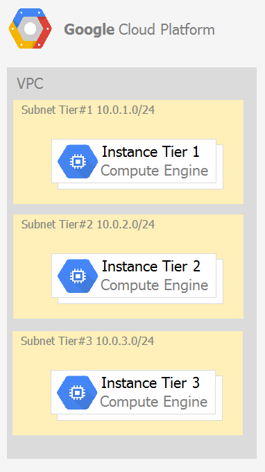
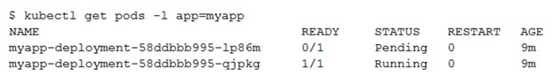
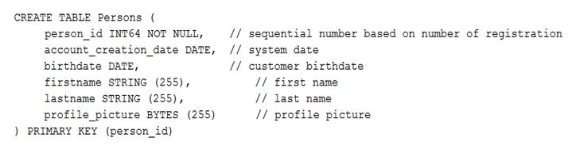
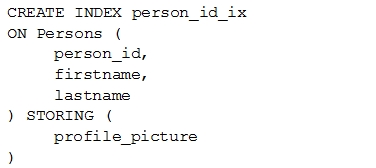

# Exam Topics

#### Question 1

Every employee of your company has a Google account. Your operational team needs to manage a large number of instances on Compute Engine. Each member of this team needs only administrative access to the servers. Your security team wants to ensure that the deployment of credentials is operationally efficient and must be able to determine who accessed a given instance. What should you do?

A. Generate a new SSH key pair. Give the private key to each member of your team. Configure the public key in the metadata of each instance. 
B. Ask each member of the team to generate a new SSH key pair and to send you their public key. Use a configuration management tool to deploy those keys on each instance. 
C. Ask each member of the team to generate a new SSH key pair and to add the public key to their Google account. Grant the  .role to the Google group corresponding to this team `compute.osAdminLogin`
D. Generate a new SSH key pair. Give the private key to each member of your team. Configure the public key as a project-wide public SSH key in your Cloud Platform project and allow project-wide public SSH keys on each instance.

**Answer: C (D)**

#### Question 2

You need to create a custom VPC with a single subnet. The subnet's range must be as large as possible. Which range should you use?

A. 0.0.0.0/0
B. 10.0.0.0/8
C. 172.16.0.0/12
D. 192.168.0.0/16

**Answer: B (A)**

#### Question 3

You want to select and configure a cost-effective solution for relational data on Google Cloud Platform. You are working with a small set of operational data in one geographic location. You need to support point-in-time recovery. What should you do?

A. Select Cloud SQL (MySQL). Verify that the enable binary logging option is selected.
B. Select Cloud SQL (MySQL). Select the create failover replicas option.
C. Select Cloud Spanner. Set up your instance with 2 nodes.
D. Select Cloud Spanner. Set up your instance as multi-regional.

**Answer: A**

#### Question 4

You want to configure autohealing for network load balancing for a group of Compute Engine instances that run in multiple zones, using the fewest possible steps.
You need to configure re-creation of VMs if they are unresponsive after 3 attempts of 10 seconds each. What should you do?

A. Create an HTTP load balancer with a backend configuration that references an existing instance group. Set the health check to healthy (HTTP)
B. Create an HTTP load balancer with a backend configuration that references an existing instance group. Define a balancing mode and set the maximum RPS to 10.
C. Create a managed instance group. Set the Autohealing health check to healthy (HTTP)
D. Create a managed instance group. Verify that the autoscaling setting is on.

**Answer: C (D)**

#### Question 5

You are using multiple configurations for gcloud. You want to review the configured Kubernetes Engine cluster of an inactive configuration using the fewest possible steps. What should you do?

A. Use gcloud config configurations describe to review the output.
B. Use gcloud config configurations activate and gcloud config list to review the output.
C. Use kubectl config get-contexts to review the output.
D. Use kubectl config use-context and kubectl config view to review the output.

**Answer: D**

#### Question 6

Your company uses Cloud Storage to store application backup files for disaster recovery purposes. You want to follow Google's recommended practices. Which storage option should you use?

A. Multi-Regional Storage
B. Regional Storage
C. Nearline Storage
D. Coldline Storage

**Answer: D (A)**

Reference: https://cloud.google.com/storage/docs/storage-classes#nearline

#### Question 7

Several employees at your company have been creating projects with Cloud Platform and paying for it with their personal credit cards, which the company reimburses. The company wants to centralize all these projects under a single, new billing account. What should you do?

A. Contact cloud-billing@google.com with your bank account details and request a corporate billing account for your company.
B. Create a ticket with Google Support and wait for their call to share your credit card details over the phone.
C. In the Google Platform Console, go to the Resource Manage and move all projects to the root Organizarion.
D. In the Google Cloud Platform Console, create a new billing account and set up a payment method.

**Answer: D (C)**

Reference: https://www.whizlabs.com/blog/google-cloud-interview-questions/

#### Question 8

You have an application that looks for its licensing server on the IP 10.0.3.21. You need to deploy the licensing server on Compute Engine. You do not want to change the configuration of the application and want the application to be able to reach the licensing server. What should you do?

A. Reserve the IP 10.0.3.21 as a static internal IP address using gcloud and assign it to the licensing server.
B. Reserve the IP 10.0.3.21 as a static public IP address using gcloud and assign it to the licensing server.
C. Use the IP 10.0.3.21 as a custom ephemeral IP address and assign it to the licensing server.
D. Start the licensing server with an automatic ephemeral IP address, and then promote it to a static internal IP address.

**Answer: A**

#### Question 9

You are deploying an application to App Engine. You want the number of instances to scale based on request rate. You need at least 3 unoccupied instances at all times. Which scaling type should you use?

A. Manual Scaling with 3 instances.
B. Basic Scaling with min_instances set to 3.
C. Basic Scaling with max_instances set to 3.
D. Automatic Scaling with min_idle_instances set to 3.

**Answer: D (B)**

Reference: https://cloud.google.com/appengine/docs/standard/python/how-instances-are-managed

#### Question 10

You have a development project with appropriate IAM roles defined. You are creating a production project and want to have the same IAM roles on the new project, using the fewest possible steps. What should you do?

A. Use gcloud iam roles copy and specify the production project as the destination project. Most Voted
B. Use gcloud iam roles copy and specify your organization as the destination organization.
C. In the Google Cloud Platform Console, use the 'create role from role' functionality.
D. In the Google Cloud Platform Console, use the 'create role' functionality and select all applicable permissions.

**Answer: A (B)**

Reference: https://cloud.google.com/sdk/gcloud/reference/iam/roles/copy

#### Question 11

You need a dynamic way of provisioning VMs on Compute Engine. The exact specifications will be in a dedicated configuration file. You want to follow Google's recommended practices. Which method should you use?

A. Deployment Manager
B. Cloud Composer
C. Managed Instance Group
D. Unmanaged Instance Group

**Answer: A (C)**

Reference: https://cloud.google.com/compute/docs/instances/

#### Question 12

You have a Dockerfile that you need to deploy on Kubernetes Engine. What should you do?

A. Use kubectl app deploy <dockerfilename>.
B. Use gcloud app deploy <dockerfilename>.
C. Create a docker image from the Dockerfile and upload it to Container Registry. Create a Deployment YAML file to point to that image. Use kubectl to create the deployment with that file.
D. Create a docker image from the Dockerfile and upload it to Cloud Storage. Create a Deployment YAML file to point to that image. Use kubectl to create the deployment with that file.

**Answer: C**

Reference: https://cloud.google.com/kubernetes-engine/docs/tutorials/hello-app

#### Question 13

Your development team needs a new Jenkins server for their project. You need to deploy the server using the fewest steps possible. What should you do?

A. Download and deploy the Jenkins Java WAR to App Engine Standard.
B. Create a new Compute Engine instance and install Jenkins through the command line interface.
C. Create a Kubernetes cluster on Compute Engine and create a deployment with the Jenkins Docker image.
D. Use GCP Marketplace to launch the Jenkins solution.

**Answer: D**

Reference: https://cloud.google.com/solutions/using-jenkins-for-distributed-builds-on-compute-engine

#### Question 14

You need to update a deployment in Deployment Manager without any resource downtime in the deployment. Which command should you use?

A. gcloud deployment-manager deployments create --config <deployment-config-path>
B. gcloud deployment-manager deployments update --config <deployment-config-path>
C. gcloud deployment-manager resources create --config <deployment-config-path>
D. gcloud deployment-manager resources update --config <deployment-config-path>

**Answer: B**

Reference: https://cloud.google.com/sdk/gcloud/reference/deployment-manager/deployments/update

#### Question 15

You need to run an important query in BigQuery but expect it to return a lot of records. You want to find out how much it will cost to run the query. You are using on-demand pricing. What should you do?

A. Arrange to switch to Flat-Rate pricing for this query, then move back to on-demand.
B. Use the command line to run a dry run query to estimate the number of bytes read. Then convert that bytes estimate to dollars using the Pricing Calculator.
C. Use the command line to run a dry run query to estimate the number of bytes returned. Then convert that bytes estimate to dollars using the Pricing Calculator.
D. Run a select count (*) to get an idea of how many records your query will look through. Then convert that number of rows to dollars using the Pricing Calculator.

**Answer: B**

Reference: https://cloud.google.com/bigquery/docs/estimate-costs

#### Question 16

You have a single binary application that you want to run on Google Cloud Platform. You decided to automatically scale the application based on underlying infrastructure CPU usage. Your organizational policies require you to use virtual machines directly. You need to ensure that the application scaling is operationally efficient and completed as quickly as possible. What should you do?

A. Create a Google Kubernetes Engine cluster, and use horizontal pod autoscaling to scale the application.
B. Create an instance template, and use the template in a managed instance group with autoscaling configured.
C. Create an instance template, and use the template in a managed instance group that scales up and down based on the time of day.
D. Use a set of third-party tools to build automation around scaling the application up and down, based on Stackdriver CPU usage monitoring.

**Answer: B**

#### Question 17

You are analyzing Google Cloud Platform service costs from three separate projects. You want to use this information to create service cost estimates by service type, daily and monthly, for the next six months using standard query syntax. What should you do?

A. Export your bill to a Cloud Storage bucket, and then import into Cloud Bigtable for analysis.
B. Export your bill to a Cloud Storage bucket, and then import into Google Sheets for analysis.
C. Export your transactions to a local file, and perform analysis with a desktop tool.
D. Export your bill to a BigQuery dataset, and then write time window-based SQL queries for analysis.

**Answer: D**

#### Question 18

You need to set up a policy so that videos stored in a specific Cloud Storage Regional bucket are moved to Coldline after 90 days, and then deleted after one year from their creation. How should you set up the policy?

A. Use Cloud Storage Object Lifecycle Management using Age conditions with SetStorageClass and Delete actions. Set the SetStorageClass action to 90 days and the Delete action to 275 days (365 ג€" 90)
B. Use Cloud Storage Object Lifecycle Management using Age conditions with SetStorageClass and Delete actions. Set the SetStorageClass action to 90 days and the Delete action to 365 days.
C. Use gsutil rewrite and set the Delete action to 275 days (365-90).
D. Use gsutil rewrite and set the Delete action to 365 days.

**Answer: B (A)**

#### Question 19

You have a Linux VM that must connect to Cloud SQL. You created a service account with the appropriate access rights. You want to make sure that the VM uses this service account instead of the default Compute Engine service account. What should you do?

A. When creating the VM via the web console, specify the service account under the 'Identity and API Access' section.
B. Download a JSON Private Key for the service account. On the Project Metadata, add that JSON as the value for the key compute-engine-service- account.
C. Download a JSON Private Key for the service account. On the Custom Metadata of the VM, add that JSON as the value for the key compute-engine- service-account.
D. Download a JSON Private Key for the service account. After creating the VM, ssh into the VM and save the JSON under ~/.gcloud/compute-engine-service- account.json.

**Answer: A (C)**

Reference: https://cloud.google.com/compute/docs/access/create-enable-service-accounts-for-instances

#### Question 20

You created an instance of SQL Server 2017 on Compute Engine to test features in the new version. You want to connect to this instance using the fewest number of steps. What should you do?

A. Install a RDP client on your desktop. Verify that a firewall rule for port 3389 exists.
B. Install a RDP client in your desktop. Set a Windows username and password in the GCP Console. Use the credentials to log in to the instance.
C. Set a Windows password in the GCP Console. Verify that a firewall rule for port 22 exists. Click the RDP button in the GCP Console and supply the credentials to log in.
D. Set a Windows username and password in the GCP Console. Verify that a firewall rule for port 3389 exists. Click the RDP button in the GCP Console, and supply the credentials to log in.

**Answer: B (D)**

Reference: https://medium.com/falafel-software/sql-server-in-the-google-cloud-a17e8a1f11ce

#### Question 21

You have one GCP account running in your default region and zone and another account running in a non-default region and zone. You want to start a new
Compute Engine instance in these two Google Cloud Platform accounts using the command line interface. What should you do?

A. Create two configurations using gcloud config configurations create [NAME]. Run gcloud config configurations activate [NAME] to switch between accounts when running the commands to start the Compute Engine instances.
B. Create two configurations using gcloud config configurations create [NAME]. Run gcloud configurations list to start the Compute Engine instances.
C. Activate two configurations using gcloud configurations activate [NAME]. Run gcloud config list to start the Compute Engine instances.
D. Activate two configurations using gcloud configurations activate [NAME]. Run gcloud configurations list to start the Compute Engine instances.

**Answer: A**

#### Question 22

You significantly changed a complex Deployment Manager template and want to confirm that the dependencies of all defined resources are properly met before committing it to the project. You want the most rapid feedback on your changes. What should you do?
A. Use granular logging statements within a Deployment Manager template authored in Python.
B. Monitor activity of the Deployment Manager execution on the Stackdriver Logging page of the GCP Console.
C. Execute the Deployment Manager template against a separate project with the same configuration, and monitor for failures.
D. Execute the Deployment Manager template using the ג€"-preview option in the same project, and observe the state of interdependent resources.

**Answer: D**

Reference: https://cloud.google.com/deployment-manager/docs/deployments/updating-deployments

#### Question 23

You are building a pipeline to process time-series data. Which Google Cloud Platform services should you put in boxes 1,2,3, and 4?

A. Cloud Pub/Sub, Cloud Dataflow, Cloud Datastore, BigQuery
B. Firebase Messages, Cloud Pub/Sub, Cloud Spanner, BigQuery
C. Cloud Pub/Sub, Cloud Storage, BigQuery, Cloud Bigtable
D. Cloud Pub/Sub, Cloud Dataflow, Cloud Bigtable, BigQuery

**Answer: D**

Reference: https://cloud.google.com/solutions/correlating-time-series-dataflow

#### Question 24

You have a project for your App Engine application that serves a development environment. The required testing has succeeded and you want to create a new project to serve as your production environment. What should you do?

A. Use gcloud to create the new project, and then deploy your application to the new project.
B. Use gcloud to create the new project and to copy the deployed application to the new project.
C. Create a Deployment Manager configuration file that copies the current App Engine deployment into a new project.
D. Deploy your application again using gcloud and specify the project parameter with the new project name to create the new project.

**Answer: A**

#### Question 25

You need to configure IAM access audit logging in BigQuery for external auditors. You want to follow Google-recommended practices. What should you do?

A. Add the auditors group to the 'logging.viewer' and 'bigQuery.dataViewer' predefined IAM roles.
B. Add the auditors group to two new custom IAM roles.
C. Add the auditor user accounts to the 'logging.viewer' and 'bigQuery.dataViewer' predefined IAM roles.
D. Add the auditor user accounts to two new custom IAM roles.

**Answer: A (C)**

Reference: https://cloud.google.com/iam/docs/roles-audit-logging

#### Question 26

You need to set up permissions for a set of Compute Engine instances to enable them to write data into a particular Cloud Storage bucket. You want to follow
Google-recommended practices. What should you do?

A. Create a service account with an access scope. Use the access scope 'https://www.googleapis.com/auth/devstorage.write_only'.
B. Create a service account with an access scope. Use the access scope 'https://www.googleapis.com/auth/cloud-platform'.
C. Create a service account and add it to the IAM role 'storage.objectCreator' for that bucket.
D. Create a service account and add it to the IAM role 'storage.objectAdmin' for that bucket.

**Answer: C (D)**

#### Question 27

You have sensitive data stored in three Cloud Storage buckets and have enabled data access logging. You want to verify activities for a particular user for these buckets, using the fewest possible steps. You need to verify the addition of metadata labels and which files have been viewed from those buckets. What should you do?

A. Using the GCP Console, filter the Activity log to view the information.
B. Using the GCP Console, filter the Stackdriver log to view the information.
C. View the bucket in the Storage section of the GCP Console.
D. Create a trace in Stackdriver to view the information.

**Answer: A**

#### Question 28

You are the project owner of a GCP project and want to delegate control to colleagues to manage buckets and files in Cloud Storage. You want to follow Google- recommended practices. Which IAM roles should you grant your colleagues?

A. Project Editor
B. Storage Admin
C. Storage Object Admin
D. Storage Object Creator

**Answer: B**

#### Question 29

You have an object in a Cloud Storage bucket that you want to share with an external company. The object contains sensitive data. You want access to the content to be removed after four hours. The external company does not have a Google account to which you can grant specific user-based access privileges. You want to use the most secure method that requires the fewest steps. What should you do?

A. Create a signed URL with a four-hour expiration and share the URL with the company.
B. Set object access to 'public' and use object lifecycle management to remove the object after four hours.
C. Configure the storage bucket as a static website and furnish the object's URL to the company. Delete the object from the storage bucket after four hours.
D. Create a new Cloud Storage bucket specifically for the external company to access. Copy the object to that bucket. Delete the bucket after four hours have passed.

**Answer: A**

#### Question 30

You are creating a Google Kubernetes Engine (GKE) cluster with a cluster autoscaler feature enabled. You need to make sure that each node of the cluster will run a monitoring pod that sends container metrics to a third-party monitoring solution. What should you do?

A. Deploy the monitoring pod in a StatefulSet object.
B. Deploy the monitoring pod in a DaemonSet object.
C. Reference the monitoring pod in a Deployment object.
D. Reference the monitoring pod in a cluster initializer at the GKE cluster creation time.

**Answer: B**

#### Question 31

You want to send and consume Cloud Pub/Sub messages from your App Engine application. The Cloud Pub/Sub API is currently disabled. You will use a service account to authenticate your application to the API. You want to make sure your application can use Cloud Pub/Sub. What should you do?

A. Enable the Cloud Pub/Sub API in the API Library on the GCP Console.
B. Rely on the automatic enablement of the Cloud Pub/Sub API when the Service Account accesses it.
C. Use Deployment Manager to deploy your application. Rely on the automatic enablement of all APIs used by the application being deployed.
D. Grant the App Engine Default service account the role of Cloud Pub/Sub Admin. Have your application enable the API on the first connection to Cloud Pub/ Sub.

**Answer: A**

#### Question 32

You need to monitor resources that are distributed over different projects in Google Cloud Platform. You want to consolidate reporting under the same Stackdriver
Monitoring dashboard. What should you do?

A. Use Shared VPC to connect all projects, and link Stackdriver to one of the projects.
B. For each project, create a Stackdriver account. In each project, create a service account for that project and grant it the role of Stackdriver Account Editor in all other projects.
C. Configure a single Stackdriver account, and link all projects to the same account.
D. Configure a single Stackdriver account for one of the projects. In Stackdriver, create a Group and add the other project names as criteria for that Group.

**Answer: C (D)**

#### Question 33

You are deploying an application to a Compute Engine VM in a managed instance group. The application must be running at all times, but only a single instance of the VM should run per GCP project. How should you configure the instance group?

A. Set autoscaling to On, set the minimum number of instances to 1, and then set the maximum number of instances to 1.
B. Set autoscaling to Off, set the minimum number of instances to 1, and then set the maximum number of instances to 1.
C. Set autoscaling to On, set the minimum number of instances to 1, and then set the maximum number of instances to 2.
D. Set autoscaling to Off, set the minimum number of instances to 1, and then set the maximum number of instances to 2.

**Answer: A (B)**

#### Question 34

You want to verify the IAM users and roles assigned within a GCP project named my-project. What should you do?

A. Run gcloud iam roles list. Review the output section.
B. Run gcloud iam service-accounts list. Review the output section.
C. Navigate to the project and then to the IAM section in the GCP Console. Review the members and roles.
D. Navigate to the project and then to the Roles section in the GCP Console. Review the roles and status.

**Answer: C**

#### Question 35

You need to create a new billing account and then link it with an existing Google Cloud Platform project. What should you do?

A. Verify that you are Project Billing Manager for the GCP project. Update the existing project to link it to the existing billing account.
B. Verify that you are Project Billing Manager for the GCP project. Create a new billing account and link the new billing account to the existing project.
C. Verify that you are Billing Administrator for the billing account. Create a new project and link the new project to the existing billing account.
D. Verify that you are Billing Administrator for the billing account. Update the existing project to link it to the existing billing account.

**Answer: B**

#### Question 36

You have one project called proj-sa where you manage all your service accounts. You want to be able to use a service account from this project to take snapshots of VMs running in another project called proj-vm. What should you do?

A. Download the private key from the service account, and add it to each VMs custom metadata.
B. Download the private key from the service account, and add the private key to each VM's SSH keys.
C. Grant the service account the IAM Role of Compute Storage Admin in the project called proj-vm.
D. When creating the VMs, set the service account's API scope for Compute Engine to read/write.

**Answer: C**

#### Question 37

You created a Google Cloud Platform project with an App Engine application inside the project. You initially configured the application to be served from the us- central region. Now you want the application to be served from the asia-northeast1 region. What should you do?

A. Change the default region property setting in the existing GCP project to asia-northeast1.
B. Change the region property setting in the existing App Engine application from us-central to asia-northeast1.
C. Create a second App Engine application in the existing GCP project and specify asia-northeast1 as the region to serve your application.
D. Create a new GCP project and create an App Engine application inside this new project. Specify asia-northeast1 as the region to serve your application.

**Answer: D (C)**

#### Question 38

You need to grant access for three users so that they can view and edit table data on a Cloud Spanner instance. What should you do?

A. Run gcloud iam roles describe roles/spanner.databaseUser. Add the users to the role.
B. Run gcloud iam roles describe roles/spanner.databaseUser. Add the users to a new group. Add the group to the role.
C. Run gcloud iam roles describe roles/spanner.viewer - -project my-project. Add the users to the role.
D. Run gcloud iam roles describe roles/spanner.viewer - -project my-project. Add the users to a new group. Add the group to the role.

**Answer: B (A)**

#### Question 39

You create a new Google Kubernetes Engine (GKE) cluster and want to make sure that it always runs a supported and stable version of Kubernetes. What should you do?

A. Enable the Node Auto-Repair feature for your GKE cluster.
B. Enable the Node Auto-Upgrades feature for your GKE cluster.
C. Select the latest available cluster version for your GKE cluster.
D. Select ג€Container-Optimized OS (cos)ג€ as a node image for your GKE cluster.

**Answer: B**

#### Question 40

You have an instance group that you want to load balance. You want the load balancer to terminate the client SSL session. The instance group is used to serve a public web application over HTTPS. You want to follow Google-recommended practices. What should you do?

A. Configure an HTTP(S) load balancer.
B. Configure an internal TCP load balancer.
C. Configure an external SSL proxy load balancer.
D. Configure an external TCP proxy load balancer.

**Answer: A**

Reference: https://cloud.google.com/load-balancing/docs/https/

#### Question 41

You have 32 GB of data in a single file that you need to upload to a Nearline Storage bucket. The WAN connection you are using is rated at 1 Gbps, and you are the only one on the connection. You want to use as much of the rated 1 Gbps as possible to transfer the file rapidly. How should you upload the file?

A. Use the GCP Console to transfer the file instead of gsutil.
B. Enable parallel composite uploads using gsutil on the file transfer.
C. Decrease the TCP window size on the machine initiating the transfer.
D. Change the storage class of the bucket from Nearline to Multi-Regional.

**Answer: B**

#### Question 42

You've deployed a microservice called myapp1 to a Google Kubernetes Engine cluster using the YAML file specified below:

You need to refactor this configuration so that the database password is not stored in plain text. You want to follow Google-recommended practices. What should you do?

A. Store the database password inside the Docker image of the container, not in the YAML file.
B. Store the database password inside a Secret object. Modify the YAML file to populate the DB_PASSWORD environment variable from the Secret.
C. Store the database password inside a ConfigMap object. Modify the YAML file to populate the DB_PASSWORD environment variable from the ConfigMap.
D. Store the database password in a file inside a Kubernetes persistent volume, and use a persistent volume claim to mount the volume to the container.

**Answer: B (C)**

#### Question 43

You are running an application on multiple virtual machines within a managed instance group and have autoscaling enabled. The autoscaling policy is configured so that additional instances are added to the group if the CPU utilization of instances goes above 80%. VMs are added until the instance group reaches its maximum limit of five VMs or until CPU utilization of instances lowers to 80%. The initial delay for HTTP health checks against the instances is set to 30 seconds.
The virtual machine instances take around three minutes to become available for users. You observe that when the instance group autoscales, it adds more instances then necessary to support the levels of end-user traffic. You want to properly maintain instance group sizes when autoscaling. What should you do?

A. Set the maximum number of instances to 1.
B. Decrease the maximum number of instances to 3.
C. Use a TCP health check instead of an HTTP health check.
D. Increase the initial delay of the HTTP health check to 200 seconds.

**Answer: D**

#### Question 44

You need to select and configure compute resources for a set of batch processing jobs. These jobs take around 2 hours to complete and are run nightly. You want to minimize service costs. What should you do?

A. Select Google Kubernetes Engine. Use a single-node cluster with a small instance type.
B. Select Google Kubernetes Engine. Use a three-node cluster with micro instance types.
C. Select Compute Engine. Use preemptible VM instances of the appropriate standard machine type.
D. Select Compute Engine. Use VM instance types that support micro bursting.

**Answer: C**

#### Question 45

You recently deployed a new version of an application to App Engine and then discovered a bug in the release. You need to immediately revert to the prior version of the application. What should you do?

A. Run gcloud app restore.
B. On the App Engine page of the GCP Console, select the application that needs to be reverted and click Revert.
C. On the App Engine Versions page of the GCP Console, route 100% of the traffic to the previous version.
D. Deploy the original version as a separate application. Then go to App Engine settings and split traffic between applications so that the original version serves 100% of the requests.

**Answer: C (D)**

Reference: https://medium.com/google-cloud/app-engine-project-cleanup-9647296e796a

#### Question 46

You deployed an App Engine application using gcloud app deploy, but it did not deploy to the intended project. You want to find out why this happened and where the application deployed. What should you do?

A. Check the app.yaml file for your application and check project settings.
B. Check the web-application.xml file for your application and check project settings.
C. Go to Deployment Manager and review settings for deployment of applications.
D. Go to Cloud Shell and run gcloud config list to review the Google Cloud configuration used for deployment.

Reference: https://cloud.google.com/endpoints/docs/openapi/troubleshoot-aeflex-deployment

**Answer: D (A)**

#### Question 47

You want to configure 10 Compute Engine instances for availability when maintenance occurs. Your requirements state that these instances should attempt to automatically restart if they crash. Also, the instances should be highly available including during system maintenance. What should you do?

A. Create an instance template for the instances. Set the 'Automatic Restart' to on. Set the 'On-host maintenance' to Migrate VM instance. Add the instance template to an instance group.
B. Create an instance template for the instances. Set 'Automatic Restart' to off. Set 'On-host maintenance' to Terminate VM instances. Add the instance template to an instance group.
C. Create an instance group for the instances. Set the 'Autohealing' health check to healthy (HTTP).
D. Create an instance group for the instance. Verify that the 'Advanced creation options' setting for 'do not retry machine creation' is set to off.

**Answer: A (B)**

#### Question 48

You host a static website on Cloud Storage. Recently, you began to include links to PDF files on this site. Currently, when users click on the links to these PDF files, their browsers prompt them to save the file onto their local system. Instead, you want the clicked PDF files to be displayed within the browser window directly, without prompting the user to save the file locally. What should you do?

A. Enable Cloud CDN on the website frontend.
B. Enable 'Share publicly' on the PDF file objects.
C. Set Content-Type metadata to application/pdf on the PDF file objects.
D. Add a label to the storage bucket with a key of Content-Type and value of application/pdf.

**Answer: C**

#### Question 49

You have a virtual machine that is currently configured with 2 vCPUs and 4 GB of memory. It is running out of memory. You want to upgrade the virtual machine to have 8 GB of memory. What should you do?

A. Rely on live migration to move the workload to a machine with more memory.
B. Use gcloud to add metadata to the VM. Set the key to required-memory-size and the value to 8 GB.
C. Stop the VM, change the machine type to n1-standard-8, and start the VM.
D. Stop the VM, increase the memory to 8 GB, and start the VM.

**Answer: D**

#### Question 50

You have production and test workloads that you want to deploy on Compute Engine. Production VMs need to be in a different subnet than the test VMs. All the
VMs must be able to reach each other over Internal IP without creating additional routes. You need to set up VPC and the 2 subnets. Which configuration meets these requirements?

A. Create a single custom VPC with 2 subnets. Create each subnet in a different region and with a different CIDR range.
B. Create a single custom VPC with 2 subnets. Create each subnet in the same region and with the same CIDR range.
C. Create 2 custom VPCs, each with a single subnet. Create each subnet in a different region and with a different CIDR range.
D. Create 2 custom VPCs, each with a single subnet. Create each subnet in the same region and with the same CIDR range.

**Answer: A**

#### Question 51

You need to create an autoscaling managed instance group for an HTTPS web application. You want to make sure that unhealthy VMs are recreated. What should you do?

A. Create a health check on port 443 and use that when creating the Managed Instance Group.
B. Select Multi-Zone instead of Single-Zone when creating the Managed Instance Group.
C. In the Instance Template, add the label 'health-check'.
D. In the Instance Template, add a startup script that sends a heartbeat to the metadata server.

**Answer: A (C)**

Reference: https://cloud.google.com/compute/docs/instance-groups/creating-groups-of-managed-instances

#### Question 52

Your company has a Google Cloud Platform project that uses BigQuery for data warehousing. Your data science team changes frequently and has few members.
You need to allow members of this team to perform queries. You want to follow Google-recommended practices. What should you do?

A. 1. Create an IAM entry for each data scientist's user account. 2. Assign the BigQuery jobUser role to the group.
B. 1. Create an IAM entry for each data scientist's user account. 2. Assign the BigQuery dataViewer user role to the group.
C. 1. Create a dedicated Google group in Cloud Identity. 2. Add each data scientist's user account to the group. 3. Assign the BigQuery jobUser role to the group.
D. 1. Create a dedicated Google group in Cloud Identity. 2. Add each data scientist's user account to the group. 3. Assign the BigQuery dataViewer user role to the group.

**Answer: C (D)**

Reference: https://cloud.google.com/bigquery/docs/cloud-sql-federated-queries

#### Question 53

Your company has a 3-tier solution running on Compute Engine. The configuration of the current infrastructure is shown below.

Each tier has a service account that is associated with all instances within it. You need to enable communication on TCP port 8080 between tiers as follows:

- Instances in tier #1 must communicate with tier #2.
- Instances in tier #2 must communicate with tier #3.

What should you do?

A. 1. Create an ingress firewall rule with the following settings: ג€¢ Targets: all instances ג€¢ Source filter: IP ranges (with the range set to 10.0.2.0/24) ג€¢ Protocols: allow all 2. Create an ingress firewall rule with the following settings: ג€¢ Targets: all instances ג€¢ Source filter: IP ranges (with the range set to 10.0.1.0/24) ג€¢ Protocols: allow all
B. 1. Create an ingress firewall rule with the following settings: ג€¢ Targets: all instances with tier #2 service account ג€¢ Source filter: all instances with tier #1 service account ג€¢ Protocols: allow TCP:8080 2. Create an ingress firewall rule with the following settings: ג€¢ Targets: all instances with tier #3 service account ג€¢ Source filter: all instances with tier #2 service account ג€¢ Protocols: allow TCP: 8080
C. 1. Create an ingress firewall rule with the following settings: ג€¢ Targets: all instances with tier #2 service account ג€¢ Source filter: all instances with tier #1 service account ג€¢ Protocols: allow all 2. Create an ingress firewall rule with the following settings: ג€¢ Targets: all instances with tier #3 service account ג€¢ Source filter: all instances with tier #2 service account ג€¢ Protocols: allow all
D. 1. Create an egress firewall rule with the following settings: ג€¢ Targets: all instances ג€¢ Source filter: IP ranges (with the range set to 10.0.2.0/24) ג€¢ Protocols: allow TCP: 8080 2. Create an egress firewall rule with the following settings: ג€¢ Targets: all instances ג€¢ Source filter: IP ranges (with the range set to 10.0.1.0/24) ג€¢ Protocols: allow TCP: 8080

**Answer: B**

#### Question 54

You are given a project with a single Virtual Private Cloud (VPC) and a single subnetwork in the us-central1 region. There is a Compute Engine instance hosting an application in this subnetwork. You need to deploy a new instance in the same project in the europe-west1 region. This new instance needs access to the application. You want to follow Google-recommended practices. What should you do?

A. 1. Create a subnetwork in the same VPC, in europe-west1. 2. Create the new instance in the new subnetwork and use the first instance's private address as the endpoint.
B. 1. Create a VPC and a subnetwork in europe-west1. 2. Expose the application with an internal load balancer. 3. Create the new instance in the new subnetwork and use the load balancer's address as the endpoint.
C. 1. Create a subnetwork in the same VPC, in europe-west1. 2. Use Cloud VPN to connect the two subnetworks. 3. Create the new instance in the new subnetwork and use the first instance's private address as the endpoint.
D. 1. Create a VPC and a subnetwork in europe-west1. 2. Peer the 2 VPCs. 3. Create the new instance in the new subnetwork and use the first instance's private address as the endpoint.

**Answer: A**

#### Question 55

Your projects incurred more costs than you expected last month. Your research reveals that a development GKE container emitted a huge number of logs, which resulted in higher costs. You want to disable the logs quickly using the minimum number of steps. What should you do?

A. 1. Go to the Logs ingestion window in Stackdriver Logging, and disable the log source for the GKE container resource.
B. 1. Go to the Logs ingestion window in Stackdriver Logging, and disable the log source for the GKE Cluster Operations resource.
C. 1. Go to the GKE console, and delete existing clusters. 2. Recreate a new cluster. 3. Clear the option to enable legacy Stackdriver Logging.
D. 1. Go to the GKE console, and delete existing clusters. 2. Recreate a new cluster. 3. Clear the option to enable legacy Stackdriver Monitoring.

**Answer: A**

#### Question 56

You have a website hosted on App Engine standard environment. You want 1% of your users to see a new test version of the website. You want to minimize complexity. What should you do?

A. Deploy the new version in the same application and use the --migrate option.
B. Deploy the new version in the same application and use the --splits option to give a weight of 99 to the current version and a weight of 1 to the new version.
C. Create a new App Engine application in the same project. Deploy the new version in that application. Use the App Engine library to proxy 1% of the requests to the new version.
D. Create a new App Engine application in the same project. Deploy the new version in that application. Configure your network load balancer to send 1% of the traffic to that new application.

**Answer: B**

#### Question 57

You have a web application deployed as a managed instance group. You have a new version of the application to gradually deploy. Your web application is currently receiving live web traffic. You want to ensure that the available capacity does not decrease during the deployment. What should you do?

A. Perform a rolling-action start-update with maxSurge set to 0 and maxUnavailable set to 1.
B. Perform a rolling-action start-update with maxSurge set to 1 and maxUnavailable set to 0.
C. Create a new managed instance group with an updated instance template. Add the group to the backend service for the load balancer. When all instances in the new managed instance group are healthy, delete the old managed instance group.
D. Create a new instance template with the new application version. Update the existing managed instance group with the new instance template. Delete the instances in the managed instance group to allow the managed instance group to recreate the instance using the new instance template.

**Answer: B (C)**

#### Question 58

You are building an application that stores relational data from users. Users across the globe will use this application. Your CTO is concerned about the scaling requirements because the size of the user base is unknown. You need to implement a database solution that can scale with your user growth with minimum configuration changes. Which storage solution should you use?

A. Cloud SQL
B. Cloud Spanner
C. Cloud Firestore
D. Cloud Datastore

**Answer: B**

#### Question 59

You are the organization and billing administrator for your company. The engineering team has the Project Creator role on the organization. You do not want the engineering team to be able to link projects to the billing account. Only the finance team should be able to link a project to a billing account, but they should not be able to make any other changes to projects. What should you do?

A. Assign the finance team only the Billing Account User role on the billing account.
B. Assign the engineering team only the Billing Account User role on the billing account.
C. Assign the finance team the Billing Account User role on the billing account and the Project Billing Manager role on the organization.
D. Assign the engineering team the Billing Account User role on the billing account and the Project Billing Manager role on the organization.

**Answer: C (D)**

#### Question 60

You have an application running in Google Kubernetes Engine (GKE) with cluster autoscaling enabled. The application exposes a TCP endpoint. There are several replicas of this application. You have a Compute Engine instance in the same region, but in another Virtual Private Cloud (VPC), called gce-network, that has no overlapping IP ranges with the first VPC. This instance needs to connect to the application on GKE. You want to minimize effort. What should you do?

A. 1. In GKE, create a Service of type LoadBalancer that uses the application's Pods as backend. 2. Set the service's externalTrafficPolicy to Cluster. 3. Configure the Compute Engine instance to use the address of the load balancer that has been created.
B. 1. In GKE, create a Service of type NodePort that uses the application's Pods as backend. 2. Create a Compute Engine instance called proxy with 2 network interfaces, one in each VPC. 3. Use iptables on this instance to forward traffic from gce-network to the GKE nodes. 4. Configure the Compute Engine instance to use the address of proxy in gce-network as endpoint.
C. 1. In GKE, create a Service of type LoadBalancer that uses the application's Pods as backend. 2. Add an annotation to this service: cloud.google.com/load-balancer-type: Internal 3. Peer the two VPCs together. 4. Configure the Compute Engine instance to use the address of the load balancer that has been created.
D. 1. In GKE, create a Service of type LoadBalancer that uses the application's Pods as backend. 2. Add a Cloud Armor Security Policy to the load balancer that whitelists the internal IPs of the MIG's instances. 3. Configure the Compute Engine instance to use the address of the load balancer that has been created.

**Answer: C (A)**

#### Question 61

Your organization is a financial company that needs to store audit log files for 3 years. Your organization has hundreds of Google Cloud projects. You need to implement a cost-effective approach for log file retention. What should you do?

A. Create an export to the sink that saves logs from Cloud Audit to BigQuery.
B. Create an export to the sink that saves logs from Cloud Audit to a Coldline Storage bucket.
C. Write a custom script that uses logging API to copy the logs from Stackdriver logs to BigQuery.
D. Export these logs to Cloud Pub/Sub and write a Cloud Dataflow pipeline to store logs to Cloud SQL.

**Answer: B (A)**

Reference: https://cloud.google.com/logging/docs/audit/

#### Question 62

You want to run a single caching HTTP reverse proxy on GCP for a latency-sensitive website. This specific reverse proxy consumes almost no CPU. You want to have a 30-GB in-memory cache, and need an additional 2 GB of memory for the rest of the processes. You want to minimize cost. How should you run this reverse proxy?

A. Create a Cloud Memorystore for Redis instance with 32-GB capacity.
B. Run it on Compute Engine, and choose a custom instance type with 6 vCPUs and 32 GB of memory.
C. Package it in a container image, and run it on Kubernetes Engine, using n1-standard-32 instances as nodes.
D. Run it on Compute Engine, choose the instance type n1-standard-1, and add an SSD persistent disk of 32 GB.

**Answer: A (B)**

#### Question 63

You are hosting an application on bare-metal servers in your own data center. The application needs access to Cloud Storage. However, security policies prevent the servers hosting the application from having public IP addresses or access to the internet. You want to follow Google-recommended practices to provide the application with access to Cloud Storage. What should you do?

A. 1. Use nslookup to get the IP address for storage.googleapis.com. 2. Negotiate with the security team to be able to give a public IP address to the servers. 3. Only allow egress traffic from those servers to the IP addresses for storage.googleapis.com.
B. 1. Using Cloud VPN, create a VPN tunnel to a Virtual Private Cloud (VPC) in Google Cloud. 2. In this VPC, create a Compute Engine instance and install the Squid proxy server on this instance. 3. Configure your servers to use that instance as a proxy to access Cloud Storage.
C. 1. Use Migrate for Compute Engine (formerly known as Velostrata) to migrate those servers to Compute Engine. 2. Create an internal load balancer (ILB) that uses storage.googleapis.com as backend. 3. Configure your new instances to use this ILB as proxy.
D. 1. Using Cloud VPN or Interconnect, create a tunnel to a VPC in Google Cloud. 2. Use Cloud Router to create a custom route advertisement for 199.36.153.4/30. Announce that network to your on-premises network through the VPN tunnel. 3. In your on-premises network, configure your DNS server to resolve *.googleapis.com as a CNAME to restricted.googleapis.com.

**Answer: D (C)**

#### Question 64

You want to deploy an application on Cloud Run that processes messages from a Cloud Pub/Sub topic. You want to follow Google-recommended practices. What should you do?

A. 1. Create a Cloud Function that uses a Cloud Pub/Sub trigger on that topic. 2. Call your application on Cloud Run from the Cloud Function for every message.
B. 1. Grant the Pub/Sub Subscriber role to the service account used by Cloud Run. 2. Create a Cloud Pub/Sub subscription for that topic. 3. Make your application pull messages from that subscription.
C. 1. Create a service account. 2. Give the Cloud Run Invoker role to that service account for your Cloud Run application. 3. Create a Cloud Pub/Sub subscription that uses that service account and uses your Cloud Run application as the push endpoint.
D. 1. Deploy your application on Cloud Run on GKE with the connectivity set to Internal. 2. Create a Cloud Pub/Sub subscription for that topic. 3. In the same Google Kubernetes Engine cluster as your application, deploy a container that takes the messages and sends them to your application.

**Answer: C (D)**

#### Question 65

You need to deploy an application, which is packaged in a container image, in a new project. The application exposes an HTTP endpoint and receives very few requests per day. You want to minimize costs. What should you do?

A. Deploy the container on Cloud Run.
B. Deploy the container on Cloud Run on GKE.
C. Deploy the container on App Engine Flexible.
D. Deploy the container on GKE with cluster autoscaling and horizontal pod autoscaling enabled.

**Answer: A (B)**

#### Question 66

Your company has an existing GCP organization with hundreds of projects and a billing account. Your company recently acquired another company that also has hundreds of projects and its own billing account. You would like to consolidate all GCP costs of both GCP organizations onto a single invoice. You would like to consolidate all costs as of tomorrow. What should you do?

A. Link the acquired company's projects to your company's billing account. 
B. Configure the acquired company's billing account and your company's billing account to export the billing data into the same BigQuery dataset. 
C. Migrate the acquired company's projects into your company's GCP organization. Link the migrated projects to your company's billing account. 
D. Create a new GCP organization and a new billing account. Migrate the acquired company's projects and your company's projects into the new GCP organization and link the projects to the new billing account. 

**Answer: A (D)**

#### Question 67

You built an application on Google Cloud that uses Cloud Spanner. Your support team needs to monitor the environment but should not have access to table data.
You need a streamlined solution to grant the correct permissions to your support team, and you want to follow Google-recommended practices. What should you do?

A. Add the support team group to the roles/monitoring.viewer role 
B. Add the support team group to the roles/spanner.databaseUser role. 
C. Add the support team group to the roles/spanner.databaseReader role. 
D. Add the support team group to the roles/stackdriver.accounts.viewer role. 

**Answer: A (B)**

#### Question 68

For analysis purposes, you need to send all the logs from all of your Compute Engine instances to a BigQuery dataset called platform-logs. You have already installed the Cloud Logging agent on all the instances. You want to minimize cost. What should you do?

A. 1. Give the BigQuery Data Editor role on the platform-logs dataset to the service accounts used by your instances. 2. Update your instances' metadata to add the following value: logs-destination: bq://platform-logs.
B. 1. In Cloud Logging, create a logs export with a Cloud Pub/Sub topic called logs as a sink. 2. Create a Cloud Function that is triggered by messages in the logs topic. 3. Configure that Cloud Function to drop logs that are not from Compute Engine and to insert Compute Engine logs in the platform-logs dataset. 
C. 1. In Cloud Logging, create a filter to view only Compute Engine logs. 2. Click Create Export. 3. Choose BigQuery as Sink Service, and the platform-logs dataset as Sink Destination. 
D. 1. Create a Cloud Function that has the BigQuery User role on the platform-logs dataset. 2. Configure this Cloud Function to create a BigQuery Job that executes this query: INSERT INTO dataset.platform-logs (timestamp, log) SELECT timestamp, log FROM compute.logs WHERE timestamp > DATE_SUB(CURRENT_DATE(), INTERVAL 1 DAY) 3. Use Cloud Scheduler to trigger this Cloud Function once a day.

**Answer: C**

#### Question 69

You are using Deployment Manager to create a Google Kubernetes Engine cluster. Using the same Deployment Manager deployment, you also want to create a
DaemonSet in the kube-system namespace of the cluster. You want a solution that uses the fewest possible services. What should you do?

A. Add the cluster's API as a new Type Provider in Deployment Manager, and use the new type to create the DaemonSet.
B. Use the Deployment Manager Runtime Configurator to create a new Config resource that contains the DaemonSet definition.
C. With Deployment Manager, create a Compute Engine instance with a startup script that uses kubectl to create the DaemonSet.
D. In the cluster's definition in Deployment Manager, add a metadata that has kube-system as key and the DaemonSet manifest as value.

**Answer: A (C)**

Reference: https://cloud.google.com/kubernetes-engine/docs/how-to/cluster-access-for-kubectl

#### Question 70

You are building an application that will run in your data center. The application will use Google Cloud Platform (GCP) services like AutoML. You created a service account that has appropriate access to AutoML. You need to enable authentication to the APIs from your on-premises environment. What should you do?

A. Use service account credentials in your on-premises application.
B. Use gcloud to create a key file for the service account that has appropriate permissions.
C. Set up direct interconnect between your data center and Google Cloud Platform to enable authentication for your on-premises applications.
D. Go to the IAM & admin console, grant a user account permissions similar to the service account permissions, and use this user account for authentication from your data center.

**Answer: B**

You are using Container Registry to centrally store your company's container images in a separate project. In another project, you want to create a Google
Kubernetes Engine (GKE) cluster. You want to ensure that Kubernetes can download images from Container Registry. What should you do?

A. In the project where the images are stored, grant the Storage Object Viewer IAM role to the service account used by the Kubernetes nodes.
B. When you create the GKE cluster, choose the Allow full access to all Cloud APIs option under 'Access scopes'.
C. Create a service account, and give it access to Cloud Storage. Create a P12 key for this service account and use it as an imagePullSecrets in Kubernetes.
D. Configure the ACLs on each image in Cloud Storage to give read-only access to the default Compute Engine service account.

**Answer: A (C)**

#### Question 72

You deployed a new application inside your Google Kubernetes Engine cluster using the YAML file specified below.

You check the status of the deployed pods and notice that one of them is still in PENDING status:

You want to find out why the pod is stuck in pending status. What should you do?

A. Review details of the myapp-service Service object and check for error messages.
B. Review details of the myapp-deployment Deployment object and check for error messages.
C. Review details of myapp-deployment-58ddbbb995-lp86m Pod and check for warning messages.
D. View logs of the container in myapp-deployment-58ddbbb995-lp86m pod and check for warning messages.

**Answer: C**

Reference: https://cloud.google.com/run/docs/gke/troubleshooting

#### Question 73

You are setting up a Windows VM on Compute Engine and want to make sure you can log in to the VM via RDP. What should you do?

A. After the VM has been created, use your Google Account credentials to log in into the VM.
B. After the VM has been created, use gcloud compute reset-windows-password to retrieve the login credentials for the VM.
C. When creating the VM, add metadata to the instance using 'windows-password' as the key and a password as the value.
D. After the VM has been created, download the JSON private key for the default Compute Engine service account. Use the credentials in the JSON file to log in to the VM.

**Answer: B (D)**

#### Question 74

You want to configure an SSH connection to a single Compute Engine instance for users in the dev1 group. This instance is the only resource in this particular
Google Cloud Platform project that the dev1 users should be able to connect to. What should you do?

A. Set metadata to enable-oslogin=true for the instance. Grant the dev1 group the compute.osLogin role. Direct them to use the Cloud Shell to ssh to that instance.
B. Set metadata to enable-oslogin=true for the instance. Set the service account to no service account for that instance. Direct them to use the Cloud Shell to ssh to that instance.
C. Enable block project wide keys for the instance. Generate an SSH key for each user in the dev1 group. Distribute the keys to dev1 users and direct them to use their third-party tools to connect.
D. Enable block project wide keys for the instance. Generate an SSH key and associate the key with that instance. Distribute the key to dev1 users and direct them to use their third-party tools to connect.

**Answer: A (D)**

#### Question 75

You need to produce a list of the enabled Google Cloud Platform APIs for a GCP project using the gcloud command line in the Cloud Shell. The project name is my-project. What should you do?

A. Run gcloud projects list to get the project ID, and then run gcloud services list --project <project ID>.
B. Run gcloud init to set the current project to my-project, and then run gcloud services list --available.
C. Run gcloud info to view the account value, and then run gcloud services list --account <Account>.
D. Run gcloud projects describe <project ID> to verify the project value, and then run gcloud services list --available.

**Answer: A**

#### Question 76

You are building a new version of an application hosted in an App Engine environment. You want to test the new version with 1% of users before you completely switch your application over to the new version. What should you do?

A. Deploy a new version of your application in Google Kubernetes Engine instead of App Engine and then use GCP Console to split traffic.
B. Deploy a new version of your application in a Compute Engine instance instead of App Engine and then use GCP Console to split traffic.
C. Deploy a new version as a separate app in App Engine. Then configure App Engine using GCP Console to split traffic between the two apps.
D. Deploy a new version of your application in App Engine. Then go to App Engine settings in GCP Console and split traffic between the current version and newly deployed versions accordingly.

**Answer: D**

#### Question 77

You need to provide a cost estimate for a Kubernetes cluster using the GCP pricing calculator for Kubernetes. Your workload requires high IOPs, and you will also be using disk snapshots. You start by entering the number of nodes, average hours, and average days. What should you do next?

A. Fill in local SSD. Fill in persistent disk storage and snapshot storage.
B. Fill in local SSD. Add estimated cost for cluster management.
C. Select Add GPUs. Fill in persistent disk storage and snapshot storage.
D. Select Add GPUs. Add estimated cost for cluster management.

**Answer: C**

Reference: https://cloud.google.com/products/calculator#tab=container

#### Question 78

You are using Google Kubernetes Engine with autoscaling enabled to host a new application. You want to expose this new application to the public, using HTTPS on a public IP address. What should you do?

A. Create a Kubernetes Service of type NodePort for your application, and a Kubernetes Ingress to expose this Service via a Cloud Load Balancer.
B. Create a Kubernetes Service of type ClusterIP for your application. Configure the public DNS name of your application using the IP of this Service.
C. Create a Kubernetes Service of type NodePort to expose the application on port 443 of each node of the Kubernetes cluster. Configure the public DNS name of your application with the IP of every node of the cluster to achieve load-balancing.
D. Create a HAProxy pod in the cluster to load-balance the traffic to all the pods of the application. Forward the public traffic to HAProxy with an iptable rule. Configure the DNS name of your application using the public IP of the node HAProxy is running on.

**Answer: A**

Reference: https://cloud.google.com/kubernetes-engine/docs/tutorials/http-balancer

#### Question 79

You need to enable traffic between multiple groups of Compute Engine instances that are currently running two different GCP projects. Each group of Compute
Engine instances is running in its own VPC. What should you do?

A. Verify that both projects are in a GCP Organization. Create a new VPC and add all instances.
B. Verify that both projects are in a GCP Organization. Share the VPC from one project and request that the Compute Engine instances in the other project use this shared VPC.
C. Verify that you are the Project Administrator of both projects. Create two new VPCs and add all instances.
D. Verify that you are the Project Administrator of both projects. Create a new VPC and add all instances.

**Answer: B**

#### Question 80

You want to add a new auditor to a Google Cloud Platform project. The auditor should be allowed to read, but not modify, all project items.
How should you configure the auditor's permissions?

A. Create a custom role with view-only project permissions. Add the user's account to the custom role.
B. Create a custom role with view-only service permissions. Add the user's account to the custom role.
C. Select the built-in IAM project Viewer role. Add the user's account to this role.
D. Select the built-in IAM service Viewer role. Add the user's account to this role.

**Answer: C**

#### Question 81

You are operating a Google Kubernetes Engine (GKE) cluster for your company where different teams can run non-production workloads. Your Machine Learning
(ML) team needs access to Nvidia Tesla P100 GPUs to train their models. You want to minimize effort and cost. What should you do?

A. Ask your ML team to add the ג€accelerator: gpuג€ annotation to their pod specification.
B. Recreate all the nodes of the GKE cluster to enable GPUs on all of them.
C. Create your own Kubernetes cluster on top of Compute Engine with nodes that have GPUs. Dedicate this cluster to your ML team.
D. Add a new, GPU-enabled, node pool to the GKE cluster. Ask your ML team to add the cloud.google.com/gke -accelerator: nvidia-tesla-p100 nodeSelector to their pod specification.

**Answer: D (B)**

#### Question 82

Your VMs are running in a subnet that has a subnet mask of 255.255.255.240. The current subnet has no more free IP addresses and you require an additional
10 IP addresses for new VMs. The existing and new VMs should all be able to reach each other without additional routes. What should you do?

A. Use gcloud to expand the IP range of the current subnet.
B. Delete the subnet, and recreate it using a wider range of IP addresses.
C. Create a new project. Use Shared VPC to share the current network with the new project.
D. Create a new subnet with the same starting IP but a wider range to overwrite the current subnet.

**Answer: A (C)**

#### Question 83

Your organization uses G Suite for communication and collaboration. All users in your organization have a G Suite account. You want to grant some G Suite users access to your Cloud Platform project. What should you do?

A. Enable Cloud Identity in the GCP Console for your domain.
B. Grant them the required IAM roles using their G Suite email address.
C. Create a CSV sheet with all users' email addresses. Use the gcloud command line tool to convert them into Google Cloud Platform accounts.
D. In the G Suite console, add the users to a special group called cloud-console-users@yourdomain.com. Rely on the default behavior of the Cloud Platform to grant users access if they are members of this group.

**Answer: B**

Reference: https://cloud.google.com/resource-manager/docs/creating-managing-organization

#### Question 84

You have a Google Cloud Platform account with access to both production and development projects. You need to create an automated process to list all compute instances in development and production projects on a daily basis. What should you do?

A. Create two configurations using gcloud config. Write a script that sets configurations as active, individually. For each configuration, use gcloud compute instances list to get a list of compute resources.
B. Create two configurations using gsutil config. Write a script that sets configurations as active, individually. For each configuration, use gsutil compute instances list to get a list of compute resources.
C. Go to Cloud Shell and export this information to Cloud Storage on a daily basis.
D. Go to GCP Console and export this information to Cloud SQL on a daily basis.

**Answer: A**

#### Question 85

You have a large 5-TB AVRO file stored in a Cloud Storage bucket. Your analysts are proficient only in SQL and need access to the data stored in this file. You want to find a cost-effective way to complete their request as soon as possible. What should you do?

A. Load data in Cloud Datastore and run a SQL query against it.
B. Create a BigQuery table and load data in BigQuery. Run a SQL query on this table and drop this table after you complete your request.
C. Create external tables in BigQuery that point to Cloud Storage buckets and run a SQL query on these external tables to complete your request.
D. Create a Hadoop cluster and copy the AVRO file to NDFS by compressing it. Load the file in a hive table and provide access to your analysts so that they can run SQL queries.

**Answer: C**

#### Question 86

You need to verify that a Google Cloud Platform service account was created at a particular time. What should you do?

A. Filter the Activity log to view the Configuration category. Filter the Resource type to Service Account.
B. Filter the Activity log to view the Configuration category. Filter the Resource type to Google Project.
C. Filter the Activity log to view the Data Access category. Filter the Resource type to Service Account.
D. Filter the Activity log to view the Data Access category. Filter the Resource type to Google Project.

**Answer: A (D)**

#### Question 87

You deployed an LDAP server on Compute Engine that is reachable via TLS through port 636 using UDP. You want to make sure it is reachable by clients over that port. What should you do?

A. Add the network tag allow-udp-636 to the VM instance running the LDAP server.
B. Create a route called allow-udp-636 and set the next hop to be the VM instance running the LDAP server.
C. Add a network tag of your choice to the instance. Create a firewall rule to allow ingress on UDP port 636 for that network tag.
D. Add a network tag of your choice to the instance running the LDAP server. Create a firewall rule to allow egress on UDP port 636 for that network tag.

**Answer: C**

#### Question 88

You need to set a budget alert for use of Compute Engineer services on one of the three Google Cloud Platform projects that you manage. All three projects are linked to a single billing account. What should you do?

A. Verify that you are the project billing administrator. Select the associated billing account and create a budget and alert for the appropriate project.
B. Verify that you are the project billing administrator. Select the associated billing account and create a budget and a custom alert.
C. Verify that you are the project administrator. Select the associated billing account and create a budget for the appropriate project.
D. Verify that you are project administrator. Select the associated billing account and create a budget and a custom alert.

**Answer: A (B)**

#### Question 89

You are migrating a production-critical on-premises application that requires 96 vCPUs to perform its task. You want to make sure the application runs in a similar environment on GCP. What should you do?

A. When creating the VM, use machine type n1-standard-96.
B. When creating the VM, use Intel Skylake as the CPU platform.
C. Create the VM using Compute Engine default settings. Use gcloud to modify the running instance to have 96 vCPUs.
D. Start the VM using Compute Engine default settings, and adjust as you go based on Rightsizing Recommendations.

**Answer: A (B)**

#### Question 90

You want to configure a solution for archiving data in a Cloud Storage bucket. The solution must be cost-effective. Data with multiple versions should be archived after 30 days. Previous versions are accessed once a month for reporting. This archive data is also occasionally updated at month-end. What should you do?

A. Add a bucket lifecycle rule that archives data with newer versions after 30 days to Coldline Storage.
B. Add a bucket lifecycle rule that archives data with newer versions after 30 days to Nearline Storage.
C. Add a bucket lifecycle rule that archives data from regional storage after 30 days to Coldline Storage.
D. Add a bucket lifecycle rule that archives data from regional storage after 30 days to Nearline Storage.

**Answer: B**

Reference: https://cloud.google.com/storage/docs/managing-lifecycles

#### Question 91

Your company's infrastructure is on-premises, but all machines are running at maximum capacity. You want to burst to Google Cloud. The workloads on Google
Cloud must be able to directly communicate to the workloads on-premises using a private IP range. What should you do?

A. In Google Cloud, configure the VPC as a host for Shared VPC.
B. In Google Cloud, configure the VPC for VPC Network Peering.
C. Create bastion hosts both in your on-premises environment and on Google Cloud. Configure both as proxy servers using their public IP addresses.
D. Set up Cloud VPN between the infrastructure on-premises and Google Cloud.

**Answer: D**

#### Question 92

You want to select and configure a solution for storing and archiving data on Google Cloud Platform. You need to support compliance objectives for data from one geographic location. This data is archived after 30 days and needs to be accessed annually. What should you do?

A. Select Multi-Regional Storage. Add a bucket lifecycle rule that archives data after 30 days to Coldline Storage.
B. Select Multi-Regional Storage. Add a bucket lifecycle rule that archives data after 30 days to Nearline Storage.
C. Select Regional Storage. Add a bucket lifecycle rule that archives data after 30 days to Nearline Storage.
D. Select Regional Storage. Add a bucket lifecycle rule that archives data after 30 days to Coldline Storage.

**Answer: D**

#### Question 93

Your company uses BigQuery for data warehousing. Over time, many different business units in your company have created 1000+ datasets across hundreds of projects. Your CIO wants you to examine all datasets to find tables that contain an employee_ssn column. You want to minimize effort in performing this task.
What should you do?

A. Go to Data Catalog and search for employee_ssn in the search box.
B. Write a shell script that uses the bq command line tool to loop through all the projects in your organization.
C. Write a script that loops through all the projects in your organization and runs a query on INFORMATION_SCHEMA.COLUMNS view to find the employee_ssn column.
D. Write a Cloud Dataflow job that loops through all the projects in your organization and runs a query on INFORMATION_SCHEMA.COLUMNS view to find employee_ssn column.

**Answer: A (D)**

#### Question 94

You create a Deployment with 2 replicas in a Google Kubernetes Engine cluster that has a single preemptible node pool. After a few minutes, you use kubectl to examine the status of your Pod and observe that one of them is still in Pending status:

What is the most likely cause?

A. The pending Pod's resource requests are too large to fit on a single node of the cluster.
B. Too many Pods are already running in the cluster, and there are not enough resources left to schedule the pending Pod.
C. The node pool is configured with a service account that does not have permission to pull the container image used by the pending Pod.
D. The pending Pod was originally scheduled on a node that has been preempted between the creation of the Deployment and your verification of the Pods' status. It is currently being rescheduled on a new node.

**Answer: B(D)**

#### Question 95

You want to find out when users were added to Cloud Spanner Identity Access Management (IAM) roles on your Google Cloud Platform (GCP) project. What should you do in the GCP Console?

A. Open the Cloud Spanner console to review configurations.
B. Open the IAM & admin console to review IAM policies for Cloud Spanner roles.
C. Go to the Stackdriver Monitoring console and review information for Cloud Spanner.
D. Go to the Stackdriver Logging console, review admin activity logs, and filter them for Cloud Spanner IAM roles.

**Answer: D (B)**

#### Question 96

Your company implemented BigQuery as an enterprise data warehouse. Users from multiple business units run queries on this data warehouse. However, you notice that query costs for BigQuery are very high, and you need to control costs. Which two methods should you use? (Choose two.)

A. Split the users from business units to multiple projects.
B. Apply a user- or project-level custom query quota for BigQuery data warehouse.
C. Create separate copies of your BigQuery data warehouse for each business unit.
D. Split your BigQuery data warehouse into multiple data warehouses for each business unit.
E. Change your BigQuery query model from on-demand to flat rate. Apply the appropriate number of slots to each Project.

**Answer: B-E**

#### Question 97

You are building a product on top of Google Kubernetes Engine (GKE). You have a single GKE cluster. For each of your customers, a Pod is running in that cluster, and your customers can run arbitrary code inside their Pod. You want to maximize the isolation between your customers' Pods. What should you do?

A. Use Binary Authorization and whitelist only the container images used by your customers' Pods.
B. Use the Container Analysis API to detect vulnerabilities in the containers used by your customers' Pods.
C. Create a GKE node pool with a sandbox type configured to gvisor. Add the parameter runtimeClassName: gvisor to the specification of your customers' Pods.
D. Use the cos_containerd image for your GKE nodes. Add a nodeSelector with the value cloud.google.com/gke-os-distribution: cos_containerd to the specification of your customers' Pods.

**Answer: C**

Reference: https://cloud.google.com/kubernetes-engine/sandbox/

#### Question 98

Your customer has implemented a solution that uses Cloud Spanner and notices some read latency-related performance issues on one table. This table is accessed only by their users using a primary key. The table schema is shown below.

You want to resolve the issue. What should you do?
A. Remove the profile_picture field from the table.
B. Add a secondary index on the person_id column.
C. Change the primary key to not have monotonically increasing values.
D. Create a secondary index using the following Data Definition Language (DDL):

**Answer: C (D)**

#### Question 99

Your finance team wants to view the billing report for your projects. You want to make sure that the finance team does not get additional permissions to the project. What should you do?

A. Add the group for the finance team to roles/billing user role.
B. Add the group for the finance team to roles/billing admin role.
C. Add the group for the finance team to roles/billing viewer role.
D. Add the group for the finance team to roles/billing project/Manager role.

**Answer: C**

#### Question 100

Your organization has strict requirements to control access to Google Cloud projects. You need to enable your Site Reliability Engineers (SREs) to approve requests from the Google Cloud support team when an SRE opens a support case. You want to follow Google-recommended practices. What should you do?

A. Add your SREs to roles/iam.roleAdmin role.
B. Add your SREs to roles/accessapproval.approver role.
C. Add your SREs to a group and then add this group to roles/iam.roleAdmin.role.
D. Add your SREs to a group and then add this group to roles/accessapproval.approver role.

**Answer: D (B)**

#### Question 101

You need to host an application on a Compute Engine instance in a project shared with other teams. You want to prevent the other teams from accidentally causing downtime on that application. Which feature should you use?

A. Use a Shielded VM.
B. Use a Preemptible VM.
C. Use a sole-tenant node.
D. Enable deletion protection on the instance.

**Answer: D**

#### Question 102

Your organization needs to grant users access to query datasets in BigQuery but prevent them from accidentally deleting the datasets. You want a solution that follows Google-recommended practices. What should you do?

A. Add users to roles/bigquery user role only, instead of roles/bigquery dataOwner.
B. Add users to roles/bigquery dataEditor role only, instead of roles/bigquery dataOwner.
C. Create a custom role by removing delete permissions, and add users to that role only.
D. Create a custom role by removing delete permissions. Add users to the group, and then add the group to the custom role.

**Answer: D (B)**

#### Question 103

You have a developer laptop with the Cloud SDK installed on Ubuntu. The Cloud SDK was installed from the Google Cloud Ubuntu package repository. You want to test your application locally on your laptop with Cloud Datastore. What should you do?

A. Export Cloud Datastore data using gcloud datastore export.
B. Create a Cloud Datastore index using gcloud datastore indexes create.
C. Install the google-cloud-sdk-datastore-emulator component using the apt get install command.
D. Install the cloud-datastore-emulator component using the gcloud components install command.

**Answer: D**

#### Question 104

Your company set up a complex organizational structure on Google Cloud. The structure includes hundreds of folders and projects. Only a few team members should be able to view the hierarchical structure. You need to assign minimum permissions to these team members, and you want to follow Google-recommended practices. What should you do?

A. Add the users to roles/browser role.
B. Add the users to roles/iam.roleViewer role.
C. Add the users to a group, and add this group to roles/browser.
D. Add the users to a group, and add this group to roles/iam.roleViewer role.

**Answer: C**

#### Question 105

Your company has a single sign-on (SSO) identity provider that supports Security Assertion Markup Language (SAML) integration with service providers. Your company has users in Cloud Identity. You would like users to authenticate using your company's SSO provider. What should you do?

A. In Cloud Identity, set up SSO with Google as an identity provider to access custom SAML apps.
B. In Cloud Identity, set up SSO with a third-party identity provider with Google as a service provider.
C. Obtain OAuth 2.0 credentials, configure the user consent screen, and set up OAuth 2.0 for Mobile & Desktop Apps.
D. Obtain OAuth 2.0 credentials, configure the user consent screen, and set up OAuth 2.0 for Web Server Applications.

**Answer: B (A)**

#### Question 106

Your organization has a dedicated person who creates and manages all service accounts for Google Cloud projects. You need to assign this person the minimum role for projects. What should you do?

A. Add the user to roles/iam.roleAdmin role.
B. Add the user to roles/iam.securityAdmin role.
C. Add the user to roles/iam.serviceAccountUser role.
D. Add the user to roles/iam.serviceAccountAdmin role.

**Answer: D**

#### Question 107

You are building an archival solution for your data warehouse and have selected Cloud Storage to archive your data. Your users need to be able to access this archived data once a quarter for some regulatory requirements. You want to select a cost-efficient option. Which storage option should you use?

A. Cold Storage
B. Nearline Storage
C. Regional Storage
D. Multi-Regional Storage

**Answer: B (A)**

#### Question 108

A team of data scientists infrequently needs to use a Google Kubernetes Engine (GKE) cluster that you manage. They require GPUs for some long-running, non- restartable jobs. You want to minimize cost. What should you do?

A. Enable node auto-provisioning on the GKE cluster.
B. Create a VerticalPodAutscaler for those workloads.
C. Create a node pool with preemptible VMs and GPUs attached to those VMs.
D. Create a node pool of instances with GPUs, and enable autoscaling on this node pool with a minimum size of 1.

**Answer: A (C)**

#### Question 109

Your organization has user identities in Active Directory. Your organization wants to use Active Directory as their source of truth for identities. Your organization wants to have full control over the Google accounts used by employees for all Google services, including your Google Cloud Platform (GCP) organization. What should you do?

A. Use Google Cloud Directory Sync (GCDS) to synchronize users into Cloud Identity.
B. Use the cloud Identity APIs and write a script to synchronize users to Cloud Identity.
C. Export users from Active Directory as a CSV and import them to Cloud Identity via the Admin Console.
D. Ask each employee to create a Google account using self signup. Require that each employee use their company email address and password.

**Answer: A**

Reference: https://cloud.google.com/solutions/federating-gcp-with-active-directory-introduction

#### Question 110

You have successfully created a development environment in a project for an application. This application uses Compute Engine and Cloud SQL. Now you need to create a production environment for this application. The security team has forbidden the existence of network routes between these 2 environments and has asked you to follow Google-recommended practices. What should you do?

A. Create a new project, enable the Compute Engine and Cloud SQL APIs in that project, and replicate the setup you have created in the development environment.
B. Create a new production subnet in the existing VPC and a new production Cloud SQL instance in your existing project, and deploy your application using those resources.
C. Create a new project, modify your existing VPC to be a Shared VPC, share that VPC with your new project, and replicate the setup you have in the development environment in that new project in the Shared VPC.
D. Ask the security team to grant you the Project Editor role in an existing production project used by another division of your company. Once they grant you that role, replicate the setup you have in the development environment in that project.

**Answer: A**

#### Question 111

Your management has asked an external auditor to review all the resources in a specific project. The security team has enabled the Organization Policy called
Domain Restricted Sharing on the organization node by specifying only your Cloud Identity domain. You want the auditor to only be able to view, but not modify, the resources in that project. What should you do?

A. Ask the auditor for their Google account, and give them the Viewer role on the project.
B. Ask the auditor for their Google account, and give them the Security Reviewer role on the project.
C. Create a temporary account for the auditor in Cloud Identity, and give that account the Viewer role on the project.
D. Create a temporary account for the auditor in Cloud Identity, and give that account the Security Reviewer role on the project.

**Answer: C**

#### Question 112

You have a workload running on Compute Engine that is critical to your business. You want to ensure that the data on the boot disk of this workload is backed up regularly. You need to be able to restore a backup as quickly as possible in case of disaster. You also want older backups to be cleaned automatically to save on cost. You want to follow Google-recommended practices. What should you do?

A. Create a Cloud Function to create an instance template.
B. Create a snapshot schedule for the disk using the desired interval.
C. Create a cron job to create a new disk from the disk using gcloud.
D. Create a Cloud Task to create an image and export it to Cloud Storage.

**Answer: B**

#### Question 113

You need to assign a Cloud Identity and Access Management (Cloud IAM) role to an external auditor. The auditor needs to have permissions to review your
Google Cloud Platform (GCP) Audit Logs and also to review your Data Access logs. What should you do?

A. Assign the auditor the IAM role roles/logging.privateLogViewer. Perform the export of logs to Cloud Storage.
B. Assign the auditor the IAM role roles/logging.privateLogViewer. Direct the auditor to also review the logs for changes to Cloud IAM policy.
C. Assign the auditor's IAM user to a custom role that has logging.privateLogEntries.list permission. Perform the export of logs to Cloud Storage.
D. Assign the auditor's IAM user to a custom role that has logging.privateLogEntries.list permission. Direct the auditor to also review the logs for changes to Cloud IAM policy.

**Answer: B (C)**

#### Question 114

You are managing several Google Cloud Platform (GCP) projects and need access to all logs for the past 60 days. You want to be able to explore and quickly analyze the log contents. You want to follow Google-recommended practices to obtain the combined logs for all projects. What should you do?

A. Navigate to Stackdriver Logging and select resource.labels.project_id="*"
B. Create a Stackdriver Logging Export with a Sink destination to a BigQuery dataset. Configure the table expiration to 60 days.
C. Create a Stackdriver Logging Export with a Sink destination to Cloud Storage. Create a lifecycle rule to delete objects after 60 days.
D. Configure a Cloud Scheduler job to read from Stackdriver and store the logs in BigQuery. Configure the table expiration to 60 days.

**Answer: B**

Reference: https://cloud.google.com/blog/products/gcp/best-practices-for-working-with-google-cloud-audit-logging

#### Question 115

You need to reduce GCP service costs for a division of your company using the fewest possible steps. You need to turn off all configured services in an existing
GCP project. What should you do?

A. 1. Verify that you are assigned the Project Owners IAM role for this project. 2. Locate the project in the GCP console, click Shut down and then enter the project ID.
B. 1. Verify that you are assigned the Project Owners IAM role for this project. 2. Switch to the project in the GCP console, locate the resources and delete them.
C. 1. Verify that you are assigned the Organizational Administrator IAM role for this project. 2. Locate the project in the GCP console, enter the project ID and then click Shut down.
D. 1. Verify that you are assigned the Organizational Administrators IAM role for this project. 2. Switch to the project in the GCP console, locate the resources and delete them.

**Answer: A (C)**

#### Question 116

You are configuring service accounts for an application that spans multiple projects. Virtual machines (VMs) running in the web-applications project need access to BigQuery datasets in crm-databases-proj. You want to follow Google-recommended practices to give access to the service account in the web-applications project. What should you do?

A. Give ג€project ownerג€ for web-applications appropriate roles to crm-databases-proj.
B. Give ג€project ownerג€ role to crm-databases-proj and the web-applications project.
C. Give ג€project ownerג€ role to crm-databases-proj and bigquery.dataViewer role to web-applications.
D. Give bigquery.dataViewer role to crm-databases-proj and appropriate roles to web-applications.

**Answer: D (C)**

Reference: https://cloud.google.com/blog/products/gcp/best-practices-for-working-with-google-cloud-audit-logging

#### Question 117

An employee was terminated, but their access to Google Cloud was not removed until 2 weeks later. You need to find out if this employee accessed any sensitive customer information after their termination. What should you do?

A. View System Event Logs in Cloud Logging. Search for the user's email as the principal.
B. View System Event Logs in Cloud Logging. Search for the service account associated with the user.
C. View Data Access audit logs in Cloud Logging. Search for the user's email as the principal.
D. View the Admin Activity log in Cloud Logging. Search for the service account associated with the user.

**Answer: C (B)**

#### Question 118

You need to create a custom IAM role for use with a GCP service. All permissions in the role must be suitable for production use. You also want to clearly share with your organization the status of the custom role. This will be the first version of the custom role. What should you do?

A. Use permissions in your role that use the 'supported' support level for role permissions. Set the role stage to ALPHA while testing the role permissions.
B. Use permissions in your role that use the 'supported' support level for role permissions. Set the role stage to BETA while testing the role permissions.
C. Use permissions in your role that use the 'testing' support level for role permissions. Set the role stage to ALPHA while testing the role permissions.
D. Use permissions in your role that use the 'testing' support level for role permissions. Set the role stage to BETA while testing the role permissions.

**Answer: A (C)**

#### Question 119

Your company has a large quantity of unstructured data in different file formats. You want to perform ETL transformations on the data. You need to make the data accessible on Google Cloud so it can be processed by a Dataflow job. What should you do?

A. Upload the data to BigQuery using the bq command line tool.
B. Upload the data to Cloud Storage using the gsutil command line tool.
C. Upload the data into Cloud SQL using the import function in the console.
D. Upload the data into Cloud Spanner using the import function in the console.

Reference: https://cloud.google.com/solutions/performing-etl-from-relational-database-into-bigquery

**Answer: B**

#### Question 120

You need to migrate Hadoop jobs for your company's Data Science team without modifying the underlying infrastructure. You want to minimize costs and infrastructure management effort. What should you do?

A. Create a Dataproc cluster using standard worker instances.
B. Create a Dataproc cluster using preemptible worker instances.
C. Manually deploy a Hadoop cluster on Compute Engine using standard instances.
D. Manually deploy a Hadoop cluster on Compute Engine using preemptible instances.

**Answer: B (A)**

Reference: https://cloud.google.com/architecture/hadoop/hadoop-gcp-migration-jobs

#### Question 121

Your managed instance group raised an alert stating that new instance creation has failed to create new instances. You need to maintain the number of running instances specified by the template to be able to process expected application traffic. What should you do?

A. Create an instance template that contains valid syntax which will be used by the instance group. Delete any persistent disks with the same name as instance names.
B. Create an instance template that contains valid syntax that will be used by the instance group. Verify that the instance name and persistent disk name values are not the same in the template.
C. Verify that the instance template being used by the instance group contains valid syntax. Delete any persistent disks with the same name as instance names. Set the disks.autoDelete property to true in the instance template.
D. Delete the current instance template and replace it with a new instance template. Verify that the instance name and persistent disk name values are not the same in the template. Set the disks.autoDelete property to true in the instance template.

**Answer: A (C)**

Reference: https://cloud.google.com/compute/docs/instance-groups/creating-groups-of-managed-instances

#### Question 122

Your company is moving from an on-premises environment to Google Cloud. You have multiple development teams that use Cassandra environments as backend databases. They all need a development environment that is isolated from other Cassandra instances. You want to move to Google Cloud quickly and with minimal support effort. What should you do?

A. 1. Build an instruction guide to install Cassandra on Google Cloud. 2. Make the instruction guide accessible to your developers.
B. 1. Advise your developers to go to Cloud Marketplace. 2. Ask the developers to launch a Cassandra image for their development work. Most Voted
C. 1. Build a Cassandra Compute Engine instance and take a snapshot of it. 2. Use the snapshot to create instances for your developers.
D. 1. Build a Cassandra Compute Engine instance and take a snapshot of it. 2. Upload the snapshot to Cloud Storage and make it accessible to your developers. 3. Build instructions to create a Compute Engine instance from the snapshot so that developers can do it themselves.

**Answer: B (D)**

#### Question 123

You have a Compute Engine instance hosting a production application. You want to receive an email if the instance consumes more than 90% of its CPU resources for more than 15 minutes. You want to use Google services. What should you do?

A. 1. Create a consumer Gmail account. 2. Write a script that monitors the CPU usage. 3. When the CPU usage exceeds the threshold, have that script send an email using the Gmail account and smtp.gmail.com on port 25 as SMTP server.
B. 1. Create a Cloud Monitoring Workspace and associate your Google Cloud Platform (GCP) project with it. 2. Create a Cloud Monitoring Alerting Policy that uses the threshold as a trigger condition. 3. Configure your email address in the notification channel.
C. 1. Create a Cloud Monitoring Workspace and associate your GCP project with it. 2. Write a script that monitors the CPU usage and sends it as a custom metric to Cloud Monitoring. 3. Create an uptime check for the instance in Cloud Monitoring.
D. 1. In Cloud Logging, create a logs-based metric to extract the CPU usage by using this regular expression: CPU Usage: ([0-9] {1,3})% 2. In Cloud Monitoring, create an Alerting Policy based on this metric. 3. Configure your email address in the notification channel.

**Answer: D**

#### Question 124

You have an application that uses Cloud Spanner as a backend database. The application has a very predictable traffic pattern. You want to automatically scale up or down the number of Spanner nodes depending on traffic. What should you do?

A. Create a cron job that runs on a scheduled basis to review Cloud Monitoring metrics, and then resize the Spanner instance accordingly.
B. Create a Cloud Monitoring alerting policy to send an alert to oncall SRE emails when Cloud Spanner CPU exceeds the threshold. SREs would scale resources up or down accordingly.
C. Create a Cloud Monitoring alerting policy to send an alert to Google Cloud Support email when Cloud Spanner CPU exceeds your threshold. Google support would scale resources up or down accordingly.
D. Create a Cloud Monitoring alerting policy to send an alert to webhook when Cloud Spanner CPU is over or under your threshold. Create a Cloud Function that listens to HTTP and resizes Spanner resources accordingly.

**Answer: D**

#### Question 125

Your company publishes large files on an Apache web server that runs on a Compute Engine instance. The Apache web server is not the only application running in the project. You want to receive an email when the egress network costs for the server exceed 100 dollars for the current month as measured by Google Cloud.
What should you do?

A. Set up a budget alert on the project with an amount of 100 dollars, a threshold of 100%, and notification type of ג€email.ג€
B. Set up a budget alert on the billing account with an amount of 100 dollars, a threshold of 100%, and notification type of ג€email.ג€
C. Export the billing data to BigQuery. Create a Cloud Function that uses BigQuery to sum the egress network costs of the exported billing data for the Apache web server for the current month and sends an email if it is over 100 dollars. Schedule the Cloud Function using Cloud Scheduler to run hourly.
D. Use the Cloud Logging Agent to export the Apache web server logs to Cloud Logging. Create a Cloud Function that uses BigQuery to parse the HTTP response log data in Cloud Logging for the current month and sends an email if the size of all HTTP responses, multiplied by current Google Cloud egress prices, totals over 100 dollars. Schedule the Cloud Function using Cloud Scheduler to run hourly.

**Answer: C (A)**

#### Question 126

You have designed a solution on Google Cloud that uses multiple Google Cloud products. Your company has asked you to estimate the costs of the solution. You need to provide estimates for the monthly total cost. What should you do?

A. For each Google Cloud product in the solution, review the pricing details on the products pricing page. Use the pricing calculator to total the monthly costs for each Google Cloud product.
B. For each Google Cloud product in the solution, review the pricing details on the products pricing page. Create a Google Sheet that summarizes the expected monthly costs for each product.
C. Provision the solution on Google Cloud. Leave the solution provisioned for 1 week. Navigate to the Billing Report page in the Cloud Console. Multiply the 1 week cost to determine the monthly costs.
D. Provision the solution on Google Cloud. Leave the solution provisioned for 1 week. Use Cloud Monitoring to determine the provisioned and used resource amounts. Multiply the 1 week cost to determine the monthly costs.

**Answer: A (C)**

#### Question 127

You have an application that receives SSL-encrypted TCP traffic on port 443. Clients for this application are located all over the world. You want to minimize latency for the clients. Which load balancing option should you use?

A. HTTPS Load Balancer
B. Network Load Balancer
C. SSL Proxy Load Balancer
D. Internal TCP/UDP Load Balancer. Add a firewall rule allowing ingress traffic from 0.0.0.0/0 on the target instances.

**Answer: C**

Reference: https://cloud.google.com/load-balancing/docs/ssl

#### Question 128

You have an application on a general-purpose Compute Engine instance that is experiencing excessive disk read throttling on its Zonal SSD Persistent Disk. The application primarily reads large files from disk. The disk size is currently 350 GB. You want to provide the maximum amount of throughput while minimizing costs.
What should you do?
A. Increase the size of the disk to 1 TB.
B. Increase the allocated CPU to the instance.
C. Migrate to use a Local SSD on the instance.
D. Migrate to use a Regional SSD on the instance.

**Answer: C**

Reference: https://cloud.google.com/compute/docs/disks/performance

#### Question 129

Your Dataproc cluster runs in a single Virtual Private Cloud (VPC) network in a single subnet with range 172.16.20.128/25. There are no private IP addresses available in the VPC network. You want to add new VMs to communicate with your cluster using the minimum number of steps. What should you do?

A. Modify the existing subnet range to 172.16.20.0/24.
B. Create a new Secondary IP Range in the VPC and configure the VMs to use that range.
C. Create a new VPC network for the VMs. Enable VPC Peering between the VMs' VPC network and the Dataproc cluster VPC network.
D. Create a new VPC network for the VMs with a subnet of 172.32.0.0/16. Enable VPC network Peering between the Dataproc VPC network and the VMs VPC network. Configure a custom Route exchange.

**Answer: C (A)**

#### Question 130

You manage an App Engine Service that aggregates and visualizes data from BigQuery. The application is deployed with the default App Engine Service account.
The data that needs to be visualized resides in a different project managed by another team. You do not have access to this project, but you want your application to be able to read data from the BigQuery dataset. What should you do?

A. Ask the other team to grant your default App Engine Service account the role of BigQuery Job User.
B. Ask the other team to grant your default App Engine Service account the role of BigQuery Data Viewer.
C. In Cloud IAM of your project, ensure that the default App Engine service account has the role of BigQuery Data Viewer.
D. In Cloud IAM of your project, grant a newly created service account from the other team the role of BigQuery Job User in your project.

**Answer: B**

The Owner, Editor, and Viewer primitive roles include the BigQuery Admin (roles/bigquery.dataOwner), BigQuery Data Editor (roles/bigquery.dataEditor), and
BigQuery Data Viewer (roles/bigquery.dataViewer) roles, respectively. This means the Owner, Editor, and Viewer primitive roles have BigQuery access as defined for the respective BigQuery roles.

Reference: https://cloud.google.com/bigquery/docs/access-control

#### Question 131

You need to create a copy of a custom Compute Engine virtual machine (VM) to facilitate an expected increase in application traffic due to a business acquisition.
What should you do?

A. Create a Compute Engine snapshot of your base VM. Create your images from that snapshot.
B. Create a Compute Engine snapshot of your base VM. Create your instances from that snapshot.
C. Create a custom Compute Engine image from a snapshot. Create your images from that image.
D. Create a custom Compute Engine image from a snapshot. Create your instances from that image.

**Answer: D**

A custom image belongs only to your project. To create an instance with a custom image, you must first have a custom image.
Reference: https://cloud.google.com/compute/docs/instances/create-start-instance

#### Question 132

You have deployed an application on a single Compute Engine instance. The application writes logs to disk. Users start reporting errors with the application. You want to diagnose the problem. What should you do?

A. Navigate to Cloud Logging and view the application logs.
B. Connect to the instance's serial console and read the application logs.
C. Configure a Health Check on the instance and set a Low Healthy Threshold value.
D. Install and configure the Cloud Logging Agent and view the logs from Cloud Logging.

**Answer: D**

#### Question 133

An application generates daily reports in a Compute Engine virtual machine (VM). The VM is in the project corp-iot-insights. Your team operates only in the project corp-aggregate-reports and needs a copy of the daily exports in the bucket corp-aggregate-reports-storage. You want to configure access so that the daily reports from the VM are available in the bucket corp-aggregate-reports-storage and use as few steps as possible while following Google-recommended practices. What should you do?

A. Move both projects under the same folder.
B. Grant the VM Service Account the role Storage Object Creator on corp-aggregate-reports-storage.
C. Create a Shared VPC network between both projects. Grant the VM Service Account the role Storage Object Creator on corp-iot-insights.
D. Make corp-aggregate-reports-storage public and create a folder with a pseudo-randomized suffix name. Share the folder with the IoT team.

**Answer: B (A)**

Reference: https://cloud.google.com/billing/docs/onboarding-checklist

#### Question 134

You built an application on your development laptop that uses Google Cloud services. Your application uses Application Default Credentials for authentication and works fine on your development laptop. You want to migrate this application to a Compute Engine virtual machine (VM) and set up authentication using Google- recommended practices and minimal changes. What should you do?

A. Assign appropriate access for Google services to the service account used by the Compute Engine VM.
B. Create a service account with appropriate access for Google services, and configure the application to use this account.
C. Store credentials for service accounts with appropriate access for Google services in a config file, and deploy this config file with your application.
D. Store credentials for your user account with appropriate access for Google services in a config file, and deploy this config file with your application.

**Answer: A (B)**

#### Question 135

You need to create a Compute Engine instance in a new project that doesn't exist yet. What should you do?

A. Using the Cloud SDK, create a new project, enable the Compute Engine API in that project, and then create the instance specifying your new project.
B. Enable the Compute Engine API in the Cloud Console, use the Cloud SDK to create the instance, and then use the --project flag to specify a new project.
C. Using the Cloud SDK, create the new instance, and use the --project flag to specify the new project. Answer yes when prompted by Cloud SDK to enable the Compute Engine API.
D. Enable the Compute Engine API in the Cloud Console. Go to the Compute Engine section of the Console to create a new instance, and look for the Create In A New Project option in the creation form.

**Answer: A (B)**

#### Question 136

Your company runs one batch process in an on-premises server that takes around 30 hours to complete. The task runs monthly, can be performed offline, and must be restarted if interrupted. You want to migrate this workload to the cloud while minimizing cost. What should you do?

A. Migrate the workload to a Compute Engine Preemptible VM.
B. Migrate the workload to a Google Kubernetes Engine cluster with Preemptible nodes.
C. Migrate the workload to a Compute Engine VM. Start and stop the instance as needed.
D. Create an Instance Template with Preemptible VMs On. Create a Managed Instance Group from the template and adjust Target CPU Utilization. Migrate the workload.

**Answer: C (B)**

Reference: https://cloud.google.com/kubernetes-engine/docs/tutorials/migrating-node-pool

#### Question 137

You are developing a new application and are looking for a Jenkins installation to build and deploy your source code. You want to automate the installation as quickly and easily as possible. What should you do?

A. Deploy Jenkins through the Google Cloud Marketplace.
B. Create a new Compute Engine instance. Run the Jenkins executable.
C. Create a new Kubernetes Engine cluster. Create a deployment for the Jenkins image.
D. Create an instance template with the Jenkins executable. Create a managed instance group with this template.

**Answer: A (C)**

Reference: https://cloud.google.com/solutions/jenkins-on-kubernetes-engine

#### Question 138

You have downloaded and installed the gcloud command line interface (CLI) and have authenticated with your Google Account. Most of your Compute Engine instances in your project run in the europe-west1-d zone. You want to avoid having to specify this zone with each CLI command when managing these instances.
What should you do?

A. Set the europe-west1-d zone as the default zone using the gcloud config subcommand.
B. In the Settings page for Compute Engine under Default location, set the zone to europeג€"west1-d.
C. In the CLI installation directory, create a file called default.conf containing zone=europeג€"west1ג€"d.
D. Create a Metadata entry on the Compute Engine page with key compute/zone and value europeג€"west1ג€"d.

**Answer: A (C)**

Reference: https://cloud.google.com/compute/docs/gcloud-compute

#### Question 139

The core business of your company is to rent out construction equipment at large scale. All the equipment that is being rented out has been equipped with multiple sensors that send event information every few seconds. These signals can vary from engine status, distance traveled, fuel level, and more. Customers are billed based on the consumption monitored by these sensors. You expect high throughput `" up to thousands of events per hour per device `" and need to retrieve consistent data based on the time of the event. Storing and retrieving individual signals should be atomic. What should you do?

A. Create a file in Cloud Storage per device and append new data to that file.
B. Create a file in Cloud Filestore per device and append new data to that file.
C. Ingest the data into Datastore. Store data in an entity group based on the device.
D. Ingest the data into Cloud Bigtable. Create a row key based on the event timestamp.

**Answer: D**

#### Question 140

You are asked to set up application performance monitoring on Google Cloud projects A, B, and C as a single pane of glass. You want to monitor CPU, memory, and disk. What should you do?

A. Enable API and then share charts from project A, B, and C.
B. Enable API and then give the metrics.reader role to projects A, B, and C.
C. Enable API and then use default dashboards to view all projects in sequence.
D. Enable API, create a workspace under project A, and then add projects B and C.

**Answer: D (C)**

#### Question 141

You created several resources in multiple Google Cloud projects. All projects are linked to different billing accounts. To better estimate future charges, you want to have a single visual representation of all costs incurred. You want to include new cost data as soon as possible. What should you do?

A. Configure Billing Data Export to BigQuery and visualize the data in Data Studio.
B. Visit the Cost Table page to get a CSV export and visualize it using Data Studio.
C. Fill all resources in the Pricing Calculator to get an estimate of the monthly cost.
D. Use the Reports view in the Cloud Billing Console to view the desired cost information.

Reference: https://cloud.google.com/billing/docs/how-to/visualize-data

**Answer: A**

Reference: https://cloud.google.com/billing/docs/how-to/visualize-data

#### Question 142

Your company has workloads running on Compute Engine and on-premises. The Google Cloud Virtual Private Cloud (VPC) is connected to your WAN over a
Virtual Private Network (VPN). You need to deploy a new Compute Engine instance and ensure that no public Internet traffic can be routed to it. What should you do?

A. Create the instance without a public IP address.
B. Create the instance with Private Google Access enabled.
C. Create a deny-all egress firewall rule on the VPC network.
D. Create a route on the VPC to route all traffic to the instance over the VPN tunnel.

Get private access to Google services, such as storage, big data, analytics, or machine learning, without having to give your service a public IP address.

**Answer: A (B)**

Reference: https://cloud.google.com/vpc

#### Question 143

Your team maintains the infrastructure for your organization. The current infrastructure requires changes. You need to share your proposed changes with the rest of the team. You want to follow Google's recommended best practices. What should you do?

A. Use Deployment Manager templates to describe the proposed changes and store them in a Cloud Storage bucket.
B. Use Deployment Manager templates to describe the proposed changes and store them in Cloud Source Repositories.
C. Apply the changes in a development environment, run gcloud compute instances list, and then save the output in a shared Storage bucket.
D. Apply the changes in a development environment, run gcloud compute instances list, and then save the output in Cloud Source Repositories.

**Answer: B**

#### Question 144

You have a Compute Engine instance hosting an application used between 9 AM and 6 PM on weekdays. You want to back up this instance daily for disaster recovery purposes. You want to keep the backups for 30 days. You want the Google-recommended solution with the least management overhead and the least number of services. What should you do?

A. 1. Update your instances' metadata to add the following value: snapshotג€"schedule: 0 1 * * * 2. Update your instances' metadata to add the following value: snapshotג€"retention: 30
B. 1. In the Cloud Console, go to the Compute Engine Disks page and select your instance's disk. 2. In the Snapshot Schedule section, select Create Schedule and configure the following parameters: - Schedule frequency: Daily - Start time: 1:00 AM ג€" 2:00 AM - Autodelete snapshots after: 30 days
C. 1. Create a Cloud Function that creates a snapshot of your instance's disk. 2. Create a Cloud Function that deletes snapshots that are older than 30 days. 3. Use Cloud Scheduler to trigger both Cloud Functions daily at 1:00 AM.
D. 1. Create a bash script in the instance that copies the content of the disk to Cloud Storage. 2. Create a bash script in the instance that deletes data older than 30 days in the backup Cloud Storage bucket. 3. Configure the instance's crontab to execute these scripts daily at 1:00 AM.

**Answer: B**

#### Question 145

Your existing application running in Google Kubernetes Engine (GKE) consists of multiple pods running on four GKE n1`"standard`"2 nodes. You need to deploy additional pods requiring n2`"highmem`"16 nodes without any downtime. What should you do?

A. Use gcloud container clusters upgrade. Deploy the new services.
B. Create a new Node Pool and specify machine type n2ג€"highmemג€"16. Deploy the new pods.
C. Create a new cluster with n2ג€"highmemג€"16 nodes. Redeploy the pods and delete the old cluster.
D. Create a new cluster with both n1ג€"standardג€"2 and n2ג€"highmemג€"16 nodes. Redeploy the pods and delete the old cluster.

**Answer: B**

#### Question 146

You have an application that uses Cloud Spanner as a database backend to keep current state information about users. Cloud Bigtable logs all events triggered by users. You export Cloud Spanner data to Cloud Storage during daily backups. One of your analysts asks you to join data from Cloud Spanner and Cloud
Bigtable for specific users. You want to complete this ad hoc request as efficiently as possible. What should you do?

A. Create a dataflow job that copies data from Cloud Bigtable and Cloud Storage for specific users.
B. Create a dataflow job that copies data from Cloud Bigtable and Cloud Spanner for specific users.
C. Create a Cloud Dataproc cluster that runs a Spark job to extract data from Cloud Bigtable and Cloud Storage for specific users.
D. Create two separate BigQuery external tables on Cloud Storage and Cloud Bigtable. Use the BigQuery console to join these tables through user fields, and apply appropriate filters.

**Answer: D (B)**

#### Question 147

You are hosting an application from Compute Engine virtual machines (VMs) in us`"central1`"a. You want to adjust your design to support the failure of a single
Compute Engine zone, eliminate downtime, and minimize cost. What should you do?

A. ג€" Create Compute Engine resources in usג€"central1ג€"b. ג€" Balance the load across both usג€"central1ג€"a and usג€"central1ג€"b.
B. ג€" Create a Managed Instance Group and specify usג€"central1ג€"a as the zone. ג€" Configure the Health Check with a short Health Interval.
C. ג€" Create an HTTP(S) Load Balancer. ג€" Create one or more global forwarding rules to direct traffic to your VMs.
D. ג€" Perform regular backups of your application. ג€" Create a Cloud Monitoring Alert and be notified if your application becomes unavailable. ג€" Restore from backups when notified.

**Answer: A**

#### Question 148

A colleague handed over a Google Cloud Platform project for you to maintain. As part of a security checkup, you want to review who has been granted the Project
Owner role. What should you do?

A. In the console, validate which SSH keys have been stored as project-wide keys.
B. Navigate to Identity-Aware Proxy and check the permissions for these resources.
C. Enable Audit Logs on the IAM & admin page for all resources, and validate the results.
D. Use the command gcloud projects getג€"iamג€"policy to view the current role assignments.

**Answer: D (A)**

Reference: https://cloud.google.com/compute/docs/instances/adding-removing-ssh-keys

#### Question 149

You are running multiple VPC-native Google Kubernetes Engine clusters in the same subnet. The IPs available for the nodes are exhausted, and you want to ensure that the clusters can grow in nodes when needed. What should you do?

A. Create a new subnet in the same region as the subnet being used.
B. Add an alias IP range to the subnet used by the GKE clusters.
C. Create a new VPC, and set up VPC peering with the existing VPC.
D. Expand the CIDR range of the relevant subnet for the cluster.

**Answer: D**

#### Question 150

You have a batch workload that runs every night and uses a large number of virtual machines (VMs). It is fault-tolerant and can tolerate some of the VMs being terminated. The current cost of VMs is too high. What should you do?

A. Run a test using simulated maintenance events. If the test is successful, use preemptible N1 Standard VMs when running future jobs.
B. Run a test using simulated maintenance events. If the test is successful, use N1 Standard VMs when running future jobs.
C. Run a test using a managed instance group. If the test is successful, use N1 Standard VMs in the managed instance group when running future jobs.
D. Run a test using N1 standard VMs instead of N2. If the test is successful, use N1 Standard VMs when running future jobs.

**Answer: A (B)**

