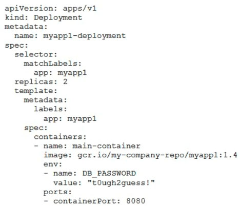
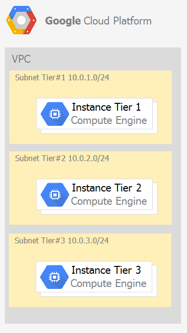
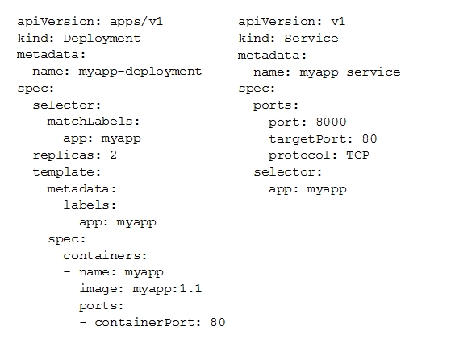
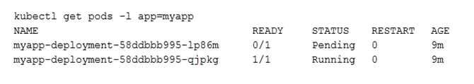
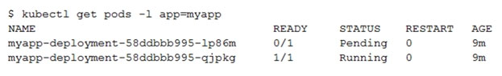
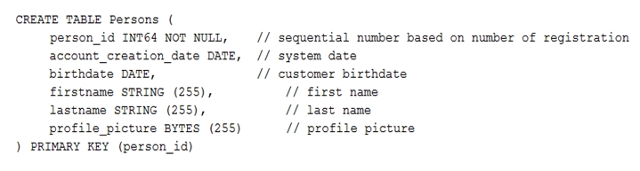
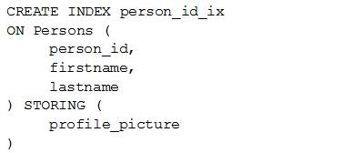

# Exam Topics

#### Question 1

Every employee of your company has a Google account. Your operational team needs to manage a large number of instances on Compute Engine. Each member of this team needs only administrative access to the servers. Your security team wants to ensure that the deployment of credentials is operationally efficient and must be able to determine who accessed a given instance. What should you do?

A. Generate a new SSH key pair. Give the private key to each member of your team. Configure the public key in the metadata of each instance.
B. Ask each member of the team to generate a new SSH key pair and to send you their public key. Use a configuration management tool to deploy those keys on each instance.
C. Ask each member of the team to generate a new SSH key pair and to add the public key to their Google account. Grant the `compute.osAdminLogin` role to the Google group corresponding to this team.
D. Generate a new SSH key pair. Give the private key to each member of your team. Configure the public key as a project-wide public SSH key in your Cloud Platform project and allow project-wide public SSH keys on each instance.

**Answer: C (D)**

#### Question 2

You need to create a custom VPC with a single subnet. The subnet's range must be as large as possible. Which range should you use?

A. 0.0.0.0/0
B. 10.0.0.0/8
C. 172.16.0.0/12
D. 192.168.0.0/16

**Answer: B (A)**

#### Question 3

You want to select and configure a cost-effective solution for relational data on Google Cloud Platform. You are working with a small set of operational data in one geographic location. You need to support point-in-time recovery. What should you do?

A. Select Cloud SQL (MySQL). Verify that the enable binary logging option is selected.
B. Select Cloud SQL (MySQL). Select the create failover replicas option.
C. Select Cloud Spanner. Set up your instance with 2 nodes.
D. Select Cloud Spanner. Set up your instance as multi-regional.

**Answer: A**

#### Question 4

You want to configure autohealing for network load balancing for a group of Compute Engine instances that run in multiple zones, using the fewest possible steps.
You need to configure re-creation of VMs if they are unresponsive after 3 attempts of 10 seconds each. What should you do?

A. Create an HTTP load balancer with a backend configuration that references an existing instance group. Set the health check to healthy (HTTP)
B. Create an HTTP load balancer with a backend configuration that references an existing instance group. Define a balancing mode and set the maximum RPS to 10.
C. Create a managed instance group. Set the Autohealing health check to healthy (HTTP)
D. Create a managed instance group. Verify that the autoscaling setting is on.

**Answer: C (D)**

#### Question 5

You are using multiple configurations for gcloud. You want to review the configured Kubernetes Engine cluster of an inactive configuration using the fewest possible steps. What should you do?

A. Use `gcloud config configurations describe` to review the output.
B. Use `gcloud config configurations activate` and `gcloud config list` to review the output.
C. Use `kubectl config get-contexts` to review the output.
D. Use `kubectl config use-context` and `kubectl config view` to review the output.

**Answer: D**

#### Question 6

Your company uses Cloud Storage to store application backup files for disaster recovery purposes. You want to follow Google's recommended practices. Which storage option should you use?

A. Multi-Regional Storage
B. Regional Storage
C. Nearline Storage
D. Coldline Storage

**Answer: D (A)**

Reference: https://cloud.google.com/storage/docs/storage-classes#nearline

#### Question 7

Several employees at your company have been creating projects with Cloud Platform and paying for it with their personal credit cards, which the company reimburses. The company wants to centralize all these projects under a single, new billing account. What should you do?

A. Contact cloud-billing@google.com with your bank account details and request a corporate billing account for your company.
B. Create a ticket with Google Support and wait for their call to share your credit card details over the phone.
C. In the Google Platform Console, go to the Resource Manage and move all projects to the root Organizarion.
D. In the Google Cloud Platform Console, create a new billing account and set up a payment method.

**Answer: D (C)**

Reference: https://www.whizlabs.com/blog/google-cloud-interview-questions/

#### Question 8

You have an application that looks for its licensing server on the IP 10.0.3.21. You need to deploy the licensing server on Compute Engine. You do not want to change the configuration of the application and want the application to be able to reach the licensing server. What should you do?

A. Reserve the IP 10.0.3.21 as a static internal IP address using gcloud and assign it to the licensing server.
B. Reserve the IP 10.0.3.21 as a static public IP address using gcloud and assign it to the licensing server.
C. Use the IP 10.0.3.21 as a custom ephemeral IP address and assign it to the licensing server.
D. Start the licensing server with an automatic ephemeral IP address, and then promote it to a static internal IP address.

**Answer: A**

#### Question 9

You are deploying an application to App Engine. You want the number of instances to scale based on request rate. You need at least 3 unoccupied instances at all times. Which scaling type should you use?

A. Manual Scaling with 3 instances.
B. Basic Scaling with min_instances set to 3.
C. Basic Scaling with max_instances set to 3.
D. Automatic Scaling with min_idle_instances set to 3.

**Answer: D (B)**

Reference: https://cloud.google.com/appengine/docs/standard/python/how-instances-are-managed

#### Question 10

You have a development project with appropriate IAM roles defined. You are creating a production project and want to have the same IAM roles on the new project, using the fewest possible steps. What should you do?

A. Use gcloud iam roles copy and specify the production project as the destination project.
B. Use gcloud iam roles copy and specify your organization as the destination organization.
C. In the Google Cloud Platform Console, use the 'create role from role' functionality.
D. In the Google Cloud Platform Console, use the 'create role' functionality and select all applicable permissions.

**Answer: A**

Reference: https://cloud.google.com/sdk/gcloud/reference/iam/roles/copy

#### Question 11

You need a dynamic way of provisioning VMs on Compute Engine. The exact specifications will be in a dedicated configuration file. You want to follow Google's recommended practices. Which method should you use?

A. Deployment Manager
B. Cloud Composer
C. Managed Instance Group
D. Unmanaged Instance Group

**Answer: A (C)**

Reference: https://cloud.google.com/compute/docs/instances/

#### Question 12

You have a Dockerfile that you need to deploy on Kubernetes Engine. What should you do?

A. Use kubectl app deploy [dockerfilename].
B. Use gcloud app deploy [dockerfilename].
C. Create a docker image from the Dockerfile and upload it to Container Registry. Create a Deployment YAML file to point to that image. Use kubectl to create the deployment with that file.
D. Create a docker image from the Dockerfile and upload it to Cloud Storage. Create a Deployment YAML file to point to that image. Use kubectl to create the deployment with that file.

**Answer: C**

Reference: https://cloud.google.com/kubernetes-engine/docs/tutorials/hello-app

#### Question 13

Your development team needs a new Jenkins server for their project. You need to deploy the server using the fewest steps possible. What should you do?

A. Download and deploy the Jenkins Java WAR to App Engine Standard.
B. Create a new Compute Engine instance and install Jenkins through the command line interface.
C. Create a Kubernetes cluster on Compute Engine and create a deployment with the Jenkins Docker image.
D. Use GCP Marketplace to launch the Jenkins solution.

**Answer: D**

Reference: https://cloud.google.com/solutions/using-jenkins-for-distributed-builds-on-compute-engine

#### Question 14

You need to update a deployment in Deployment Manager without any resource downtime in the deployment. Which command should you use?

A. gcloud deployment-manager deployments create --config `<deployment-config-path>`
B. gcloud deployment-manager deployments update --config `<deployment-config-path>`
C. gcloud deployment-manager resources create --config `<deployment-config-path>`
D. gcloud deployment-manager resources update --config `<deployment-config-path>`

**Answer: B**

Reference: https://cloud.google.com/sdk/gcloud/reference/deployment-manager/deployments/update

#### Question 15

You need to run an important query in BigQuery but expect it to return a lot of records. You want to find out how much it will cost to run the query. You are using on-demand pricing. What should you do?

A. Arrange to switch to Flat-Rate pricing for this query, then move back to on-demand.
B. Use the command line to run a dry run query to estimate the number of bytes read. Then convert that bytes estimate to dollars using the Pricing Calculator.
C. Use the command line to run a dry run query to estimate the number of bytes returned. Then convert that bytes estimate to dollars using the Pricing Calculator.
D. Run a select count (*) to get an idea of how many records your query will look through. Then convert that number of rows to dollars using the Pricing Calculator.

**Answer: B**

Reference: https://cloud.google.com/bigquery/docs/estimate-costs

#### Question 16

You have a single binary application that you want to run on Google Cloud Platform. You decided to automatically scale the application based on underlying infrastructure CPU usage. Your organizational policies require you to use virtual machines directly. You need to ensure that the application scaling is operationally efficient and completed as quickly as possible. What should you do?

A. Create a Google Kubernetes Engine cluster, and use horizontal pod autoscaling to scale the application.
B. Create an instance template, and use the template in a managed instance group with autoscaling configured.
C. Create an instance template, and use the template in a managed instance group that scales up and down based on the time of day.
D. Use a set of third-party tools to build automation around scaling the application up and down, based on Stackdriver CPU usage monitoring.

**Answer: B**

#### Question 17

You are analyzing Google Cloud Platform service costs from three separate projects. You want to use this information to create service cost estimates by service type, daily and monthly, for the next six months using standard query syntax. What should you do?

A. Export your bill to a Cloud Storage bucket, and then import into Cloud Bigtable for analysis.
B. Export your bill to a Cloud Storage bucket, and then import into Google Sheets for analysis.
C. Export your transactions to a local file, and perform analysis with a desktop tool.
D. Export your bill to a BigQuery dataset, and then write time window-based SQL queries for analysis.

**Answer: D**

#### Question 18

You need to set up a policy so that videos stored in a specific Cloud Storage Regional bucket are moved to Coldline after 90 days, and then deleted after one year from their creation. How should you set up the policy?

A. Use Cloud Storage Object Lifecycle Management using Age conditions with SetStorageClass and Delete actions. Set the SetStorageClass action to 90 days and the Delete action to 275 days (365-90)
B. Use Cloud Storage Object Lifecycle Management using Age conditions with SetStorageClass and Delete actions. Set the SetStorageClass action to 90 days and the Delete action to 365 days.
C. Use gsutil rewrite and set the Delete action to 275 days (365-90).
D. Use gsutil rewrite and set the Delete action to 365 days.

**Answer: B (A)**

#### Question 19

You have a Linux VM that must connect to Cloud SQL. You created a service account with the appropriate access rights. You want to make sure that the VM uses this service account instead of the default Compute Engine service account. What should you do?

A. When creating the VM via the web console, specify the service account under the 'Identity and API Access' section.
B. Download a JSON Private Key for the service account. On the Project Metadata, add that JSON as the value for the key compute-engine-service- account.
C. Download a JSON Private Key for the service account. On the Custom Metadata of the VM, add that JSON as the value for the key compute-engine- service-account.
D. Download a JSON Private Key for the service account. After creating the VM, ssh into the VM and save the JSON under ~/.gcloud/compute-engine-service- account.json.

**Answer: A (C)**

Reference: https://cloud.google.com/compute/docs/access/create-enable-service-accounts-for-instances

#### Question 20

You created an instance of SQL Server 2017 on Compute Engine to test features in the new version. You want to connect to this instance using the fewest number of steps. What should you do?

A. Install a RDP client on your desktop. Verify that a firewall rule for port 3389 exists.
B. Install a RDP client in your desktop. Set a Windows username and password in the GCP Console. Use the credentials to log in to the instance.
C. Set a Windows password in the GCP Console. Verify that a firewall rule for port 22 exists. Click the RDP button in the GCP Console and supply the credentials to log in.
D. Set a Windows username and password in the GCP Console. Verify that a firewall rule for port 3389 exists. Click the RDP button in the GCP Console, and supply the credentials to log in.

**Answer: B (D)**

Reference: https://medium.com/falafel-software/sql-server-in-the-google-cloud-a17e8a1f11ce

#### Question 21

You have one GCP account running in your default region and zone and another account running in a non-default region and zone. You want to start a new
Compute Engine instance in these two Google Cloud Platform accounts using the command line interface. What should you do?

A. Create two configurations using gcloud config configurations create [NAME]. Run gcloud config configurations activate [NAME] to switch between accounts when running the commands to start the Compute Engine instances.
B. Create two configurations using gcloud config configurations create [NAME]. Run gcloud configurations list to start the Compute Engine instances.
C. Activate two configurations using gcloud configurations activate [NAME]. Run gcloud config list to start the Compute Engine instances.
D. Activate two configurations using gcloud configurations activate [NAME]. Run gcloud configurations list to start the Compute Engine instances.

**Answer: A**

#### Question 22

You significantly changed a complex Deployment Manager template and want to confirm that the dependencies of all defined resources are properly met before committing it to the project. You want the most rapid feedback on your changes. What should you do?

A. Use granular logging statements within a Deployment Manager template authored in Python.
B. Monitor activity of the Deployment Manager execution on the Stackdriver Logging page of the GCP Console.
C. Execute the Deployment Manager template against a separate project with the same configuration, and monitor for failures.
D. Execute the Deployment Manager template using the --preview option in the same project, and observe the state of interdependent resources.

**Answer: D**

Reference: https://cloud.google.com/deployment-manager/docs/deployments/updating-deployments

#### Question 23

You are building a pipeline to process time-series data. Which Google Cloud Platform services should you put in boxes 1,2,3, and 4?

A. Cloud Pub/Sub, Cloud Dataflow, Cloud Datastore, BigQuery
B. Firebase Messages, Cloud Pub/Sub, Cloud Spanner, BigQuery
C. Cloud Pub/Sub, Cloud Storage, BigQuery, Cloud Bigtable
D. Cloud Pub/Sub, Cloud Dataflow, Cloud Bigtable, BigQuery

**Answer: D**

Reference: https://cloud.google.com/solutions/correlating-time-series-dataflow

#### Question 24

You have a project for your App Engine application that serves a development environment. The required testing has succeeded and you want to create a new project to serve as your production environment. What should you do?

A. Use gcloud to create the new project, and then deploy your application to the new project.
B. Use gcloud to create the new project and to copy the deployed application to the new project.
C. Create a Deployment Manager configuration file that copies the current App Engine deployment into a new project.
D. Deploy your application again using gcloud and specify the project parameter with the new project name to create the new project.

**Answer: A**

#### Question 25

You need to configure IAM access audit logging in BigQuery for external auditors. You want to follow Google-recommended practices. What should you do?

A. Add the auditors group to the 'logging.viewer' and 'bigQuery.dataViewer' predefined IAM roles.
B. Add the auditors group to two new custom IAM roles.
C. Add the auditor user accounts to the 'logging.viewer' and 'bigQuery.dataViewer' predefined IAM roles.
D. Add the auditor user accounts to two new custom IAM roles.

**Answer: A (C)**

Reference: https://cloud.google.com/iam/docs/roles-audit-logging

#### Question 26

You need to set up permissions for a set of Compute Engine instances to enable them to write data into a particular Cloud Storage bucket. You want to follow
Google-recommended practices. What should you do?

A. Create a service account with an access scope. Use the access scope 'https://www.googleapis.com/auth/devstorage.write_only'.
B. Create a service account with an access scope. Use the access scope 'https://www.googleapis.com/auth/cloud-platform'.
C. Create a service account and add it to the IAM role 'storage.objectCreator' for that bucket.
D. Create a service account and add it to the IAM role 'storage.objectAdmin' for that bucket.

**Answer: C (D)**

#### Question 27

You have sensitive data stored in three Cloud Storage buckets and have enabled data access logging. You want to verify activities for a particular user for these buckets, using the fewest possible steps. You need to verify the addition of metadata labels and which files have been viewed from those buckets. What should you do?

A. Using the GCP Console, filter the Activity log to view the information.
B. Using the GCP Console, filter the Stackdriver log to view the information.
C. View the bucket in the Storage section of the GCP Console.
D. Create a trace in Stackdriver to view the information.

**Answer: A**

#### Question 28

You are the project owner of a GCP project and want to delegate control to colleagues to manage buckets and files in Cloud Storage. You want to follow Google- recommended practices. Which IAM roles should you grant your colleagues?

A. Project Editor
B. Storage Admin
C. Storage Object Admin
D. Storage Object Creator

**Answer: B**

#### Question 29

You have an object in a Cloud Storage bucket that you want to share with an external company. The object contains sensitive data. You want access to the content to be removed after four hours. The external company does not have a Google account to which you can grant specific user-based access privileges. You want to use the most secure method that requires the fewest steps. What should you do?

A. Create a signed URL with a four-hour expiration and share the URL with the company.
B. Set object access to 'public' and use object lifecycle management to remove the object after four hours.
C. Configure the storage bucket as a static website and furnish the object's URL to the company. Delete the object from the storage bucket after four hours.
D. Create a new Cloud Storage bucket specifically for the external company to access. Copy the object to that bucket. Delete the bucket after four hours have passed.

**Answer: A**

#### Question 30

You are creating a Google Kubernetes Engine (GKE) cluster with a cluster autoscaler feature enabled. You need to make sure that each node of the cluster will run a monitoring pod that sends container metrics to a third-party monitoring solution. What should you do?

A. Deploy the monitoring pod in a StatefulSet object.
B. Deploy the monitoring pod in a DaemonSet object.
C. Reference the monitoring pod in a Deployment object.
D. Reference the monitoring pod in a cluster initializer at the GKE cluster creation time.

**Answer: B**

#### Question 31

You want to send and consume Cloud Pub/Sub messages from your App Engine application. The Cloud Pub/Sub API is currently disabled. You will use a service account to authenticate your application to the API. You want to make sure your application can use Cloud Pub/Sub. What should you do?

A. Enable the Cloud Pub/Sub API in the API Library on the GCP Console.
B. Rely on the automatic enablement of the Cloud Pub/Sub API when the Service Account accesses it.
C. Use Deployment Manager to deploy your application. Rely on the automatic enablement of all APIs used by the application being deployed.
D. Grant the App Engine Default service account the role of Cloud Pub/Sub Admin. Have your application enable the API on the first connection to Cloud Pub/ Sub.

**Answer: A**

#### Question 32

You need to monitor resources that are distributed over different projects in Google Cloud Platform. You want to consolidate reporting under the same Stackdriver
Monitoring dashboard. What should you do?

A. Use Shared VPC to connect all projects, and link Stackdriver to one of the projects.
B. For each project, create a Stackdriver account. In each project, create a service account for that project and grant it the role of Stackdriver Account Editor in all other projects.
C. Configure a single Stackdriver account, and link all projects to the same account.
D. Configure a single Stackdriver account for one of the projects. In Stackdriver, create a Group and add the other project names as criteria for that Group.

**Answer: C (D)**

#### Question 33

You are deploying an application to a Compute Engine VM in a managed instance group. The application must be running at all times, but only a single instance of the VM should run per GCP project. How should you configure the instance group?

A. Set autoscaling to On, set the minimum number of instances to 1, and then set the maximum number of instances to 1.
B. Set autoscaling to Off, set the minimum number of instances to 1, and then set the maximum number of instances to 1.
C. Set autoscaling to On, set the minimum number of instances to 1, and then set the maximum number of instances to 2.
D. Set autoscaling to Off, set the minimum number of instances to 1, and then set the maximum number of instances to 2.

**Answer: A (B)**

#### Question 34

You want to verify the IAM users and roles assigned within a GCP project named my-project. What should you do?

A. Run gcloud iam roles list. Review the output section.
B. Run gcloud iam service-accounts list. Review the output section.
C. Navigate to the project and then to the IAM section in the GCP Console. Review the members and roles.
D. Navigate to the project and then to the Roles section in the GCP Console. Review the roles and status.

**Answer: C**

#### Question 35

You need to create a new billing account and then link it with an existing Google Cloud Platform project. What should you do?

A. Verify that you are Project Billing Manager for the GCP project. Update the existing project to link it to the existing billing account.
B. Verify that you are Project Billing Manager for the GCP project. Create a new billing account and link the new billing account to the existing project.
C. Verify that you are Billing Administrator for the billing account. Create a new project and link the new project to the existing billing account.
D. Verify that you are Billing Administrator for the billing account. Update the existing project to link it to the existing billing account.

**Answer: B**

#### Question 36

You have one project called proj-sa where you manage all your service accounts. You want to be able to use a service account from this project to take snapshots of VMs running in another project called proj-vm. What should you do?

A. Download the private key from the service account, and add it to each VMs custom metadata.
B. Download the private key from the service account, and add the private key to each VM's SSH keys.
C. Grant the service account the IAM Role of Compute Storage Admin in the project called proj-vm.
D. When creating the VMs, set the service account's API scope for Compute Engine to read/write.

**Answer: C**

#### Question 37

You created a Google Cloud Platform project with an App Engine application inside the project. You initially configured the application to be served from the us- central region. Now you want the application to be served from the asia-northeast1 region. What should you do?

A. Change the default region property setting in the existing GCP project to asia-northeast1.
B. Change the region property setting in the existing App Engine application from us-central to asia-northeast1.
C. Create a second App Engine application in the existing GCP project and specify asia-northeast1 as the region to serve your application.
D. Create a new GCP project and create an App Engine application inside this new project. Specify asia-northeast1 as the region to serve your application.

**Answer: D (C)**

#### Question 38

You need to grant access for three users so that they can view and edit table data on a Cloud Spanner instance. What should you do?

A. Run gcloud iam roles describe roles/spanner.databaseUser. Add the users to the role.
B. Run gcloud iam roles describe roles/spanner.databaseUser. Add the users to a new group. Add the group to the role.
C. Run gcloud iam roles describe roles/spanner.viewer - -project my-project. Add the users to the role.
D. Run gcloud iam roles describe roles/spanner.viewer - -project my-project. Add the users to a new group. Add the group to the role.

**Answer: B (A)**

#### Question 39

You create a new Google Kubernetes Engine (GKE) cluster and want to make sure that it always runs a supported and stable version of Kubernetes. What should you do?

A. Enable the Node Auto-Repair feature for your GKE cluster.
B. Enable the Node Auto-Upgrades feature for your GKE cluster.
C. Select the latest available cluster version for your GKE cluster.
D. Select `Container-Optimized OS (cos)` as a node image for your GKE cluster.

**Answer: B**

#### Question 40

You have an instance group that you want to load balance. You want the load balancer to terminate the client SSL session. The instance group is used to serve a public web application over HTTPS. You want to follow Google-recommended practices. What should you do?

A. Configure an HTTP(S) load balancer.
B. Configure an internal TCP load balancer.
C. Configure an external SSL proxy load balancer.
D. Configure an external TCP proxy load balancer.

**Answer: A**

Reference: https://cloud.google.com/load-balancing/docs/https/

#### Question 41

You have 32 GB of data in a single file that you need to upload to a Nearline Storage bucket. The WAN connection you are using is rated at 1 Gbps, and you are the only one on the connection. You want to use as much of the rated 1 Gbps as possible to transfer the file rapidly. How should you upload the file?

A. Use the GCP Console to transfer the file instead of gsutil.
B. Enable parallel composite uploads using gsutil on the file transfer.
C. Decrease the TCP window size on the machine initiating the transfer.
D. Change the storage class of the bucket from Nearline to Multi-Regional.

**Answer: B**

#### Question 42

You've deployed a microservice called myapp1 to a Google Kubernetes Engine cluster using the YAML file specified below:

You need to refactor this configuration so that the database password is not stored in plain text. You want to follow Google-recommended practices. What should you do?

A. Store the database password inside the Docker image of the container, not in the YAML file.
B. Store the database password inside a Secret object. Modify the YAML file to populate the DB_PASSWORD environment variable from the Secret.
C. Store the database password inside a ConfigMap object. Modify the YAML file to populate the DB_PASSWORD environment variable from the ConfigMap.
D. Store the database password in a file inside a Kubernetes persistent volume, and use a persistent volume claim to mount the volume to the container.

**Answer: B (C)**

#### Question 43

You are running an application on multiple virtual machines within a managed instance group and have autoscaling enabled. The autoscaling policy is configured so that additional instances are added to the group if the CPU utilization of instances goes above 80%. VMs are added until the instance group reaches its maximum limit of five VMs or until CPU utilization of instances lowers to 80%. The initial delay for HTTP health checks against the instances is set to 30 seconds.
The virtual machine instances take around three minutes to become available for users. You observe that when the instance group autoscales, it adds more instances then necessary to support the levels of end-user traffic. You want to properly maintain instance group sizes when autoscaling. What should you do?

A. Set the maximum number of instances to 1.
B. Decrease the maximum number of instances to 3.
C. Use a TCP health check instead of an HTTP health check.
D. Increase the initial delay of the HTTP health check to 200 seconds.

**Answer: D**

#### Question 44

You need to select and configure compute resources for a set of batch processing jobs. These jobs take around 2 hours to complete and are run nightly. You want to minimize service costs. What should you do?

A. Select Google Kubernetes Engine. Use a single-node cluster with a small instance type.
B. Select Google Kubernetes Engine. Use a three-node cluster with micro instance types.
C. Select Compute Engine. Use preemptible VM instances of the appropriate standard machine type.
D. Select Compute Engine. Use VM instance types that support micro bursting.

**Answer: C**

#### Question 45

You recently deployed a new version of an application to App Engine and then discovered a bug in the release. You need to immediately revert to the prior version of the application. What should you do?

A. Run gcloud app restore.
B. On the App Engine page of the GCP Console, select the application that needs to be reverted and click Revert.
C. On the App Engine Versions page of the GCP Console, route 100% of the traffic to the previous version.
D. Deploy the original version as a separate application. Then go to App Engine settings and split traffic between applications so that the original version serves 100% of the requests.

**Answer: C (D)**

Reference: https://medium.com/google-cloud/app-engine-project-cleanup-9647296e796a

#### Question 46

You deployed an App Engine application using gcloud app deploy, but it did not deploy to the intended project. You want to find out why this happened and where the application deployed. What should you do?

A. Check the app.yaml file for your application and check project settings.
B. Check the web-application.xml file for your application and check project settings.
C. Go to Deployment Manager and review settings for deployment of applications.
D. Go to Cloud Shell and run gcloud config list to review the Google Cloud configuration used for deployment.

Reference: https://cloud.google.com/endpoints/docs/openapi/troubleshoot-aeflex-deployment

**Answer: D (A)**

#### Question 47

You want to configure 10 Compute Engine instances for availability when maintenance occurs. Your requirements state that these instances should attempt to automatically restart if they crash. Also, the instances should be highly available including during system maintenance. What should you do?

A. Create an instance template for the instances. Set the 'Automatic Restart' to on. Set the 'On-host maintenance' to Migrate VM instance. Add the instance template to an instance group.
B. Create an instance template for the instances. Set 'Automatic Restart' to off. Set 'On-host maintenance' to Terminate VM instances. Add the instance template to an instance group.
C. Create an instance group for the instances. Set the 'Autohealing' health check to healthy (HTTP).
D. Create an instance group for the instance. Verify that the 'Advanced creation options' setting for 'do not retry machine creation' is set to off.

**Answer: A (B)**

#### Question 48

You host a static website on Cloud Storage. Recently, you began to include links to PDF files on this site. Currently, when users click on the links to these PDF files, their browsers prompt them to save the file onto their local system. Instead, you want the clicked PDF files to be displayed within the browser window directly, without prompting the user to save the file locally. What should you do?

A. Enable Cloud CDN on the website frontend.
B. Enable 'Share publicly' on the PDF file objects.
C. Set Content-Type metadata to application/pdf on the PDF file objects.
D. Add a label to the storage bucket with a key of Content-Type and value of application/pdf.

**Answer: C**

#### Question 49

You have a virtual machine that is currently configured with 2 vCPUs and 4 GB of memory. It is running out of memory. You want to upgrade the virtual machine to have 8 GB of memory. What should you do?

A. Rely on live migration to move the workload to a machine with more memory.
B. Use gcloud to add metadata to the VM. Set the key to required-memory-size and the value to 8 GB.
C. Stop the VM, change the machine type to n1-standard-8, and start the VM.
D. Stop the VM, increase the memory to 8 GB, and start the VM.

**Answer: D**

#### Question 50

You have production and test workloads that you want to deploy on Compute Engine. Production VMs need to be in a different subnet than the test VMs. All the
VMs must be able to reach each other over Internal IP without creating additional routes. You need to set up VPC and the 2 subnets. Which configuration meets these requirements?

A. Create a single custom VPC with 2 subnets. Create each subnet in a different region and with a different CIDR range.
B. Create a single custom VPC with 2 subnets. Create each subnet in the same region and with the same CIDR range.
C. Create 2 custom VPCs, each with a single subnet. Create each subnet in a different region and with a different CIDR range.
D. Create 2 custom VPCs, each with a single subnet. Create each subnet in the same region and with the same CIDR range.

**Answer: A**

#### Question 51

You need to create an autoscaling managed instance group for an HTTPS web application. You want to make sure that unhealthy VMs are recreated. What should you do?

A. Create a health check on port 443 and use that when creating the Managed Instance Group.
B. Select Multi-Zone instead of Single-Zone when creating the Managed Instance Group.
C. In the Instance Template, add the label 'health-check'.
D. In the Instance Template, add a startup script that sends a heartbeat to the metadata server.

**Answer: A (C)**

Reference: https://cloud.google.com/compute/docs/instance-groups/creating-groups-of-managed-instances

#### Question 52

Your company has a Google Cloud Platform project that uses BigQuery for data warehousing. Your data science team changes frequently and has few members.
You need to allow members of this team to perform queries. You want to follow Google-recommended practices. What should you do?

A. 1. Create an IAM entry for each data scientist's user account. 2. Assign the BigQuery jobUser role to the group.
B. 1. Create an IAM entry for each data scientist's user account. 2. Assign the BigQuery dataViewer user role to the group.
C. 1. Create a dedicated Google group in Cloud Identity. 2. Add each data scientist's user account to the group. 3. Assign the BigQuery jobUser role to the group.
D. 1. Create a dedicated Google group in Cloud Identity. 2. Add each data scientist's user account to the group. 3. Assign the BigQuery dataViewer user role to the group.

**Answer: C (D)**

Reference: https://cloud.google.com/bigquery/docs/cloud-sql-federated-queries

#### Question 53

Your company has a 3-tier solution running on Compute Engine. The configuration of the current infrastructure is shown below.

Each tier has a service account that is associated with all instances within it. You need to enable communication on TCP port 8080 between tiers as follows:

- Instances in tier #1 must communicate with tier #2.
- Instances in tier #2 must communicate with tier #3.
  What should you do?

A. 1. Create an ingress firewall rule with the following settings: `Targets: all instances`, `Source filter: IP ranges` (with the range set to 10.0.2.0/24), `Protocols: allow all` 2. Create an ingress firewall rule with the following settings: `Targets: all instances`,  `Source filter: IP ranges` (with the range set to 10.0.1.0/24), `Protocols: allow all`
B. 1. Create an ingress firewall rule with the following settings: `Targets: all instances with tier #2 service account `, `Source filter: all instances with tier #1 service account`, `Protocols: allow TCP:8080` 2. Create an ingress firewall rule with the following settings: `Targets: all instances with tier #3 service account`, `Source filter: all instances with tier #2 service account`, `Protocols: allow TCP: 8080`
C. 1. Create an ingress firewall rule with the following settings: `Targets: all instances with tier #2 service account`, `Source filter: all instances with tier #1 service account`, `Protocols: allow all` 2. Create an ingress firewall rule with the following settings: `Targets: all instances with tier #3 service account`, `Source filter: all instances with tier #2 service account`, `Protocols: allow all`
D. 1. Create an egress firewall rule with the following settings: `Targets: all instances`, `Source filter: IP ranges` (with the range set to 10.0.2.0/24), `Protocols: allow TCP: 8080` 2. Create an egress firewall rule with the following settings: `Targets: all instances`, `Source filter: IP ranges` (with the range set to 10.0.1.0/24) `Protocols: allow TCP: 8080`

**Answer: B**

#### Question 54

You are given a project with a single Virtual Private Cloud (VPC) and a single subnetwork in the us-central1 region. There is a Compute Engine instance hosting an application in this subnetwork. You need to deploy a new instance in the same project in the europe-west1 region. This new instance needs access to the application. You want to follow Google-recommended practices. What should you do?

A. 1. Create a subnetwork in the same VPC, in europe-west1. 2. Create the new instance in the new subnetwork and use the first instance's private address as the endpoint.
B. 1. Create a VPC and a subnetwork in europe-west1. 2. Expose the application with an internal load balancer. 3. Create the new instance in the new subnetwork and use the load balancer's address as the endpoint.
C. 1. Create a subnetwork in the same VPC, in europe-west1. 2. Use Cloud VPN to connect the two subnetworks. 3. Create the new instance in the new subnetwork and use the first instance's private address as the endpoint.
D. 1. Create a VPC and a subnetwork in europe-west1. 2. Peer the 2 VPCs. 3. Create the new instance in the new subnetwork and use the first instance's private address as the endpoint.

**Answer: A**

#### Question 55

Your projects incurred more costs than you expected last month. Your research reveals that a development GKE container emitted a huge number of logs, which resulted in higher costs. You want to disable the logs quickly using the minimum number of steps. What should you do?

A. 1. Go to the Logs ingestion window in Stackdriver Logging, and disable the log source for the GKE container resource.
B. 1. Go to the Logs ingestion window in Stackdriver Logging, and disable the log source for the GKE Cluster Operations resource.
C. 1. Go to the GKE console, and delete existing clusters. 2. Recreate a new cluster. 3. Clear the option to enable legacy Stackdriver Logging.
D. 1. Go to the GKE console, and delete existing clusters. 2. Recreate a new cluster. 3. Clear the option to enable legacy Stackdriver Monitoring.

**Answer: A**

#### Question 56

You have a website hosted on App Engine standard environment. You want 1% of your users to see a new test version of the website. You want to minimize complexity. What should you do?

A. Deploy the new version in the same application and use the --migrate option.
B. Deploy the new version in the same application and use the --splits option to give a weight of 99 to the current version and a weight of 1 to the new version.
C. Create a new App Engine application in the same project. Deploy the new version in that application. Use the App Engine library to proxy 1% of the requests to the new version.
D. Create a new App Engine application in the same project. Deploy the new version in that application. Configure your network load balancer to send 1% of the traffic to that new application.

**Answer: B**

#### Question 57

You have a web application deployed as a managed instance group. You have a new version of the application to gradually deploy. Your web application is currently receiving live web traffic. You want to ensure that the available capacity does not decrease during the deployment. What should you do?

A. Perform a rolling-action start-update with maxSurge set to 0 and maxUnavailable set to 1.
B. Perform a rolling-action start-update with maxSurge set to 1 and maxUnavailable set to 0.
C. Create a new managed instance group with an updated instance template. Add the group to the backend service for the load balancer. When all instances in the new managed instance group are healthy, delete the old managed instance group.
D. Create a new instance template with the new application version. Update the existing managed instance group with the new instance template. Delete the instances in the managed instance group to allow the managed instance group to recreate the instance using the new instance template.

**Answer: B (C)**

#### Question 58

You are building an application that stores relational data from users. Users across the globe will use this application. Your CTO is concerned about the scaling requirements because the size of the user base is unknown. You need to implement a database solution that can scale with your user growth with minimum configuration changes. Which storage solution should you use?

A. Cloud SQL
B. Cloud Spanner
C. Cloud Firestore
D. Cloud Datastore

**Answer: B**

#### Question 59

You are the organization and billing administrator for your company. The engineering team has the Project Creator role on the organization. You do not want the engineering team to be able to link projects to the billing account. Only the finance team should be able to link a project to a billing account, but they should not be able to make any other changes to projects. What should you do?

A. Assign the finance team only the Billing Account User role on the billing account.
B. Assign the engineering team only the Billing Account User role on the billing account.
C. Assign the finance team the Billing Account User role on the billing account and the Project Billing Manager role on the organization.
D. Assign the engineering team the Billing Account User role on the billing account and the Project Billing Manager role on the organization.

**Answer: C (D)**

#### Question 60

You have an application running in Google Kubernetes Engine (GKE) with cluster autoscaling enabled. The application exposes a TCP endpoint. There are several replicas of this application. You have a Compute Engine instance in the same region, but in another Virtual Private Cloud (VPC), called gce-network, that has no overlapping IP ranges with the first VPC. This instance needs to connect to the application on GKE. You want to minimize effort. What should you do?

A. 1. In GKE, create a Service of type LoadBalancer that uses the application's Pods as backend. 2. Set the service's externalTrafficPolicy to Cluster. 3. Configure the Compute Engine instance to use the address of the load balancer that has been created.
B. 1. In GKE, create a Service of type NodePort that uses the application's Pods as backend. 2. Create a Compute Engine instance called proxy with 2 network interfaces, one in each VPC. 3. Use iptables on this instance to forward traffic from gce-network to the GKE nodes. 4. Configure the Compute Engine instance to use the address of proxy in gce-network as endpoint.
C. 1. In GKE, create a Service of type LoadBalancer that uses the application's Pods as backend. 2. Add an annotation to this service: cloud.google.com/load-balancer-type: Internal 3. Peer the two VPCs together. 4. Configure the Compute Engine instance to use the address of the load balancer that has been created.
D. 1. In GKE, create a Service of type LoadBalancer that uses the application's Pods as backend. 2. Add a Cloud Armor Security Policy to the load balancer that whitelists the internal IPs of the MIG's instances. 3. Configure the Compute Engine instance to use the address of the load balancer that has been created.

**Answer: C (A)**

#### Question 61

Your organization is a financial company that needs to store audit log files for 3 years. Your organization has hundreds of Google Cloud projects. You need to implement a cost-effective approach for log file retention. What should you do?

A. Create an export to the sink that saves logs from Cloud Audit to BigQuery.
B. Create an export to the sink that saves logs from Cloud Audit to a Coldline Storage bucket.
C. Write a custom script that uses logging API to copy the logs from Stackdriver logs to BigQuery.
D. Export these logs to Cloud Pub/Sub and write a Cloud Dataflow pipeline to store logs to Cloud SQL.

**Answer: B (A)**

Reference: https://cloud.google.com/logging/docs/audit/

#### Question 62

You want to run a single caching HTTP reverse proxy on GCP for a latency-sensitive website. This specific reverse proxy consumes almost no CPU. You want to have a 30-GB in-memory cache, and need an additional 2 GB of memory for the rest of the processes. You want to minimize cost. How should you run this reverse proxy?

A. Create a Cloud Memorystore for Redis instance with 32-GB capacity.
B. Run it on Compute Engine, and choose a custom instance type with 6 vCPUs and 32 GB of memory.
C. Package it in a container image, and run it on Kubernetes Engine, using n1-standard-32 instances as nodes.
D. Run it on Compute Engine, choose the instance type n1-standard-1, and add an SSD persistent disk of 32 GB.

**Answer: A (B)**

#### Question 63

You are hosting an application on bare-metal servers in your own data center. The application needs access to Cloud Storage. However, security policies prevent the servers hosting the application from having public IP addresses or access to the internet. You want to follow Google-recommended practices to provide the application with access to Cloud Storage. What should you do?

A. 1. Use nslookup to get the IP address for storage.googleapis.com. 2. Negotiate with the security team to be able to give a public IP address to the servers. 3. Only allow egress traffic from those servers to the IP addresses for storage.googleapis.com.
B. 1. Using Cloud VPN, create a VPN tunnel to a Virtual Private Cloud (VPC) in Google Cloud. 2. In this VPC, create a Compute Engine instance and install the Squid proxy server on this instance. 3. Configure your servers to use that instance as a proxy to access Cloud Storage.
C. 1. Use Migrate for Compute Engine (formerly known as Velostrata) to migrate those servers to Compute Engine. 2. Create an internal load balancer (ILB) that uses storage.googleapis.com as backend. 3. Configure your new instances to use this ILB as proxy.
D. 1. Using Cloud VPN or Interconnect, create a tunnel to a VPC in Google Cloud. 2. Use Cloud Router to create a custom route advertisement for 199.36.153.4/30. Announce that network to your on-premises network through the VPN tunnel. 3. In your on-premises network, configure your DNS server to resolve *.googleapis.com as a CNAME to restricted.googleapis.com.

**Answer: D (C)**

#### Question 64

You want to deploy an application on Cloud Run that processes messages from a Cloud Pub/Sub topic. You want to follow Google-recommended practices. What should you do?

A. 1. Create a Cloud Function that uses a Cloud Pub/Sub trigger on that topic. 2. Call your application on Cloud Run from the Cloud Function for every message.
B. 1. Grant the Pub/Sub Subscriber role to the service account used by Cloud Run. 2. Create a Cloud Pub/Sub subscription for that topic. 3. Make your application pull messages from that subscription.
C. 1. Create a service account. 2. Give the Cloud Run Invoker role to that service account for your Cloud Run application. 3. Create a Cloud Pub/Sub subscription that uses that service account and uses your Cloud Run application as the push endpoint.
D. 1. Deploy your application on Cloud Run on GKE with the connectivity set to Internal. 2. Create a Cloud Pub/Sub subscription for that topic. 3. In the same Google Kubernetes Engine cluster as your application, deploy a container that takes the messages and sends them to your application.

**Answer: C (D)**

#### Question 65

You need to deploy an application, which is packaged in a container image, in a new project. The application exposes an HTTP endpoint and receives very few requests per day. You want to minimize costs. What should you do?

A. Deploy the container on Cloud Run.
B. Deploy the container on Cloud Run on GKE.
C. Deploy the container on App Engine Flexible.
D. Deploy the container on GKE with cluster autoscaling and horizontal pod autoscaling enabled.

**Answer: A (B)**

#### Question 66

Your company has an existing GCP organization with hundreds of projects and a billing account. Your company recently acquired another company that also has hundreds of projects and its own billing account. You would like to consolidate all GCP costs of both GCP organizations onto a single invoice. You would like to consolidate all costs as of tomorrow. What should you do?

A. Link the acquired company's projects to your company's billing account.
B. Configure the acquired company's billing account and your company's billing account to export the billing data into the same BigQuery dataset.
C. Migrate the acquired company's projects into your company's GCP organization. Link the migrated projects to your company's billing account.
D. Create a new GCP organization and a new billing account. Migrate the acquired company's projects and your company's projects into the new GCP organization and link the projects to the new billing account.

**Answer: A (D)**

#### Question 67

You built an application on Google Cloud that uses Cloud Spanner. Your support team needs to monitor the environment but should not have access to table data.
You need a streamlined solution to grant the correct permissions to your support team, and you want to follow Google-recommended practices. What should you do?

A. Add the support team group to the roles/monitoring.viewer role
B. Add the support team group to the roles/spanner.databaseUser role.
C. Add the support team group to the roles/spanner.databaseReader role.
D. Add the support team group to the roles/stackdriver.accounts.viewer role.

**Answer: A (B)**

#### Question 68

For analysis purposes, you need to send all the logs from all of your Compute Engine instances to a BigQuery dataset called platform-logs. You have already installed the Cloud Logging agent on all the instances. You want to minimize cost. What should you do?

A. 1. Give the BigQuery Data Editor role on the platform-logs dataset to the service accounts used by your instances. 2. Update your instances' metadata to add the following value: logs-destination: bq://platform-logs.
B. 1. In Cloud Logging, create a logs export with a Cloud Pub/Sub topic called logs as a sink. 2. Create a Cloud Function that is triggered by messages in the logs topic. 3. Configure that Cloud Function to drop logs that are not from Compute Engine and to insert Compute Engine logs in the platform-logs dataset.
C. 1. In Cloud Logging, create a filter to view only Compute Engine logs. 2. Click Create Export. 3. Choose BigQuery as Sink Service, and the platform-logs dataset as Sink Destination.
D. 1. Create a Cloud Function that has the BigQuery User role on the platform-logs dataset. 2. Configure this Cloud Function to create a BigQuery Job that executes this query: INSERT INTO dataset.platform-logs (timestamp, log) SELECT timestamp, log FROM compute.logs WHERE timestamp > DATE_SUB(CURRENT_DATE(), INTERVAL 1 DAY) 3. Use Cloud Scheduler to trigger this Cloud Function once a day.

**Answer: C**

#### Question 69

You are using Deployment Manager to create a Google Kubernetes Engine cluster. Using the same Deployment Manager deployment, you also want to create a
DaemonSet in the kube-system namespace of the cluster. You want a solution that uses the fewest possible services. What should you do?

A. Add the cluster's API as a new Type Provider in Deployment Manager, and use the new type to create the DaemonSet.
B. Use the Deployment Manager Runtime Configurator to create a new Config resource that contains the DaemonSet definition.
C. With Deployment Manager, create a Compute Engine instance with a startup script that uses kubectl to create the DaemonSet.
D. In the cluster's definition in Deployment Manager, add a metadata that has kube-system as key and the DaemonSet manifest as value.

**Answer: A (C)**

Reference: https://cloud.google.com/kubernetes-engine/docs/how-to/cluster-access-for-kubectl

Spiegazioni:
A. Corretta: Aggiungere l'API del cluster come nuovo Type Provider in Deployment Manager consente di usare direttamente il tipo per creare la DaemonSet, riducendo al minimo l'uso di servizi esterni.
B. Errata: Il Deployment Manager Runtime Configurator è utilizzato per gestire configurazioni dinamiche e non è ottimale per creare risorse come una DaemonSet.
C. Errata: Creare un'istanza di Compute Engine con uno script di avvio per gestire la DaemonSet richiede risorse aggiuntive e complica la configurazione, non rispettando l'obiettivo di minimizzare i servizi.
D. Errata: L'aggiunta di metadata nella definizione del cluster non è un metodo valido per creare una DaemonSet, poiché i metadata non gestiscono direttamente manifesti Kubernetes.

#### Question 70

You are building an application that will run in your data center. The application will use Google Cloud Platform (GCP) services like AutoML. You created a service account that has appropriate access to AutoML. You need to enable authentication to the APIs from your on-premises environment. What should you do?

A. Use service account credentials in your on-premises application.
B. Use gcloud to create a key file for the service account that has appropriate permissions.
C. Set up direct interconnect between your data center and Google Cloud Platform to enable authentication for your on-premises applications.
D. Go to the IAM & admin console, grant a user account permissions similar to the service account permissions, and use this user account for authentication from your data center.

**Answer: B**

#### Question 71

You are using Container Registry to centrally store your company's container images in a separate project. In another project, you want to create a Google
Kubernetes Engine (GKE) cluster. You want to ensure that Kubernetes can download images from Container Registry. What should you do?

A. In the project where the images are stored, grant the Storage Object Viewer IAM role to the service account used by the Kubernetes nodes.
B. When you create the GKE cluster, choose the Allow full access to all Cloud APIs option under 'Access scopes'.
C. Create a service account, and give it access to Cloud Storage. Create a P12 key for this service account and use it as an imagePullSecrets in Kubernetes.
D. Configure the ACLs on each image in Cloud Storage to give read-only access to the default Compute Engine service account.

**Answer: A (C)**

#### Question 72

You deployed a new application inside your Google Kubernetes Engine cluster using the YAML file specified below.

You check the status of the deployed pods and notice that one of them is still in PENDING status:

You want to find out why the pod is stuck in pending status. What should you do?

A. Review details of the myapp-service Service object and check for error messages.
B. Review details of the myapp-deployment Deployment object and check for error messages.
C. Review details of myapp-deployment-58ddbbb995-lp86m Pod and check for warning messages.
D. View logs of the container in myapp-deployment-58ddbbb995-lp86m pod and check for warning messages.

**Answer: C**

Reference: https://cloud.google.com/run/docs/gke/troubleshooting

#### Question 73

You are setting up a Windows VM on Compute Engine and want to make sure you can log in to the VM via RDP. What should you do?

A. After the VM has been created, use your Google Account credentials to log in into the VM.
B. After the VM has been created, use gcloud compute reset-windows-password to retrieve the login credentials for the VM.
C. When creating the VM, add metadata to the instance using 'windows-password' as the key and a password as the value.
D. After the VM has been created, download the JSON private key for the default Compute Engine service account. Use the credentials in the JSON file to log in to the VM.

**Answer: B (D)**

#### Question 74

You want to configure an SSH connection to a single Compute Engine instance for users in the dev1 group. This instance is the only resource in this particular
Google Cloud Platform project that the dev1 users should be able to connect to. What should you do?

A. Set metadata to enable-oslogin=true for the instance. Grant the dev1 group the compute.osLogin role. Direct them to use the Cloud Shell to ssh to that instance.
B. Set metadata to enable-oslogin=true for the instance. Set the service account to no service account for that instance. Direct them to use the Cloud Shell to ssh to that instance.
C. Enable block project wide keys for the instance. Generate an SSH key for each user in the dev1 group. Distribute the keys to dev1 users and direct them to use their third-party tools to connect.
D. Enable block project wide keys for the instance. Generate an SSH key and associate the key with that instance. Distribute the key to dev1 users and direct them to use their third-party tools to connect.

**Answer: A (D)**

#### Question 75

You need to produce a list of the enabled Google Cloud Platform APIs for a GCP project using the gcloud command line in the Cloud Shell. The project name is my-project. What should you do?

A. Run gcloud projects list to get the project ID, and then run gcloud services list --project `<project ID>`.
B. Run gcloud init to set the current project to my-project, and then run gcloud services list --available.
C. Run gcloud info to view the account value, and then run gcloud services list --account `<Account>`.
D. Run gcloud projects describe `<project ID>` to verify the project value, and then run gcloud services list --available.

**Answer: A**

#### Question 76

You are building a new version of an application hosted in an App Engine environment. You want to test the new version with 1% of users before you completely switch your application over to the new version. What should you do?

A. Deploy a new version of your application in Google Kubernetes Engine instead of App Engine and then use GCP Console to split traffic.
B. Deploy a new version of your application in a Compute Engine instance instead of App Engine and then use GCP Console to split traffic.
C. Deploy a new version as a separate app in App Engine. Then configure App Engine using GCP Console to split traffic between the two apps.
D. Deploy a new version of your application in App Engine. Then go to App Engine settings in GCP Console and split traffic between the current version and newly deployed versions accordingly.

**Answer: D**

#### Question 77

You need to provide a cost estimate for a Kubernetes cluster using the GCP pricing calculator for Kubernetes. Your workload requires high IOPs, and you will also be using disk snapshots. You start by entering the number of nodes, average hours, and average days. What should you do next?

A. Fill in local SSD. Fill in persistent disk storage and snapshot storage.
B. Fill in local SSD. Add estimated cost for cluster management.
C. Select Add GPUs. Fill in persistent disk storage and snapshot storage.
D. Select Add GPUs. Add estimated cost for cluster management.

**Answer: A**

Reference: https://cloud.google.com/products/calculator#tab=container

#### Question 78

You are using Google Kubernetes Engine with autoscaling enabled to host a new application. You want to expose this new application to the public, using HTTPS on a public IP address. What should you do?

A. Create a Kubernetes Service of type NodePort for your application, and a Kubernetes Ingress to expose this Service via a Cloud Load Balancer.
B. Create a Kubernetes Service of type ClusterIP for your application. Configure the public DNS name of your application using the IP of this Service.
C. Create a Kubernetes Service of type NodePort to expose the application on port 443 of each node of the Kubernetes cluster. Configure the public DNS name of your application with the IP of every node of the cluster to achieve load-balancing.
D. Create a HAProxy pod in the cluster to load-balance the traffic to all the pods of the application. Forward the public traffic to HAProxy with an iptable rule. Configure the DNS name of your application using the public IP of the node HAProxy is running on.

**Answer: A**

Reference: https://cloud.google.com/kubernetes-engine/docs/tutorials/http-balancer

#### Question 79

You need to enable traffic between multiple groups of Compute Engine instances that are currently running two different GCP projects. Each group of Compute
Engine instances is running in its own VPC. What should you do?

A. Verify that both projects are in a GCP Organization. Create a new VPC and add all instances.
B. Verify that both projects are in a GCP Organization. Share the VPC from one project and request that the Compute Engine instances in the other project use this shared VPC.
C. Verify that you are the Project Administrator of both projects. Create two new VPCs and add all instances.
D. Verify that you are the Project Administrator of both projects. Create a new VPC and add all instances.

**Answer: B**

#### Question 80

You want to add a new auditor to a Google Cloud Platform project. The auditor should be allowed to read, but not modify, all project items.
How should you configure the auditor's permissions?

A. Create a custom role with view-only project permissions. Add the user's account to the custom role.
B. Create a custom role with view-only service permissions. Add the user's account to the custom role.
C. Select the built-in IAM project Viewer role. Add the user's account to this role.
D. Select the built-in IAM service Viewer role. Add the user's account to this role.

**Answer: C**

#### Question 81

You are operating a Google Kubernetes Engine (GKE) cluster for your company where different teams can run non-production workloads. Your Machine Learning (ML) team needs access to Nvidia Tesla P100 GPUs to train their models. You want to minimize effort and cost. What should you do?

A. Ask your ML team to add the `accelerator: gpu` annotation to their pod specification.
B. Recreate all the nodes of the GKE cluster to enable GPUs on all of them.
C. Create your own Kubernetes cluster on top of Compute Engine with nodes that have GPUs. Dedicate this cluster to your ML team.
D. Add a new, GPU-enabled, node pool to the GKE cluster. Ask your ML team to add the cloud.google.com/gke -accelerator: nvidia-tesla-p100 nodeSelector to their pod specification.

**Answer: D (B)**

#### Question 82

Your VMs are running in a subnet that has a subnet mask of 255.255.255.240. The current subnet has no more free IP addresses and you require an additional
10 IP addresses for new VMs. The existing and new VMs should all be able to reach each other without additional routes. What should you do?

A. Use gcloud to expand the IP range of the current subnet.
B. Delete the subnet, and recreate it using a wider range of IP addresses.
C. Create a new project. Use Shared VPC to share the current network with the new project.
D. Create a new subnet with the same starting IP but a wider range to overwrite the current subnet.

**Answer: A (C)**

#### Question 83

Your organization uses G Suite for communication and collaboration. All users in your organization have a G Suite account. You want to grant some G Suite users access to your Cloud Platform project. What should you do?

A. Enable Cloud Identity in the GCP Console for your domain.
B. Grant them the required IAM roles using their G Suite email address.
C. Create a CSV sheet with all users' email addresses. Use the gcloud command line tool to convert them into Google Cloud Platform accounts.
D. In the G Suite console, add the users to a special group called cloud-console-users@yourdomain.com. Rely on the default behavior of the Cloud Platform to grant users access if they are members of this group.

**Answer: B**

Reference: https://cloud.google.com/resource-manager/docs/creating-managing-organization

#### Question 84

You have a Google Cloud Platform account with access to both production and development projects. You need to create an automated process to list all compute instances in development and production projects on a daily basis. What should you do?

A. Create two configurations using gcloud config. Write a script that sets configurations as active, individually. For each configuration, use gcloud compute instances list to get a list of compute resources.
B. Create two configurations using gsutil config. Write a script that sets configurations as active, individually. For each configuration, use gsutil compute instances list to get a list of compute resources.
C. Go to Cloud Shell and export this information to Cloud Storage on a daily basis.
D. Go to GCP Console and export this information to Cloud SQL on a daily basis.

**Answer: A**

#### Question 85

You have a large 5-TB AVRO file stored in a Cloud Storage bucket. Your analysts are proficient only in SQL and need access to the data stored in this file. You want to find a cost-effective way to complete their request as soon as possible. What should you do?

A. Load data in Cloud Datastore and run a SQL query against it.
B. Create a BigQuery table and load data in BigQuery. Run a SQL query on this table and drop this table after you complete your request.
C. Create external tables in BigQuery that point to Cloud Storage buckets and run a SQL query on these external tables to complete your request.
D. Create a Hadoop cluster and copy the AVRO file to NDFS by compressing it. Load the file in a hive table and provide access to your analysts so that they can run SQL queries.

**Answer: C**

#### Question 86

You need to verify that a Google Cloud Platform service account was created at a particular time. What should you do?

A. Filter the Activity log to view the Configuration category. Filter the Resource type to Service Account.
B. Filter the Activity log to view the Configuration category. Filter the Resource type to Google Project.
C. Filter the Activity log to view the Data Access category. Filter the Resource type to Service Account.
D. Filter the Activity log to view the Data Access category. Filter the Resource type to Google Project.

**Answer: A (D)**

#### Question 87

You deployed an LDAP server on Compute Engine that is reachable via TLS through port 636 using UDP. You want to make sure it is reachable by clients over that port. What should you do?

A. Add the network tag allow-udp-636 to the VM instance running the LDAP server.
B. Create a route called allow-udp-636 and set the next hop to be the VM instance running the LDAP server.
C. Add a network tag of your choice to the instance. Create a firewall rule to allow ingress on UDP port 636 for that network tag.
D. Add a network tag of your choice to the instance running the LDAP server. Create a firewall rule to allow egress on UDP port 636 for that network tag.

**Answer: C**

#### Question 88

You need to set a budget alert for use of Compute Engineer services on one of the three Google Cloud Platform projects that you manage. All three projects are linked to a single billing account. What should you do?

A. Verify that you are the project billing administrator. Select the associated billing account and create a budget and alert for the appropriate project.
B. Verify that you are the project billing administrator. Select the associated billing account and create a budget and a custom alert.
C. Verify that you are the project administrator. Select the associated billing account and create a budget for the appropriate project.
D. Verify that you are project administrator. Select the associated billing account and create a budget and a custom alert.

**Answer: A (B)**

#### Question 89

You are migrating a production-critical on-premises application that requires 96 vCPUs to perform its task. You want to make sure the application runs in a similar environment on GCP. What should you do?

A. When creating the VM, use machine type n1-standard-96.
B. When creating the VM, use Intel Skylake as the CPU platform.
C. Create the VM using Compute Engine default settings. Use gcloud to modify the running instance to have 96 vCPUs.
D. Start the VM using Compute Engine default settings, and adjust as you go based on Rightsizing Recommendations.

**Answer: A (B)**

#### Question 90

You want to configure a solution for archiving data in a Cloud Storage bucket. The solution must be cost-effective. Data with multiple versions should be archived after 30 days. Previous versions are accessed once a month for reporting. This archive data is also occasionally updated at month-end. What should you do?

A. Add a bucket lifecycle rule that archives data with newer versions after 30 days to Coldline Storage.
B. Add a bucket lifecycle rule that archives data with newer versions after 30 days to Nearline Storage.
C. Add a bucket lifecycle rule that archives data from regional storage after 30 days to Coldline Storage.
D. Add a bucket lifecycle rule that archives data from regional storage after 30 days to Nearline Storage.

**Answer: B**

Reference: https://cloud.google.com/storage/docs/managing-lifecycles

#### Question 91

Your company's infrastructure is on-premises, but all machines are running at maximum capacity. You want to burst to Google Cloud. The workloads on Google Cloud must be able to directly communicate to the workloads on-premises using a private IP range. What should you do?

A. In Google Cloud, configure the VPC as a host for Shared VPC.
B. In Google Cloud, configure the VPC for VPC Network Peering.
C. Create bastion hosts both in your on-premises environment and on Google Cloud. Configure both as proxy servers using their public IP addresses.
D. Set up Cloud VPN between the infrastructure on-premises and Google Cloud.

**Answer: D**

#### Question 92

You want to select and configure a solution for storing and archiving data on Google Cloud Platform. You need to support compliance objectives for data from one geographic location. This data is archived after 30 days and needs to be accessed annually. What should you do?

A. Select Multi-Regional Storage. Add a bucket lifecycle rule that archives data after 30 days to Coldline Storage.
B. Select Multi-Regional Storage. Add a bucket lifecycle rule that archives data after 30 days to Nearline Storage.
C. Select Regional Storage. Add a bucket lifecycle rule that archives data after 30 days to Nearline Storage.
D. Select Regional Storage. Add a bucket lifecycle rule that archives data after 30 days to Coldline Storage.

**Answer: D**

#### Question 93

Your company uses BigQuery for data warehousing. Over time, many different business units in your company have created 1000+ datasets across hundreds of projects. Your CIO wants you to examine all datasets to find tables that contain an employee_ssn column. You want to minimize effort in performing this task. What should you do?

A. Go to Data Catalog and search for employee_ssn in the search box.
B. Write a shell script that uses the bq command line tool to loop through all the projects in your organization.
C. Write a script that loops through all the projects in your organization and runs a query on INFORMATION_SCHEMA.COLUMNS view to find the employee_ssn column.
D. Write a Cloud Dataflow job that loops through all the projects in your organization and runs a query on INFORMATION_SCHEMA.COLUMNS view to find employee_ssn column.

**Answer: A (D)**

#### Question 94

You create a Deployment with 2 replicas in a Google Kubernetes Engine cluster that has a single preemptible node pool. After a few minutes, you use kubectl to examine the status of your Pod and observe that one of them is still in Pending status:

What is the most likely cause?

A. The pending Pod's resource requests are too large to fit on a single node of the cluster.
B. Too many Pods are already running in the cluster, and there are not enough resources left to schedule the pending Pod.
C. The node pool is configured with a service account that does not have permission to pull the container image used by the pending Pod.
D. The pending Pod was originally scheduled on a node that has been preempted between the creation of the Deployment and your verification of the Pods' status. It is currently being rescheduled on a new node.

**Answer: D**

#### Question 95

You want to find out when users were added to Cloud Spanner Identity Access Management (IAM) roles on your Google Cloud Platform (GCP) project. What should you do in the GCP Console?

A. Open the Cloud Spanner console to review configurations.
B. Open the IAM & admin console to review IAM policies for Cloud Spanner roles.
C. Go to the Stackdriver Monitoring console and review information for Cloud Spanner.
D. Go to the Stackdriver Logging console, review admin activity logs, and filter them for Cloud Spanner IAM roles.

**Answer: D (B)**

#### Question 96

Your company implemented BigQuery as an enterprise data warehouse. Users from multiple business units run queries on this data warehouse. However, you notice that query costs for BigQuery are very high, and you need to control costs. Which two methods should you use? (Choose two.)

A. Split the users from business units to multiple projects.
B. Apply a user- or project-level custom query quota for BigQuery data warehouse.
C. Create separate copies of your BigQuery data warehouse for each business unit.
D. Split your BigQuery data warehouse into multiple data warehouses for each business unit.
E. Change your BigQuery query model from on-demand to flat rate. Apply the appropriate number of slots to each Project.

**Answer: B-E**

#### Question 97

You are building a product on top of Google Kubernetes Engine (GKE). You have a single GKE cluster. For each of your customers, a Pod is running in that cluster, and your customers can run arbitrary code inside their Pod. You want to maximize the isolation between your customers' Pods. What should you do?

A. Use Binary Authorization and whitelist only the container images used by your customers' Pods.
B. Use the Container Analysis API to detect vulnerabilities in the containers used by your customers' Pods.
C. Create a GKE node pool with a sandbox type configured to gvisor. Add the parameter runtimeClassName: gvisor to the specification of your customers' Pods.
D. Use the cos_containerd image for your GKE nodes. Add a nodeSelector with the value cloud.google.com/gke-os-distribution: cos_containerd to the specification of your customers' Pods.

**Answer: C**

Reference: https://cloud.google.com/kubernetes-engine/sandbox/

#### Question 98

Your customer has implemented a solution that uses Cloud Spanner and notices some read latency-related performance issues on one table. This table is accessed only by their users using a primary key. The table schema is shown below.

You want to resolve the issue. What should you do?

A. Remove the profile_picture field from the table.
B. Add a secondary index on the person_id column.
C. Change the primary key to not have monotonically increasing values.
D. Create a secondary index using the following Data Definition Language (DDL): 

**Answer: C (D)**

#### Question 99

Your finance team wants to view the billing report for your projects. You want to make sure that the finance team does not get additional permissions to the project. What should you do?

A. Add the group for the finance team to roles/billing user role.
B. Add the group for the finance team to roles/billing admin role.
C. Add the group for the finance team to roles/billing viewer role.
D. Add the group for the finance team to roles/billing project/Manager role.

**Answer: C**

#### Question 100

Your organization has strict requirements to control access to Google Cloud projects. You need to enable your Site Reliability Engineers (SREs) to approve requests from the Google Cloud support team when an SRE opens a support case. You want to follow Google-recommended practices. What should you do?

A. Add your SREs to roles/iam.roleAdmin role.
B. Add your SREs to roles/accessapproval.approver role.
C. Add your SREs to a group and then add this group to roles/iam.roleAdmin.role.
D. Add your SREs to a group and then add this group to roles/accessapproval.approver role.

**Answer: D (B)**

#### Question 101

You need to host an application on a Compute Engine instance in a project shared with other teams. You want to prevent the other teams from accidentally causing downtime on that application. Which feature should you use?

A. Use a Shielded VM.
B. Use a Preemptible VM.
C. Use a sole-tenant node.
D. Enable deletion protection on the instance.

**Answer: D**

#### Question 102

Your organization needs to grant users access to query datasets in BigQuery but prevent them from accidentally deleting the datasets. You want a solution that follows Google-recommended practices. What should you do?

A. Add users to roles/bigquery user role only, instead of roles/bigquery dataOwner.
B. Add users to roles/bigquery dataEditor role only, instead of roles/bigquery dataOwner.
C. Create a custom role by removing delete permissions, and add users to that role only.
D. Create a custom role by removing delete permissions. Add users to the group, and then add the group to the custom role.

**Answer: D (B)**

#### Question 103

You have a developer laptop with the Cloud SDK installed on Ubuntu. The Cloud SDK was installed from the Google Cloud Ubuntu package repository. You want to test your application locally on your laptop with Cloud Datastore. What should you do?

A. Export Cloud Datastore data using gcloud datastore export.
B. Create a Cloud Datastore index using gcloud datastore indexes create.
C. Install the google-cloud-sdk-datastore-emulator component using the apt get install command.
D. Install the cloud-datastore-emulator component using the gcloud components install command.

**Answer: D**

#### Question 104

Your company set up a complex organizational structure on Google Cloud. The structure includes hundreds of folders and projects. Only a few team members should be able to view the hierarchical structure. You need to assign minimum permissions to these team members, and you want to follow Google-recommended practices. What should you do?

A. Add the users to roles/browser role.
B. Add the users to roles/iam.roleViewer role.
C. Add the users to a group, and add this group to roles/browser.
D. Add the users to a group, and add this group to roles/iam.roleViewer role.

**Answer: C**

#### Question 105

Your company has a single sign-on (SSO) identity provider that supports Security Assertion Markup Language (SAML) integration with service providers. Your company has users in Cloud Identity. You would like users to authenticate using your company's SSO provider. What should you do?

A. In Cloud Identity, set up SSO with Google as an identity provider to access custom SAML apps.
B. In Cloud Identity, set up SSO with a third-party identity provider with Google as a service provider.
C. Obtain OAuth 2.0 credentials, configure the user consent screen, and set up OAuth 2.0 for Mobile & Desktop Apps.
D. Obtain OAuth 2.0 credentials, configure the user consent screen, and set up OAuth 2.0 for Web Server Applications.

**Answer: B (A)**

#### Question 106

Your organization has a dedicated person who creates and manages all service accounts for Google Cloud projects. You need to assign this person the minimum role for projects. What should you do?

A. Add the user to roles/iam.roleAdmin role.
B. Add the user to roles/iam.securityAdmin role.
C. Add the user to roles/iam.serviceAccountUser role.
D. Add the user to roles/iam.serviceAccountAdmin role.

**Answer: D**

#### Question 107

You are building an archival solution for your data warehouse and have selected Cloud Storage to archive your data. Your users need to be able to access this archived data once a quarter for some regulatory requirements. You want to select a cost-efficient option. Which storage option should you use?

A. Cold Storage
B. Nearline Storage
C. Regional Storage
D. Multi-Regional Storage

**Answer: B (A)**

#### Question 108

A team of data scientists infrequently needs to use a Google Kubernetes Engine (GKE) cluster that you manage. They require GPUs for some long-running, non- restartable jobs. You want to minimize cost. What should you do?

A. Enable node auto-provisioning on the GKE cluster.
B. Create a VerticalPodAutscaler for those workloads.
C. Create a node pool with preemptible VMs and GPUs attached to those VMs.
D. Create a node pool of instances with GPUs, and enable autoscaling on this node pool with a minimum size of 1.

**Answer: A (C)**

#### Question 109

Your organization has user identities in Active Directory. Your organization wants to use Active Directory as their source of truth for identities. Your organization wants to have full control over the Google accounts used by employees for all Google services, including your Google Cloud Platform (GCP) organization. What should you do?

A. Use Google Cloud Directory Sync (GCDS) to synchronize users into Cloud Identity.
B. Use the cloud Identity APIs and write a script to synchronize users to Cloud Identity.
C. Export users from Active Directory as a CSV and import them to Cloud Identity via the Admin Console.
D. Ask each employee to create a Google account using self signup. Require that each employee use their company email address and password.

**Answer: A**

Reference: https://cloud.google.com/solutions/federating-gcp-with-active-directory-introduction

#### Question 110

You have successfully created a development environment in a project for an application. This application uses Compute Engine and Cloud SQL. Now you need to create a production environment for this application. The security team has forbidden the existence of network routes between these 2 environments and has asked you to follow Google-recommended practices. What should you do?

A. Create a new project, enable the Compute Engine and Cloud SQL APIs in that project, and replicate the setup you have created in the development environment.
B. Create a new production subnet in the existing VPC and a new production Cloud SQL instance in your existing project, and deploy your application using those resources.
C. Create a new project, modify your existing VPC to be a Shared VPC, share that VPC with your new project, and replicate the setup you have in the development environment in that new project in the Shared VPC.
D. Ask the security team to grant you the Project Editor role in an existing production project used by another division of your company. Once they grant you that role, replicate the setup you have in the development environment in that project.

**Answer: A**

#### Question 111

Your management has asked an external auditor to review all the resources in a specific project. The security team has enabled the Organization Policy called Domain Restricted Sharing on the organization node by specifying only your Cloud Identity domain. You want the auditor to only be able to view, but not modify, the resources in that project. What should you do?

A. Ask the auditor for their Google account, and give them the Viewer role on the project.
B. Ask the auditor for their Google account, and give them the Security Reviewer role on the project.
C. Create a temporary account for the auditor in Cloud Identity, and give that account the Viewer role on the project.
D. Create a temporary account for the auditor in Cloud Identity, and give that account the Security Reviewer role on the project.

**Answer: C**

#### Question 112

You have a workload running on Compute Engine that is critical to your business. You want to ensure that the data on the boot disk of this workload is backed up regularly. You need to be able to restore a backup as quickly as possible in case of disaster. You also want older backups to be cleaned automatically to save on cost. You want to follow Google-recommended practices. What should you do?

A. Create a Cloud Function to create an instance template.
B. Create a snapshot schedule for the disk using the desired interval.
C. Create a cron job to create a new disk from the disk using gcloud.
D. Create a Cloud Task to create an image and export it to Cloud Storage.

**Answer: B**

#### Question 113

You need to assign a Cloud Identity and Access Management (Cloud IAM) role to an external auditor. The auditor needs to have permissions to review your Google Cloud Platform (GCP) Audit Logs and also to review your Data Access logs. What should you do?

A. Assign the auditor the IAM role roles/logging.privateLogViewer. Perform the export of logs to Cloud Storage.
B. Assign the auditor the IAM role roles/logging.privateLogViewer. Direct the auditor to also review the logs for changes to Cloud IAM policy.
C. Assign the auditor's IAM user to a custom role that has logging.privateLogEntries.list permission. Perform the export of logs to Cloud Storage.
D. Assign the auditor's IAM user to a custom role that has logging.privateLogEntries.list permission. Direct the auditor to also review the logs for changes to Cloud IAM policy.

**Answer: B (C)**

#### Question 114

You are managing several Google Cloud Platform (GCP) projects and need access to all logs for the past 60 days. You want to be able to explore and quickly analyze the log contents. You want to follow Google-recommended practices to obtain the combined logs for all projects. What should you do?

A. Navigate to Stackdriver Logging and select resource.labels.project_id="*"
B. Create a Stackdriver Logging Export with a Sink destination to a BigQuery dataset. Configure the table expiration to 60 days.
C. Create a Stackdriver Logging Export with a Sink destination to Cloud Storage. Create a lifecycle rule to delete objects after 60 days.
D. Configure a Cloud Scheduler job to read from Stackdriver and store the logs in BigQuery. Configure the table expiration to 60 days.

**Answer: B**

Reference: https://cloud.google.com/blog/products/gcp/best-practices-for-working-with-google-cloud-audit-logging

#### Question 115

You need to reduce GCP service costs for a division of your company using the fewest possible steps. You need to turn off all configured services in an existing GCP project. What should you do?

A. 1. Verify that you are assigned the Project Owners IAM role for this project. 2. Locate the project in the GCP console, click Shut down and then enter the project ID.
B. 1. Verify that you are assigned the Project Owners IAM role for this project. 2. Switch to the project in the GCP console, locate the resources and delete them.
C. 1. Verify that you are assigned the Organizational Administrator IAM role for this project. 2. Locate the project in the GCP console, enter the project ID and then click Shut down.
D. 1. Verify that you are assigned the Organizational Administrators IAM role for this project. 2. Switch to the project in the GCP console, locate the resources and delete them.

**Answer: A (C)**

#### Question 116

You are configuring service accounts for an application that spans multiple projects. Virtual machines (VMs) running in the web-applications project need access to BigQuery datasets in crm-databases-proj. You want to follow Google-recommended practices to give access to the service account in the web-applications project. What should you do?

A. Give `project owner` for web-applications appropriate roles to crm-databases-proj.
B. Give `project owner` role to crm-databases-proj and the web-applications project.
C. Give `project owner` role to crm-databases-proj and bigquery.dataViewer role to web-applications.
D. Give bigquery.dataViewer role to crm-databases-proj and appropriate roles to web-applications.

**Answer: D (C)**

Reference: https://cloud.google.com/blog/products/gcp/best-practices-for-working-with-google-cloud-audit-logging

#### Question 117

An employee was terminated, but their access to Google Cloud was not removed until 2 weeks later. You need to find out if this employee accessed any sensitive customer information after their termination. What should you do?

A. View System Event Logs in Cloud Logging. Search for the user's email as the principal.
B. View System Event Logs in Cloud Logging. Search for the service account associated with the user.
C. View Data Access audit logs in Cloud Logging. Search for the user's email as the principal.
D. View the Admin Activity log in Cloud Logging. Search for the service account associated with the user.

**Answer: C (B)**

#### Question 118

You need to create a custom IAM role for use with a GCP service. All permissions in the role must be suitable for production use. You also want to clearly share with your organization the status of the custom role. This will be the first version of the custom role. What should you do?

A. Use permissions in your role that use the 'supported' support level for role permissions. Set the role stage to ALPHA while testing the role permissions.
B. Use permissions in your role that use the 'supported' support level for role permissions. Set the role stage to BETA while testing the role permissions.
C. Use permissions in your role that use the 'testing' support level for role permissions. Set the role stage to ALPHA while testing the role permissions.
D. Use permissions in your role that use the 'testing' support level for role permissions. Set the role stage to BETA while testing the role permissions.

**Answer: A (C)**

#### Question 119

Your company has a large quantity of unstructured data in different file formats. You want to perform ETL transformations on the data. You need to make the data accessible on Google Cloud so it can be processed by a Dataflow job. What should you do?

A. Upload the data to BigQuery using the bq command line tool.
B. Upload the data to Cloud Storage using the gsutil command line tool.
C. Upload the data into Cloud SQL using the import function in the console.
D. Upload the data into Cloud Spanner using the import function in the console.

Reference: https://cloud.google.com/solutions/performing-etl-from-relational-database-into-bigquery

**Answer: B**

#### Question 120

You need to migrate Hadoop jobs for your company's Data Science team without modifying the underlying infrastructure. You want to minimize costs and infrastructure management effort. What should you do?

A. Create a Dataproc cluster using standard worker instances.
B. Create a Dataproc cluster using preemptible worker instances.
C. Manually deploy a Hadoop cluster on Compute Engine using standard instances.
D. Manually deploy a Hadoop cluster on Compute Engine using preemptible instances.

**Answer: B (A)**

Reference: https://cloud.google.com/architecture/hadoop/hadoop-gcp-migration-jobs

#### Question 121

Your managed instance group raised an alert stating that new instance creation has failed to create new instances. You need to maintain the number of running instances specified by the template to be able to process expected application traffic. What should you do?

A. Create an instance template that contains valid syntax which will be used by the instance group. Delete any persistent disks with the same name as instance names.
B. Create an instance template that contains valid syntax that will be used by the instance group. Verify that the instance name and persistent disk name values are not the same in the template.
C. Verify that the instance template being used by the instance group contains valid syntax. Delete any persistent disks with the same name as instance names. Set the disks.autoDelete property to true in the instance template.
D. Delete the current instance template and replace it with a new instance template. Verify that the instance name and persistent disk name values are not the same in the template. Set the disks.autoDelete property to true in the instance template.

**Answer: A (C)**

Reference: https://cloud.google.com/compute/docs/instance-groups/creating-groups-of-managed-instances

Spiegazione:

A. This is the only option (I know that it can be temporary) that will work without Rolling update according to
https://cloud.google.com/compute/docs/troubleshooting/troubleshooting-migs
B. will not solve our problem without Rolling update
C. not correct, we cannot update existing template
D. not correct, we cannot delete existing template when it is in use (just checked in GCP) (We need rolling update)

#### Question 122

Your company is moving from an on-premises environment to Google Cloud. You have multiple development teams that use Cassandra environments as backend databases. They all need a development environment that is isolated from other Cassandra instances. You want to move to Google Cloud quickly and with minimal support effort. What should you do?

A. 1. Build an instruction guide to install Cassandra on Google Cloud. 2. Make the instruction guide accessible to your developers.
B. 1. Advise your developers to go to Cloud Marketplace. 2. Ask the developers to launch a Cassandra image for their development work.
C. 1. Build a Cassandra Compute Engine instance and take a snapshot of it. 2. Use the snapshot to create instances for your developers.
D. 1. Build a Cassandra Compute Engine instance and take a snapshot of it. 2. Upload the snapshot to Cloud Storage and make it accessible to your developers. 3. Build instructions to create a Compute Engine instance from the snapshot so that developers can do it themselves.

**Answer: B (D)**

Spiegazione:
A. Scrivere una guida richiede tempo e sforzo continuo per la manutenzione, il che non risponde all'esigenza di supporto minimo e rapido setup. Inoltre, i passaggi manuali aumentano il rischio di configurazioni non standard e quindi potenziali errori.
B.L'opzione migliore per migrare rapidamente a Google Cloud con sforzo minimo è sfruttare il Cloud Marketplace.
C. Anche se l’uso di uno snapshot può facilitare l'implementazione, richiede comunque che qualcuno clonare manualmente ogni volta l'istanza per ciascun sviluppatore. Ciò aumenta il carico di lavoro e non offre la stessa rapidità e praticità dell'uso delle immagini predefinite di Cloud Marketplace.
D. Caricare lo snapshot su Cloud Storage e lasciare agli sviluppatori il compito di creare istanze è complesso e richiede una gestione non immediata, con procedure manuali che aumentano il rischio di errore e non rispondono alla richiesta di uno sforzo minimo.

#### Question 123

You have a Compute Engine instance hosting a production application. You want to receive an email if the instance consumes more than 90% of its CPU resources for more than 15 minutes. You want to use Google services. What should you do?

A. 1. Create a consumer Gmail account. 2. Write a script that monitors the CPU usage. 3. When the CPU usage exceeds the threshold, have that script send an email using the Gmail account and smtp.gmail.com on port 25 as SMTP server.
B. 1. Create a Cloud Monitoring Workspace and associate your Google Cloud Platform (GCP) project with it. 2. Create a Cloud Monitoring Alerting Policy that uses the threshold as a trigger condition. 3. Configure your email address in the notification channel.
C. 1. Create a Cloud Monitoring Workspace and associate your GCP project with it. 2. Write a script that monitors the CPU usage and sends it as a custom metric to Cloud Monitoring. 3. Create an uptime check for the instance in Cloud Monitoring.
D. 1. In Cloud Logging, create a logs-based metric to extract the CPU usage by using this regular expression: CPU Usage: ([0-9] {1,3})% 2. In Cloud Monitoring, create an Alerting Policy based on this metric. 3. Configure your email address in the notification channel.

**Answer: B**

Spiegazione:
A. Questo approccio richiede la creazione di uno script di monitoraggio e l'utilizzo di un account Gmail per inviare email. È una soluzione manuale, non scalabile e non segue le best practice di sicurezza di Google.
B. Cloud Monitoring, che è il servizio nativo di Google per monitorare risorse di Google Cloud, comprese le istanze di Compute Engine. Cloud Monitoring permette di creare policy di allarme basate su metriche predefinite, come l'uso della CPU, e di impostare notifiche email quando la soglia definita viene superata.
C. Anche se questo metodo usa Cloud Monitoring, richiede la creazione di una metrica personalizzata tramite uno script. Questo aumenta la complessità e non è necessario, poiché Google offre già metriche standard per l'uso della CPU.
D. La creazione di una metrica basata su log per monitorare l'uso della CPU non è il modo ideale, dato che esistono metriche già pronte in Cloud Monitoring che possono monitorare l'uso della CPU senza configurazioni aggiuntive. Utilizzare log per una metrica standard come la CPU è meno efficiente.

#### Question 124

You have an application that uses Cloud Spanner as a backend database. The application has a very predictable traffic pattern. You want to automatically scale up or down the number of Spanner nodes depending on traffic. What should you do?

A. Create a cron job that runs on a scheduled basis to review Cloud Monitoring metrics, and then resize the Spanner instance accordingly.
B. Create a Cloud Monitoring alerting policy to send an alert to oncall SRE emails when Cloud Spanner CPU exceeds the threshold. SREs would scale resources up or down accordingly.
C. Create a Cloud Monitoring alerting policy to send an alert to Google Cloud Support email when Cloud Spanner CPU exceeds your threshold. Google support would scale resources up or down accordingly.
D. Create a Cloud Monitoring alerting policy to send an alert to webhook when Cloud Spanner CPU is over or under your threshold. Create a Cloud Function that listens to HTTP and resizes Spanner resources accordingly.

**Answer: D**

Speigazione:

A. Anche se può funzionare, un cron job programmato introduce ritardi e potrebbe non reagire rapidamente ai cambiamenti nel traffico, compromettendo l'efficienza della scalabilità.
B. Richiede un intervento manuale da parte degli SRE, che non garantisce una risposta rapida e aumenta il carico di lavoro per il team
C. Google Cloud Support non gestisce automaticamente la scalabilità delle risorse in risposta a queste notifiche; quindi, non è un'opzione scalabile o automatizzata
D. Offre un approccio automatico e scalabile per adattare le risorse di Cloud Spanner alle necessità dell'applicazione, riducendo al minimo l'intervento manuale. Usando una **policy di allarme di Cloud Monitoring** che invia notifiche a un webhook, si può attivare una **Cloud Function** che, in base alle metriche di CPU di Cloud Spanner, scala automaticamente il numero di nodi in su o in giù.

#### Question 125

Your company publishes large files on an Apache web server that runs on a Compute Engine instance. The Apache web server is not the only application running in the project. You want to receive an email when the egress network costs for the server exceed 100 dollars for the current month as measured by Google Cloud. What should you do?

A. Set up a budget alert on the project with an amount of 100 dollars, a threshold of 100%, and notification type of `email.`
B. Set up a budget alert on the billing account with an amount of 100 dollars, a threshold of 100%, and notification type of `email.`
C. Export the billing data to BigQuery. Create a Cloud Function that uses BigQuery to sum the egress network costs of the exported billing data for the Apache web server for the current month and sends an email if it is over 100 dollars. Schedule the Cloud Function using Cloud Scheduler to run hourly.
D. Use the Cloud Logging Agent to export the Apache web server logs to Cloud Logging. Create a Cloud Function that uses BigQuery to parse the HTTP response log data in Cloud Logging for the current month and sends an email if the size of all HTTP responses, multiplied by current Google Cloud egress prices, totals over 100 dollars. Schedule the Cloud Function using Cloud Scheduler to run hourly.

**Answer: C (A)**

Spiegazione:
A. Questa opzione monitorerebbe i costi di egress per l'intero progetto, non solo per il server Apache. Inoltre, potrebbe includere costi di egress di altre applicazioni nel progetto, rendendo difficile isolare i costi specifici del server Apache.
B. Anche in questo caso, un budget a livello di account di fatturazione includerebbe tutti i progetti collegati all’account e non solo i costi di rete del server Apache, risultando in notifiche meno accurate e utili.
C. Questa opzione consente di monitorare i costi di rete (egress) specificamente per il server Apache, senza monitorare altri costi nel progetto. Esportando i dati di fatturazione in BigQuery, è possibile creare una Cloud Function che calcola i costi di egress di rete per il server Apache e invia un'email quando tali costi superano la soglia di 100 dollari per il mese corrente. Cloud Scheduler può attivare la Cloud Function ogni ora, garantendo aggiornamenti periodici e tempestivi.
D. Questa opzione è molto complessa: richiede l’analisi dei log di Cloud Logging per calcolare i costi, una metodologia meno diretta e più suscettibile di errori rispetto all’uso dei dati di fatturazione disponibili in BigQuery.

#### Question 126

You have designed a solution on Google Cloud that uses multiple Google Cloud products. Your company has asked you to estimate the costs of the solution. You need to provide estimates for the monthly total cost. What should you do?

A. For each Google Cloud product in the solution, review the pricing details on the products pricing page. Use the pricing calculator to total the monthly costs for each Google Cloud product.
B. For each Google Cloud product in the solution, review the pricing details on the products pricing page. Create a Google Sheet that summarizes the expected monthly costs for each product.
C. Provision the solution on Google Cloud. Leave the solution provisioned for 1 week. Navigate to the Billing Report page in the Cloud Console. Multiply the 1 week cost to determine the monthly costs.
D. Provision the solution on Google Cloud. Leave the solution provisioned for 1 week. Use Cloud Monitoring to determine the provisioned and used resource amounts. Multiply the 1 week cost to determine the monthly costs.

**Answer: A (C)**

Spiegazione:
A. consente di ottenere una stima accurata dei costi mensili utilizzando il Pricing Calculator di Google Cloud, che è progettato appositamente per stimare i costi totali per più prodotti e configurazioni specifiche. Il calcolatore fornisce opzioni dettagliate per ogni prodotto, consentendo di specificare l'uso stimato e altri parametri chiave per una stima mensile realistica e ben documentata.
B. Sebbene creare un foglio Google possa fornire una panoramica, è meno efficiente e più suscettibile a errori manuali rispetto all'uso del calcolatore di Google Cloud, che è progettato per essere preciso e aggiornato con i prezzi correnti.
C. Lasciare una soluzione attiva per una settimana e calcolarne i costi è meno affidabile, in quanto non rappresenta accuratamente l’uso mensile completo, soprattutto se l'utilizzo di risorse è variabile.
D. Questa opzione si basa su una stima settimanale e sull’utilizzo di Cloud Monitoring per stimare i costi mensili, ma presenta le stesse incertezze dell’opzione C, in quanto l’uso effettivo può variare su base mensile.

#### Question 127

You have an application that receives SSL-encrypted TCP traffic on port 443. Clients for this application are located all over the world. You want to minimize latency for the clients. Which load balancing option should you use?

A. HTTPS Load Balancer
B. Network Load Balancer
C. SSL Proxy Load Balancer
D. Internal TCP/UDP Load Balancer. Add a firewall rule allowing ingress traffic from 0.0.0.0/0 on the target instances.

**Answer: C**

Reference: https://cloud.google.com/load-balancing/docs/ssl

Spiegazione:
A. HTTPS Load Balancer: anche se supporta il traffico su porta 443, è specificamente progettato per il traffico HTTP/HTTPS, piuttosto che per il traffico TCP generico crittografato con SSL.
B. Network Load Balancer: questa opzione è adatta per il traffico TCP/UDP senza crittografia. Non è ottimale per il traffico crittografato SSL e non supporta la gestione globale o il bilanciamento tra regioni diverse.
C. L'opzione SSL Proxy Load Balancer è progettata per gestire il traffico TCP crittografato SSL (TLS) su porte standard come la porta 443. Questo tipo di bilanciamento del carico è ideale per distribuire il traffico tra aree geografiche differenti, minimizzando la latenza per i client in tutto il mondo. Utilizza punti di presenza globali per instradare il traffico verso il backend più vicino e affidabile, ottimizzando così le prestazioni.
D.  Internal TCP/UDP Load Balancer: è progettato per il traffico interno, non per quello pubblico proveniente da internet. Aggiungere una regola firewall per consentire il traffico globale non è una best practice e non ottimizza la latenza per i client globali.

#### Question 128

You have an application on a general-purpose Compute Engine instance that is experiencing excessive disk read throttling on its Zonal SSD Persistent Disk. The application primarily reads large files from disk. The disk size is currently 350 GB. You want to provide the maximum amount of throughput while minimizing costs. What should you do?

A. Increase the size of the disk to 1 TB.
B. Increase the allocated CPU to the instance.
C. Migrate to use a Local SSD on the instance.
D. Migrate to use a Regional SSD on the instance.

**Answer: C**

Reference: https://cloud.google.com/compute/docs/disks/performance

Spiegazione:
A. ridimensionare il disco SSD Persistente può aumentare il limite di throughput (poiché la velocità massima di I/O dipende dalla dimensione), ma l'aumento di costo potrebbe non giustificare un miglioramento delle prestazioni comparabile a quello di una Local SSD.
B. aumentare la CPU potrebbe migliorare le prestazioni generali dell'istanza, ma non influisce direttamente sul throughput di I/O del disco.
C. Se l'applicazione ha bisogno di leggere grandi file dal disco e sta subendo un throttling (limitazione) nella lettura dei dati, un Local SSD è la scelta ideale per migliorare le prestazioni. Le Local SSD offrono velocità di lettura e scrittura significativamente più elevate rispetto ai dischi persistenti.
D. i Regional SSD sono pensati per la ridondanza e la disponibilità su più zone, ma non offrono vantaggi significativi in termini di throughput rispetto alle Local SSD.

#### Question 129

Your Dataproc cluster runs in a single Virtual Private Cloud (VPC) network in a single subnet with range 172.16.20.128/25. There are no private IP addresses available in the VPC network. You want to add new VMs to communicate with your cluster using the minimum number of steps. What should you do?

A. Modify the existing subnet range to 172.16.20.0/24.
B. Create a new Secondary IP Range in the VPC and configure the VMs to use that range.
C. Create a new VPC network for the VMs. Enable VPC Peering between the VMs' VPC network and the Dataproc cluster VPC network.
D. Create a new VPC network for the VMs with a subnet of 172.32.0.0/16. Enable VPC network Peering between the Dataproc VPC network and the VMs VPC network. Configure a custom Route exchange.

**Answer: A**

Spiegazione:
A. Se non ci sono più indirizzi IP privati disponibili nel VPC esistente, modificare l'intervallo della subnet (da 172.16.20.128/25 a 172.16.20.0/24) espanderà la gamma di indirizzi IP disponibili. Questo consentirà di aggiungere ulteriori VM al cluster Dataproc, permettendo la comunicazione tra queste nuove VM e il cluster senza la necessità di creare nuove reti o configurazioni di peering.
B. una gamma IP secondaria è usata per gestire indirizzi IP aggiuntivi per risorse come Pod nei cluster GKE, ma non risolve il problema di esaurimento di IP primari per il Dataproc cluster.
C. il peering tra VPC richiede ulteriori configurazioni e non risolve direttamente il problema della disponibilità di IP all’interno del VPC esistente.
D. anche questa opzione è più complessa del necessario, poiché prevede configurazioni aggiuntive di routing e peering, che non sono richieste per soddisfare il requisito iniziale.

#### Question 130

You manage an App Engine Service that aggregates and visualizes data from BigQuery. The application is deployed with the default App Engine Service account. The data that needs to be visualized resides in a different project managed by another team. You do not have access to this project, but you want your application to be able to read data from the BigQuery dataset. What should you do?

A. Ask the other team to grant your default App Engine Service account the role of BigQuery Job User.
B. Ask the other team to grant your default App Engine Service account the role of BigQuery Data Viewer.
C. In Cloud IAM of your project, ensure that the default App Engine service account has the role of BigQuery Data Viewer.
D. In Cloud IAM of your project, grant a newly created service account from the other team the role of BigQuery Job User in your project.

**Answer: B**

Spiegazioni:
A. BigQuery Job User concede autorizzazioni di query e creazione di job, che non sono necessarie per l'accesso in sola lettura.
B. BigQuery Data Viewer consente la lettura del dataset, che è sufficiente per la visualizzazione dei dati, mentre BigQuery Job User (Opzione A) è più adatto a eseguire query, attività non richiesta per la visualizzazione.
C. In Cloud IAM del proprio progetto non si può gestire direttamente l’accesso a dataset di un progetto esterno; sono necessarie autorizzazioni nel progetto del dataset.
D. Creare un nuovo account di servizio nel progetto dell'altro team è un’operazione non necessaria e complessa rispetto a concedere l'accesso al tuo account di servizio predefinito.

#### Question 131

You need to create a copy of a custom Compute Engine virtual machine (VM) to facilitate an expected increase in application traffic due to a business acquisition. What should you do?

A. Create a Compute Engine snapshot of your base VM. Create your images from that snapshot.
B. Create a Compute Engine snapshot of your base VM. Create your instances from that snapshot.
C. Create a custom Compute Engine image from a snapshot. Create your images from that image.
D. Create a custom Compute Engine image from a snapshot. Create your instances from that image.

**Answer: D**

A custom image belongs only to your project. To create an instance with a custom image, you must first have a custom image.
Reference: https://cloud.google.com/compute/docs/instances/create-start-instance

Spiegazioni:
A. Questa opzione non è corretta perché, mentre puoi creare uno snapshot della VM, non puoi creare direttamente un'immagine utilizzando solo lo snapshot. Devi prima convertire lo snapshot in un'immagine personalizzata per poter creare istanze da essa.
B. Non puoi creare direttamente istanze da uno snapshot. Gli snapshot servono solo per il backup o la creazione di immagini. Per creare istanze, hai bisogno di un'immagine, quindi devi passare attraverso la fase di creazione di un'immagine personalizzata.
C. Questa opzione è confusa. Anche se la creazione di un'immagine personalizzata dallo snapshot è corretta, la parte "creare le immagini da quell'immagine" è ambigua. Normalmente, da un'immagine si creano istanze, non altre immagini. Questa formulazione può portare a fraintendimenti riguardo al processo di creazione delle istanze.
D. Correta

#### Question 132

You have deployed an application on a single Compute Engine instance. The application writes logs to disk. Users start reporting errors with the application. You want to diagnose the problem. What should you do?

A. Navigate to Cloud Logging and view the application logs.
B. Connect to the instance's serial console and read the application logs.
C. Configure a Health Check on the instance and set a Low Healthy Threshold value.
D. Install and configure the Cloud Logging Agent and view the logs from Cloud Logging.

**Answer: D**

#### Question 133

An application generates daily reports in a Compute Engine virtual machine (VM). The VM is in the project corp-iot-insights. Your team operates only in the project corp-aggregate-reports and needs a copy of the daily exports in the bucket corp-aggregate-reports-storage. You want to configure access so that the daily reports from the VM are available in the bucket corp-aggregate-reports-storage and use as few steps as possible while following Google-recommended practices. What should you do?

A. Move both projects under the same folder.
B. Grant the VM Service Account the role Storage Object Creator on corp-aggregate-reports-storage.
C. Create a Shared VPC network between both projects. Grant the VM Service Account the role Storage Object Creator on corp-iot-insights.
D. Make corp-aggregate-reports-storage public and create a folder with a pseudo-randomized suffix name. Share the folder with the IoT team.

**Answer: B (A)**

Reference: https://cloud.google.com/billing/docs/onboarding-checklist

Spiegazioni:
A. Errata. Spostare entrambi i progetti sotto la stessa cartella non è necessario per configurare l'accesso ai bucket. Inoltre, questa opzione non affronta il problema di concedere i permessi necessari in modo diretto e pratico.
B. Corretta. Concedere al Service Account della VM il ruolo di Storage Object Creator sul bucket `corp-aggregate-reports-storage` consente alla VM di scrivere direttamente i report nel bucket desiderato. Questa opzione è semplice e segue le pratiche raccomandate da Google per la gestione delle autorizzazioni.
C. Errata. Creare una rete VPC condivisa tra i progetti non è necessario per questo caso specifico. La condivisione delle risorse di rete non risolve direttamente il problema di autorizzazione per l'accesso al bucket e aggiunge complessità non necessaria.
D. Errata. Rendere il bucket `corp-aggregate-reports-storage` pubblico espone i dati a tutti, aumentando i rischi di sicurezza. Creare una cartella con un suffisso pseudo-casuale non fornisce una soluzione sicura e non segue le migliori pratiche per la gestione degli accessi. È meglio mantenere il bucket privato e gestire l'accesso tramite autorizzazioni appropriate.

#### Question 134

You built an application on your development laptop that uses Google Cloud services. Your application uses Application Default Credentials for authentication and works fine on your development laptop. You want to migrate this application to a Compute Engine virtual machine (VM) and set up authentication using Google- recommended practices and minimal changes. What should you do?

A. Assign appropriate access for Google services to the service account used by the Compute Engine VM.
B. Create a service account with appropriate access for Google services, and configure the application to use this account.
C. Store credentials for service accounts with appropriate access for Google services in a config file, and deploy this config file with your application.
D. Store credentials for your user account with appropriate access for Google services in a config file, and deploy this config file with your application.

**Answer: B**

#### Question 135

You need to create a Compute Engine instance in a new project that doesn't exist yet. What should you do?

A. Using the Cloud SDK, create a new project, enable the Compute Engine API in that project, and then create the instance specifying your new project.
B. Enable the Compute Engine API in the Cloud Console, use the Cloud SDK to create the instance, and then use the --project flag to specify a new project.
C. Using the Cloud SDK, create the new instance, and use the --project flag to specify the new project. Answer yes when prompted by Cloud SDK to enable the Compute Engine API.
D. Enable the Compute Engine API in the Cloud Console. Go to the Compute Engine section of the Console to create a new instance, and look for the Create In A New Project option in the creation form.

**Answer: A (B)**

Spiegazioni:
A. Corretta. Utilizzare il Cloud SDK per creare un nuovo progetto e abilitare l'API di Compute Engine in quel progetto è il metodo corretto per iniziare. Una volta che il progetto è stato creato e l'API è attivata, è possibile procedere alla creazione dell'istanza specificando il nuovo progetto. Questo approccio segue le pratiche raccomandate per la creazione di progetti e risorse in Google Cloud.
B. Errata. Abilitare l'API di Compute Engine nel Cloud Console senza prima creare il progetto non è possibile. Prima è necessario creare il progetto, quindi abilitare l'API in esso. La descrizione di questa opzione non segue il flusso corretto di creazione di un progetto.
C. Errata. Anche se si può utilizzare il flag `--project` per specificare un nuovo progetto, il Cloud SDK non abilita automaticamente l'API di Compute Engine per il nuovo progetto se non è stata precedentemente abilitata. Quindi, non si può semplicemente rispondere "sì" quando viene richiesto, poiché il progetto deve essere creato e l'API deve essere abilitata in anticipo.
D. Errata. Non esiste un'opzione "Create In A New Project" nel modulo di creazione dell'istanza nel Cloud Console. Prima bisogna creare un progetto e abilitare l'API di Compute Engine, e solo successivamente si può creare un'istanza all'interno di quel progetto. Questa opzione non è valida in quanto confonde i passaggi necessari.

#### Question 136

Your company runs one batch process in an on-premises server that takes around 30 hours to complete. The task runs monthly, can be performed offline, and must be restarted if interrupted. You want to migrate this workload to the cloud while minimizing cost. What should you do?

A. Migrate the workload to a Compute Engine Preemptible VM.
B. Migrate the workload to a Google Kubernetes Engine cluster with Preemptible nodes.
C. Migrate the workload to a Compute Engine VM. Start and stop the instance as needed.
D. Create an Instance Template with Preemptible VMs On. Create a Managed Instance Group from the template and adjust Target CPU Utilization. Migrate the workload.

**Answer: C (B)**

Reference: https://cloud.google.com/kubernetes-engine/docs/tutorials/migrating-node-pool

Spiegazioni:
A. Errata. Anche se le VM Preemptible di Compute Engine possono ridurre i costi, esse possono essere terminate in qualsiasi momento e non garantiscono un tempo di esecuzione continuo. Dato che il processo batch richiede circa 30 ore e deve essere riavviato se interrotto, questa opzione non è adatta.
B. Errata. L'utilizzo di Google Kubernetes Engine con nodi Preemptible comporterebbe simili problematiche alla scelta delle VM Preemptible. I nodi possono essere interrotti, il che significa che il processo batch non sarebbe sicuro e potrebbe dover essere riavviato frequentemente.
C. Corretta. Migrando il carico di lavoro su una VM di Compute Engine e avviando e fermando l'istanza secondo necessità, si ha un controllo completo sull'ambiente di esecuzione. Si possono utilizzare VM standard per garantire la disponibilità continua del processo, riducendo al contempo i costi poiché si può interrompere l'istanza quando non è in uso.
D. Errata. Creare un modello di istanza con VMs Preemptible e un gruppo di istanze gestito non è una buona soluzione per un carico di lavoro che richiede un'esecuzione continua. Anche in questo caso, i nodi possono essere interrotti, il che causerebbe la necessità di riavviare il lavoro. Questa soluzione non garantisce l'affidabilità necessaria per un processo di lunga durata.

#### Question 137

You are developing a new application and are looking for a Jenkins installation to build and deploy your source code. You want to automate the installation as quickly and easily as possible. What should you do?

A. Deploy Jenkins through the Google Cloud Marketplace.
B. Create a new Compute Engine instance. Run the Jenkins executable.
C. Create a new Kubernetes Engine cluster. Create a deployment for the Jenkins image.
D. Create an instance template with the Jenkins executable. Create a managed instance group with this template.

**Answer: A (C)**

Reference: https://cloud.google.com/solutions/jenkins-on-kubernetes-engine

Spiegazioni:
A. Corretta. Utilizzare il Google Cloud Marketplace per distribuire Jenkins è la soluzione più rapida e semplice per avviare un'installazione. Il Marketplace offre immagini preconfigurate e configurazioni che facilitano l'installazione, consentendo di risparmiare tempo nella configurazione e nella gestione di Jenkins.
B. Errata. Sebbene sia possibile creare un'istanza di Compute Engine e eseguire l'eseguibile di Jenkins, questo approccio richiede più passaggi manuali per la configurazione del server, la gestione delle dipendenze e la configurazione della rete. Non è il modo più rapido ed efficiente per avviare Jenkins.
C. Errata. Creare un cluster di Kubernetes e un deployment per l'immagine di Jenkins può essere un buon approccio per un'installazione scalabile, ma è più complesso rispetto all'utilizzo del Google Cloud Marketplace. Richiede una gestione di Kubernetes che potrebbe non essere necessaria se si cerca una soluzione rapida.
D. Errata. Creare un modello di istanza con l'eseguibile di Jenkins e un gruppo di istanze gestito richiederebbe ancora una configurazione manuale e non è il modo più veloce per iniziare a utilizzare Jenkins. Questo approccio è più complesso e richiede una gestione continua delle istanze.

#### Question 138

You have downloaded and installed the gcloud command line interface (CLI) and have authenticated with your Google Account. Most of your Compute Engine instances in your project run in the europe-west1-d zone. You want to avoid having to specify this zone with each CLI command when managing these instances. What should you do?

A. Set the europe-west1-d zone as the default zone using the gcloud config subcommand.
B. In the Settings page for Compute Engine under Default location, set the zone to europe-west1-d.
C. In the CLI installation directory, create a file called default.conf containing zone=europe-west1-d.
D. Create a Metadata entry on the Compute Engine page with key compute/zone and value europe-west1-d.

**Answer: A (C)**

Reference: https://cloud.google.com/compute/docs/gcloud-compute

Spiegazioni:
A. Corretta. Utilizzare il comando `gcloud config` per impostare la zona predefinita è il modo raccomandato per evitare di specificare la zona con ogni comando. Questo comando aggiornerà la configurazione locale del gcloud, rendendo l'uso più semplice e veloce.
B. Errata. Sebbene possa sembrare logico impostare la zona predefinita nella pagina delle impostazioni di Compute Engine, questo non influirà sulle configurazioni del CLI. Le impostazioni del CLI devono essere gestite attraverso il comando `gcloud config`.
C. Errata. Creare un file chiamato `default.conf` nella directory di installazione del CLI non è un metodo supportato per configurare le impostazioni predefinite di gcloud. Le configurazioni dovrebbero essere gestite tramite il comando `gcloud config`.
D. Errata. Creare una voce di metadata su Compute Engine con la chiave `compute/zone` non è il modo corretto per impostare una zona predefinita per il CLI. Questo approccio potrebbe influenzare il comportamento delle istanze stesse, ma non modifica la configurazione del CLI.

#### Question 139

The core business of your company is to rent out construction equipment at large scale. All the equipment that is being rented out has been equipped with multiple sensors that send event information every few seconds. These signals can vary from engine status, distance traveled, fuel level, and more. Customers are billed based on the consumption monitored by these sensors. You expect high throughput - up to thousands of events per hour per device - and need to retrieve consistent data based on the time of the event. Storing and retrieving individual signals should be atomic. What should you do?

A. Create a file in Cloud Storage per device and append new data to that file.
B. Create a file in Cloud Filestore per device and append new data to that file.
C. Ingest the data into Datastore. Store data in an entity group based on the device.
D. Ingest the data into Cloud Bigtable. Create a row key based on the event timestamp.

**Answer: D**

Spiegazioni:
A. Errata. Creare un file in Cloud Storage per dispositivo e appendere nuovi dati a quel file non è una soluzione ideale per eventi ad alta frequenza. L'append di file non garantisce la consistenza e l'atomicità necessarie per gestire eventi in tempo reale, e potrebbe causare conflitti di scrittura.
B. Errata. Simile all'opzione A, utilizzare Cloud Filestore per appendere dati non è ottimale. Anche in questo caso, si tratterebbe di operazioni su file, che non garantiscono l'atomicità e potrebbero risultare in una gestione inefficiente dei dati in caso di alta concorrenza.
C. Errata. Ingestire i dati in Datastore potrebbe funzionare, ma non è la scelta migliore per scenari ad alta throughput. Datastore ha limiti di throughput per le scritture, e gestire dati basati su timestamp potrebbe non garantire la consistenza temporale necessaria per il monitoraggio delle informazioni.
D. Corretta. Cloud Bigtable è progettato per gestire grandi volumi di dati con alta velocità e bassa latenza. Creare una chiave di riga basata sul timestamp degli eventi permette di mantenere la consistenza temporale e garantisce che ogni evento sia memorizzato in modo atomico. Inoltre, Bigtable è ottimizzato per operazioni di lettura e scrittura ad alta velocità, rendendolo ideale per applicazioni come il monitoraggio dei sensori.

#### Question 140

You are asked to set up application performance monitoring on Google Cloud projects A, B, and C as a single pane of glass. You want to monitor CPU, memory, and disk. What should you do?

A. Enable API and then share charts from project A, B, and C.
B. Enable API and then give the metrics.reader role to projects A, B, and C.
C. Enable API and then use default dashboards to view all projects in sequence.
D. Enable API, create a workspace under project A, and then add projects B and C.

**Answer: D**

Spiegazioni:
A. Errata. Condividere i grafici da ciascun progetto non fornisce una visione centralizzata delle prestazioni delle applicazioni. Non è un approccio scalabile per monitorare più progetti contemporaneamente, poiché richiede di gestire grafici separati per ogni progetto.
B. Errata. Anche se assegnare il ruolo `metrics.reader` ai progetti A, B e C consente l'accesso ai dati delle metriche, non crea una vista centralizzata per il monitoraggio delle prestazioni. Non è sufficiente per configurare un monitoraggio unificato.
C. Errata. Utilizzare dashboard predefiniti per visualizzare i progetti uno dopo l'altro non è un metodo efficiente per ottenere una visione globale delle prestazioni. Non fornisce una vera centralizzazione e richiederebbe comunque di navigare tra diversi dashboard.
D. Corretta. Abilitare l'API e creare un workspace sotto il progetto A, quindi aggiungere i progetti B e C, permette di centralizzare il monitoraggio delle prestazioni. In questo modo, puoi visualizzare le metriche di CPU, memoria e disco in un'unica interfaccia, facilitando l'analisi e la gestione delle prestazioni delle applicazioni su più progetti.

#### Question 141

You created several resources in multiple Google Cloud projects. All projects are linked to different billing accounts. To better estimate future charges, you want to have a single visual representation of all costs incurred. You want to include new cost data as soon as possible. What should you do?

A. Configure Billing Data Export to BigQuery and visualize the data in Data Studio.
B. Visit the Cost Table page to get a CSV export and visualize it using Data Studio.
C. Fill all resources in the Pricing Calculator to get an estimate of the monthly cost.
D. Use the Reports view in the Cloud Billing Console to view the desired cost information.

Reference: https://cloud.google.com/billing/docs/how-to/visualize-data

**Answer: A**

Spiegazioni:
A. Corretta. Configurare l'esportazione dei dati di fatturazione in BigQuery consente di raccogliere e archiviare automaticamente i dati di costo da più progetti in un'unica posizione. Successivamente, puoi utilizzare Google Data Studio per creare visualizzazioni e report sui costi in tempo reale, facilitando l'analisi delle spese future e l'inclusione dei nuovi dati non appena disponibili.
B. Errata. Sebbene tu possa ottenere un'esportazione CSV dalla pagina della tabella dei costi, questo metodo non automatizza l'importazione dei dati e richiede un passaggio manuale per l'analisi. Inoltre, non ti permette di visualizzare i dati in tempo reale, rendendolo meno efficace per stimare i costi futuri.
C. Errata. Utilizzare il Pricing Calculator per stimare i costi mensili non fornisce un riepilogo delle spese correnti. Questo strumento è utile per pianificare i costi, ma non tiene traccia delle spese già sostenute o delle variazioni nei costi nel tempo.
D. Errata. Anche se puoi utilizzare la vista Reports nel Cloud Billing Console per visualizzare informazioni sui costi, questo approccio non offre la flessibilità e la capacità di personalizzazione di BigQuery e Data Studio. Inoltre, i dati non saranno aggiornati automaticamente come nel caso dell'esportazione dei dati di fatturazione.

#### Question 142

Your company has workloads running on Compute Engine and on-premises. The Google Cloud Virtual Private Cloud (VPC) is connected to your WAN over a Virtual Private Network (VPN). You need to deploy a new Compute Engine instance and ensure that no public Internet traffic can be routed to it. What should you do?

A. Create the instance without a public IP address.
B. Create the instance with Private Google Access enabled.
C. Create a deny-all egress firewall rule on the VPC network.
D. Create a route on the VPC to route all traffic to the instance over the VPN tunnel.

**Answer: A (B)**

Reference: https://cloud.google.com/vpc

Spiegazioni:
A. Corretta. Creare l'istanza senza un indirizzo IP pubblico impedisce qualsiasi traffico di Internet pubblico di accedere all'istanza. Questo è il metodo più semplice e diretto per garantire che l'istanza non sia esposta a Internet, mantenendola accessibile solo all'interno della VPC o tramite la VPN.
B. Errata. Abilitare l'accesso privato a Google (Private Google Access) consente alle risorse senza IP pubblico di accedere ai servizi Google tramite l'IP privato. Tuttavia, questo non impedisce il traffico pubblico di raggiungere l'istanza; non è una misura sufficiente per garantire che non ci sia traffico di Internet.
C. Errata. Creare una regola firewall deny-all per il traffico in uscita (egress) non impedisce il traffico in ingresso (ingress) dall'Internet pubblico. La regola firewall non impedisce l'accesso pubblico all'istanza; serve solo a controllare il traffico che l'istanza può inviare.
D. Errata. Creare una route sulla VPC per instradare tutto il traffico verso l'istanza tramite il tunnel VPN non è necessario e non impedisce l'accesso pubblico all'istanza. Inoltre, non è pratico instradare tutto il traffico in questo modo quando l'istanza può semplicemente essere creata senza un indirizzo IP pubblico.

#### Question 143

Your team maintains the infrastructure for your organization. The current infrastructure requires changes. You need to share your proposed changes with the rest of the team. You want to follow Google's recommended best practices. What should you do?

A. Use Deployment Manager templates to describe the proposed changes and store them in a Cloud Storage bucket.
B. Use Deployment Manager templates to describe the proposed changes and store them in Cloud Source Repositories.
C. Apply the changes in a development environment, run gcloud compute instances list, and then save the output in a shared Storage bucket.
D. Apply the changes in a development environment, run gcloud compute instances list, and then save the output in Cloud Source Repositories.

**Answer: B**

Spiegazioni:
A. Errata. Anche se è possibile utilizzare i modelli di Deployment Manager per descrivere i cambiamenti, archiviare i modelli in un bucket di Cloud Storage non è la migliore pratica consigliata per la gestione delle configurazioni e del versioning. I bucket di Cloud Storage non forniscono funzionalità di controllo della versione e collaborazione come un repository di codice.
B. Corretta. Utilizzare i modelli di Deployment Manager per descrivere i cambiamenti e memorizzarli in Cloud Source Repositories è la soluzione migliore, poiché i repository di codice forniscono funzionalità di controllo delle versioni, collaborazione e revisione del codice. Questo metodo consente al team di visualizzare, commentare e approvare le modifiche in modo più efficace.
C. Errata. Applicare i cambiamenti in un ambiente di sviluppo e salvare solo l'output di `gcloud compute instances list` non fornisce una documentazione completa o una descrizione dei cambiamenti proposti. Questo approccio è più orientato alla verifica dello stato attuale dell'infrastruttura piuttosto che alla condivisione di proposte di modifica.
D. Errata. Anche in questo caso, applicare i cambiamenti in un ambiente di sviluppo e memorizzare solo l'output di `gcloud compute instances list` non è sufficiente. Non fornisce un modo strutturato per documentare e condividere le modifiche proposte, e l'output da solo non è una rappresentazione chiara delle modifiche necessarie.

#### Question 144

You have a Compute Engine instance hosting an application used between 9 AM and 6 PM on weekdays. You want to back up this instance daily for disaster recovery purposes. You want to keep the backups for 30 days. You want the Google-recommended solution with the least management overhead and the least number of services. What should you do?

A. 1. Update your instances' metadata to add the following value: snapshot-schedule: 0 1 * * * 2. Update your instances' metadata to add the following value: snapshot-retention: 30
B. 1. In the Cloud Console, go to the Compute Engine Disks page and select your instance's disk. 2. In the Snapshot Schedule section, select Create Schedule and configure the following parameters: - Schedule frequency: Daily - Start time: 1:00 AM - 2:00 AM - Autodelete snapshots after: 30 days
C. 1. Create a Cloud Function that creates a snapshot of your instance's disk. 2. Create a Cloud Function that deletes snapshots that are older than 30 days. 3. Use Cloud Scheduler to trigger both Cloud Functions daily at 1:00 AM.
D. 1. Create a bash script in the instance that copies the content of the disk to Cloud Storage. 2. Create a bash script in the instance that deletes data older than 30 days in the backup Cloud Storage bucket. 3. Configure the instance's crontab to execute these scripts daily at 1:00 AM.

**Answer: B**

Spiegazioni:
A. Errata. Sebbene sia possibile utilizzare i metadati delle istanze per configurare snapshot e retention, questo metodo richiede una gestione manuale e una comprensione approfondita della sintassi cron per le pianificazioni. Non è il modo più raccomandato da Google per gestire i backup automatici.
B. Corretta. Creare una pianificazione degli snapshot direttamente nella console di Google Cloud è il metodo consigliato con il minor overhead di gestione. Google Cloud gestisce automaticamente la creazione e l'eliminazione degli snapshot, mantenendo la semplicità e riducendo il rischio di errori.
C. Errata. Sebbene le Cloud Functions possano automatizzare la creazione e l'eliminazione degli snapshot, questo approccio introduce una complessità e una dipendenza da più servizi. È più laborioso da gestire rispetto alla creazione di una semplice pianificazione degli snapshot tramite la console.
D. Errata. Utilizzare script bash per gestire il backup su Cloud Storage e configurare il crontab è una soluzione complessa che richiede maggiore manutenzione. Questo approccio non è raccomandato da Google in quanto introduce vari punti di errore e richiede una gestione manuale delle operazioni di backup.

#### Question 145

Your existing application running in Google Kubernetes Engine (GKE) consists of multiple pods running on four GKE n1-standard-2 nodes. You need to deploy additional pods requiring n2-highmem-16 nodes without any downtime. What should you do?

A. Use gcloud container clusters upgrade. Deploy the new services.
B. Create a new Node Pool and specify machine type n2-highmem-16. Deploy the new pods.
C. Create a new cluster with n2-highmem-16 nodes. Redeploy the pods and delete the old cluster.
D. Create a new cluster with both n1-standard-2 and n2-highmem-16 nodes. Redeploy the pods and delete the old cluster.

**Answer: B**

Spiegazioni:
A. Errata. L'upgrade del cluster tramite `gcloud container clusters upgrade` è destinato ad aggiornare la versione del cluster GKE e non consente di modificare il tipo di nodo per eseguire pod con requisiti diversi. Non è un metodo appropriato per aggiungere nodi con specifiche diverse senza downtime.
B. Corretta. Creando un nuovo Node Pool con il tipo di macchina n2-highmem-16, è possibile aggiungere nodi con specifiche superiori al cluster esistente senza downtime. I nuovi pod possono quindi essere distribuiti su questo nuovo Node Pool, consentendo di scalare le risorse senza interrompere i pod già in esecuzione.
C. Errata. Creare un nuovo cluster con nodi n2-highmem-16 richiederebbe il ridistribuzione dei pod e la cancellazione del cluster vecchio, comportando downtime. Questa soluzione non è ottimale per garantire continuità operativa.
D. Errata. Anche se la creazione di un cluster con nodi n1-standard-2 e n2-highmem-16 è tecnicamente possibile, il passaggio a un nuovo cluster comporterebbe downtime e non è necessario. È meglio gestire tutto all'interno di un singolo cluster tramite i Node Pool per evitare interruzioni.

#### Question 146

You have an application that uses Cloud Spanner as a database backend to keep current state information about users. Cloud Bigtable logs all events triggered by users. You export Cloud Spanner data to Cloud Storage during daily backups. One of your analysts asks you to join data from Cloud Spanner and Cloud Bigtable for specific users. You want to complete this ad hoc request as efficiently as possible. What should you do?

A. Create a dataflow job that copies data from Cloud Bigtable and Cloud Storage for specific users.
B. Create a dataflow job that copies data from Cloud Bigtable and Cloud Spanner for specific users.
C. Create a Cloud Dataproc cluster that runs a Spark job to extract data from Cloud Bigtable and Cloud Storage for specific users.
D. Create two separate BigQuery external tables on Cloud Storage and Cloud Bigtable. Use the BigQuery console to join these tables through user fields, and apply appropriate filters.

**Answer: D (B)**

Spiegazioni:
A. Errata. Sebbene sia possibile creare un lavoro Dataflow per copiare i dati da Cloud Bigtable e Cloud Storage, unire i dati a livello di Dataflow potrebbe richiedere più tempo e risorse. Inoltre, non è chiaro se i dati di Cloud Spanner siano coinvolti in questo caso.
B. Errata. Creare un lavoro Dataflow per copiare i dati da Cloud Bigtable e Cloud Spanner per specifici utenti sarebbe inefficiente. La richiesta di unire i dati non richiede necessariamente il caricamento dei dati in un altro sistema.
C. Errata. Utilizzare un cluster Cloud Dataproc per eseguire un lavoro Spark sarebbe eccessivo per un'operazione di join semplice e potrebbe comportare costi elevati e tempi di avvio prolungati, rispetto a soluzioni più dirette.
D. Corretta. Creando due tabelle esterne in BigQuery, una da Cloud Storage e l'altra da Cloud Bigtable, è possibile sfruttare la potenza di BigQuery per eseguire facilmente query e unire i dati attraverso i campi degli utenti. Questo approccio è più efficiente e permette di sfruttare la scalabilità e le capacità di query di BigQuery senza dover gestire ulteriori processi ETL.

#### Question 147

You are hosting an application from Compute Engine virtual machines (VMs) in us-central1-a. You want to adjust your design to support the failure of a single Compute Engine zone, eliminate downtime, and minimize cost. What should you do?

A. - Create Compute Engine resources in us-central1-b. - Balance the load across both us-central1-a and us-central1-b.
B. - Create a Managed Instance Group and specify us-central1-a as the zone. - Configure the Health Check with a short Health Interval.
C. - Create an HTTP(S) Load Balancer. - Create one or more global forwarding rules to direct traffic to your VMs.
D. - Perform regular backups of your application. - Create a Cloud Monitoring Alert and be notified if your application becomes unavailable. - Restore from backups when notified.

**Answer: A**

Spiegazioni:
A. Corretta. Creando risorse in due zone diverse (us-central1-a e us-central1-b) e bilanciando il carico tra di esse, puoi garantire la disponibilità continua della tua applicazione anche in caso di guasti in una delle zone. Questo approccio elimina il downtime e mantiene i costi ridotti rispetto a configurazioni più complesse.
B. Errata. Creare un Managed Instance Group in una sola zona non garantirebbe l'assenza di downtime in caso di guasto della zona. Inoltre, la configurazione di un Health Check con un intervallo breve non previene il downtime, ma piuttosto verifica lo stato delle istanze già attive.
C. Errata. Anche se creare un HTTP(S) Load Balancer è utile per distribuire il traffico, se le istanze sono tutte localizzate in una sola zona (us-central1-a), un guasto in quella zona comporterebbe ancora downtime. Il Load Balancer è efficace solo se ci sono risorse distribuite in più zone.
D. Errata. Effettuare backup regolari e configurare avvisi di monitoraggio non elimina il downtime; queste azioni servono per ripristinare il servizio dopo un guasto. Questa soluzione non è preventiva e non soddisfa il requisito di eliminare il downtime.

#### Question 148

A colleague handed over a Google Cloud Platform project for you to maintain. As part of a security checkup, you want to review who has been granted the Project Owner role. What should you do?

A. In the console, validate which SSH keys have been stored as project-wide keys.
B. Navigate to Identity-Aware Proxy and check the permissions for these resources.
C. Enable Audit Logs on the IAM & admin page for all resources, and validate the results.
D. Use the command gcloud projects get-iam-policy to view the current role assignments.

**Answer: D (A)**

Reference: https://cloud.google.com/compute/docs/instances/adding-removing-ssh-keys

Spiegazioni:
A. Errata. Verificare le chiavi SSH memorizzate non fornisce informazioni sui ruoli IAM e sulle autorizzazioni degli utenti, quindi non è utile per controllare chi ha il ruolo di Project Owner.
B. Errata. L'Identity-Aware Proxy gestisce l'accesso alle applicazioni, ma non è il posto giusto per controllare i ruoli a livello di progetto. Le autorizzazioni sui ruoli di progetto sono gestite a livello IAM, non specificamente in relazione all'Identity-Aware Proxy.
C. Errata. Abilitare i log di audit può aiutarti a monitorare le attività future, ma non fornisce una panoramica immediata delle attuali assegnazioni di ruoli. Inoltre, la revisione dei log di audit può richiedere tempo e non è un metodo diretto per controllare le assegnazioni di ruoli esistenti.
D. Corretta. Usare il comando `gcloud projects get-iam-policy` ti consente di visualizzare rapidamente le attuali assegnazioni di ruolo nel progetto, inclusi gli utenti con il ruolo di Project Owner. Questo è il metodo più diretto e efficace per ottenere l'informazione desiderata.

#### Question 149

You are running multiple VPC-native Google Kubernetes Engine clusters in the same subnet. The IPs available for the nodes are exhausted, and you want to ensure that the clusters can grow in nodes when needed. What should you do?

A. Create a new subnet in the same region as the subnet being used.
B. Add an alias IP range to the subnet used by the GKE clusters.
C. Create a new VPC, and set up VPC peering with the existing VPC.
D. Expand the CIDR range of the relevant subnet for the cluster.

**Answer: D**

Spiegazioni:
A. Errata. Creare un nuovo subnet nella stessa regione non affronta direttamente il problema dell'esaurimento degli indirizzi IP nel subnet esistente utilizzato dai cluster.
B. Errata. Aggiungere un alias IP range è un'opzione, ma non risolve completamente il problema se gli indirizzi IP esistenti nel subnet sono esauriti.
C. Errata. Creare un nuovo VPC e configurare il VPC peering è un approccio complesso e non necessario per questo scenario.
D. Corretta. Espandere il CIDR range del subnet pertinente consente di aggiungere più indirizzi IP, permettendo così ai cluster GKE di crescere senza esaurire gli indirizzi IP disponibili. Questa soluzione è diretta e affronta efficacemente il problema dell'esaurimento degli indirizzi IP.

#### Question 150

You have a batch workload that runs every night and uses a large number of virtual machines (VMs). It is fault-tolerant and can tolerate some of the VMs being terminated. The current cost of VMs is too high. What should you do?

A. Run a test using simulated maintenance events. If the test is successful, use preemptible N1 Standard VMs when running future jobs.
B. Run a test using simulated maintenance events. If the test is successful, use N1 Standard VMs when running future jobs.
C. Run a test using a managed instance group. If the test is successful, use N1 Standard VMs in the managed instance group when running future jobs.
D. Run a test using N1 standard VMs instead of N2. If the test is successful, use N1 Standard VMs when running future jobs.

**Answer: A (B)**

Spiegazioni:
A. Corretta. Le VM preemptible sono una scelta ideale per i workload che possono tollerare interruzioni, poiché offrono costi significativamente inferiori rispetto alle VM standard. Testare il comportamento del workload con eventi di manutenzione simulati ti consente di assicurarti che il tuo workload possa gestire la terminazione delle VM preemptible senza problemi.
B. Errata. Usare solo VM N1 Standard non aiuta a ridurre i costi. Le VM standard sono più costose e non sfruttano il potenziale di riduzione dei costi delle VM preemptible.
C. Errata. Sebbene l'uso di un managed instance group possa semplificare la gestione delle VM, non affronta il problema principale dei costi. Usare N1 Standard VMs non è la soluzione più economica.
D. Errata. Eseguire un test utilizzando N1 Standard VMs rispetto a N2 non è rilevante per il problema del costo, poiché non si considera l'utilizzo delle VM preemptible che sono più economiche e adatte per workload tolleranti ai guasti.

#### Question 151

You are working with a user to set up an application in a new VPC behind a firewall. The user is concerned about data egress. You want to configure the fewest open egress ports. What should you do?

A. Set up a low-priority (65534) rule that blocks all egress and a high-priority rule (1000) that allows only the appropriate ports.
B. Set up a high-priority (1000) rule that pairs both ingress and egress ports.
C. Set up a high-priority (1000) rule that blocks all egress and a low-priority (65534) rule that allows only the appropriate ports.
D. Set up a high-priority (1000) rule to allow the appropriate ports.

**Answer: A (C)**

Spiegazioni:
A. Corretta. Questa configurazione crea una regola a bassa priorità che blocca tutto il traffico in uscita, garantendo che solo le porte specificate nella regola ad alta priorità siano aperte. Questo approccio minimizza il rischio di perdite di dati in uscita e limita l'egress solo alle porte necessarie per l'applicazione.
B. Errata. Una regola che abbina ingressi e uscite non è una pratica standard e potrebbe portare a configurazioni poco chiare o indesiderate.
C. Errata. Bloccare tutto l'egress con una regola ad alta priorità non è efficace, poiché le regole di firewall consentono il traffico per impostazione predefinita; pertanto, questa regola non consentirebbe alcun traffico in uscita.
D. Errata. Una regola a priorità alta che consente solo le porte appropriate non è sufficiente se non c'è una regola che blocca esplicitamente tutto il resto, lasciando potenzialmente aperto un eccesso di traffico in uscita.

#### Question 152

Your company runs its Linux workloads on Compute Engine instances. Your company will be working with a new operations partner that does not use Google Accounts. You need to grant access to the instances to your operations partner so they can maintain the installed tooling. What should you do?

A. Enable Cloud IAP for the Compute Engine instances, and add the operations partner as a Cloud IAP Tunnel User.
B. Tag all the instances with the same network tag. Create a firewall rule in the VPC to grant TCP access on port 22 for traffic from the operations partner to instances with the network tag.
C. Set up Cloud VPN between your Google Cloud VPC and the internal network of the operations partner.
D. Ask the operations partner to generate SSH key pairs, and add the public keys to the VM instances.

**Answer: D**

Reference: https://cloud.google.com/vpc/docs/firewalls

Spiegazioni:
A. Errata. Abilitare Cloud IAP (Identity-Aware Proxy) richiede che gli utenti abbiano un account Google, quindi non sarebbe un'opzione praticabile per un partner operativo che non utilizza Google Accounts.
B. Errata. Sebbene l'aggiunta di tag alle istanze e la creazione di regole di firewall sia una buona pratica per controllare l'accesso, non è sufficiente da sola per consentire accesso SSH. Inoltre, sarebbe necessario gestire le credenziali di accesso separatamente.
C. Errata. Configurare un Cloud VPN è un'opzione valida per collegare le reti, ma non è specificamente necessario per concedere accesso SSH alle istanze. Può anche introdurre complessità non necessarie per l'accesso diretto alle istanze.
D. Corretta. Chiedere al partner operativo di generare coppie di chiavi SSH e aggiungere le chiavi pubbliche alle istanze VM è un modo standard e sicuro per concedere accesso SSH. In questo modo, puoi gestire facilmente le chiavi e revocare l'accesso se necessario.

#### Question 153

You have created a code snippet that should be triggered whenever a new file is uploaded to a Cloud Storage bucket. You want to deploy this code snippet. What should you do?

A. Use App Engine and configure Cloud Scheduler to trigger the application using Pub/Sub.
B. Use Cloud Functions and configure the bucket as a trigger resource.
C. Use Google Kubernetes Engine and configure a CronJob to trigger the application using Pub/Sub.
D. Use Dataflow as a batch job, and configure the bucket as a data source.

**Answer: B**

Spiegazioni:
A. Errata: Questa opzione implica l'uso di App Engine con Cloud Scheduler, che non è la soluzione più semplice per il trigger di eventi basati sull'upload di file. App Engine è più adatto per applicazioni web e non è specificamente progettato per rispondere a eventi di Cloud Storage.
B. Corretta: Questa è la soluzione raccomandata. Cloud Functions è un servizio di serverless computing che consente di eseguire codice in risposta a eventi. Configurando il bucket di Cloud Storage come risorsa di trigger, la funzione sarà automaticamente eseguita ogni volta che un nuovo file viene caricato, senza necessità di gestire l'infrastruttura.
C. Errata: Questa opzione richiede più gestione dell'infrastruttura e non è ottimale per un trigger immediato su upload di file. Un CronJob è progettato per attività pianificate, non per eventi istantanei.
D. Errata: Dataflow è più adatto per elaborazioni batch e stream di dati piuttosto che per rispondere a eventi di upload immediati. Questa opzione non fornisce un trigger istantaneo per i nuovi file caricati.

#### Question 154

You have been asked to set up Object Lifecycle Management for objects stored in storage buckets. The objects are written once and accessed frequently for 30 days. After 30 days, the objects are not read again unless there is a special need. The objects should be kept for three years, and you need to minimize cost. What should you do?

A. Set up a policy that uses Nearline storage for 30 days and then moves to Archive storage for three years.
B. Set up a policy that uses Standard storage for 30 days and then moves to Archive storage for three years.
C. Set up a policy that uses Nearline storage for 30 days, then moves the Coldline for one year, and then moves to Archive storage for two years.
D. Set up a policy that uses Standard storage for 30 days, then moves to Coldline for one year, and then moves to Archive storage for two years.

**Answer: B**

Spiegazioni:
A. Errata: Nearline storage è destinato a dati che vengono letti meno di una volta al mese, il che non si adatta alla descrizione di oggetti che vengono accessibili frequentemente per 30 giorni. Inoltre, spostare direttamente a Archive storage dopo 30 giorni non è l'ideale per il costo.
B. Corretta: Questa opzione prevede l'uso di Standard storage per i primi 30 giorni, il che è appropriato poiché gli oggetti sono frequentemente accessibili. Dopo 30 giorni, è possibile spostare gli oggetti in Archive storage, il che è economico per dati che non vengono letti frequentemente. Questa strategia minimizza i costi nel lungo periodo.
C. Errata: Anche se Nearline storage è adatto per oggetti non letti frequentemente, l'opzione di spostare a Coldline per un anno è più costosa rispetto a spostare direttamente a Archive storage dopo 30 giorni. L'uso di Nearline e Coldline in questo contesto non è necessario.
D. Errata: Questa opzione inizia con Standard storage, il che è corretto, ma poi prevede di spostare gli oggetti a Coldline per un anno, il che non è ottimale. Gli oggetti possono essere direttamente trasferiti ad Archive storage dopo 30 giorni, riducendo i costi complessivi.

#### Question 155

You are storing sensitive information in a Cloud Storage bucket. For legal reasons, you need to be able to record all requests that read any of the stored data. You want to make sure you comply with these requirements. What should you do?

A. Enable the Identity Aware Proxy API on the project.
B. Scan the bucket using the Data Loss Prevention API.
C. Allow only a single Service Account access to read the data.
D. Enable Data Access audit logs for the Cloud Storage API.

**Answer: D**

Spiegazioni:
A. Errata: Abilitare l'Identity Aware Proxy API non è rilevante per la registrazione delle richieste di accesso ai dati in un bucket di Cloud Storage. L'Identity Aware Proxy è utilizzato per controllare l'accesso alle applicazioni, non per monitorare l'accesso ai dati in Cloud Storage.
B. Errata: La Data Loss Prevention API è utilizzata per identificare e proteggere i dati sensibili, ma non per registrare le richieste di accesso ai dati. Non risponde ai requisiti di registrazione delle letture dei dati.
C. Errata: Limitare l'accesso a un solo Service Account non fornisce una soluzione per registrare le richieste di lettura. Questa opzione non offre la tracciabilità necessaria per conformarsi ai requisiti legali.
D. Corretta: Abilitare i Data Access audit logs per l'API Cloud Storage consente di registrare tutte le richieste che leggono i dati memorizzati nel bucket. Questa opzione è la più adatta per garantire la conformità legale richiesta.

#### Question 156

You are the team lead of a group of 10 developers. You provided each developer with an individual Google Cloud Project that they can use as their personal sandbox to experiment with different Google Cloud solutions. You want to be notified if any of the developers are spending above $500 per month on their sandbox environment. What should you do?

A. Create a single budget for all projects and configure budget alerts on this budget.
B. Create a separate billing account per sandbox project and enable BigQuery billing exports. Create a Data Studio dashboard to plot the spending per billing account.
C. Create a budget per project and configure budget alerts on all of these budgets.
D. Create a single billing account for all sandbox projects and enable BigQuery billing exports. Create a Data Studio dashboard to plot the spending per project.

**Answer: C**

Spiegazioni:
A. Errata: Creare un singolo budget per tutti i progetti non permette di ricevere notifiche individuali per ogni progetto. Questo approccio non fornisce la granularità necessaria per monitorare le spese di ciascun sandbox.
B. Errata: Creare un account di fatturazione separato per ogni progetto complicerebbe la gestione e non è necessario per ricevere avvisi di spesa. Inoltre, richiederebbe più configurazione e monitoraggio.
C. Corretta: Creare un budget separato per ciascun progetto consente di configurare avvisi specifici per ogni sandbox. Questo approccio è efficace per monitorare e ricevere notifiche sulle spese di ciascun sviluppatore in modo autonomo.
D. Errata: Creare un unico account di fatturazione per tutti i progetti non consentirebbe di ricevere avvisi di spesa specifici per ciascun progetto. Inoltre, questo approccio potrebbe rendere difficile l'individuazione delle spese eccessive in singoli sandbox.

#### Question 157

You are deploying a production application on Compute Engine. You want to prevent anyone from accidentally destroying the instance by clicking the wrong button. What should you do?

A. Disable the flag `Delete boot disk when instance is deleted.`
B. Enable delete protection on the instance.
C. Disable Automatic restart on the instance.
D. Enable Preemptibility on the instance.

**Answer: B (A)**

Spiegazioni:
A. Errata: Disabilitare la flag `Delete boot disk when instance is deleted` non previene la cancellazione dell'istanza stessa, ma solo la cancellazione del disco di avvio. Non protegge l'istanza dalla sua eliminazione.
B. Corretta: Abilitare la protezione alla cancellazione sull'istanza impedisce che l'istanza venga eliminata accidentalmente, anche se l'utente ha i permessi necessari. Questa è la misura di protezione più diretta per evitare la cancellazione.
C. Errata: Disabilitare il riavvio automatico dell'istanza non ha alcun impatto sulla possibilità di eliminare l'istanza. Questa opzione è più utile per gestire le interruzioni e non per proteggere l'istanza dalla cancellazione.
D. Errata: Abilitare la preemptibilità consente a Google di terminare l'istanza in qualsiasi momento, il che va contro l'obiettivo di proteggere l'istanza da cancellazioni accidentali. La preemptibilità è utilizzata per le istanze temporanee e a basso costo.

#### Question 158

Your company uses a large number of Google Cloud services centralized in a single project. All teams have specific projects for testing and development. The DevOps team needs access to all of the production services in order to perform their job. You want to prevent Google Cloud product changes from broadening their permissions in the future. You want to follow Google-recommended practices. What should you do?

A. Grant all members of the DevOps team the role of Project Editor on the organization level.
B. Grant all members of the DevOps team the role of Project Editor on the production project.
C. Create a custom role that combines the required permissions. Grant the DevOps team the custom role on the production project.
D. Create a custom role that combines the required permissions. Grant the DevOps team the custom role on the organization level.

**Answer: C (B)**

Spiegazioni:
A. Errata: Concedere il ruolo di Project Editor a livello organizzativo darebbe accesso completo a tutte le risorse nei progetti dell'organizzazione, il che è troppo permissivo e non segue le migliori pratiche di sicurezza.
B. Errata: Anche se concedere il ruolo di Project Editor sul progetto di produzione limita i diritti al solo progetto di produzione, questo ruolo consente comunque modifiche a tutte le risorse, il che non previene cambiamenti futuri nelle autorizzazioni associate al ruolo.
C. Corretta: Creare un ruolo personalizzato che combina solo le autorizzazioni necessarie consente di controllare in modo preciso quali azioni il team DevOps può eseguire. Assegnare questo ruolo personalizzato al progetto di produzione è in linea con le migliori pratiche di sicurezza.
D. Errata: Creare un ruolo personalizzato a livello organizzativo darebbe accesso a tutte le risorse nell'organizzazione, simile a quanto accadrebbe con i ruoli predefiniti, violando l'obiettivo di limitare i permessi e prevenire cambiamenti futuri nelle autorizzazioni.

#### Question 159

You are building an application that processes data files uploaded from thousands of suppliers. Your primary goals for the application are data security and the expiration of aged data. You need to design the application to:

- Restrict access so that suppliers can access only their own data.
- Give suppliers write access to data only for 30 minutes.
- Delete data that is over 45 days old.
  You have a very short development cycle, and you need to make sure that the application requires minimal maintenance. Which two strategies should you use?
  (Choose two.)

A. Build a lifecycle policy to delete Cloud Storage objects after 45 days.
B. Use signed URLs to allow suppliers limited time access to store their objects.
C. Set up an SFTP server for your application, and create a separate user for each supplier.
D. Build a Cloud function that triggers a timer of 45 days to delete objects that have expired.
E. Develop a script that loops through all Cloud Storage buckets and deletes any buckets that are older than 45 days.

**Answer: A-B (A-E)**

Spiegazioni:
A. Corretta: Creare una policy di ciclo di vita per eliminare gli oggetti di Cloud Storage dopo 45 giorni è un metodo efficace e automatizzato per gestire l'eliminazione dei dati obsoleti, soddisfacendo l'esigenza di ridurre il mantenimento dell'applicazione.
B. Corretta: Utilizzare URL firmati consente ai fornitori di accedere ai propri dati con un accesso temporaneo limitato, in questo caso a 30 minuti. Questo metodo garantisce che i fornitori possano caricare i loro dati in modo sicuro e solo per il tempo necessario.
C. Errata: L'uso di un server SFTP richiederebbe una gestione più complessa e non garantirebbe automaticamente la scadenza dei dati o l'accesso limitato nel tempo, aumentando il carico di manutenzione.
D. Errata: Sebbene una Cloud Function possa essere utilizzata per eliminare oggetti scaduti, la gestione di un timer di 45 giorni non è la soluzione più efficiente o necessaria, poiché la policy di ciclo di vita è già in grado di gestire l'eliminazione automatica.
E. Errata: Creare uno script che controlla e elimina i bucket più vecchi di 45 giorni non è pratico e non si allinea con le esigenze specifiche di mantenere solo i dati dei fornitori, aumentando il rischio di eliminare erroneamente dati utili.

#### Question 160

Your company wants to standardize the creation and management of multiple Google Cloud resources using Infrastructure as Code. You want to minimize the amount of repetitive code needed to manage the environment. What should you do?

A. Develop templates for the environment using Cloud Deployment Manager.
B. Use curl in a terminal to send a REST request to the relevant Google API for each individual resource.
C. Use the Cloud Console interface to provision and manage all related resources.
D. Create a bash script that contains all requirement steps as gcloud commands.

**Answer: A**

Spiegazioni:
A. Corretta: Sviluppare modelli per l'ambiente utilizzando Cloud Deployment Manager consente di standardizzare la creazione e la gestione delle risorse Google Cloud in modo efficiente, riducendo al minimo il codice ripetitivo grazie all'uso di modelli e configurazioni.
B. Errata: Utilizzare curl per inviare richieste REST alle API Google per ogni risorsa individuale comporterebbe un'implementazione complessa e ripetitiva, aumentando la possibilità di errori e non offrendo un approccio scalabile.
C. Errata: Utilizzare l'interfaccia del Cloud Console per gestire le risorse è più manuale e non supporta l'approccio di Infrastructure as Code, non consentendo quindi di standardizzare la creazione e la gestione delle risorse.
D. Errata: Creare uno script bash con comandi gcloud richiede ancora una certa quantità di codice ripetitivo e non fornisce la flessibilità e la standardizzazione offerte da un gestore delle distribuzioni come il Cloud Deployment Manager.

#### Question 161

You are performing a monthly security check of your Google Cloud environment and want to know who has access to view data stored in your Google Cloud Project. What should you do?

A. Enable Audit Logs for all APIs that are related to data storage.
B. Review the IAM permissions for any role that allows for data access.
C. Review the Identity-Aware Proxy settings for each resource.
D. Create a Data Loss Prevention job.

**Answer: B**

Spiegazioni:
A. Errata: Abilitare i log di audit per tutte le API relative alla memorizzazione dei dati può fornire informazioni sui accessi effettuati, ma non elenca direttamente chi ha accesso a visualizzare i dati, rendendo questo approccio non completamente efficace per il tuo obiettivo.
B. Corretta: Rivedere le autorizzazioni IAM per qualsiasi ruolo che consente l'accesso ai dati è il modo più diretto per identificare chi ha accesso a visualizzare i dati nel tuo progetto Google Cloud, poiché i ruoli IAM definiscono i permessi degli utenti.
C. Errata: Rivedere le impostazioni di Identity-Aware Proxy (IAP) non fornisce un elenco completo degli utenti che possono visualizzare i dati, poiché IAP è più focalizzato sul controllo dell'accesso alle applicazioni, non direttamente ai dati memorizzati.
D. Errata: Creare un lavoro di Data Loss Prevention (DLP) è utile per identificare e proteggere informazioni sensibili, ma non aiuta a identificare chi ha accesso ai dati nel progetto, quindi non risponde direttamente alla tua esigenza di verifica.

#### Question 162

Your company has embraced a hybrid cloud strategy where some of the applications are deployed on Google Cloud. A Virtual Private Network (VPN) tunnel connects your Virtual Private Cloud (VPC) in Google Cloud with your company's on-premises network. Multiple applications in Google Cloud need to connect to an on-premises database server, and you want to avoid having to change the IP configuration in all of your applications when the IP of the database changes. What should you do?

A. Configure Cloud NAT for all subnets of your VPC to be used when egressing from the VM instances.
B. Create a private zone on Cloud DNS, and configure the applications with the DNS name.
C. Configure the IP of the database as custom metadata for each instance, and query the metadata server.
D. Query the Compute Engine internal DNS from the applications to retrieve the IP of the database.

**Answer: B (A)**

Spiegazioni:
A. Errata: Configurare Cloud NAT aiuta nella gestione degli indirizzi IP per l'uscita da una VPC, ma non risolve il problema di cambiamenti negli indirizzi IP per il database on-premises. Non è una soluzione efficace per il tuo scenario.
B. Corretta: Creare una zona privata in Cloud DNS e configurare le applicazioni con il nome DNS consente di utilizzare un nome invece di un indirizzo IP. Questo approccio permette di modificare facilmente l'indirizzo IP del database senza dover aggiornare tutte le applicazioni, semplicemente modificando il record DNS.
C. Errata: Configurare l'IP del database come metadato personalizzato per ogni istanza non è pratico, poiché richiederebbe un aggiornamento manuale dei metadati ogni volta che l'IP cambia, rendendo la gestione più complessa e suscettibile a errori.
D. Errata: Consultare il DNS interno di Compute Engine per recuperare l'IP del database è possibile, ma non è garantito che il DNS interno conosca l'IP del database on-premises. Inoltre, richiede una configurazione aggiuntiva per garantire che il database sia accessibile tramite il DNS interno, quindi non è la soluzione migliore.

#### Question 163

You have developed a containerized web application that will serve internal colleagues during business hours. You want to ensure that no costs are incurred outside of the hours the application is used. You have just created a new Google Cloud project and want to deploy the application. What should you do?

A. Deploy the container on Cloud Run for Anthos, and set the minimum number of instances to zero.
B. Deploy the container on Cloud Run (fully managed), and set the minimum number of instances to zero.
C. Deploy the container on App Engine flexible environment with autoscaling, and set the value min_instances to zero in the app.yaml.
D. Deploy the container on App Engine flexible environment with manual scaling, and set the value instances to zero in the app.yaml.

**Answer: B (C)**

Spiegazioni:
A. Errata: Cloud Run for Anthos non supporta l'impostazione del numero minimo di istanze a zero. Anche se è una soluzione per eseguire contenitori, non è ottimizzata per l'uso a costo zero al di fuori delle ore lavorative.
B. Corretta: Cloud Run (gestito) permette di impostare il numero minimo di istanze a zero, il che significa che non ci saranno costi quando l'applicazione non è in uso. Inoltre, Cloud Run si adatta automaticamente in base alle richieste, rendendolo ideale per scenari di utilizzo intermittente.
C. Errata: Anche se App Engine flessibile supporta l'autoscaling, l'impostazione di `min_instances` a zero non è supportata nella flessibile. Questo potrebbe comportare costi anche quando l'applicazione non è in uso.
D. Errata: App Engine flessibile con scaling manuale non permette di impostare gli istanti a zero. Questa configurazione comporterebbe costi continui anche quando l'applicazione non è attiva.

#### Question 164

You have experimented with Google Cloud using your own credit card and expensed the costs to your company. Your company wants to streamline the billing process and charge the costs of your projects to their monthly invoice. What should you do?

A. Grant the financial team the IAM role of `Billing Account User` on the billing account linked to your credit card.
B. Set up BigQuery billing export and grant your financial department IAM access to query the data.
C. Create a ticket with Google Billing Support to ask them to send the invoice to your company.
D. Change the billing account of your projects to the billing account of your company.

**Answer: D**

Spiegazioni:
A. Errata: Anche se concedere il ruolo di `Billing Account User` permetterebbe al team finanziario di visualizzare i dettagli della fatturazione, non risolve il problema di caricare i costi dei progetti sull'account di fatturazione dell'azienda. 
B. Errata: Configurare l'esportazione della fatturazione in BigQuery fornisce visibilità sui costi, ma non trasferisce effettivamente i costi all'account di fatturazione dell'azienda.
C. Errata: Aprire un ticket con Google Billing Support per richiedere l'invio della fattura all'azienda non è una soluzione praticabile per ristrutturare la fatturazione. La fatturazione è legata agli account e non può essere cambiata su richiesta.
D. Corretta: Cambiare l'account di fatturazione dei progetti all'account di fatturazione della tua azienda è la soluzione più diretta e appropriata per garantire che i costi siano caricati sulla fattura mensile dell'azienda.

#### Question 165

You are running a data warehouse on BigQuery. A partner company is offering a recommendation engine based on the data in your data warehouse. The partner company is also running their application on Google Cloud. They manage the resources in their own project, but they need access to the BigQuery dataset in your project. You want to provide the partner company with access to the dataset. What should you do?

A. Create a Service Account in your own project, and grant this Service Account access to BigQuery in your project.
B. Create a Service Account in your own project, and ask the partner to grant this Service Account access to BigQuery in their project.
C. Ask the partner to create a Service Account in their project, and have them give the Service Account access to BigQuery in their project.
D. Ask the partner to create a Service Account in their project, and grant their Service Account access to the BigQuery dataset in your project.

**Answer: D**

Spiegazioni:
A. Errata: Creare un Service Account nel tuo progetto e concedergli accesso a BigQuery non risolve il problema, poiché il Service Account non può accedere direttamente alle risorse del partner.
B. Errata: Creare un Service Account nel tuo progetto e chiedere al partner di concedere accesso a questo Service Account non è possibile, poiché non possono gestire le autorizzazioni per un Service Account che non appartiene al loro progetto.
C. Errata: Chiedere al partner di creare un Service Account nel loro progetto non fornisce una soluzione diretta per accedere ai dati nel tuo dataset BigQuery.
D. Corretta: Chiedere al partner di creare un Service Account nel loro progetto e concedere a quel Service Account accesso al dataset BigQuery nel tuo progetto è la soluzione corretta. Questo permette al loro applicativo di accedere ai dati nel tuo dataset in modo sicuro e controllato.

#### Question 166

Your web application has been running successfully on Cloud Run for Anthos. You want to evaluate an updated version of the application with a specific percentage of your production users (canary deployment). What should you do?

A. Create a new service with the new version of the application. Split traffic between this version and the version that is currently running.
B. Create a new revision with the new version of the application. Split traffic between this version and the version that is currently running.
C. Create a new service with the new version of the application. Add an HTTP Load Balancer in front of both services.
D. Create a new revision with the new version of the application. Add an HTTP Load Balancer in front of both revisions.

**Answer: B (A)**

Spiegazioni:
A. Errata: Creare un nuovo servizio con la nuova versione dell'applicazione non è necessario per un canary deployment. Un canary deployment può essere effettuato all'interno dello stesso servizio, senza dover creare un servizio separato.
B. Corretta: Creare una nuova revisione con la nuova versione dell'applicazione e dividere il traffico tra questa revisione e quella attualmente in esecuzione è la strategia giusta per un canary deployment. Cloud Run per Anthos supporta la gestione delle revisioni e la distribuzione del traffico tra di esse.
C. Errata: Creare un nuovo servizio richiede più configurazione e gestione, e non è l'approccio corretto per eseguire un canary deployment. È preferibile gestire le versioni all'interno dello stesso servizio.
D. Errata: Anche se l'uso di un HTTP Load Balancer per gestire le revisioni è possibile, non è necessario per il canary deployment. Cloud Run gestisce già il traffico tra le revisioni senza necessità di un bilanciatore di carico esterno.

#### Question 167

Your company developed a mobile game that is deployed on Google Cloud. Gamers are connecting to the game with their personal phones over the Internet. The game sends UDP packets to update the servers about the gamers' actions while they are playing in multiplayer mode. Your game backend can scale over multiple virtual machines (VMs), and you want to expose the VMs over a single IP address. What should you do?

A. Configure an SSL Proxy load balancer in front of the application servers.
B. Configure an Internal UDP load balancer in front of the application servers.
C. Configure an External HTTP(s) load balancer in front of the application servers.
D. Configure an External Network load balancer in front of the application servers.

**Answer: D (A)**

Spiegazioni:
A. Errata: Un SSL Proxy load balancer è progettato per gestire il traffico HTTPS e non è adatto per le comunicazioni UDP, che sono necessarie per la tua applicazione di gioco.
B. Errata: Un Internal UDP load balancer è utilizzato per gestire il traffico UDP all'interno di una rete VPC, ma non può essere esposto direttamente a Internet, quindi non è adatto per il tuo caso in cui i giocatori si connettono tramite Internet.
C. Errata: Un External HTTP(s) load balancer è progettato per gestire il traffico HTTP/HTTPS, non UDP. Pertanto, non è idoneo per il tuo scenario in cui i pacchetti UDP devono essere gestiti.
D. Corretta: Un External Network load balancer può gestire il traffico UDP e può essere utilizzato per esporre le tue VM su un singolo indirizzo IP, permettendo ai giocatori di connettersi senza problemi.

#### Question 168

You are working for a hospital that stores its medical images in an on-premises data room. The hospital wants to use Cloud Storage for archival storage of these images. The hospital wants an automated process to upload any new medical images to Cloud Storage. You need to design and implement a solution. What should you do?

A. Create a Pub/Sub topic, and enable a Cloud Storage trigger for the Pub/Sub topic. Create an application that sends all medical images to the Pub/Sub topic.
B. Deploy a Dataflow job from the batch template, `Datastore to Cloud Storage.` Schedule the batch job on the desired interval.
C. Create a script that uses the gsutil command line interface to synchronize the on-premises storage with Cloud Storage. Schedule the script as a cron job.
D. In the Cloud Console, go to Cloud Storage. Upload the relevant images to the appropriate bucket.

**Answer: C**

Spiegazioni:
A. Errata: Creare un Pub/Sub topic e abilitare un trigger di Cloud Storage richiede un'applicazione per inviare le immagini, ma questo approccio è più complesso e non ottimizzato per l'archiviazione automatizzata delle immagini mediche.
B. Errata: Sebbene un lavoro di Dataflow possa elaborare i dati, non è l'approccio migliore per caricare automaticamente immagini mediche da una sorgente on-premises a Cloud Storage, soprattutto se si tratta solo di caricare file.
C. Corretta: Creare uno script che utilizza il comando gsutil per sincronizzare lo storage on-premises con Cloud Storage è una soluzione semplice ed efficace. Pianificare lo script come un cron job garantirà che tutte le nuove immagini vengano caricate automaticamente a intervalli regolari.
D. Errata: Caricare manualmente le immagini tramite la Console Cloud non è un metodo automatizzato e richiederebbe intervento umano ogni volta che ci sono nuove immagini da archiviare.

#### Question 169

Your auditor wants to view your organization's use of data in Google Cloud. The auditor is most interested in auditing who accessed data in Cloud Storage buckets. You need to help the auditor access the data they need. What should you do?

A. Turn on Data Access Logs for the buckets they want to audit, and then build a query in the log viewer that filters on Cloud Storage.
B. Assign the appropriate permissions, and then create a Data Studio report on Admin Activity Audit Logs.
C. Assign the appropriate permissions, and then use Cloud Monitoring to review metrics.
D. Use the export logs API to provide the Admin Activity Audit Logs in the format they want.

**Answer: A (D)**

Spiegazioni:
A. Corretta: Attivare i Data Access Logs per i bucket di Cloud Storage consente di registrare e monitorare l'accesso ai dati. Creare una query nel visualizzatore di log per filtrare i log di Cloud Storage fornisce all'auditor le informazioni necessarie sui dati accessi.
B. Errata: Creare un report su Admin Activity Audit Logs non è specifico per l'accesso ai dati nei bucket di Cloud Storage e non soddisfa le esigenze dell'auditor, che è interessato a dati specifici.
C. Errata: Sebbene assegnare le autorizzazioni appropriate sia importante, utilizzare Cloud Monitoring per rivedere le metriche non fornisce informazioni dettagliate sull'accesso ai dati nei bucket di Cloud Storage.
D. Errata: L'API di esportazione dei log per fornire i log delle attività amministrative non è pertinente per auditare l'accesso ai dati in Cloud Storage, poiché si concentra sulle attività amministrative piuttosto che sull'accesso ai dati.

#### Question 170

You received a JSON file that contained a private key of a Service Account in order to get access to several resources in a Google Cloud project. You downloaded and installed the Cloud SDK and want to use this private key for authentication and authorization when performing gcloud commands. What should you do?

A. Use the command gcloud auth login and point it to the private key.
B. Use the command gcloud auth activate-service-account and point it to the private key.
C. Place the private key file in the installation directory of the Cloud SDK and rename it to `credentials.json`.
D. Place the private key file in your home directory and rename it to `GOOGLE_APPLICATION_CREDENTIALS`.

**Answer: B**

Spiegazioni:
A. Errata: Il comando `gcloud auth login` è utilizzato per autenticare un utente tramite il proprio account Google, non per un Service Account.
B. Corretta: Il comando `gcloud auth activate-service-account` consente di attivare un Service Account utilizzando la chiave privata specificata. Questo è il modo corretto per autenticarsi utilizzando un Service Account con il Cloud SDK.
C. Errata: Non è necessario e non è raccomandato posizionare la chiave privata nella directory di installazione del Cloud SDK o rinominarla in `credentials.json`.
D. Errata: Anche se posizionare la chiave nella home directory è una pratica comune, il nome del file deve essere `GOOGLE_APPLICATION_CREDENTIALS`, ma questa impostazione non è direttamente utilizzata dal comando gcloud; è invece usata dalle librerie client di Google Cloud per autenticazione automatica.

#### Question 171

You are working with a Cloud SQL MySQL database at your company. You need to retain a month-end copy of the database for three years for audit purposes. What should you do?

A. Set up an export job for the first of the month. Write the export file to an Archive class Cloud Storage bucket.
B. Save the automatic first-of-the-month backup for three years. Store the backup file in an Archive class Cloud Storage bucket.
C. Set up an on-demand backup for the first of the month. Write the backup to an Archive class Cloud Storage bucket.
D. Convert the automatic first-of-the-month backup to an export file. Write the export file to a Coldline class Cloud Storage bucket.

**Answer: A (B)**

Spiegazioni:
A. Corretta: Configurare un job di esportazione mensile e salvare il file in un bucket di Cloud Storage di classe Archive è una soluzione efficiente e a lungo termine, poiché l'Archive class offre il costo di storage più basso per dati che devono essere conservati a lungo senza accessi frequenti.
B. Errata: Le copie di backup automatiche non sono progettate per essere conservate a lungo termine, poiché potrebbero essere automaticamente eliminate secondo la politica di gestione del ciclo di vita dei backup.
C. Errata: I backup on-demand in Cloud SQL non offrono lo stesso controllo per essere conservati per periodi estesi, e l’uso di un backup diretto non è l’opzione ideale per un archivio a lungo termine.
D. Errata: Convertire un backup automatico in un file di esportazione può complicare il processo. Inoltre, Coldline è più costoso rispetto ad Archive per dati che necessitano di un'archiviazione prolungata.

#### Question 172

You are monitoring an application and receive user feedback that a specific error is spiking. You notice that the error is caused by a Service Account having insufficient permissions. You are able to solve the problem but want to be notified if the problem recurs. What should you do?

A. In the Log Viewer, filter the logs on severity 'Error' and the name of the Service Account.
B. Create a sink to BigQuery to export all the logs. Create a Data Studio dashboard on the exported logs.
C. Create a custom log-based metric for the specific error to be used in an Alerting Policy.
D. Grant Project Owner access to the Service Account.

**Answer: C (A)**

Spiegazioni:
A. Errata: Filtrare manualmente i log in Log Viewer non permette di ricevere notifiche automatiche, rendendolo inadeguato per monitorare ricorrenze future dell’errore.
B. Errata: Esportare i log in BigQuery e visualizzarli in Data Studio richiede lavoro aggiuntivo e non offre notifiche automatiche in caso di ricorrenza dell’errore.
C. Corretta: Creare una metrica basata su log specifica per l'errore e utilizzarla in una policy di avviso è il metodo più efficace per monitorare automaticamente l’errore e ricevere notifiche qualora dovesse ripresentarsi.
D. Errata: Concedere al Service Account il ruolo di Project Owner è eccessivo e non segue il principio di "least privilege," introducendo rischi di sicurezza aggiuntivi.

#### Question 173

Your company has a new security initiative that requires all data stored in Google Cloud to be encrypted by customer-managed encryption keys. You plan to use Cloud Key Management Service (KMS) to configure access to the keys. You need to follow the "separation of duties" principle and Google-recommended best practices. What should you do? (Choose two.)

A. Provision Cloud KMS in its own project.
B. Do not assign an owner to the Cloud KMS project.
C. Provision Cloud KMS in the project where the keys are being used.
D. Grant the roles/cloudkms.admin role to the owner of the project where the keys from Cloud KMS are being used.
E. Grant an owner role for the Cloud KMS project to a different user than the owner of the project where the keys from Cloud KMS are being used.

**Answer: A-B (A-E)**

Spiegazioni:

A. Corretta: Creare Cloud KMS in un progetto separato consente di migliorare la sicurezza, centralizzando la gestione delle chiavi e seguendo le best practices di Google per la gestione e il controllo delle chiavi.
B. Errata: Non assegnare un proprietario al progetto KMS non è consigliato, poiché ogni progetto necessita di un proprietario per garantire una gestione adeguata.
C. Errata: Progettare Cloud KMS nello stesso progetto in cui vengono utilizzate le chiavi non rispetta il principio di separazione dei ruoli.
D. Errata: Assegnare il ruolo di cloudkms.admin al proprietario del progetto di utilizzo delle chiavi contravviene al principio di separazione dei ruoli.
E. Corretta: Assegnare il ruolo di proprietario del progetto Cloud KMS a un utente diverso rispetto al proprietario del progetto che utilizza le chiavi promuove la separazione dei ruoli, riducendo i rischi associati a un accesso illimitato alle risorse e alle chiavi di crittografia.

#### Question 174

You are about to deploy a new Enterprise Resource Planning (ERP) system on Google Cloud. The application holds the full database in-memory for fast data access, and you need to configure the most appropriate resources on Google Cloud for this application. What should you do?

A. Provision preemptible Compute Engine instances.
B. Provision Compute Engine instances with GPUs attached.
C. Provision Compute Engine instances with local SSDs attached.
D. Provision Compute Engine instances with M1 machine type.

**Answer: D (C)**

Spiegazioni:
A. Errata: Le istanze preemptible non sono adatte per sistemi ERP, poiché possono essere interrotte da Google Cloud in qualsiasi momento, causando potenzialmente perdita di dati o interruzioni del servizio, il che è inaccettabile per applicazioni critiche che richiedono accesso ininterrotto alla memoria.
B. Errata: Le GPU sono utili per attività che richiedono elaborazioni parallele elevate, come l'apprendimento automatico o il calcolo scientifico, ma non per applicazioni ERP che necessitano principalmente di molta memoria per l'elaborazione in memoria.
C. Errata: Gli SSD locali offrono prestazioni di archiviazione elevate, ma non sono adatti per un'applicazione in-memory, poiché l'accesso ai dati sarebbe più lento rispetto a un'istanza ottimizzata per la memoria.
D. Corretta: Le istanze di tipo M1 (ottimizzate per la memoria) sono progettate per applicazioni che richiedono grandi quantità di memoria, fino a 12 TB, offrendo la capacità e la velocità necessarie per archiviare e gestire database completamente in memoria come quelli di un sistema ERP.

#### Question 175

You have developed an application that consists of multiple microservices, with each microservice packaged in its own Docker container image. You want to deploy the entire application on Google Kubernetes Engine so that each microservice can be scaled individually. What should you do?

A. Create and deploy a Custom Resource Definition per microservice.
B. Create and deploy a Docker Compose File.
C. Create and deploy a Job per microservice.
D. Create and deploy a Deployment per microservice.

**Answer: D**

A. Errata: Le Custom Resource Definitions (CRD) in Kubernetes sono utilizzate per definire risorse personalizzate che estendono l'API Kubernetes, non per gestire la distribuzione e il ridimensionamento di microservizi.
B. Errata: Docker Compose è uno strumento per orchestrare container su una singola macchina, e non è compatibile con Google Kubernetes Engine (GKE). In GKE è necessario utilizzare risorse native di Kubernetes come Deployment per la gestione dei microservizi.
C. Errata: I Job in Kubernetes sono utilizzati per eseguire attività di breve durata (batch job), e non sono adatti per microservizi che richiedono un'esecuzione continua e che devono essere scalati orizzontalmente.
D. Corretta: I Deployment sono l'opzione corretta per distribuire e gestire microservizi su GKE, in quanto consentono di scalare individualmente ogni microservizio e di garantire l'alta disponibilità tramite il controllo automatico delle repliche e l'aggiornamento graduale.

#### Question 176

You will have several applications running on different Compute Engine instances in the same project. You want to specify at a more granular level the service account each instance uses when calling Google Cloud APIs. What should you do?

A. When creating the instances, specify a Service Account for each instance.
B. When creating the instances, assign the name of each Service Account as instance metadata.
C. After starting the instances, use gcloud compute instances update to specify a Service Account for each instance.
D. After starting the instances, use gcloud compute instances update to assign the name of the relevant Service Account as instance metadata.

**Answer: A (C)**

Spiegazioni:

A. Corretta: Quando si creano le istanze, è possibile specificare un Account di Servizio per ciascuna istanza. Questo è il metodo consigliato per assegnare permessi specifici a ciascuna istanza in modo che possa accedere solo alle API di Google Cloud necessarie. In questo modo, ogni istanza utilizza il proprio Account di Servizio con i permessi appropriati.
B. Errata: Assegnare il nome dell'Account di Servizio come metadato dell'istanza non determina quale Account di Servizio utilizzerà l'istanza. I metadati servono a fornire informazioni aggiuntive all'istanza ma non assegnano effettivamente un Account di Servizio.
C. Errata: Una volta creata l'istanza, non è possibile aggiornare l'Account di Servizio associato utilizzando gcloud compute instances update. È necessario specificare l'Account di Servizio desiderato durante la creazione dell'istanza.
D. Errata: Assegnare il nome dell'Account di Servizio come metadato dopo l'avvio dell'istanza non modifica l'Account di Servizio utilizzato per chiamare le API.

#### Question 177

You are creating an application that will run on Google Kubernetes Engine. You have identified MongoDB as the most suitable database system for your application and want to deploy a managed MongoDB environment that provides a support SLA. What should you do?

A. Create a Cloud Bigtable cluster, and use the HBase API.
B. Deploy MongoDB Atlas from the Google Cloud Marketplace.
C. Download a MongoDB installation package, and run it on Compute Engine instances.
D. Download a MongoDB installation package, and run it on a Managed Instance Group.

**Answer: B (C)**

Spiegazioni:
A. Errata: Cloud Bigtable è un database NoSQL gestito su Google Cloud, ma è progettato per grandi volumi di dati con basse latenze, non per l'uso specifico di MongoDB. Inoltre, Cloud Bigtable usa un'API HBase, quindi non supporta nativamente le API o il modello di dati di MongoDB.
B. Corretta: MongoDB Atlas è una soluzione gestita per MongoDB disponibile su Google Cloud Marketplace. Scegliendo MongoDB Atlas, è possibile configurare e gestire facilmente i cluster MongoDB con supporto SLA, backup e scalabilità gestiti, eliminando la necessità di configurazioni manuali su Compute Engine o Kubernetes.
C. Errata: Eseguire MongoDB su Compute Engine richiederebbe la gestione manuale della scalabilità, della tolleranza ai guasti e del backup, e non garantirebbe un supporto SLA per l'ambiente MongoDB, rendendo difficile ottenere la gestione automatizzata.
D. Errata: Anche eseguire MongoDB su un Managed Instance Group comporta la gestione manuale dell'infrastruttura e la mancanza di un supporto SLA specifico per MongoDB. Questo approccio non fornisce l'ambiente gestito richiesto.

#### Question 178

You are managing a project for the Business Intelligence (BI) department in your company. A data pipeline ingests data into BigQuery via streaming. You want the users in the BI department to be able to run the custom SQL queries against the latest data in BigQuery. What should you do?

A. Create a Data Studio dashboard that uses the related BigQuery tables as a source and give the BI team view access to the Data Studio dashboard.
B. Create a Service Account for the BI team and distribute a new private key to each member of the BI team.
C. Use Cloud Scheduler to schedule a batch Dataflow job to copy the data from BigQuery to the BI team's internal data warehouse.
D. Assign the IAM role of BigQuery User to a Google Group that contains the members of the BI team.

**Answer: D (C)**

Spiegazioni:

A. Errata: Creare un dashboard in Data Studio può essere utile per visualizzare i dati, ma non consente agli utenti del team BI di eseguire query SQL personalizzate direttamente sui dati in BigQuery. Inoltre, limitarsi all'accesso in visualizzazione non permette la flessibilità richiesta per creare query su misura.
B. Errata: Distribuire chiavi private per un Service Account ai membri del team non è una pratica consigliata per motivi di sicurezza e gestione. Ogni membro dovrebbe avere accesso tramite ruoli IAM connessi ai loro account personali piuttosto che tramite una chiave condivisa di un Service Account.
C. Errata: Spostare i dati tramite un job Dataflow programmato non è necessario, poiché BigQuery è già progettato per gestire grandi volumi di dati e può essere interrogato in tempo reale. Questo approccio aggiungerebbe complessità e ritardi non necessari.
D. Corretta: Assegnare il ruolo IAM di BigQuery User a un Google Group che include i membri del team BI consente loro di eseguire query sui dati direttamente in BigQuery, rispettando i criteri di accesso in modo sicuro e gestibile.

#### Question 179

Your company is moving its entire workload to Compute Engine. Some servers should be accessible through the Internet, and other servers should only be accessible over the internal network. All servers need to be able to talk to each other over specific ports and protocols. The current on-premises network relies on a demilitarized zone (DMZ) for the public servers and a Local Area Network (LAN) for the private servers. You need to design the networking infrastructure on Google Cloud to match these requirements. What should you do?

A. 1. Create a single VPC with a subnet for the DMZ and a subnet for the LAN. 2. Set up firewall rules to open up relevant traffic between the DMZ and the LAN subnets, and another firewall rule to allow public ingress traffic for the DMZ.
B. 1. Create a single VPC with a subnet for the DMZ and a subnet for the LAN. 2. Set up firewall rules to open up relevant traffic between the DMZ and the LAN subnets, and another firewall rule to allow public egress traffic for the DMZ.
C. 1. Create a VPC with a subnet for the DMZ and another VPC with a subnet for the LAN. 2. Set up firewall rules to open up relevant traffic between the DMZ and the LAN subnets, and another firewall rule to allow public ingress traffic for the DMZ.
D. 1. Create a VPC with a subnet for the DMZ and another VPC with a subnet for the LAN. 2. Set up firewall rules to open up relevant traffic between the DMZ and the LAN subnets, and another firewall rule to allow public egress traffic for the DMZ.

**Answer: A**

Spiegazioni:
A. Corretta: Creare una singola VPC con una subnet per la DMZ e una per la LAN consente di gestire facilmente il traffico tra i due ambienti. Impostare regole di firewall per consentire il traffico rilevante tra i due sottoreti e per abilitare il traffico pubblico in ingresso per la DMZ soddisfa i requisiti di accessibilità dei server.
B. Errata: Sebbene la creazione di una VPC con sottoreti per la DMZ e la LAN sia corretta, consentire solo il traffico in uscita pubblico per la DMZ non è sufficiente. È necessario consentire il traffico in ingresso per i server pubblici nella DMZ, non solo il traffico in uscita.
C. Errata: Creare due VPC separate non è necessario e complica la gestione della rete. I server nella DMZ e nella LAN possono comunicare più facilmente all'interno di una singola VPC, rendendo più semplice l'applicazione delle regole del firewall.
D. Errata: Analogamente alla spiegazione per la risposta C, la creazione di due VPC separate è eccessiva. Inoltre, consentire solo il traffico in uscita per la DMZ non soddisfa i requisiti di accessibilità dei server pubblici. È necessario permettere il traffico in ingresso.

#### Question 180

You have just created a new project which will be used to deploy a globally distributed application. You will use Cloud Spanner for data storage. You want to create a Cloud Spanner instance. You want to perform the first step in preparation of creating the instance. What should you do?

A. Enable the Cloud Spanner API.
B. Configure your Cloud Spanner instance to be multi-regional.
C. Create a new VPC network with subnetworks in all desired regions.
D. Grant yourself the IAM role of Cloud Spanner Admin.

**Answer: A (B)**

Spiegazioni:

A. Corretta: Abilitare l'API Cloud Spanner è il primo passo necessario per poter utilizzare il servizio. Senza l'abilitazione dell'API, non sarà possibile creare un'istanza di Cloud Spanner.
B. Errata: Anche se configurare l'istanza Cloud Spanner come multi-regionale è importante per un'applicazione distribuita a livello globale, questa configurazione viene eseguita dopo l'abilitazione dell'API e non è il primo passo.
C. Errata: Creare una nuova rete VPC con subnet in tutte le regioni desiderate è un passo successivo nella preparazione dell'ambiente. Non è necessario avere una rete VPC per iniziare a creare un'istanza di Cloud Spanner.
D. Errata: Anche se è importante avere il ruolo IAM appropriato per gestire Cloud Spanner, la prima azione da compiere è abilitare l'API. La concessione di autorizzazioni IAM può essere eseguita in seguito.

#### Question 181

You have created a new project in Google Cloud through the gcloud command line interface (CLI) and linked a billing account. You need to create a new Compute Engine instance using the CLI. You need to perform the prerequisite steps. What should you do?

A. Create a Cloud Monitoring Workspace.
B. Create a VPC network in the project.
C. Enable the compute googleapis.com API.
D. Grant yourself the IAM role of Computer Admin.

**Answer: C (D)**

Spiegazioni:
A. Errata: Creare un Cloud Monitoring Workspace non è un requisito per lanciare un'istanza di Compute Engine. Il Cloud Monitoring serve per monitorare risorse ma non è necessario per creare istanze.
B. Errata: Anche se creare una rete VPC è utile per configurazioni di rete personalizzate, Compute Engine creerà una rete VPC di default se non esiste già, quindi non è un requisito preliminare.
C. Corretta: Abilitare l'API di Compute (`compute.googleapis.com`) è un passaggio necessario per utilizzare le risorse di Compute Engine, inclusa la creazione di istanze.
D. Errata: Anche se il ruolo di Compute Admin è importante per gestire le istanze, il primo passo è abilitare l'API. Il ruolo IAM può essere configurato in un secondo momento, se necessario.

#### Question 182

Your company has developed a new application that consists of multiple microservices. You want to deploy the application to Google Kubernetes Engine (GKE), and you want to ensure that the cluster can scale as more applications are deployed in the future. You want to avoid manual intervention when each new application is deployed. What should you do?

A. Deploy the application on GKE, and add a HorizontalPodAutoscaler to the deployment.
B. Deploy the application on GKE, and add a VerticalPodAutoscaler to the deployment.
C. Create a GKE cluster with autoscaling enabled on the node pool. Set a minimum and maximum for the size of the node pool.
D. Create a separate node pool for each application, and deploy each application to its dedicated node pool.

**Answer: C**

Spiegazioni:
A. Errata: L'aggiunta di un `HorizontalPodAutoscaler` gestisce la scalabilità delle *repliche dei pod* per un'applicazione, ma non garantisce la scalabilità dell'intero cluster man mano che vengono aggiunte nuove applicazioni.
B. Errata: L'aggiunta di un `VerticalPodAutoscaler` consente di adattare le risorse (CPU e memoria) di ciascun pod, ma non scala il cluster a livello di nodo per supportare un aumento delle applicazioni.
C. Corretta: Abilitare l'autoscaling sul pool di nodi del cluster consente a GKE di aumentare o ridurre automaticamente il numero di nodi in base al carico. Configurare un minimo e un massimo per la dimensione del nodo permette di gestire la scalabilità generale del cluster man mano che si aggiungono nuove applicazioni, senza intervento manuale.
D. Errata: Creare un pool di nodi dedicato per ciascuna applicazione è inefficiente e non è scalabile automaticamente, richiedendo intervento manuale per gestire ogni nuovo pool e applicazione.

#### Question 183

You need to manage a third-party application that will run on a Compute Engine instance. Other Compute Engine instances are already running with default configuration. Application installation files are hosted on Cloud Storage. You need to access these files from the new instance without allowing other virtual machines (VMs) to access these files. What should you do?

A. Create the instance with the default Compute Engine service account. Grant the service account permissions on Cloud Storage.
B. Create the instance with the default Compute Engine service account. Add metadata to the objects on Cloud Storage that matches the metadata on the new instance.
C. Create a new service account and assign this service account to the new instance. Grant the service account permissions on Cloud Storage.
D. Create a new service account and assign this service account to the new instance. Add metadata to the objects on Cloud Storage that matches the metadata on the new instance.

**Answer: C (A)**

Spiegazioni:
A. Errata: L'uso dell'account di servizio predefinito per la nuova istanza concederebbe accesso agli oggetti di Cloud Storage anche alle altre istanze, non rispettando il requisito di accesso riservato al nuovo server.
B. Errata: L'aggiunta di metadati agli oggetti di Cloud Storage per adattarli ai metadati dell'istanza non è un metodo di controllo dell'accesso in Google Cloud, quindi non garantirebbe l'accesso selettivo.
C. Corretta: Creare un nuovo account di servizio e assegnarlo alla nuova istanza, concedendo poi i permessi necessari su Cloud Storage solo a questo account, consente di gestire i permessi in modo granulare, permettendo l'accesso esclusivo alla nuova VM.
D. Errata: Anche se si crea un nuovo account di servizio, l'aggiunta di metadati agli oggetti di Cloud Storage non è un meccanismo di controllo dell'accesso appropriato per limitare l'accesso a una singola VM.

#### Question 184

You need to configure optimal data storage for files stored in Cloud Storage for minimal cost. The files are used in a mission-critical analytics pipeline that is used continually. The users are in Boston, MA (United States). What should you do?

A. Configure regional storage for the region closest to the users. Configure a Nearline storage class.
B. Configure regional storage for the region closest to the users. Configure a Standard storage class.
C. Configure dual-regional storage for the dual region closest to the users. Configure a Nearline storage class.
D. Configure dual-regional storage for the dual region closest to the users. Configure a Standard storage class.

**Answer: B**

Spiegazioni:
A. Errata: La classe di storage Nearline è progettata per dati a bassa frequenza di accesso, come backup o archiviazione a lungo termine, con costi di accesso elevati. Poiché i file sono usati continuamente in una pipeline mission-critical, Nearline non è adatta a questo caso.
B. Corretta: Lo storage regionale nella regione più vicina agli utenti con la classe di storage Standard offre bassa latenza e costi di accesso ridotti, ideali per dati usati frequentemente in pipeline mission-critical. Questa configurazione garantisce accesso rapido e costi relativamente ottimali per l'uso continuo.
C. Errata: Sebbene la configurazione dual-region possa offrire un'alta disponibilità, l'uso della classe Nearline non è appropriato per dati utilizzati continuamente poiché comporta costi elevati di accesso ai dati.
D. Errata: La configurazione dual-region con la classe Standard potrebbe aumentare la resilienza, ma a un costo più elevato rispetto allo storage regionale. Per un'area specifica come Boston, uno storage regionale è sufficiente e più economico per dati critici con accesso continuo.

#### Question 185

You are developing a new web application that will be deployed on Google Cloud Platform. As part of your release cycle, you want to test updates to your application on a small portion of real user traffic. The majority of the users should still be directed towards a stable version of your application. What should you do?

A. Deploy the application on App Engine. For each update, create a new version of the same service. Configure traffic splitting to send a small percentage of traffic to the new version.
B. Deploy the application on App Engine. For each update, create a new service. Configure traffic splitting to send a small percentage of traffic to the new service.
C. Deploy the application on Kubernetes Engine. For a new release, update the deployment to use the new version.
D. Deploy the application on Kubernetes Engine. For a new release, create a new deployment for the new version. Update the service to use the new deployment.

**Answer: A**

Spiegazioni:
A. Corretta: Su App Engine, la creazione di una nuova versione dello stesso servizio e la configurazione dello splitting del traffico permette di distribuire una piccola percentuale di traffico alla versione aggiornata. Questo è utile per testare le modifiche in produzione senza impattare la maggior parte degli utenti, mantenendo il resto del traffico sulla versione stabile.
B. Errata: Creare un nuovo servizio per ogni aggiornamento non è la pratica ottimale per il testing delle nuove versioni, poiché si basa su nuovi servizi anziché versioni dello stesso servizio. App Engine supporta meglio il traffico frazionato a livello di versione per testare nuove release.
C. Errata: Su Kubernetes Engine, aggiornare il deployment alla nuova versione distribuisce immediatamente il nuovo codice a tutti i pod gestiti, non consentendo di dirigere una piccola porzione di traffico a una nuova versione per il testing controllato.
D. Errata: La creazione di un nuovo deployment e l'aggiornamento del servizio per puntare a quel deployment non offre un controllo semplice per lo splitting del traffico. Su GKE, servirebbe una configurazione avanzata (come con Istio o altri ingressi) per ottenere un simile comportamento di frazionamento del traffico, cosa che App Engine gestisce in modo nativo.

#### Question 186

You need to add a group of new users to Cloud Identity. Some of the users already have existing Google accounts. You want to follow one of Google's recommended practices and avoid conflicting accounts. What should you do?

A. Invite the user to transfer their existing account.
B. Invite the user to use an email alias to resolve the conflict.
C. Tell the user that they must delete their existing account.
D. Tell the user to remove all personal email from the existing account.

**Answer: A**

Spiegazioni:
A. Corretta: Invitare l'utente a trasferire il proprio account esistente è una delle pratiche consigliate da Google per evitare account in conflitto. Questo approccio permette agli utenti di mantenere i dati esistenti e di migrare il loro account sotto il dominio dell'azienda in Cloud Identity.
B. Errata: L'uso di un alias email non risolve il problema di un account in conflitto, poiché l'alias non cambia il dominio o la gestione dell'account esistente.
C. Errata: Richiedere agli utenti di eliminare il proprio account esistente non è una pratica consigliata, poiché potrebbe comportare la perdita di dati importanti e non risolve il conflitto in modo organizzato.
D. Errata: Rimuovere l'email personale dal proprio account non risolve il conflitto tra gli account personali e aziendali. Il conflitto riguarda la gestione e il dominio dell'account, non il contenuto delle email.

#### Question 187

You need to manage a Cloud Spanner instance for best query performance. Your instance in production runs in a single Google Cloud region. You need to improve performance in the shortest amount of time. You want to follow Google best practices for service configuration. What should you do?

A. Create an alert in Cloud Monitoring to alert when the percentage of high priority CPU utilization reaches 45%. If you exceed this threshold, add nodes to your instance.
B. Create an alert in Cloud Monitoring to alert when the percentage of high priority CPU utilization reaches 45%. Use database query statistics to identify queries that result in high CPU usage, and then rewrite those queries to optimize their resource usage.
C. Create an alert in Cloud Monitoring to alert when the percentage of high priority CPU utilization reaches 65%. If you exceed this threshold, add nodes to your instance.
D. Create an alert in Cloud Monitoring to alert when the percentage of high priority CPU utilization reaches 65%. Use database query statistics to identify queries that result in high CPU usage, and then rewrite those queries to optimize their resource usage.

**Answer: C**

Spiegazioni:
A. Errata: La soglia del 45% di utilizzo della CPU ad alta priorità è troppo bassa per una gestione efficiente delle risorse di Cloud Spanner, e potrebbe causare scalabilità eccessiva senza un reale beneficio per le prestazioni.
B. Errata: Anche se l'ottimizzazione delle query è utile, la soglia del 45% è troppo conservativa e non rientra tra le best practice di Google. Un limite superiore è consigliato per mantenere un equilibrio tra prestazioni e costi.
C. Corretta: Impostare un avviso per il 65% di utilizzo della CPU ad alta priorità segue le best practice di Google per aggiungere nodi solo quando necessario, migliorando le prestazioni senza un eccessivo aumento di costi.
D. Errata: Sebbene l'ottimizzazione delle query possa aiutare, l'approccio consigliato per migliorare rapidamente le prestazioni di un'istanza è aumentare i nodi quando il limite di utilizzo della CPU è al 65%, senza la necessità immediata di riscrivere le query.

#### Question 188

Your company has an internal application for managing transactional orders. The application is used exclusively by employees in a single physical location. The application requires strong consistency, fast queries, and ACID guarantees for multi-table transactional updates. The first version of the application is implemented in PostgreSQL, and you want to deploy it to the cloud with minimal code changes. Which database is most appropriate for this application?

A. BigQuery
B. Cloud SQL
C. Cloud Spanner
D. Cloud Datastore

**Answer: B (C)**

Spiegazioni:
A. Errata: BigQuery è progettato per l'analisi di grandi volumi di dati e non offre le garanzie di transazioni ACID per aggiornamenti multi-tabella. Non è adatto per applicazioni transazionali con consistenza forte e bassa latenza richiesta da un'applicazione di ordini transazionali.
B. Corretta: Cloud SQL supporta PostgreSQL e garantisce consistenza forte e transazioni ACID, rendendolo adatto per applicazioni transazionali che richiedono aggiornamenti multi-tabella con latenza bassa. Inoltre, consente una migrazione a basso impatto per applicazioni già basate su PostgreSQL.
C. Errata: Sebbene Cloud Spanner offra consistenza forte e supporto per transazioni ACID, è più indicato per applicazioni distribuite globalmente. Essendo l’applicazione utilizzata in una singola sede, Cloud SQL risulta più appropriato e offre compatibilità nativa con PostgreSQL.
D. Errata: Cloud Datastore non supporta transazioni ACID multi-tabella e non è ottimizzato per query relazionali complesse, rendendolo inadatto per applicazioni che necessitano di forte consistenza e operazioni transazionali complesse.

#### Question 189

You are assigned to maintain a Google Kubernetes Engine (GKE) cluster named 'dev' that was deployed on Google Cloud. You want to manage the GKE configuration using the command line interface (CLI). You have just downloaded and installed the Cloud SDK. You want to ensure that future CLI commands by default address this specific cluster What should you do?

A. Use the command gcloud config set container/cluster dev.
B. Use the command gcloud container clusters update dev.
C. Create a file called gke.default in the ~/.gcloud folder that contains the cluster name.
D. Create a file called defaults.json in the ~/.gcloud folder that contains the cluster name.

**Answer: A**

Spiegazioni:
A. Corretta: Il comando `gcloud config set container/cluster dev` imposta il cluster "dev" come predefinito per i comandi futuri di Google Kubernetes Engine (GKE), consentendo di gestire il cluster senza dover specificare il nome in ogni comando.
B. Errata: Il comando `gcloud container clusters update dev` viene utilizzato per aggiornare configurazioni specifiche del cluster "dev" esistente, ma non imposta il cluster come predefinito per i comandi futuri.
C. Errata: Non esiste alcun file `gke.default` nella cartella `~/.gcloud` per specificare il cluster predefinito. L’impostazione dei predefiniti avviene tramite il comando `gcloud config set`.
D. Errata: Un file `defaults.json` nella cartella `~/.gcloud` non è un metodo supportato per impostare le configurazioni predefinite del cluster.

#### Question 190

The sales team has a project named Sales Data Digest that has the ID acme-data-digest. You need to set up similar Google Cloud resources for the marketing team but their resources must be organized independently of the sales team. What should you do?

A. Grant the Project Editor role to the Marketing team for acme-data-digest.
B. Create a Project Lien on acme-data-digest and then grant the Project Editor role to the Marketing team.
C. Create another project with the ID acme-marketing-data-digest for the Marketing team and deploy the resources there.
D. Create a new project named Marketing Data Digest and use the ID acme-data-digest. Grant the Project Editor role to the Marketing team.

**Answer: C (A)**

Spiegazione delle opzioni:
- A. Errata: Concedere il ruolo di **Project Editor** al team di Marketing per il progetto `acme-data-digest` non soddisfa il requisito di separare le risorse tra i team, dato che le risorse rimarrebbero organizzate nello stesso progetto.
- B. Errata: Applicare un **Project Lien** su `acme-data-digest` non organizza le risorse separatamente; serve a impedire la cancellazione accidentale del progetto, ma non crea un nuovo progetto per il Marketing.
- C. Corretta: Creando un progetto indipendente `acme-marketing-data-digest`, le risorse del team di Marketing saranno gestite separatamente rispetto a quelle del team di Vendite, come richiesto.
- D. Errata: Non è possibile usare lo stesso ID di progetto (`acme-data-digest`) per due progetti distinti, poiché ogni ID deve essere unico su Google Cloud.

#### Question 191

You have deployed multiple Linux instances on Compute Engine. You plan on adding more instances in the coming weeks. You want to be able to access all of these instances through your SSH client over the internet without having to configure specific access on the existing and new instances. You do not want the Compute Engine instances to have a public IP. What should you do?

A. Configure Cloud Identity-Aware Proxy for HTTPS resources.
B. Configure Cloud Identity-Aware Proxy for SSH and TCP resources
C. Create an SSH keypair and store the public key as a project-wide SSH Key.
D. Create an SSH keypair and store the private key as a project-wide SSH Key.

**Answer: B**

Spiegazione:
A. Errata: Il Cloud Identity-Aware Proxy per risorse HTTPS non è rilevante per l'accesso SSH.
B. Corretta: Configurando il Cloud Identity-Aware Proxy per SSH e TCP, puoi accedere in modo sicuro alle istanze Compute Engine senza un indirizzo IP pubblico. Questo approccio fornisce un livello di sicurezza aggiuntivo, poiché gli utenti devono autenticarsi tramite IAP prima di poter accedere alle istanze.
C. Errata: Anche se la creazione di chiavi SSH è una pratica comune, non risolve il problema dell'accesso a istanze senza IP pubblico.
D. Errata: Memorizzare la chiave privata come chiave SSH a livello di progetto non è sicuro e non fornisce l'accesso SSH.

#### Question 192

You have created an application that is packaged into a Docker image. You want to deploy the Docker image as a workload on Google Kubernetes Engine. What should you do?

A. Upload the image to Cloud Storage and create a Kubernetes Service referencing the image.
B. Upload the image to Cloud Storage and create a Kubernetes Deployment referencing the image.
C. Upload the image to Container Registry and create a Kubernetes Service referencing the image.
D. Upload the image to Container Registry and create a Kubernetes Deployment referencing the image.

**Answer: D (B)**

Spiegazione:
A. Errata: Caricare l'immagine su Cloud Storage non è la prassi consigliata per l'esecuzione di immagini Docker su Kubernetes. Kubernetes non può direttamente eseguire immagini da Cloud Storage.
B. Errata: Simile alla spiegazione precedente, Kubernetes non può eseguire direttamente immagini da Cloud Storage, quindi non è possibile creare un Deployment in questo modo.
C. Errata: Anche se caricare l'immagine su Container Registry è corretto, non dovresti creare un Kubernetes Service per fare riferimento all'immagine. Il Service è usato per esporre le applicazioni in esecuzione (ad es., i Deployment) e non per gestire direttamente le immagini.
D. Corretta: Devi caricare l'immagine Docker nel Container Registry (o nel nuovo Artifact Registry), quindi creare un Kubernetes Deployment che fa riferimento a quest'immagine. Questo ti consente di gestire il ciclo di vita dell'applicazione in Kubernetes, assicurando anche che il tuo cluster possa accedere e eseguire l'immagine in modo efficiente.

#### Question 193

You are using Data Studio to visualize a table from your data warehouse that is built on top of BigQuery. Data is appended to the data warehouse during the day. At night, the daily summary is recalculated by overwriting the table. You just noticed that the charts in Data Studio are broken, and you want to analyze the problem. What should you do?

A. Review the Error Reporting page in the Cloud Console to find any errors.
B. Use the BigQuery interface to review the nightly job and look for any errors.
C. Use Cloud Debugger to find out why the data was not refreshed correctly.
D. In Cloud Logging, create a filter for your Data Studio report.

**Answer: B (C)**

Spiegazione:
A. Errata: La pagina di Error Reporting in Cloud Console è più utile per identificare errori nelle applicazioni, non per problemi specifici relativi ai job di BigQuery.
B. Corretta: Poiché il problema è legato all'aggiornamento notturno della tabella, è fondamentale controllare il lavoro notturno in BigQuery. Controllando la cronologia delle esecuzioni delle query e i log del job in BigQuery, puoi identificare se ci sono stati errori durante l'elaborazione dei dati e capire se il job ha completato correttamente il caricamento dei dati nella tabella.
C. Errata: Cloud Debugger è utile per il debugging di applicazioni, ma non è adatto per analizzare problemi legati a BigQuery o Data Studio.
D. Errata: Creare un filtro in Cloud Logging per il report di Data Studio non ti darà informazioni dirette sui problemi di aggiornamento della tabella in BigQuery.

#### Question 194

You have been asked to set up the billing configuration for a new Google Cloud customer. Your customer wants to group resources that share common IAM policies. What should you do?

A. Use labels to group resources that share common IAM policies.
B. Use folders to group resources that share common IAM policies.
C. Set up a proper billing account structure to group IAM policies.
D. Set up a proper project naming structure to group IAM policies.

**Answer: B**

Spiegazioni:
A. Errata: Le etichette (labels) possono essere utilizzate per categorizzare risorse, ma non influenzano le politiche IAM e non possono essere utilizzate per gestire autorizzazioni a livello di gruppo.
B. Corretta: Le cartelle in Google Cloud consentono di organizzare progetti e risorse in una gerarchia. Utilizzando le cartelle, puoi applicare politiche IAM comuni a un gruppo di progetti, facilitando così la gestione delle autorizzazioni e della sicurezza.
C. Errata: I conti di fatturazione non sono utilizzati per raggruppare politiche IAM. Sono principalmente utilizzati per gestire la fatturazione e i costi associati alle risorse.
D. Errata: Una struttura di denominazione dei progetti non influisce sulle politiche IAM. Anche se può aiutare a identificare i progetti, non è un metodo per applicare politiche comuni.

#### Question 195

You have been asked to create robust Virtual Private Network (VPN) connectivity between a new Virtual Private Cloud (VPC) and a remote site. Key requirements include dynamic routing, a shared address space of 10.19.0.1/22, and no overprovisioning of tunnels during a failover event. You want to follow Google- recommended practices to set up a high availability Cloud VPN. What should you do?

A. Use a custom mode VPC network, configure static routes, and use active/passive routing.
B. Use an automatic mode VPC network, configure static routes, and use active/active routing.
C. Use a custom mode VPC network, use Cloud Router border gateway protocol (BGP) routes, and use active/passive routing.
D. Use an automatic mode VPC network, use Cloud Router border gateway protocol (BGP) routes, and configure policy-based routing.

**Answer: C (D)**

Spiegazioni:
A. Errata: Anche se una rete VPC in modalità personalizzata può essere appropriata, l'uso di percorsi statici non supporta il routing dinamico, che è un requisito chiave per la connettività VPN robusta. Inoltre, il routing attivo/passivo non ottimizza l'uso delle risorse durante il failover.
B. Errata: La modalità automatica per la VPC è limitata nella personalizzazione e non offre la flessibilità necessaria per configurare il routing dinamico con BGP. Inoltre, l'uso di percorsi statici non soddisfa i requisiti di routing dinamico.
C. Corretta: Utilizzando una rete VPC in modalità personalizzata e il protocollo BGP con Cloud Router, puoi implementare un routing dinamico che consente una gestione efficace delle route e della connettività VPN. L'approccio attivo/passivo soddisfa anche il requisito di non sovraccaricare le tunnel durante un evento di failover.
D. Errata: Sebbene la modalità automatica sia più semplice, non offre la stessa flessibilità della modalità personalizzata. Inoltre, il routing basato su policy non è necessario in questo caso, poiché il BGP fornisce già una gestione più robusta delle rotte e della connettività.

#### Question 196

You are running multiple microservices in a Kubernetes Engine cluster. One microservice is rendering images. The microservice responsible for the image rendering requires a large amount of CPU time compared to the memory it requires. The other microservices are workloads that are optimized for n1-standard machine types. You need to optimize your cluster so that all workloads are using resources as efficiently as possible. What should you do?

A. Assign the pods of the image rendering microservice a higher pod priority than the other microservices.
B. Create a node pool with compute-optimized machine type nodes for the image rendering microservice. Use the node pool with general-purpose machine type nodes for the other microservices.
C. Use the node pool with general-purpose machine type nodes for the image rendering microservice. Create a node pool with compute-optimized machine type nodes for the other microservices.
D. Configure the required amount of CPU and memory in the resource requests specification of the image rendering microservice deployment. Keep the resource requests for the other microservices at the default.

**Answer: B**

Spiegazioni:
A. Errata: Assegnare una priorità più alta ai pod del microservizio di rendering delle immagini non ottimizza necessariamente l'uso delle risorse, poiché non affronta il problema dell'allocazione delle risorse a livello di nodo. La priorità non influisce direttamente sull'efficienza delle risorse a lungo termine.
B. Corretta: Creare un pool di nodi con macchine ottimizzate per il calcolo per il microservizio di rendering delle immagini consente di fornire più risorse CPU a quel carico di lavoro specifico. Utilizzare un pool di nodi con macchine generali per gli altri microservizi ottimizza l'uso delle risorse, poiché le macchine ottimizzate per il calcolo sono più adatte per carichi di lavoro che richiedono più CPU e meno memoria.
C. Errata: Utilizzare il pool di nodi con macchine generali per il microservizio di rendering delle immagini non è efficiente, poiché queste macchine non sono ottimizzate per gestire carichi di lavoro ad alta intensità di CPU. Creare un pool di nodi con macchine ottimizzate per il calcolo è la scelta migliore per ottimizzare le risorse.
D. Errata: Configurare la quantità richiesta di CPU e memoria nei requisiti di risorse del microservizio di rendering delle immagini è importante, ma non risolve il problema dell'allocazione delle risorse a livello di nodo. Senza un pool di nodi adeguato, non si garantisce un'ottimizzazione efficiente delle risorse a lungo termine.

#### Question 197

Your organization has three existing Google Cloud projects. You need to bill the Marketing department for only their Google Cloud services for a new initiative within their group. What should you do?

A. 1. Verify that you are assigned the Billing Administrator IAM role for your organization's Google Cloud Project for the Marketing department. 2. Link the new project to a Marketing Billing Account.
B. 1. Verify that you are assigned the Billing Administrator IAM role for your organization's Google Cloud account. 2. Create a new Google Cloud Project for the Marketing department. 3. Set the default key-value project labels to department:marketing for all services in this project.
C. 1. Verify that you are assigned the Organization Administrator IAM role for your organization's Google Cloud account. 2. Create a new Google Cloud Project for the Marketing department. 3. Link the new project to a Marketing Billing Account.
D. 1. Verify that you are assigned the Organization Administrator IAM role for your organization's Google Cloud account. 2. Create a new Google Cloud Project for the Marketing department. 3. Set the default key-value project labels to department:marketing for all services in this project.

**Answer: A**

Spiegazioni:
A. Corretta: Per addebitare solo i servizi Google Cloud del dipartimento Marketing, è necessario verificare di avere il ruolo di Billing Administrator per il progetto Google Cloud del dipartimento Marketing e quindi collegare il nuovo progetto a un account di fatturazione specifico per il Marketing. Questo approccio consente di separare le spese del dipartimento Marketing da quelle degli altri progetti.
B. Errata: Anche se creare un nuovo progetto e impostare etichette per identificare il dipartimento Marketing è utile, non affronta il problema principale della separazione della fatturazione. È fondamentale collegare il progetto a un account di fatturazione appropriato per garantire che solo i servizi del dipartimento Marketing vengano addebitati.
C. Errata: Anche se è importante avere il ruolo di Organization Administrator, non è necessario per collegare un progetto a un account di fatturazione. Inoltre, creare un nuovo progetto non è indispensabile se si desidera fatturare per un'iniziativa all'interno di un progetto esistente.
D. Errata: Simile alla risposta precedente, avere il ruolo di Organization Administrator non è necessario per collegare un progetto a un account di fatturazione. Anche in questo caso, l'impostazione di etichette non è sufficiente per garantire che le spese siano correttamente addebitate al dipartimento Marketing.

#### Question 198

You deployed an application on a managed instance group in Compute Engine. The application accepts Transmission Control Protocol (TCP) traffic on port 389 and requires you to preserve the IP address of the client who is making a request. You want to expose the application to the internet by using a load balancer. What should you do?

A. Expose the application by using an external TCP Network Load Balancer.
B. Expose the application by using a TCP Proxy Load Balancer.
C. Expose the application by using an SSL Proxy Load Balancer.
D. Expose the application by using an internal TCP Network Load Balancer.

**Answer: A (B)**

Spiegazioni:
A. Corretta: L'External TCP Network Load Balancer può preservare l'indirizzo IP originale del client utilizzando il modulo di bilanciamento del carico TCP, il che soddisfa il requisito di mantenere l'IP del client. È ideale per applicazioni che ricevono traffico TCP diretto dall'esterno.
B. Errata: Il TCP Proxy Load Balancer è utile per gestire il traffico TCP, ma introduce un'overhead in più e di solito è utilizzato per protocolli applicativi su TCP, come HTTP. Non è la scelta ottimale quando non è necessario l'overhead di proxy e si desidera un bilanciamento del carico più diretto.
C. Errata: L'SSL Proxy Load Balancer è progettato per gestire traffico HTTPS, non TCP generico, e non è rilevante per le applicazioni che comunicano su porta 389.
D. Errata: L'Internal TCP Network Load Balancer è progettato per traffico interno e non può essere utilizzato per esporre l'applicazione su Internet, non ricevendo traffico pubblico.

#### Question 199

You are building a multi-player gaming application that will store game information in a database. As the popularity of the application increases, you are concerned about delivering consistent performance. You need to ensure an optimal gaming performance for global users, without increasing the management complexity. What should you do?

A. Use Cloud SQL database with cross-region replication to store game statistics in the EU, US, and APAC regions.
B. Use Cloud Spanner to store user data mapped to the game statistics.
C. Use BigQuery to store game statistics with a Redis on Memorystore instance in the front to provide global consistency.
D. Store game statistics in a Bigtable database partitioned by username.

**Answer: B**

Spiegazioni:
A. Errata: L'uso di Cloud SQL con replica cross-region potrebbe aiutare a distribuire i dati, ma non è la scelta migliore per applicazioni con requisiti di scalabilità e performance elevati come un'app di gioco multiplayer, poiché la replica può introdurre latenza e la gestione delle istanze può diventare complessa.
B. Corretta: Cloud Spanner è progettato per gestire applicazioni con requisiti di scalabilità globale e bassa latenza. Offre consistenza forte e distribuzione automatica dei dati, il che lo rende adatto per applicazioni come un gioco multiplayer dove la performance ottimale è fondamentale per gli utenti globali, senza aumentare significativamente la complessità di gestione.
C. Errata: Anche se BigQuery è eccellente per analisi di grandi quantità di dati, non è ottimale per operazioni di scrittura e aggiornamento frequenti come quelle richieste da un'app di gioco multiplayer. Inoltre, Redis su Memorystore non garantirebbe una persistenza dei dati adeguata.
D. Errata: Sebbene Bigtable possa gestire grandi quantità di dati, non è progettato per fornire consistenza globale e operazioni transazionali che sono tipicamente necessarie in un'app di gioco multiplayer. La partizione per nome utente potrebbe complicare ulteriormente l'accesso ai dati.

#### Question 200

You are building an application that stores relational data from users. Users across the globe will use this application. Your CTO is concerned about the scaling requirements because the size of the user base is unknown. You need to implement a database solution that can scale with your user growth with minimum configuration changes. Which storage solution should you use?

A. Cloud SQL
B. Firestore
C. Cloud Spanner
D. Bigtable

**Answer: C**

### Spiegazioni:
A. **Errata**: **Cloud SQL** è un'ottima soluzione per database relazionali, ma ha limitazioni di scalabilità orizzontale. Man mano che la base utenti cresce, la gestione delle risorse e la scalabilità possono diventare complesse, richiedendo potenzialmente migrazioni o configurazioni manuali.
B. **Errata**: **Firestore** è un database NoSQL, non relazionale, che può scalare bene, ma non è progettato specificamente per gestire dati relazionali. La struttura dei dati e le query potrebbero non adattarsi bene a un modello relazionale complesso.
C. **Corretta**: **Cloud Spanner** è progettato per fornire scalabilità orizzontale automatica con supporto per transazioni ACID. Può gestire crescenti quantità di dati e carichi di lavoro senza richiedere modifiche significative alla configurazione, rendendolo adatto per un'applicazione con una base utenti in crescita.
D. **Errata**: **Bigtable** è un database NoSQL progettato per gestire grandi volumi di dati non relazionali. Sebbene possa scalare bene, non è adatto per dati relazionali e non offre le funzionalità transazionali di cui potresti aver bisogno.
In sintesi, la scelta migliore per un'applicazione che richiede scalabilità e gestione dei dati relazionali è **Cloud Spanner** (risposta C).

#### Question 201

Your company has multiple projects linked to a single billing account in Google Cloud. You need to visualize the costs with specific metrics that should be dynamically calculated based on company-specific criteria. You want to automate the process. What should you do?

A. In the Google Cloud console, visualize the costs related to the projects in the Reports section.
B. In the Google Cloud console, visualize the costs related to the projects in the Cost breakdown section.
C. In the Google Cloud console, use the export functionality of the Cost table. Create a Looker Studio dashboard on top of the CSV export.
D. Configure Cloud Billing data export to BigQuery for the billing account. Create a Looker Studio dashboard on top of the BigQuery export.

**Answer: D**

Spiegazioni:
A. Errata: Reports nella console di Google Cloud offre una visualizzazione dei costi, ma non consente la personalizzazione e l'automazione necessarie per calcoli specifici basati su criteri aziendali.
B. Errata: Cost breakdown fornisce una visualizzazione dettagliata dei costi, ma anch'essa non è progettata per l'automazione o la personalizzazione avanzata che richiede un'analisi basata su criteri aziendali specifici.
C. Errata: Sebbene l'export CSV possa offrire una vista dei costi, richiede ulteriori passaggi manuali per creare un dashboard su Looker Studio, non è l'approccio più efficiente o automatizzato per analizzare i costi.
D. Corretta: Configurando l'export dei dati di fatturazione in BigQuery, puoi automatizzare il processo di raccolta e archiviazione dei dati di fatturazione. Creando un dashboard in Looker Studio sopra l'export di BigQuery, puoi ottenere visualizzazioni personalizzate e dinamiche basate su criteri specifici della tua azienda, facilitando l'analisi e il monitoraggio dei costi.

#### Question 202

You have an application that runs on Compute Engine VM instances in a custom Virtual Private Cloud (VPC). Your company’s security policies only allow the use of internal IP addresses on VM instances and do not let VM instances connect to the internet. You need to ensure that the application can access a file hosted in a Cloud Storage bucket within your project. What should you do?

A. Enable Private Service Access on the Cloud Storage Bucket.
B. Add storage.googleapis.com to the list of restricted services in a VPC Service Controls perimeter and add your project to the list of protected projects.
C. Enable Private Google Access on the subnet within the custom VPC.
D. Deploy a Cloud NAT instance and route the traffic to the dedicated IP address of the Cloud Storage bucket.

**Answer: C (A)**

A. Errata: Abilitare il Private Service Access su un bucket di Cloud Storage non è corretto perché questa opzione è destinata alla connessione ai servizi Google Cloud, non ai bucket di Cloud Storage direttamente.
B. Errata: Aggiungere storage.googleapis.com alla lista dei servizi ristretti in un perimeter di VPC Service Controls non consente l'accesso ai bucket di Cloud Storage dai VM con IP interni; al contrario, questo approccio potrebbe limitare l'accesso.
C. Corretta: Abilitare il Private Google Access nella subnet del VPC consente alle VM che utilizzano solo indirizzi IP interni di accedere ai servizi Google Cloud, incluso Cloud Storage. Questo permette alle VM di comunicare con i bucket di Cloud Storage senza la necessità di un indirizzo IP pubblico.
D. Errata: Implementare un Cloud NAT per instradare il traffico verso l'indirizzo IP dedicato di un bucket di Cloud Storage non è necessario, poiché le VM non devono connettersi a Internet e il NAT non risolve il problema dell'accesso ai servizi Google Cloud tramite indirizzi IP interni.

#### Question 203

Your company completed the acquisition of a startup and is now merging the IT systems of both companies. The startup had a production Google Cloud project in their organization. You need to move this project into your organization and ensure that the project is billed to your organization. You want to accomplish this task with minimal effort. What should you do?

A. Use the projects.move method to move the project to your organization. Update the billing account of the project to that of your organization.
B. Ensure that you have an Organization Administrator Identity and Access Management (IAM) role assigned to you in both organizations. Navigate to the Resource Manager in the startup’s Google Cloud organization, and drag the project to your company's organization.
C. Create a Private Catalog for the Google Cloud Marketplace, and upload the resources of the startup's production project to the Catalog. Share the Catalog with your organization, and deploy the resources in your company’s project.
D. Create an infrastructure-as-code template for all resources in the project by using Terraform, and deploy that template to a new project in your organization. Delete the project from the startup’s Google Cloud organization.

**Answer: A (D)**

Spiegazioni:
A. Corretta: Utilizzare il metodo projects.move per spostare il progetto nella propria organizzazione è il metodo più diretto per completare la migrazione. Dopo aver spostato il progetto, è possibile aggiornare l'account di fatturazione del progetto per farlo riferire all'organizzazione, minimizzando così lo sforzo richiesto.
B. Errata: Anche se è importante avere il ruolo di Organization Administrator IAM in entrambe le organizzazioni, non è possibile "trascinare" un progetto da un'organizzazione a un'altra. La gestione dei progetti in Google Cloud avviene tramite API o interfacce specifiche, non tramite un'interazione visiva come il drag-and-drop.
C. Errata: Creare un Private Catalog per il Google Cloud Marketplace e caricare le risorse del progetto non è una soluzione valida per spostare un progetto esistente. Questo metodo richiederebbe di ricreare le risorse manualmente, aumentando significativamente l'effort.
D. Errata: Creare un template infrastructure-as-code con Terraform e distribuirlo in un nuovo progetto è un'opzione valida, ma richiede molto lavoro e pianificazione. Inoltre, non affronta direttamente il problema del trasferimento del progetto esistente e comporterebbe una ricreazione delle risorse, nonostante la possibilità di eliminare il progetto originario.

#### Question 204

All development (dev) teams in your organization are located in the United States. Each dev team has its own Google Cloud project. You want to restrict access so that each dev team can only create cloud resources in the United States (US). What should you do?

A. Create a folder to contain all the dev projects. Create an organization policy to limit resources in US locations.
B. Create an organization to contain all the dev projects. Create an Identity and Access Management (IAM) policy to limit the resources in US regions.
C. Create an Identity and Access Management (IAM) policy to restrict the resources locations in the US. Apply the policy to all dev projects.
D. Create an Identity and Access Management (IAM) policy to restrict the resources locations in all dev projects. Apply the policy to all dev roles.

**Answer: A (C)**

Spiegazioni:
A. Corretta: Creare una cartella per contenere tutti i progetti di sviluppo e implementare una politica di organizzazione per limitare le risorse nelle posizioni degli Stati Uniti è il modo migliore per garantire che tutti i team di sviluppo possano solo creare risorse in quelle aree. Questo approccio centralizza la gestione delle politiche e si applica automaticamente a tutti i progetti nella cartella.
B. Errata: Creare un'organizzazione per contenere tutti i progetti di sviluppo non è necessario in questo contesto, poiché le organizzazioni di Google Cloud già forniscono una struttura gerarchica. Inoltre, un IAM policy non può limitare direttamente le regioni, mentre le politiche di organizzazione possono.
C. Errata: Creare una politica IAM per limitare le posizioni delle risorse negli Stati Uniti non è efficace, poiché le politiche IAM non hanno la capacità di limitare le regioni in cui possono essere create le risorse. Le politiche IAM controllano l'accesso alle risorse, non le limitazioni geografiche.
D. Errata: Analogamente alla risposta C, le politiche IAM non possono limitare direttamente le posizioni delle risorse in modo geograficamente specifico. Applicare tali politiche a tutti i ruoli di sviluppo non risolverebbe il problema delle limitazioni geografiche.

#### Question 205

You are configuring Cloud DNS. You want to create DNS records to point home.mydomain.com, mydomain.com, and www.mydomain.com to the IP address of your Google Cloud load balancer. What should you do?

A. Create one CNAME record to point mydomain.com to the load balancer, and create two A records to point WWW and HOME to mydomain.com respectively.
B. Create one CNAME record to point mydomain.com to the load balancer, and create two AAAA records to point WWW and HOME to mydomain.com respectively.
C. Create one A record to point mydomain.com to the load balancer, and create two CNAME records to point WWW and HOME to mydomain.com respectively.
D. Create one A record to point mydomain.com to the load balancer, and create two NS records to point WWW and HOME to mydomain.com respectively.

**Answer: C (B)**

Spiegazioni:
A. Errata: Creare un record CNAME per puntare mydomain.com al bilanciatore di carico non è corretto, poiché i record CNAME non possono essere utilizzati per il dominio radice (mydomain.com). I record CNAME sono destinati a puntare a sottodomini.
B. Errata: Simile alla risposta A, un record CNAME non può essere utilizzato per il dominio radice. Inoltre, i record AAAA sono utilizzati per indirizzi IPv6, mentre in questo caso si sta facendo riferimento a un bilanciatore di carico che è più comunemente puntato tramite un record A.
C. Corretta: Creare un record A per puntare mydomain.com al bilanciatore di carico è l'approccio corretto. Inoltre, creare due record CNAME per puntare WWW e HOME a mydomain.com consente di gestire correttamente i sottodomini. I record CNAME reindirizzano correttamente le richieste per i sottodomini.
D. Errata: Creare record NS (Name Server) non è appropriato in questo contesto, poiché i record NS sono utilizzati per definire quali server DNS sono responsabili per un dominio, non per mappare i nomi di dominio agli indirizzi IP.

#### Question 206

You have two subnets (subnet-a and subnet-b) in the default VPC. Your database servers are running in subnet-a. Your application servers and web servers are running in subnet-b. You want to configure a firewall rule that only allows database traffic from the application servers to the database servers. What should you do?

A. 1) Create service accounts sa-app and sa-db. 2) Associate service account sa-app with the application servers and the service account sa-db with the database servers. 3) Create an ingress firewall rule to allow network traffic from source service account sa-app to target service account sa-db.
B. 1) Create network tags app-server and db-server. 2) Add the app-server tag to the application servers and the db-server tag to the database servers. 3) Create an egress firewall rule to allow network traffic from source network tag app-server to target network tag db-server.
C. 1) Create a service account sa-app and a network tag db-server. 2) Associate the service account sa-app with the application servers and the network tag db-server with the database servers. 3) Create an ingress firewall rule to allow network traffic from source VPC IP addresses and target the subnet-a IP addresses.
D. 1) Create a network tag app-server and service account sa-db. 2) Add the tag to the application servers and associate the service account with the database servers. 3) Create an egress firewall rule to allow network traffic from source network tag app-server to target service account sa-db.

**Answer: A (B)**

Spiegazioni: Sia gli account di servizio che i tag di rete possono essere utilizzati per creare una regola di Cloud Firewall. La parola chiave è "per consentire il traffico di rete dal server dell'app al server del database", cosa realizzabile tramite regola inbound/ingress e non regola egress.

#### Question 207

Your team wants to deploy a specific content management system (CMS) solution to Google Cloud. You need a quick and easy way to deploy and install the solution. What should you do?

A. Search for the CMS solution in Google Cloud Marketplace. Use gcloud CLI to deploy the solution.
B. Search for the CMS solution in Google Cloud Marketplace. Deploy the solution directly from Cloud Marketplace.
C. Search for the CMS solution in Google Cloud Marketplace. Use Terraform and the Cloud Marketplace ID to deploy the solution with the appropriate parameters.
D. Use the installation guide of the CMS provider. Perform the installation through your configuration management system.

**Answer: B (C)**

Spiegazioni:
A. Errata: Anche se l'uso di gcloud CLI per implementare soluzioni è valido, non è la scelta più semplice o veloce. Inoltre, la maggior parte delle soluzioni nel Google Cloud Marketplace possono essere distribuite direttamente dalla console senza la necessità di utilizzare la riga di comando.
B. Corretta: Questo è il modo più semplice e veloce per implementare una soluzione CMS. Google Cloud Marketplace offre un'interfaccia user-friendly per distribuire applicazioni e soluzioni. Puoi semplicemente cercare il CMS desiderato e distribuirlo direttamente dalla console senza bisogno di passaggi aggiuntivi.
C. Errata: Anche se Terraform è uno strumento potente per la gestione dell'infrastruttura come codice, la domanda chiede un modo "rapido e facile". Utilizzare Terraform richiede configurazione e conoscenza pregressa, quindi non è l'opzione più semplice per un'implementazione rapida.
D. Errata: Sebbene seguire la guida di installazione del provider sia un approccio valido, non è necessariamente il modo più veloce o facile. La gestione della configurazione potrebbe richiedere tempo e non sarebbe immediatamente disponibile come soluzione chiavi in mano.

#### Question 208

You are working for a startup that was officially registered as a business 6 months ago. As your customer base grows, your use of Google Cloud increases. You want to allow all engineers to create new projects without asking them for their credit card information. What should you do?

A. Create a Billing account, associate a payment method with it, and provide all project creators with permission to associate that billing account with their projects.
B. Grant all engineers permission to create their own billing accounts for each new project.
C. Apply for monthly invoiced billing, and have a single invoice for the project paid by the finance team.
D. Create a billing account, associate it with a monthly purchase order (PO), and send the PO to Google Cloud.

**Answer: A**

Spiegazioni:
A. Corretta: Questa opzione consente di creare un solo account di fatturazione, associando un metodo di pagamento ad esso. Gli ingegneri possono quindi creare progetti e associarli all'account di fatturazione senza la necessità di fornire informazioni sulla carta di credito, facilitando la gestione delle risorse e delle spese.
B. Errata: Consentire a ogni ingegnere di creare i propri account di fatturazione per ciascun nuovo progetto complica la gestione delle spese e può portare a una maggiore confusione nel monitoraggio dei costi complessivi.
C. Errata: Sebbene l'applicazione per una fatturazione mensile possa sembrare una soluzione praticabile, richiede un processo di approvazione e potrebbe non essere il metodo più semplice per consentire agli ingegneri di creare nuovi progetti senza l'input della carta di credito.
D. Errata: Creare un account di fatturazione e associarlo a un ordine d'acquisto mensile è più complesso e potrebbe richiedere una maggiore burocrazia rispetto all'assegnazione di un unico account di fatturazione agli ingegneri.

#### Question 209

Your continuous integration and delivery (CI/CD) server can’t execute Google Cloud actions in a specific project because of permission issues. You need to validate whether the used service account has the appropriate roles in the specific project. What should you do?

A. Open the Google Cloud console, and check the Identity and Access Management (IAM) roles assigned to the service account at the project or inherited from the folder or organization levels.
B. Open the Google Cloud console, and check the organization policies.
C. Open the Google Cloud console, and run a query to determine which resources this service account can access.
D. Open the Google Cloud console, and run a query of the audit logs to find permission denied errors for this service account.

**Answer: A**

Spiegazioni:
A. Corretta: Questa opzione permette di verificare direttamente i ruoli IAM assegnati al servizio account nel progetto specifico e anche quelli ereditati a livello di cartella o organizzazione. Questo è essenziale per identificare eventuali problemi di autorizzazione.
B. Errata: Controllare le politiche dell'organizzazione non fornisce informazioni dirette sui ruoli specifici assegnati a un servizio account. Le politiche dell'organizzazione possono limitare alcune azioni, ma non mostrano le assegnazioni di ruolo specifiche.
C. Errata: Anche se questo approccio potrebbe fornire informazioni sulle risorse accessibili, non identifica direttamente quali ruoli sono stati assegnati al servizio account. La visibilità delle autorizzazioni è più utile per risolvere il problema di accesso.
D. Errata: Esaminare i log di audit per trovare errori di accesso negato potrebbe fornire indizi sul problema, ma non è la soluzione più diretta per verificare quali ruoli sono assegnati al servizio account. Inoltre, non mostra i ruoli effettivi o le autorizzazioni.

#### Question 210

Your team is using Linux instances on Google Cloud. You need to ensure that your team logs in to these instances in the most secure and cost efficient way. What should you do?

A. Attach a public IP to the instances and allow incoming connections from the internet on port 22 for SSH.
B. Use the gcloud compute ssh command with the --tunnel-through-iap flag. Allow ingress traffic from the IP range 35.235.240.0/20 on port 22.
C. Use a third party tool to provide remote access to the instances.
D. Create a bastion host with public internet access. Create the SSH tunnel to the instance through the bastion host.

**Answer: B (D)**

Spiegazioni:
A. Errata: Attaccare un IP pubblico agli istanze e consentire le connessioni in entrata da Internet sulla porta 22 per SSH è rischioso. Espone le istanze direttamente a Internet, aumentando il rischio di attacchi informatici e vulnerabilità.
B. Corretta: Utilizzare il comando gcloud compute ssh con l'opzione --tunnel-through-iap è una soluzione sicura. IAP (Identity-Aware Proxy) consente l'accesso alle istanze senza la necessità di un IP pubblico, utilizzando invece l'autenticazione Google per garantire che solo gli utenti autorizzati possano connettersi.
C. Errata: Sebbene gli strumenti di terze parti possano fornire accesso remoto, non sono sempre la soluzione più sicura o conveniente, e possono comportare costi aggiuntivi o requisiti di configurazione complessi.
D. Errata: Creare un bastion host con accesso pubblico e tunnel SSH tramite di esso introduce un ulteriore livello di complessità e costi. Anche se può migliorare la sicurezza rispetto all'esposizione diretta delle istanze, l'opzione B è più sicura e meno costosa.

#### Question 211

An external member of your team needs list access to compute images and disks in one of your projects. You want to follow Google-recommended practices when you grant the required permissions to this user. What should you do?

A. Create a custom role, and add all the required compute.disks.list and compute.images.list permissions as includedPermissions. Grant the custom role to the user at the project level.
B. Create a custom role based on the Compute Image User role. Add the compute.disks.list to the includedPermissions field. Grant the custom role to the user at the project level.
C. Create a custom role based on the Compute Storage Admin role. Exclude unnecessary permissions from the custom role. Grant the custom role to the user at the project level.
D. Grant the Compute Storage Admin role at the project level.

**Answer: A**

Spiegazioni:
A. Corretta: Creare un ruolo personalizzato con le autorizzazioni compute.disks.list e compute.images.list è l'approccio raccomandato da Google quando si desidera concedere solo le autorizzazioni minime necessarie per un'attività specifica. Questo ruolo può essere concesso al livello di progetto, garantendo accesso limitato e seguendo il principio del "least privilege" (minimo privilegio).
B. Errata: Anche se si basa sul ruolo di Compute Image User, non è necessario modificarlo per aggiungere le autorizzazioni relative ai dischi (compute.disks.list). Creare un ruolo personalizzato specifico (opzione A) è preferibile per evitare autorizzazioni aggiuntive non necessarie.
C. Errata: Il ruolo di Compute Storage Admin contiene molte autorizzazioni che non sono necessarie per l'attività richiesta. Ridurle tramite personalizzazione è complesso e potrebbe introdurre autorizzazioni indesiderate. È meglio creare un ruoo da zero per concedere solo le autorizzazioni minime necessarie
D. Errata: Il ruolo di Compute Storage Admin concede troppe autorizzazioni e non rispetta il principio del minimo privilegio, quindi non è raccomandato per questo tipo di accesso limitato.

#### Question 212

You are running a web application on Cloud Run for a few hundred users. Some of your users complain that the initial web page of the application takes much longer to load than the following pages. You want to follow Google’s recommendations to mitigate the issue. What should you do?

A. Set the minimum number of instances for your Cloud Run service to 3.
B. Set the concurrency number to 1 for your Cloud Run service.
C. Set the maximum number of instances for your Cloud Run service to 100.
D. Update your web application to use the protocol HTTP/2 instead of HTTP/1.1.

**Answer: A**

Spiegazioni:
A. Corretta: Impostare un numero minimo di istanze su Cloud Run aiuta a ridurre la latenza per i primi utenti, poiché evita il cold start (avvio a freddo) della funzione. Se Cloud Run ha sempre almeno 3 istanze attive, la probabilità che gli utenti sperimentino un ritardo di caricamento iniziale diminuisce notevolmente.
B. Errata: Ridurre la concorrenza a 1 può rallentare il servizio poiché ogni istanza gestisce solo una richiesta alla volta, il che non risolverà il problema del caricamento iniziale lento e potrebbe aumentare il numero di istanze necessarie.
C. Errata: Aumentare il numero massimo di istanze è utile solo per gestire un traffico elevato, ma non affronta il problema del cold start per i primi utenti.
D. Errata: L'aggiornamento al protocollo HTTP/2 può migliorare le prestazioni per alcune applicazioni, ma non risolve il problema del cold start, che è la probabile causa del caricamento lento iniziale.

#### Question 213

You are building a data lake on Google Cloud for your Internet of Things (IoT) application. The IoT application has millions of sensors that are constantly streaming structured and unstructured data to your backend in the cloud. You want to build a highly available and resilient architecture based on Google-recommended practices. What should you do?

A. Stream data to Pub/Sub, and use Dataflow to send data to Cloud Storage.
B. Stream data to Pub/Sub, and use Storage Transfer Service to send data to BigQuery.
C. Stream data to Dataflow, and use Dataprep by Trifacta to send data to Bigtable.
D. Stream data to Dataflow, and use Storage Transfer Service to send data to BigQuery.

**Answer: A**

Spiegazioni:
A. Corretta: Pub/Sub è consigliato per ricevere e gestire flussi di dati in tempo reale, poiché offre alta disponibilità e resilienza. Usare Dataflow per elaborare i dati e inviarli a Cloud Storage consente una pipeline flessibile per strutturare e archiviare dati sia strutturati che non strutturati in un data lake. Cloud Storage è scalabile e adatto a contenere grandi volumi di dati IoT.
B. Errata: Storage Transfer Service non è progettato per trasferimenti in tempo reale; è più adatto a trasferimenti pianificati di dati da altre fonti di storage a Google Cloud.
C. Errata: Dataprep by Trifacta è per la preparazione dei dati e non per lo streaming. Inoltre, Bigtable è una soluzione per dati di tipo NoSQL e non ideale per un data lake generale.
D. Errata: Anche in questo caso, Storage Transfer Service non è indicato per il flusso continuo di dati verso BigQuery; si usa principalmente per trasferimenti batch.

#### Question 214

You are running out of primary internal IP addresses in a subnet for a custom mode VPC. The subnet has the IP range 10.0.0.0/20, and the IP addresses are primarily used by virtual machines in the project. You need to provide more IP addresses for the virtual machines. What should you do?

A. Add a secondary IP range 10.1.0.0/20 to the subnet.
B. Change the subnet IP range from 10.0.0.0/20 to 10.0.0.0/18.
C. Change the subnet IP range from 10.0.0.0/20 to 10.0.0.0/22.
D. Convert the subnet IP range from IPv4 to IPv6.

**Answer: B (A)**

Spiegazioni:
A. Errata: Aggiungere un range IP secondario fornisce IP per alias IP, non per indirizzi primari delle VM. Non risolve l'esaurimento degli indirizzi primari.
B. Corretta: Modificare il range IP della subnet a uno più grande, come /18, aumenta gli indirizzi IP disponibili (da ~4096 a ~16,384). È una soluzione diretta per espandere gli IP primari in un VPC in modalità personalizzata.
C. Errata: Ridurre il range a /22 diminuisce gli IP primari disponibili da ~4096 a ~1024, aggravando il problema.
D. Errata: Passare a IPv6 non risolve il problema, poiché Google Cloud non supporta indirizzi IPv6 primari per le VM.

#### Question 215

Your company requires all developers to have the same permissions, regardless of the Google Cloud project they are working on. Your company’s security policy also restricts developer permissions to Compute Engine, Cloud Functions, and Cloud SQL. You want to implement the security policy with minimal effort. What should you do?

A. 1.Create a custom role with Compute Engine, Cloud Functions, and Cloud SQL permissions in one project within the Google Cloud organization. 2.Copy the role across all projects created within the organization with the gcloud iam roles copy command. 3 Assign the role to developers in those projects.
B. 1. Add all developers to a Google group in Google Groups for Workspace. 2. Assign the predefined role of Compute Admin to the Google group at the Google Cloud organization level.
C. 1. Add all developers to a Google group in Cloud Identity. 2. Assign predefined roles for Compute Engine, Cloud Functions, and Cloud SQL permissions to the Google group for each project in the Google Cloud organization.
D. 1. Add all developers to a Google group in Cloud Identity. 2. Create a custom role with Compute Engine, Cloud Functions, and Cloud SQL permissions at the Google Cloud organization level. 3. Assign the custom role to the Google group.

**Answer: D**

Spiegazioni:
A. Errata: Creare e copiare un ruolo personalizzato per ogni progetto è inefficiente e richiede molto sforzo per la gestione, soprattutto se ci sono molti progetti. Inoltre, ciò non garantisce che i permessi siano identici in tutta l'organizzazione.
B. Errata: Assegnare solo il ruolo di Compute Admin non include i permessi specifici per Cloud Functions e Cloud SQL, quindi non soddisfa completamente la policy aziendale.
C. Errata: Assegnare ruoli predefiniti per ciascun progetto richiede sforzo manuale e non è efficiente, soprattutto se i progetti aumentano o cambiano frequentemente.
D. Corretta: Creare un gruppo per gli sviluppatori in Cloud Identity, creare un ruolo personalizzato con i permessi per Compute Engine, Cloud Functions e Cloud SQL a livello di organizzazione e assegnarlo al gruppo semplifica la gestione dei permessi. Con questa configurazione, ogni sviluppatore ha gli stessi permessi su tutti i progetti, rispettando la policy aziendale e riducendo al minimo lo sforzo amministrativo.

#### Question 216

You are developing an Apache Beam pipeline to extract data from a Cloud SQL instance by using JdbcIO. You have two projects running in Google Cloud. The pipeline will be deployed and executed on Dataflow in Project A. The Cloud SQL. instance is running in Project B and does not have a public IP address. After deploying the pipeline, you noticed that the pipeline failed to extract data from the Cloud SQL instance due to connection failure. You verified that VPC Service Controls and shared VPC are not in use in these projects. You want to resolve this error while ensuring that the data does not go through the public internet. What should you do?

A. Set up VPC Network Peering between Project A and Project B. Add a firewall rule to allow the peered subnet range to access all instances on the network.
B. Turn off the external IP addresses on the Dataflow worker. Enable Cloud NAT in Project A.
C. Add the external IP addresses of the Dataflow worker as authorized networks in the Cloud SQL instance.
D. Set up VPC Network Peering between Project A and Project B. Create a Compute Engine instance without external IP address in Project B on the peered subnet to serve as a proxy server to the Cloud SQL database.

**Answer: A**

Spiegazioni:
A. Corretta: Impostare il VPC Network Peering tra i progetti A e B consente ai Dataflow workers di Project A di accedere a Cloud SQL in Project B tramite la rete privata, senza passare per internet. La regola del firewall permette il traffico tra gli intervalli delle subnet peering, garantendo una connessione sicura e privata tra i due progetti.
B. Errata: Disattivare gli IP esterni sui worker Dataflow e utilizzare Cloud NAT non risolverebbe il problema poiché Cloud NAT è utilizzato per l'accesso alla rete pubblica e non per l'accesso privato tramite IP interni.
C. Errata: Autorizzare gli IP esterni dei worker Dataflow aumenterebbe il livello di esposizione al pubblico, andando contro l'obiettivo di mantenere il traffico su reti private.
D. Possibile soluzione, ma inefficiente: Creare una VM come proxy server per connettersi a Cloud SQL potrebbe funzionare, ma introdurrebbe una latenza aggiuntiva e complessità architetturale. La soluzione A è più diretta e ottimale.

#### Question 217

Your company has an internal application for managing transactional orders. The application is used exclusively by employees in a single physical location. The application requires strong consistency, fast queries, and ACID guarantees for multi-table transactional updates. The first version of the application is implemented in PostgreSQL, and you want to deploy it to the cloud with minimal code changes. Which database is most appropriate for this application?

A. Bigtable
B. BigQuery
C. Cloud SQL
D. Firestore

**Answer: C**

Spiegazioni:
A. Bigtable: Errata – Bigtable è progettato per archiviare grandi volumi di dati e gestire carichi di lavoro ad alta velocità, ma non supporta nativamente le transazioni ACID multi-tabella e la consistenza forte richiesta per le applicazioni transazionali.
B. BigQuery: Errata – BigQuery è una soluzione di data warehousing adatta per analisi su larga scala, ma non supporta transazioni ACID o query in tempo reale per applicazioni transazionali.
C. Cloud SQL: Corretta – Cloud SQL offre supporto per PostgreSQL con caratteristiche come transazioni ACID, forte consistenza, e compatibilità con applicazioni esistenti basate su PostgreSQL. Permette di migrare l’applicazione con modifiche minime al codice.
D. Firestore: Errata – Firestore è ottimizzato per applicazioni NoSQL con forti requisiti di scalabilità e sincronizzazione, ma non offre supporto nativo per transazioni multi-tabella e non è ideale per carichi transazionali basati su SQL.

#### Question 218

Your company runs one batch process in an on-premises server that takes around 30 hours to complete. The task runs monthly, can be performed offline, and must be restarted if interrupted. You want to migrate this workload to the cloud while minimizing cost. What should you do?

A. Create an Instance Template with Spot VMs On. Create a Managed Instance Group from the template and adjust Target CPU Utilization. Migrate the workload.
B. Migrate the workload to a Compute Engine VM. Start and stop the instance as needed.
C. Migrate the workload to a Google Kubernetes Engine cluster with Spot nodes.
D. Migrate the workload to a Compute Engine Spot VM.

**Answer: B (A)**

Spiegazioni:
Spiegazioni:

A. Errata: Sebbene le Spot VMs riducano i costi, utilizzare un Managed Instance Group (MIG) con Target CPU Utilization è eccessivo per un processo batch mensile che non necessita di scalabilità automatica.
B. Corretta: Una singola VM di Compute Engine permette di controllare l'avvio e l'arresto manuale, utile per eseguire il batch solo quando necessario e minimizzare i costi. Inoltre, non introduce complessità come il ridimensionamento automatico.
C. Errata: Google Kubernetes Engine (GKE) introduce un livello di complessità non necessario per un semplice processo batch. L'uso di nodi Spot in GKE non giustifica la complessità in questo caso.
D. Errata: Le Spot VMs offrono un vantaggio in termini di costo, ma non garantiscono la disponibilità continua necessaria per un processo che dura 30 ore, poiché possono essere interrotte in qualsiasi momento.

#### Question 219

You are planning to migrate the following on-premises data management solutions to Google Cloud: - One MySQL for your main database; - Apache Kafka for your event streaming platform; - One Cloud SQL for PostgreSQL database for your analytical and reporting need. You want to implement Google-recommended solutions for the migration. You need to ensure that the new solutions provide global scalability and require minimal operational and infrastructure management. What should you do?

A. Migrate from MySQL to Cloud SQL, from Kafka to Pub/Sub, and from Cloud SQL for PostgreSQL to BigQuery.
B. Migrate from MySQL to Cloud Spanner, from Kafka to Pub/Sub, and from Cloud SQL for PostgreSQL to BigQuery.
C. Migrate from MySQL to Cloud Spanner, from Kafka to Memorystore, and from Cloud SQL for PostgreSQL to Cloud SQL.
D. Migrate from MySQL to Cloud SQL, from Kafka to Memorystore, and from Cloud SQL for PostgreSQL to Cloud SQL.

**Answer: B (A)**

Spiegazioni:
A. Errata: Sebbene Cloud SQL sia una soluzione valida per MySQL, non offre la scalabilità globale necessaria per grandi applicazioni. BigQuery è adatto per analisi e reporting, ma non sostituisce un database tradizionale per esigenze di scrittura.
B. Corretta: Migrando da MySQL a Cloud Spanner, si ottiene una soluzione altamente scalabile e gestita che supporta la disponibilità globale. Pub/Sub è un servizio di messaggistica scalabile e gestito, ideale per l'event streaming. BigQuery è la scelta migliore per analisi e reporting su grandi volumi di dati.
C. Errata: Memorystore è un servizio di caching, non un sostituto appropriato per Apache Kafka, che è un sistema di messaggistica e streaming. Cloud Spanner è una buona scelta per il database principale, ma la migrazione da Kafka a Memorystore non è adeguata.
D. Errata: Questa opzione mantiene Cloud SQL per MySQL e PostgreSQL, che non offrono la scalabilità globale desiderata. Inoltre, l'uso di Memorystore per Kafka non è corretto, in quanto non è progettato per gestire il flusso di eventi come Kafka.

#### Question 220

During a recent audit of your existing Google Cloud resources, you discovered several users with email addresses outside of your Google Workspace domain. You want to ensure that your resources are only shared with users whose email addresses match your domain. You need to remove any mismatched users, and you want to avoid having to audit your resources to identify mismatched users. What should you do?

A. Create a Cloud Scheduler task to regularly scan your projects and delete mismatched users.
B. Create a Cloud Scheduler task to regularly scan your resources and delete mismatched users.
C. Set an organizational policy constraint to limit identities by domain to automatically remove mismatched users.
D. Set an organizational policy constraint to limit identities by domain, and then retroactively remove the existing mismatched users

**Answer: D (B)**

Spiegazione: Organization policies are not retroactive

#### Question 221

Your application is running on Google Cloud in a managed instance group (MIG). You see errors in Cloud Logging for one VM that one of the processes is not responsive. You want to replace this VM in the MIG quickly. What should you do?

A. Use the gcloud compute instances update command with a REFRESH action for the VM.
B. Use the gcloud compute instance-groups managed recreate-instances command to recreate the VM.
C. Select the MIG from the Compute Engine console and, in the menu, select Replace VMs.
D. Update and apply the instance template of the MIG.

**Answer: B**

Spiegazioni:

A. Errata: Il comando `gcloud compute instances update` non è specificamente progettato per aggiornare le istanze all'interno di un Managed Instance Group (MIG) e non garantisce la sostituzione rapida di un'istanza non reattiva.
B. Corretta: Il comando `gcloud compute instance-groups managed recreate-instances` è progettato per ricreare rapidamente istanze non reattive in un MIG. Questo approccio consente di rimuovere l'istanza problematica e sostituirla con una nuova istanza basata sul modello di istanza corrente.
C. Errata: Anche se è possibile sostituire le VM direttamente dalla Console di Google Cloud, non è la soluzione più rapida rispetto all'uso di un comando gcloud, specialmente se si gestiscono più istanze.
D. Errata: Aggiornare e applicare il modello di istanza del MIG non è la soluzione più rapida per sostituire un'istanza non reattiva. Questo approccio si concentra sulla modifica del modello per le future istanze, non sulla sostituzione immediata dell'istanza esistente.

#### Question 222

You want to permanently delete a Pub/Sub topic managed by Config Connector in your Google Cloud project. What should you do?

A. Use kubectl to create the label deleted-by-cnrm and to change its value to true for the topic resource.
B. Use kubectl to delete the topic resource.
C. Use gcloud CLI to delete the topic.
D. Use gcloud CLI to update the topic label managed-by-cnrm to false.

**Answer: B (D)**

Spiegazioni:
A. Errata: Creare un'etichetta `deleted-by-cnrm` e cambiarne il valore non è un metodo valido per eliminare permanentemente un topic Pub/Sub gestito da Config Connector. Questo non attiverebbe un processo di cancellazione.
B. Corretta: Utilizzare `kubectl` per eliminare direttamente la risorsa del topic è il metodo corretto. Config Connector gestisce le risorse Kubernetes, quindi la cancellazione della risorsa con `kubectl delete` rimuoverà anche il topic Pub/Sub associato.
C. Errata: Sebbene sia possibile utilizzare `gcloud CLI` per eliminare un topic Pub/Sub, quando si utilizza Config Connector, è necessario interagire con la risorsa tramite `kubectl`, poiché è gestita come una risorsa Kubernetes.
D. Errata: Aggiornare l'etichetta `managed-by-cnrm` a false non eliminerà il topic. Le etichette non controllano direttamente la gestione delle risorse da parte di Config Connector e non attivano alcun processo di cancellazione.

#### Question 223

Your company is using Google Workspace to manage employee accounts. Anticipated growth will increase the number of personnel from 100 employees to 1,000 employees within 2 years. Most employees will need access to your company’s Google Cloud account. The systems and processes will need to support 10x growth without performance degradation, unnecessary complexity, or security issues. What should you do?

A. Migrate the users to Active Directory. Connect the Human Resources system to Active Directory. Turn on Google Cloud Directory Sync (GCDS) for Cloud Identity. Turn on Identity Federation from Cloud Identity to Active Directory.
B. Organize the users in Cloud Identity into groups. Enforce multi-factor authentication in Cloud Identity.
C. Turn on identity federation between Cloud Identity and Google Workspace. Enforce multi-factor authentication for domain wide delegation.
D. Use a third-party identity provider service through federation. Synchronize the users from Google Workplace to the third-party provider in real time.

**Answer: B (C)**

Spiegazioni:
A. Errata: Anche se l'integrazione di Active Directory con Google Cloud Directory Sync (GCDS) è una pratica comune, comporterebbe una maggiore complessità nella gestione degli utenti e nella configurazione, specialmente considerando il futuro aumento del numero di dipendenti. Questo approccio non è il più semplice o scalabile in termini di gestione degli accessi.
B. Corretta: Organizzare gli utenti in gruppi all'interno di Cloud Identity e implementare l'autenticazione multi-fattore è una soluzione efficace per gestire un numero crescente di dipendenti. Questa strategia semplifica la gestione degli accessi e migliora la sicurezza senza introdurre complessità non necessaria.
C. Errata: Attivare la federazione dell'identità tra Cloud Identity e Google Workspace e applicare l'autenticazione multi-fattore è un buon approccio, ma potrebbe non essere sufficiente per gestire un aumento di utenti da 100 a 1.000 senza complessità addizionale nella gestione degli accessi.
D. Errata: Sebbene l'uso di un provider di identità di terze parti possa essere una soluzione valida, comporterebbe una dipendenza da un sistema esterno e potrebbe complicare ulteriormente la gestione degli utenti e delle autorizzazioni, specialmente in un contesto di crescita rapida. Inoltre, la sincronizzazione in tempo reale può comportare sfide di integrazione e prestazioni.

#### Question 224

You want to host your video encoding software on Compute Engine. Your user base is growing rapidly, and users need to be able to encode their videos at any time without interruption or CPU limitations. You must ensure that your encoding solution is highly available, and you want to follow Google-recommended practices to automate operations. What should you do?

A. Deploy your solution on multiple standalone Compute Engine instances, and increase the number of existing instances when CPU utilization on Cloud Monitoring reaches a certain threshold.
B. Deploy your solution on multiple standalone Compute Engine instances, and replace existing instances with high-CPU instances when CPU utilization on Cloud Monitoring reaches a certain threshold.
C. Deploy your solution to an instance group, and increase the number of available instances whenever you see high CPU utilization in Cloud Monitoring.
D. Deploy your solution to an instance group, and set the autoscaling based on CPU utilization.

**Answer: D (A)**

Spiegazioni:
A. Errata: Sebbene l'uso di più istanze di Compute Engine possa migliorare la disponibilità, l'aumento manuale del numero di istanze quando si raggiunge un certo livello di utilizzo della CPU non è un approccio automatizzato e non segue le best practices di Google per l'operatività automatizzata.
B. Errata: La sostituzione delle istanze esistenti con istanze ad alta CPU quando l'utilizzo della CPU supera una certa soglia non è efficiente. Questo approccio potrebbe comportare interruzioni nel servizio e non garantisce un'alta disponibilità, poiché le istanze vengono sostituite anziché scalate orizzontalmente.
C. Errata: Anche se l'uso di un gruppo di istanze per gestire più istanze di Compute Engine è un passo nella giusta direzione, l'aumento manuale del numero di istanze in base all'utilizzo della CPU non è automatizzato e non sfrutta appieno le capacità di autoscaling di Google Cloud.
D. Corretta: Distribuire la soluzione in un gruppo di istanze e configurare l'autoscaling basato sull'utilizzo della CPU è la soluzione migliore. Questo approccio garantisce alta disponibilità, scalabilità automatica e operazioni ottimizzate, poiché il sistema può automaticamente aumentare o diminuire il numero di istanze in base alla domanda degli utenti senza interruzioni.

#### Question 225

Your managed instance group raised an alert stating that new instance creation has failed to create new instances. You need to solve the instance creation problem. What should you do?

A. Create an instance template that contains valid syntax which will be used by the instance group. Delete any persistent disks with the same name as instance names.
B. Create an instance template that contains valid syntax that will be used by the instance group. Verify that the instance name and persistent disk name values are not the same in the template.
C. Verify that the instance template being used by the instance group contains valid syntax. Delete any persistent disks with the same name as instance names. Set the disks.autoDelete property to true in the instance template.
D. Delete the current instance template and replace it with a new instance template. Verify that the instance name and persistent disk name values are not the same in the template. Set the disks.autoDelete property to true in the instance template.

**Answer: A**

Spiegazioni:

A. Errata: Sebbene sia importante avere una sintassi valida nell'instance template, eliminare i dischi persistenti con lo stesso nome delle istanze non risolve direttamente il problema della creazione delle istanze. Inoltre, non affronta la causa principale del fallimento, che potrebbe derivare da una sintassi errata o altre configurazioni errate.
B. Errata: Anche se creare un template di istanza con una sintassi valida è fondamentale, non basta verificare che il nome dell'istanza e il nome del disco persistente non siano uguali. Potrebbe esserci un altro problema nella configurazione del template o nelle risorse del progetto che impedisce la creazione delle istanze.
C. Corretta: Verificare che l'instance template utilizzi una sintassi valida è fondamentale per garantire che la creazione delle istanze avvenga correttamente. Inoltre, eliminare dischi persistenti con lo stesso nome delle istanze e impostare la proprietà disks.autoDelete su true può prevenire conflitti futuri e garantire che le risorse vengano gestite correttamente.
D. Errata: Anche se la creazione di un nuovo template di istanza può risolvere il problema, non è sempre necessario eliminare il template corrente. Se il template corrente è valido ma ha solo alcune configurazioni errate, potrebbe essere più efficiente semplicemente modificarlo piuttosto che crearne uno nuovo. Inoltre, la verifica dei nomi e l'impostazione di disks.autoDelete sono già trattati nella risposta C.

#### Question 226

You have created an application that is packaged into a Docker image. You want to deploy the Docker image as a workload on Google Kubernetes Engine. What should you do?

A. Upload the image to Cloud Storage and create a Kubernetes Service referencing the image.
B. Upload the image to Cloud Storage and create a Kubernetes Deployment referencing the image.
C. Upload the image to Artifact Registry and create a Kubernetes Service referencing the image.
D. Upload the image to Artifact Registry and create a Kubernetes Deployment referencing the image.

**Answer: D**

Spiegazione:
A. Errata: Caricare l'immagine su Cloud Storage non è la prassi consigliata per l'esecuzione di immagini Docker su Kubernetes. Kubernetes non può direttamente eseguire immagini da Cloud Storage.
B. Errata: Simile alla spiegazione precedente, Kubernetes non può eseguire direttamente immagini da Cloud Storage, quindi non è possibile creare un Deployment in questo modo.
C. Errata: Anche se caricare l'immagine su Container Registry è corretto, non dovresti creare un Kubernetes Service per fare riferimento all'immagine. Il Service è usato per esporre le applicazioni in esecuzione (ad es., i Deployment) e non per gestire direttamente le immagini.
D. Corretta: Devi caricare l'immagine Docker nel Container Registry (o nel nuovo Artifact Registry), quindi creare un Kubernetes Deployment che fa riferimento a quest'immagine. Questo ti consente di gestire il ciclo di vita dell'applicazione in Kubernetes, assicurando anche che il tuo cluster possa accedere e eseguire l'immagine in modo efficiente.

#### Question 227

You are using Looker Studio to visualize a table from your data warehouse that is built on top of BigQuery. Data is appended to the data warehouse during the day. At night, the daily summary is recalculated by overwriting the table. You just noticed that the charts in Looker Studio are broken, and you want to analyze the problem. What should you do?

A. In Cloud Logging, create a filter for your Looker Studio report.
B. Use the open source CLI tool, Snapshot Debugger, to find out why the data was not refreshed correctly.
C. Review the Error Reporting page in the Google Cloud console to find any errors.
D. Use the BigQuery interface to review the nightly job and look for any errors.

**Answer: D (A)**

Spiegazioni:
A. Errata: Creare un filtro in Cloud Logging per il report di Looker Studio non risolve il problema dei grafici rotti. Sebbene sia utile monitorare i log, non fornisce informazioni dirette sulle cause della mancata corretta visualizzazione dei dati.
B. Errata: L'uso di Snapshot Debugger potrebbe non essere pertinente in questo contesto, poiché è più focalizzato su problemi di rendering delle visualizzazioni piuttosto che su problemi di sincronizzazione o aggiornamento dei dati. Inoltre, potrebbe non essere il miglior strumento per analizzare specificamente la questione dei dati non aggiornati.
C. Errata: Sebbene la revisione della pagina Error Reporting possa fornire informazioni su eventuali errori generali, non è la fonte migliore per diagnosticare specificamente problemi relativi al caricamento dei dati in Looker Studio, soprattutto se il problema è legato all'aggiornamento della tabella di BigQuery.
D. Corretta: Utilizzare l'interfaccia di BigQuery per esaminare il lavoro notturno che sovrascrive la tabella è il modo più diretto per identificare eventuali errori o problemi nel processo di aggiornamento. Potrebbe rivelare se ci sono stati errori durante l'operazione di sovrascrittura della tabella, che potrebbero aver causato il problema di visualizzazione in Looker Studio.

#### Question 228

You have a batch workload that runs every night and uses a large number of virtual machines (VMs). It is fault-tolerant and can tolerate some of the VMs being terminated. The current cost of VMs is too high. What should you do?

A. Run a test using simulated maintenance events. If the test is successful, use Spot N2 Standard VMs when running future jobs.
B. Run a test using simulated maintenance events. If the test is successful, use N2 Standard VMs when running future jobs.
C. Run a test using a managed instance group. If the test is successful, use N2 Standard VMs in the managed instance group when running future jobs.
D. Run a test using N1 standard VMs instead of N2. If the test is successful, use N1 Standard VMs when running future jobs.

**Answer: A (D)**

Spiegazioni:
A. Corretta: Utilizzare Spot N2 Standard VMs per i carichi di lavoro batch è una soluzione efficace, in quanto questi VMs offrono costi significativamente inferiori. Dato che il carico di lavoro è tollerante ai guasti, la terminazione di alcuni VMs non dovrebbe influenzare negativamente il processo. La simulazione di eventi di manutenzione aiuta a testare la resilienza del sistema.
B. Errata: Anche se l'uso di N2 Standard VMs è un'opzione valida, non offre lo stesso risparmio sui costi rispetto all'uso di Spot VMs. Inoltre, la tolleranza ai guasti non viene massimizzata al 100% come sarebbe con i VMs Spot.
C. Errata: Sebbene testare un gruppo di istanze gestito sia un buon approccio per la scalabilità e la gestione, non affronta direttamente la questione dei costi. Utilizzare N2 Standard VMs non offre i benefici di costo di Spot VMs.
D. Errata: Passare a N1 Standard VMs potrebbe ridurre i costi, ma N2 è generalmente più efficiente e performante. Inoltre, non affronta il problema principale di costi elevati, poiché N1 non è necessariamente più economico dei VMs Spot.

#### Question 229

You created several resources in multiple Google Cloud projects. All projects are linked to different billing accounts. To better estimate future charges, you want to have a single visual representation of all costs incurred. You want to include new cost data as soon as possible. What should you do?

A. Fill all resources in the Pricing Calculator to get an estimate of the monthly cost.
B. Use the Reports view in the Cloud Billing Console to view the desired cost information.
C. Visit the Cost Table page to get a CSV export and visualize it using Looker Studio.
D. Configure Billing Data Export to BigQuery and visualize the data in Looker Studio.

**Answer: D**

Spiegazioni:
A. Errata: Sebbene il Pricing Calculator possa fornire stime dei costi, non offre un'analisi dei costi già sostenuti. Inoltre, richiede un input manuale delle risorse, il che rende difficile avere una visualizzazione unica e tempestiva di tutte le spese.
B. Errata: La Reports view nel Cloud Billing Console fornisce una buona panoramica dei costi, ma non è adatta per una visualizzazione personalizzata e integrata dei dati di costo da più progetti e conti di fatturazione. Non è la soluzione migliore per avere una rappresentazione unica e visiva.
C. Errata: Anche se il Cost Table page consente di esportare i dati in formato CSV, questo approccio richiede passaggi aggiuntivi per visualizzare i dati in Looker Studio e potrebbe non aggiornarsi in tempo reale. Inoltre, non fornisce un'integrazione diretta.
D. Corretta: Configurare l'esportazione dei dati di fatturazione in BigQuery consente di avere accesso a tutti i costi in un unico luogo e di visualizzarli in Looker Studio. Questa soluzione supporta l'aggiornamento continuo dei dati e offre la flessibilità necessaria per analizzare e visualizzare i costi in base alle esigenze.

#### Question 230

Your company has a large quantity of unstructured data in different file formats. You want to perform ETL transformations on the data. You need to make the data accessible on Google Cloud so it can be processed by a Dataflow job. What should you do?

A. Upload the data to BigQuery using the bq command line tool.
B. Upload the data to Cloud Storage using the gcloud storage command.
C. Upload the data into Cloud SQL using the import function in the Google Cloud console.
D. Upload the data into Cloud Spanner using the import function in the Google Cloud console.

**Answer: B**

Spiegazioni:
A. Errata: Sebbene BigQuery possa gestire grandi quantità di dati, non è progettato per caricare direttamente file non strutturati. Inoltre, BigQuery è principalmente utilizzato per analisi e query, piuttosto che per l'archiviazione di dati non strutturati.
B. Corretta: Caricare i dati su Cloud Storage è la soluzione migliore per gestire grandi quantità di dati non strutturati. Cloud Storage è progettato per archiviare file di qualsiasi formato e dimensione e può essere facilmente integrato con Dataflow per eseguire trasformazioni ETL sui dati.
C. Errata: Cloud SQL è orientato a dati strutturati e relazionali. Anche se puoi importare dati, non è la scelta ideale per grandi quantità di dati non strutturati o per file di formati diversi.
D. Errata: Cloud Spanner è un database relazionale distribuito che richiede dati strutturati. Importare dati non strutturati in Cloud Spanner non sarebbe efficace e non supporterebbe le necessità ETL per questo tipo di dati.

#### Question 231

You have deployed an application on a single Compute Engine instance. The application writes logs to disk. Users start reporting errors with the application. You want to diagnose the problem. What should you do?

A. Navigate to Cloud Logging and view the application logs.
B. Configure a health check on the instance and set a “consecutive successes” Healthy threshold value of 1.
C. Connect to the instance’s serial console and read the application logs.
D. Install and configure the Ops agent and view the logs from Cloud Logging.

**Answer: D**

Speigazione: The Ops Agent is the primary agent for collecting telemetry from your Compute Engine instances.

#### Question 232

You recently received a new Google Cloud project with an attached billing account where you will work. You need to create instances, set firewalls, and store data in Cloud Storage. You want to follow Google-recommended practices. What should you do?

A. Use the gcloud CLI services enable cloudresourcemanager.googleapis.com command to enable all resources.
B. Use the gcloud services enable compute.googleapis.com command to enable Compute Engine and the gcloud services enable storage-api.googleapis.com command to enable the Cloud Storage APIs.
C. Open the Google Cloud console and enable all Google Cloud APIs from the API dashboard.
D. Open the Google Cloud console and run gcloud init --project in a Cloud Shell.

**Answer: B**

Spiegazioni:
A. Errata: Il comando gcloud services enable cloudresourcemanager.googleapis.com abilita solo il servizio di gestione delle risorse e non tutte le risorse necessarie per creare istanze, impostare firewall e memorizzare dati in Cloud Storage.
B. Corretta: Utilizzare il comando gcloud services enable per abilitare specificamente le API necessarie, come Compute Engine e Cloud Storage, è una pratica consigliata. Questo garantisce che solo i servizi richiesti siano abilitati, migliorando la sicurezza e la gestione delle risorse.
C. Errata: Abilitare tutte le API dalla dashboard API non è una pratica raccomandata, poiché potrebbe attivare servizi non necessari e complicare la gestione delle risorse e la sicurezza.
D. Errata: Eseguire gcloud init --project in Cloud Shell è utile per configurare l'ambiente, ma non abiliterebbe automaticamente le API necessarie per le operazioni di creazione delle istanze e archiviazione dei dati.

#### Question 233

Your application development team has created Docker images for an application that will be deployed on Google Cloud. Your team does not want to manage the infrastructure associated with this application. You need to ensure that the application can scale automatically as it gains popularity. What should you do?

A. Create an instance template with the container image, and deploy a Managed Instance Group with Autoscaling.
B. Upload Docker images to Artifact Registry, and deploy the application on Google Kubernetes Engine using Standard mode.
C. Upload Docker images to the Cloud Storage, and deploy the application on Google Kubernetes Engine using Standard mode.
D. Upload Docker images to Artifact Registry, and deploy the application on Cloud Run.

**Answer: D (B)**

Spiegazioni:
A. Errata: Creare un template di istanza con l'immagine del contenitore e distribuire un Managed Instance Group con autoscaling richiede comunque la gestione dell'infrastruttura, che il team non desidera.
B. Errata: Sebbene l'upload delle immagini Docker su Artifact Registry e la distribuzione su Google Kubernetes Engine (GKE) in modalità Standard possa garantire scalabilità, il team deve comunque gestire il cluster Kubernetes e l'infrastruttura sottostante.
C. Errata: Caricare le immagini Docker su Cloud Storage non è la pratica migliore per la gestione delle immagini, poiché non offre le stesse funzionalità di gestione e sicurezza di Artifact Registry, e la distribuzione su GKE richiederebbe ancora gestione dell'infrastruttura.
D. Corretta: Caricare le immagini Docker su Artifact Registry e distribuire l'applicazione su Cloud Run è la soluzione ideale. Cloud Run gestisce automaticamente l'infrastruttura e consente la scalabilità automatica in base alla domanda, soddisfacendo le esigenze del team di sviluppo senza richiedere una gestione diretta dell'infrastruttura.

#### Question 234

You are migrating a business critical application from your local data center into Google Cloud. As part of your high-availability strategy, you want to ensure that any data used by the application will be immediately available if a zonal failure occurs. What should you do?

A. Store the application data on a zonal persistent disk. Create a snapshot schedule for the disk. If an outage occurs, create a new disk from the most recent snapshot and attach it to a new VM in another zone.
B. Store the application data on a zonal persistent disk. If an outage occurs, create an instance in another zone with this disk attached.
C. Store the application data on a regional persistent disk. Create a snapshot schedule for the disk. If an outage occurs, create a new disk from the most recent snapshot and attach it to a new VM in another zone.
D. Store the application data on a regional persistent disk. If an outage occurs, create an instance in another zone with this disk attached.

**Answer: D (A)**

Spiegazioni:
A. Errata: Sebbene la creazione di snapshot regolari sia una buona pratica, l'archiviazione dei dati su un disco persistente zonale non offre la resilienza necessaria in caso di un guasto zonale. Non garantisce la disponibilità immediata dei dati in un'altra zona.
B. Errata: Come nell'opzione A, l'uso di un disco persistente zonale non fornisce la disponibilità immediata in caso di un guasto zonale, poiché il disco sarebbe bloccato nella zona in cui si è verificato il guasto.
C. Errata: Anche se l'uso di un disco persistente regionale offre una certa protezione, la creazione di snapshot non è necessaria se si utilizza un disco regionale, poiché i dati sono già replicati in più zone. Creare un nuovo disco da uno snapshot non è l'approccio più efficace in caso di un guasto zonale.
D. Corretta: Archiviare i dati su un disco persistente regionale garantisce che i dati siano automaticamente replicati in più zone. In caso di un guasto, è possibile creare un'istanza in un'altra zona utilizzando lo stesso disco regionale, assicurando così che i dati siano immediatamente disponibili e riducendo al minimo i tempi di inattività.

#### Question 235

The DevOps group in your organization needs full control of Compute Engine resources in your development project. However, they should not have permission to create or update any other resources in the project. You want to follow Google’s recommendations for setting permissions for the DevOps group. What should you do?

A. Grant the basic role roles/viewer and the predefined role roles/compute.admin to the DevOps group.
B. Create an IAM policy and grant all compute.instanceAdmin.* permissions to the policy. Attach the policy to the DevOps group.
C. Create a custom role at the folder level and grant all compute.instanceAdmin.* permissions to the role. Grant the custom role to the DevOps group.
D. Grant the basic role roles/editor to the DevOps group.

**Answer: A (B)**

Spiegazione:
A. Corretta: Assegnando al gruppo DevOps il ruolo base roles/viewer insieme al ruolo predefinito roles/compute.admin, si garantisce il controllo completo delle risorse di Compute Engine, mentre si limita l'accesso ad altre risorse nel progetto. Questo approccio segue la raccomandazione di concedere solo le autorizzazioni necessarie.
B. Errata: Creare una policy IAM e concedere tutte le autorizzazioni compute.instanceAdmin.* non limita l'accesso ad altre risorse nel progetto, portando a potenziali problemi di sicurezza.
C. Errata: La creazione di un ruolo personalizzato a livello di cartella non è possibile. Anche se fosse, concedere tutte le autorizzazioni compute.instanceAdmin.* non sarebbe l'approccio corretto senza ulteriori restrizioni.
D. Errata: Assegnare il ruolo roles/editor consentirebbe al gruppo DevOps di creare e modificare qualsiasi risorsa nel progetto, il che non soddisfa il requisito di limitare le autorizzazioni solo alle risorse di Compute Engine.

#### Question 236

Your team is running an on-premises ecommerce application. The application contains a complex set of microservices written in Python, and each microservice is running on Docker containers. Configurations are injected by using environment variables. You need to deploy your current application to a serverless Google Cloud cloud solution. What should you do?

A. Use your existing CI/CD pipeline. Use the generated Docker images and deploy them to Cloud Run. Update the configurations and the required endpoints.
B. Use your existing continuous integration and delivery (CI/CD) pipeline. Use the generated Docker images and deploy them to Cloud Function. Use the same configuration as on-premises.
C. Use the existing codebase and deploy each service as a separate Cloud Function. Update the configurations and the required endpoints.
D. Use your existing codebase and deploy each service as a separate Cloud Run. Use the same configurations as on-premises.

**Answer: A**

Spiegazioni:
A. Corretta: Questa opzione è corretta perché Cloud Run è progettato per eseguire applicazioni containerizzate, rendendola una scelta ideale per i microservizi scritti in Docker. Utilizzare il pipeline CI/CD esistente facilita la migrazione e l'aggiornamento delle configurazioni e degli endpoint è gestibile.
B. Errata: Questa opzione è errata perché Cloud Functions è più adatta per funzioni leggere e potrebbe non supportare efficacemente la complessità dei microservizi. Inoltre, richiederebbe modifiche significative alla struttura del codice, rendendo la migrazione più complessa.
C. Errata: Questa opzione è errata poiché richiede una riprogettazione significativa dell'applicazione, convertendo i microservizi in Cloud Functions. Cloud Functions non è ideale per architetture di microservizi complesse, e questo comporterebbe un lavoro supplementare non necessario.
D. Errata: Questa opzione è errata perché, sebbene Cloud Run possa essere una buona scelta per i microservizi, la formulazione non specifica l'utilizzo del pipeline CI/CD esistente, che è cruciale per una migrazione fluida. Inoltre, mantenere le stesse configurazioni potrebbe non essere sempre fattibile a causa delle differenze tra gli ambienti.

#### Question 237

You are running multiple microservices in a Kubernetes Engine cluster. One microservice is rendering images. The microservice responsible for the image rendering requires a large amount of CPU time compared to the memory it requires. The other microservices are workloads that are optimized for n2-standard machine types. You need to optimize your cluster so that all workloads are using resources as efficiently as possible. What should you do?

A. Assign the pods of the image rendering microservice a higher pod priority than the other microservices.
B. Create a node pool with compute-optimized machine type nodes for the image rendering microservice. Use the node pool with general-purpose machine type nodes for the other microservices.
C. Use the node pool with general-purpose machine type nodes for the image rendering microservice. Create a node pool with compute-optimized machine type nodes for the other microservices.
D. Configure the required amount of CPU and memory in the resource requests specification of the image rendering microservice deployment. Keep the resource requests for the other microservices at the default.

**Answer: B**

#### Question 238

You are working in a team that has developed a new application that needs to be deployed on Kubernetes. The production application is business critical and should be optimized for reliability. You need to provision a Kubernetes cluster and want to follow Google-recommended practices. What should you do?

A. Create a GKE Autopilot cluster. Enroll the cluster in the rapid release channel.
B. Create a GKE Autopilot cluster. Enroll the cluster in the stable release channel.
C. Create a zonal GKE standard cluster. Enroll the cluster in the stable release channel.
D. Create a regional GKE standard cluster. Enroll the cluster in the rapid release channel.

**Answer: B**

Spiegazioni:
A. Errata: Questa opzione è errata perché, sebbene GKE Autopilot sia una buona scelta per la gestione automatica delle risorse, iscriversi al canale di rilascio rapido non è raccomandato per un'applicazione critica per il business. I canali di rilascio rapido possono includere versioni meno stabili e più suscettibili a problemi.
B. Corretta: Questa opzione è corretta poiché la creazione di un cluster GKE Autopilot nel canale di rilascio stabile assicura una maggiore affidabilità e sicurezza. GKE Autopilot gestisce le risorse in modo efficiente, ottimizzando l'infrastruttura per un'applicazione critica.
C. Errata: Questa opzione è errata perché, sebbene un cluster GKE standard zonale possa essere più economico, non offre la stessa resilienza e disponibilità rispetto a un cluster regionale, il che è cruciale per un'applicazione business-critical.
D. Errata: Questa opzione è errata poiché, sebbene un cluster GKE standard regionale offra una maggiore resilienza rispetto a un cluster zonale, iscriversi al canale di rilascio rapido non è raccomandato per applicazioni critiche, in quanto potrebbe esporre l'applicazione a versioni instabili e potenziali problemi.

#### Question 239

You are responsible for a web application on Compute Engine. You want your support team to be notified automatically if users experience high latency for at least 5 minutes. You need a Google-recommended solution with no development cost. What should you do?

A. Export Cloud Monitoring metrics to BigQuery and use a Looker Studio dashboard to monitor your web application’s latency.
B. Create an alert policy to send a notification when the HTTP response latency exceeds the specified threshold.
C. Implement an App Engine service which invokes the Cloud Monitoring API and sends a notification in case of anomalies.
D. Use the Cloud Monitoring dashboard to observe latency and take the necessary actions when the response latency exceeds the specified threshold.

**Answer: B (C)**

Spiegazioni:
A. Errata: Questa opzione è errata perché, sebbene esportare i metriche di Cloud Monitoring su BigQuery e utilizzare Looker Studio possa fornire una visione approfondita dei dati, non offre una soluzione automatica di notifica per i problemi di latenza e comporterebbe costi di sviluppo per impostare il dashboard.
B. Corretta: Questa opzione è corretta poiché la creazione di una politica di allerta in Cloud Monitoring consente di configurare notifiche automatiche quando la latenza di risposta HTTP supera una soglia specificata per almeno 5 minuti. Questa è una soluzione raccomandata e senza costi di sviluppo.
C. Errata: Questa opzione è errata perché implementare un servizio App Engine per invocare l'API di Cloud Monitoring richiede sviluppo e gestione del codice, il che non è in linea con la richiesta di una soluzione senza costi di sviluppo.
D. Errata: Questa opzione è errata perché utilizzare il dashboard di Cloud Monitoring per osservare la latenza non fornisce notifiche automatiche. È una soluzione passiva che richiede monitoraggio manuale, non soddisfacendo i requisiti per una notifica automatica in caso di latenza elevata.

#### Question 240

You have an on-premises data analytics set of binaries that processes data files in memory for about 45 minutes every midnight. The sizes of those data files range from 1 gigabyte to 16 gigabytes. You want to migrate this application to Google Cloud with minimal effort and cost. What should you do?

A. Create a container for the set of binaries. Use Cloud Scheduler to start a Cloud Run job for the container.
B. Create a container for the set of binaries. Deploy the container to Google Kubernetes Engine (GKE) and use the Kubernetes scheduler to start the application.
C. Upload the code to Cloud Functions. Use Cloud Scheduler to start the application.
D. Lift and shift to a VM on Compute Engine. Use an instance schedule to start and stop the instance.

**Answer: D (A)**

Spiegazioni:
A. Errata: Sebbene la creazione di un container e l'uso di Cloud Scheduler per avviare un lavoro di Cloud Run siano soluzioni valide, Cloud Run ha limitazioni di timeout che potrebbero non essere adatte per un processo che richiede 45 minuti di elaborazione in memoria.
B. Errata: Anche se creare un container e distribuire su GKE è un'opzione valida, comporta più complessità nella gestione del cluster Kubernetes e richiede una maggiore pianificazione rispetto ad altre soluzioni più semplici.
C. Errata: Caricare il codice su Cloud Functions non è adatto per un'applicazione che elabora file di grandi dimensioni e richiede un tempo di esecuzione lungo, poiché Cloud Functions ha limiti di timeout e di memoria che non soddisferebbero le esigenze dell'applicazione.
D. Corretta: Questa opzione è corretta poiché eseguire un lift-and-shift su una VM di Compute Engine consente di migrare l'applicazione con sforzi minimi. È possibile utilizzare una programmazione dell'istanza per avviare e arrestare l'istanza, ottimizzando così i costi, mentre l'applicazione rimane in un ambiente familiare e senza richiedere modifiche significative.

#### Question 241

You used the gcloud container clusters command to create two Google Cloud Kubernetes (GKE) clusters: prod-cluster and dev-cluster.
- prod-cluster is a standard cluster.
- dev-cluster is an auto-pilot cluster.
When you run the kubectl get nodes command, you only see the nodes from prod-cluster. Which commands should you run to check the node status for dev-cluster?

A. gcloud container clusters get-credentials dev-cluster kubectl get nodes
B. gcloud container clusters update -generate-password dev-cluster kubectl get nodes
C. kubectl config set-context dev-cluster kubectl cluster-info
D. kubectl config set-credentials dev-cluster kubectl cluster-info

**Answer: A (D)**

Spiegazioni:
A. Corretta: Questo comando è corretto. Utilizzando `gcloud container clusters get-credentials dev-cluster`, si configura `kubectl` per comunicare con `dev-cluster`, permettendo poi di eseguire `kubectl get nodes` per visualizzare lo stato dei nodi. In quanto cluster Autopilot, dev-cluster non mostra i nodi nello stesso modo dei cluster standard, ma questo comando consente di controllare le informazioni dei nodi se necessario.
B. Errata: `gcloud container clusters update -generate-password dev-cluster` non è un comando valido per ottenere credenziali o configurare l’accesso. L'opzione `-generate-password` non è supportata in questo contesto.
C. Errata: `kubectl config set-context dev-cluster` imposta il contesto di configurazione, ma non garantisce che `kubectl` possa accedere al cluster se non è stato eseguito `get-credentials` per configurare le credenziali di accesso.
D. Errata: `kubectl config set-credentials dev-cluster` consente di definire credenziali specifiche per il cluster, ma senza usare `get-credentials`, `kubectl` non potrà accedere al cluster `dev-cluster`.

#### Question 242

You recently discovered that your developers are using many service account keys during their development process. While you work on a long term improvement, you need to quickly implement a process to enforce short-lived service account credentials in your company. You have the following requirements:
- All service accounts that require a key should be created in a centralized project called pj-sa.
- Service account keys should only be valid for one day.
You need a Google-recommended solution that minimizes cost. What should you do?

A. Implement a Cloud Run job to rotate all service account keys periodically in pj-sa. Enforce an org policy to deny service account key creation with an exception to pj-sa.
B. Implement a Kubernetes CronJob to rotate all service account keys periodically. Disable attachment of service accounts to resources in all projects with an exception to pj-sa.
C. Enforce an org policy constraint allowing the lifetime of service account keys to be 24 hours. Enforce an org policy constraint denying service account key creation with an exception on pj-sa.
D. Enforce a DENY org policy constraint over the lifetime of service account keys for 24 hours. Disable attachment of service accounts to resources in all projects with an exception to pj-sa.

**Answer: C (D)**

Spiegazioni:
A. Errata: Sebbene la rotazione delle chiavi tramite un job Cloud Run sia una soluzione valida per garantire la rotazione delle chiavi, questa opzione non garantisce che le chiavi abbiano una durata di vita massima di 24 ore. La configurazione di un job Cloud Run può comportare dei costi aggiuntivi e richiede una gestione più complessa rispetto a una policy centralizzata.
B. Errata: Utilizzare un Kubernetes CronJob per ruotare le chiavi periodicamente è meno consigliato poiché Kubernetes aggiunge una complessità infrastrutturale aggiuntiva e non offre un controllo diretto sulla durata delle chiavi, rendendo questa soluzione meno pratica e non conforme alla raccomandazione di Google.
C. Corretta: Applicare una org policy per limitare la durata delle chiavi di account di servizio a 24 ore e negare la creazione delle chiavi tranne che per il progettocentralizzato pj-sa è la soluzione raccomandata. Questa configurazione consente di soddisfare entrambi i requisiti di durata breve delle chiavi e di controllo centralizzato, mantenendo i costi bassi e riducendo al minimo la complessità.
D. Errata: Applicare una org policy che imponga una durata DENY sulle chiavi di account di servizio non è il modo corretto per imporre la durata delle chiavi a 24 ore. Questa opzione non soddisfa correttamente il requisito della durata di 24 ore e potrebbe risultare in una configurazione non funzionante.

#### Question 243

Your company is running a three-tier web application on virtual machines that use a MySQL database. You need to create an estimated total cost of cloud infrastructure to run this application on Google Cloud instances and Cloud SQL. What should you do?

A. Create a Google spreadsheet with multiple Google Cloud resource combinations. On a separate sheet, import the current Google Cloud prices and use these prices for the calculations within formulas.
B. Use the Google Cloud Pricing Calculator and select the Cloud Operations template to define your web application with as much detail as possible.
C. Implement a similar architecture on Google Cloud, and run a reasonable load test on a smaller scale. Check the billing information, and calculate the estimated costs based on the real load your system usually handles.
D. Use the Google Cloud Pricing Calculator to determine the cost of every Google Cloud resource you expect to use. Use similar size instances for the web server, and use your current on-premises machines as a comparison for Cloud SQL.

**Answer: D**

Spiegazioni:
A. Errata: Creare un foglio Google con diverse combinazioni di risorse Google Cloud può essere un approccio laborioso e poco efficace per stimare i costi. Importare i prezzi attuali è utile, ma questo metodo non sfrutta gli strumenti di calcolo dei costi progettati specificamente per Google Cloud, risultando in un calcolo meno preciso.
B. Errata: Sebbene utilizzare il Google Cloud Pricing Calculator sia utile, selezionare il template Cloud Operations non è specifico per la tua applicazione. Per stimare i costi in modo efficace, è necessario utilizzare il calcolatore per le risorse specifiche necessarie per la tua applicazione e non un template generico.
C. Errata: Implementare un'architettura simile su Google Cloud e testare a carico è un approccio valido, ma potrebbe richiedere molto tempo e risorse. Inoltre, non fornisce una stima basata su una configurazione dettagliata delle risorse necessarie.
D. Corretta: Utilizzare il Google Cloud Pricing Calculator per determinare il costo di ogni risorsa Google Cloud prevista è il modo più diretto e preciso per stimare i costi. Confrontare le istanze di dimensioni simili per il server web e le macchine attuali con Cloud SQL consente di ottenere una stima dettagliata e realistica delle spese.

#### Question 244

You have a Bigtable instance that consists of three nodes that store personally identifiable information (PII) data. You need to log all read or write operations, including any metadata or configuration reads of this database table, in your company’s Security Information and Event Management (SIEM) system. What should you do?

A. - Navigate to Cloud Monitoring in the Google Cloud console, and create a custom monitoring job for the Bigtable instance to track all changes. - Create an alert by using webhook endpoints, with the SIEM endpoint as a receiver.
B. - Navigate to the Audit Logs page in the Google Cloud console, and enable Admin Write logs for the Bigtable instance. - Create a Cloud Functions instance to export logs from Cloud Logging to your SIEM.
C. - Navigate to the Audit Logs page in the Google Cloud console, and enable Data Read, Data Write and Admin Read logs for the Bigtable instance. - Create a Pub/Sub topic as a Cloud Logging sink destination, and add your SIEM as a subscriber to the topic.
D. - Install the Ops Agent on the Bigtable instance during configuration. - Create a service account with read permissions for the Bigtable instance. - Create a custom Dataflow job with this service account to export logs to the company’s SIEM system.

**Answer: C**

Spiegazioni:
A. Errata: Sebbene creare un lavoro di monitoraggio personalizzato per Bigtable possa fornire alcune informazioni, non è un metodo completo per registrare tutte le operazioni di lettura e scrittura. Le informazioni relative ai log di accesso ai dati non vengono necessariamente tracciate tramite Cloud Monitoring, e il webhook potrebbe non essere l'approccio migliore per un'integrazione con un SIEM.
B. Errata: Abilitare i log di scrittura dell'amministratore è un passo nella giusta direzione, ma non include le letture di dati. Inoltre, l'esportazione tramite Cloud Functions non è necessaria; è più diretto utilizzare i log di Cloud Logging con una destinazione adeguata.
C. Corretta: Abilitare i log di lettura dei dati, scrittura dei dati e lettura dell'amministratore fornisce un tracciamento completo delle operazioni effettuate sul tuo Bigtable. Creare un argomento Pub/Sub come destinazione del sink di Cloud Logging e aggiungere il tuo SIEM come sottoscrittore garantisce che i log vengano inviati direttamente al tuo sistema di gestione della sicurezza.
D. Errata: Sebbene installare l'Ops Agent e configurare un lavoro Dataflow sia un approccio avanzato, è eccessivo per il requisito di registrare operazioni di lettura e scrittura. L'Ops Agent non è necessario per Bigtable e la complessità di configurare un lavoro Dataflow per l'esportazione dei log non è giustificata quando ci sono metodi più semplici disponibili.

#### Question 245

You want to set up a Google Kubernetes Engine cluster. Verifiable node identity and integrity are required for the cluster, and nodes cannot be accessed from the internet. You want to reduce the operational cost of managing your cluster, and you want to follow Google-recommended practices. What should you do?

A. Deploy a private autopilot cluster.
B. Deploy a public autopilot cluster.
C. Deploy a standard public cluster and enable shielded nodes.
D. Deploy a standard private cluster and enable shielded nodes.

**Answer: A**

Spiegazioni:
A. Corretta: Creare un cluster autopilot privato consente di avere nodi non accessibili da Internet, garantendo così la sicurezza. Inoltre, l'autopilot riduce i costi operativi gestendo automaticamente le risorse del cluster, in linea con le pratiche consigliate di Google.
B. Errata: Un cluster pubblico autopilot non soddisfa i requisiti di accessibilità, poiché i nodi sarebbero accessibili da Internet, compromettendo la sicurezza e la conformità con le specifiche di identità e integrità dei nodi.
C. Errata: Anche se un cluster standard pubblico con nodi protetti garantirebbe l'integrità, i nodi sarebbero ancora accessibili da Internet, il che non soddisfa il requisito di non accessibilità. Inoltre, gestire un cluster standard implica un maggiore costo operativo rispetto a un cluster autopilot.
D. Errata: Sebbene un cluster standard privato con nodi protetti offra sicurezza e integrità, comporta anche costi operativi più elevati e una maggiore complessità nella gestione rispetto a un cluster autopilot privato, che è progettato per ridurre l'onere operativo.

#### Question 246

Your company wants to migrate their on-premises workloads to Google Cloud. The current on-premises workloads consist of:

- A Flask web application
- A backend API
- A scheduled long-running background job for ETL and reporting
  You need to keep operational costs low. You want to follow Google-recommended practices to migrate these workloads to serverless solutions on Google Cloud. What should you do?

A. Migrate the web application to App Engine and the backend API to Cloud Run. Use Cloud Tasks to run your background job on Compute Engine.
B. Migrate the web application to App Engine and the backend API to Cloud Run. Use Cloud Tasks to run your background job on Cloud Run.
C. Run the web application on a Cloud Storage bucket and the backend API on Cloud Run. Use Cloud Tasks to run your background job on Cloud Run.
D. Run the web application on a Cloud Storage bucket and the backend API on Cloud Run. Use Cloud Tasks to run your background job on Compute Engine.

**Answer: B (D)**

Spiegazioni:
A. Errata: Sebbene App Engine e Cloud Run siano scelte appropriate per il web application e il backend API, l'uso di Compute Engine per il job in background non è una soluzione serverless. Compute Engine comporterebbe costi operativi più elevati e una gestione più complessa.
B. Corretta: Migrando il web application su App Engine e il backend API su Cloud Run, si seguono pratiche raccomandate e si mantiene un approccio serverless. L'uso di Cloud Tasks per eseguire il job in background su Cloud Run permette di scalare automaticamente e di ridurre i costi operativi.
C. Errata: Anche se Cloud Run è una scelta corretta per il backend API, eseguire l'applicazione web su un bucket di Cloud Storage non è appropriato, poiché i bucket non possono eseguire codice Flask. Questo approccio non consentirebbe l'esecuzione dell'applicazione.
D. Errata: Analogamente all'opzione C, eseguire l'applicazione web su un bucket di Cloud Storage non è appropriato. Inoltre, utilizzare Compute Engine per il job in background non è una soluzione serverless, quindi non soddisfa l'obiettivo di mantenere i costi operativi bassi.

#### Question 247

Your company is moving its continuous integration and delivery (CI/CD) pipeline to Compute Engine instances. The pipeline will manage the entire cloud infrastructure through code. How can you ensure that the pipeline has appropriate permissions while your system is following security best practices?

A.
    - Attach a single service account to the compute instances.
    - Add minimal rights to the service account.
    - Allow the service account to impersonate a Cloud Identity user with elevated permissions to create, update, or delete resources.
B.
    - Add a step for human approval to the CI/CD pipeline before the execution of the infrastructure provisioning.
    - Use the human approvals IAM account for the provisioning.
C.
    - Attach a single service account to the compute instances.
    - Add all required Identity and Access Management (IAM) permissions to this service account to create, update, or delete resources.
D.
    - Create multiple service accounts, one for each pipeline with the appropriate minimal Identity and Access Management (IAM) permissions.
    - Use a secret manager service to store the key files of the service accounts.
    - Allow the CI/CD pipeline to request the appropriate secrets during the execution of the pipeline.

**Answer: D**

Spiegazioni:
A. Errata: Anche se l'idea di permettere a un servizio di impersonare un utente con privilegi elevati è utile per gestire le autorizzazioni, questo approccio può portare a un'esposizione non necessaria dei privilegi e non segue le best practices di sicurezza. Un singolo account di servizio con diritti minimi non dovrebbe avere la capacità di impersonare utenti con accessi più elevati.
B. Errata: Aggiungere un passaggio di approvazione umana prima dell'esecuzione della provisioning dell'infrastruttura è una buona pratica di sicurezza, ma non è sufficiente a garantire un controllo adeguato sulle autorizzazioni. Inoltre, l'utilizzo di un account IAM per le approvazioni umane non affronta le necessità di gestione delle autorizzazioni in modo pratico.
C. Errata: Attaccare un solo account di servizio e dargli tutti i permessi necessari è contro le pratiche di sicurezza raccomandate. Dare troppi privilegi a un singolo account di servizio aumenta il rischio di esposizione e attacchi. È meglio seguire il principio del privilegio minimo.
D. Corretta: Creare più account di servizio consente di applicare il principio del privilegio minimo, dando a ciascun pipeline solo i permessi necessari. L'uso di un gestore di segreti per archiviare le chiavi riduce il rischio di esposizione delle chiavi stesse. Inoltre, la possibilità per la pipeline di richiedere segreti durante l'esecuzione è una buona pratica di gestione delle credenziali, consentendo una maggiore sicurezza.

#### Question 248

Your application stores files on Cloud Storage by using the Standard Storage class. The application only requires access to files created in the last 30 days. You want to automatically save costs on files that are no longer accessed by the application. What should you do?

A. Create an object lifecycle on the storage bucket to change the storage class to Archive Storage for objects with an age over 30 days.
B. Create a cron job in Cloud Scheduler to call a Cloud Functions instance every day to delete files older than 30 days.
C. Create a retention policy on the storage bucket of 30 days, and lock the bucket by using a retention policy lock.
D. Enable object versioning on the storage bucket and add lifecycle rules to expire non-current versions after 30 days.

**Answer: A (C)**

Spiegazioni:
A. Corretta: Creare una regola di lifecycle sugli oggetti nel bucket per cambiare la classe di archiviazione a Archive Storage per gli oggetti più vecchi di 30 giorni consente di risparmiare costi su file che non sono più accessibili dall'applicazione. Questo approccio è efficiente per ottimizzare i costi di archiviazione, mantenendo comunque i file accessibili per eventuali necessità future.
B. Errata: Creare un cron job in Cloud Scheduler per chiamare una funzione Cloud ogni giorno per eliminare file più vecchi di 30 giorni può sembrare una soluzione valida, ma non ottimizza i costi in modo efficiente. Inoltre, la cancellazione dei file non consente di conservarli per eventuali necessità future. Questa soluzione potrebbe comportare una perdita di dati.
C. Errata: Creare una politica di retention di 30 giorni e bloccare il bucket con una retention policy lock impedirebbe la cancellazione di file anche dopo 30 giorni. Questo non risponde all'esigenza di ridurre i costi per file non più accessibili e potrebbe creare complicazioni nella gestione dei dati.
D. Errata: Abilitare la versione degli oggetti e aggiungere regole di lifecycle per far scadere le versioni non correnti dopo 30 giorni non affronta direttamente il problema di ridurre i costi per i file più vecchi di 30 giorni. Questa soluzione è più adatta per gestire le versioni dei file, non per risparmiare sui costi di archiviazione.

#### Question 249

Your manager asks you to deploy a workload to a Kubernetes cluster. You are not sure of the workload's resource requirements or how the requirements might vary depending on usage patterns, external dependencies, or other factors. You need a solution that makes cost-effective recommendations regarding CPU and memory requirements, and allows the workload to function consistently in any situation. You want to follow Google-recommended practices. What should you do?

A. Configure the Horizontal Pod Autoscaler for availability, and configure the cluster autoscaler for suggestions.
B. Configure the Horizontal Pod Autoscaler for availability, and configure the Vertical Pod Autoscaler recommendations for suggestions.
C. Configure the Vertical Pod Autoscaler recommendations for availability, and configure the Cluster autoscaler for suggestions.
D. Configure the Vertical Pod Autoscaler recommendations for availability, and configure the Horizontal Pod Autoscaler for suggestions.

**Answer: B**

Spiegazioni:
A. Errata: Configurare l'Horizontal Pod Autoscaler per la disponibilità è utile, ma non affronta direttamente l'incertezza riguardo ai requisiti delle risorse del workload. La Cluster Autoscaler può fornire suggerimenti sulla dimensione del cluster, ma non sui requisiti specifici di CPU e memoria del workload.
B. Corretta: Configurare l'Horizontal Pod Autoscaler per garantire la disponibilità dei pod in base al carico di lavoro e configurare il Vertical Pod Autoscaler per fornire raccomandazioni sui requisiti di CPU e memoria è una soluzione efficace. Questo approccio consente al workload di adattarsi automaticamente ai requisiti variabili, mantenendo un funzionamento costante e ottimizzando i costi.
C. Errata: Configurare il Vertical Pod Autoscaler per le raccomandazioni è utile, ma non fornisce la disponibilità per il workload in base ai carichi variabili. La Cluster Autoscaler può fornire suggerimenti sulla dimensione del cluster, ma non è specifica per le risorse del workload.
D. Errata: Configurare il Vertical Pod Autoscaler per la disponibilità non è corretto, poiché questo strumento si concentra sulla regolazione delle risorse all'interno di un pod esistente piuttosto che sulla disponibilità dei pod in base ai requisiti di carico. L'Horizontal Pod Autoscaler è più adatto a gestire la disponibilità in base alla domanda.
Horizontal Pod Autoscaler (HPA): It automatically scales the number of pods in a deployment, replica set, or stateful set based on observed CPU utilization (or, with custom metrics support, on some other application-provided metrics). This helps maintain availability by ensuring that your application has the necessary number of pods to handle the workload.
Vertical Pod Autoscaler (VPA): It automatically adjusts the CPU and memory reservations for your pods to help "right size" your applications. This is particularly useful when you're unsure of the resource requirements. VPA makes recommendations for the appropriate CPU and memory settings based on usage patterns, which can be very effective for cost optimization.
This combination ensures that your workload is both horizontally scalable (to handle changes in demand) and vertically optimized (to use resources efficiently), following Google-recommended practices for Kubernetes workloads.

#### Question 250

You need to migrate invoice documents stored on-premises to Cloud Storage. The documents have the following storage requirements:

- Documents must be kept for five years.
- Up to five revisions of the same invoice document must be stored, to allow for corrections.
- Documents older than 365 days should be moved to lower cost storage tiers.
  You want to follow Google-recommended practices to minimize your operational and development costs. What should you do?

A. Enable retention policies on the bucket, and use Cloud Scheduler to invoke a Cloud Function to move or delete your documents based on their metadata.
B. Enable retention policies on the bucket, use lifecycle rules to change the storage classes of the objects, set the number of versions, and delete old files.
C. Enable object versioning on the bucket, and use Cloud Scheduler to invoke a Cloud Functions instance to move or delete your documents based on their metadata.
D. Enable object versioning on the bucket, use lifecycle conditions to change the storage class of the objects, set the number of versions, and delete old files.

**Answer: D (C)**

The correct answer is D. Here's why:
- **Object versioning** allows you to keep up to five revisions of the same invoice document.
- **Lifecycle conditions** can be used to automatically change the storage class of objects older than 365 days to a lower-cost storage tier.
- You can also set the number of versions to keep and automatically delete old files, which helps to manage storage costs effectively.
This approach aligns with Google-recommended practices and helps to minimize operational and development costs.

#### Question 251

You installed the Google Cloud CLI on your workstation and set the proxy configuration. However, you are worried that your proxy credentials will be recorded in the gcloud CLI logs. You want to prevent your proxy credential from being logged. What should you do?

A. Configure username and password by using gcloud config set proxy/username and gcloud config set proxy/password commands.
B. Encode username and password in sha256 encoding, and save in to a text file. Use filename as a value in the gcloud config set core/custom_ca_certs_file command.
C. Provide values for CLOUDSDK_PROXY_USERNAME and CLOUDSDK_PROXY_PASSWORD in the gcloud CLI tool configuration file.
D. Set the CLOUDSDK_PROXY_USERNAME and CLOUDSDK_PROXY_PASSWORD properties by using environment variables in your command line tool.

**Answer: D (A)**

#### Question 252

Your company developed an application to deploy on Google Kubernetes Engine. Certain parts of the application are not fault-tolerant and are allowed to have downtime. Other parts of the application are critical and must always be available. You need to configure a Google Kubernetes Engine cluster while optimizing for cost. What should you do?

A. Create a cluster with a single node-pool by using standard VMs. Label he fault-tolerant Deployments as spot_true.
B. Create a cluster with a single node-pool by using Spot VMs. Label the critical Deployments as spot_false.
C. Create a cluster with both a Spot VM node pool and a node pool by using standard VMs. Deploy the critical deployments on the Spot VM node pool and the fault-tolerant deployments on the node pool by using standard VMs.
D. Create a cluster with both a Spot VM node pool and a nods pool by using standard VMs. Deploy the critical deployments on the node pool by using standard VMs and the fault-tolerant deployments on the Spot VM node pool.

**Answer: D (A)**

Spiegazioni:  
A. Errata: Creare un cluster con un solo node-pool standard e contrassegnare i Deployment fault-tolerant come `spot_true` non sfrutta affatto le Spot VM, il che significa che non si ottiene alcun risparmio sui costi.  
B. Errata: Utilizzare solo Spot VM per l'intero cluster è rischioso per le parti critiche dell'applicazione, poiché le Spot VM possono essere terminate in qualsiasi momento, portando a downtime indesiderato per i servizi essenziali.  
C. Errata: Questa opzione scambia i ruoli delle Spot VM e dei nodi standard, posizionando i Deployment critici su Spot VM. Questo è inadeguato perché le Spot VM non garantiscono disponibilità continua, il che non è accettabile per componenti critici.  
D. Corretta: Creando un cluster con sia un node pool di Spot VM che un node pool di standard VM, puoi garantire che le parti critiche dell'applicazione siano eseguite su nodi standard (che sono più stabili e non soggetti a interruzioni improvvise come le Spot VM).  

#### Question 253

You need to deploy an application in Google Cloud using serverless technology. You want to test a new version of the application with a small percentage of production traffic. What should you do?

A. Deploy the application to Cloud Run. Use gradual rollouts for traffic splitting.
B. Deploy the application to Google Kubernetes Engine. Use Anthos Service Mash for traffic splitting.
C. Deploy the application to Cloud Functions. Specify the version number in the functions name.
D. Deploy the application to App Engine. For each new version, create a new service.

**Answer: A (D)**

Spiegazioni:  
A. Corretta: Cloud Run consente il deployment di applicazioni serverless e supporta il traffico suddiviso attraverso i rollouts graduali, permettendo di testare una nuova versione con una piccola percentuale di traffico di produzione.
B. Errata: Anche se Google Kubernetes Engine può gestire il traffico, l'utilizzo di Anthos Service Mesh è più complesso rispetto ad altre opzioni serverless come Cloud Run e non è la scelta ideale per il traffico suddiviso per testare nuove versioni.  
C. Errata: Cloud Functions non supporta direttamente il traffico suddiviso come funzionalità. Specificare il numero di versione nel nome della funzione non consente di controllare il traffico in modo fluido e non rappresenta una strategia di test efficiente.  
D. Errata: Creare un nuovo servizio per ogni versione su App Engine non è un metodo efficiente per testare le nuove versioni con traffico suddiviso, in quanto complica la gestione e non offre un modo semplice per monitorare il traffico tra le versioni.  

#### Question 254

Your company's security vulnerability management policy wants a member of the security team to have visibility into vulnerabilities and other OS metadata for a specific Compute Engine instance. This Compute Engine instance hosts a critical application in your Google Cloud project. You need to implement your company's security vulnerability management policy. What should you do?

A.
    - Ensure that the Ops Agent is installed on the Compute Engine instance.
    - Create a custom metric in the Cloud Monitoring dashboard.
    - Provide the security team member with access to this dashboard.
B.
    - Ensure that the Ops Agent is installed on the Compute Engine instance.
    - Provide the security team member roles/osconfig.inventoryViewer permission.
C.
    - Ensure that the OS Config agent is installed on the Compute Engine instance.
    - Provide the security team member roles/osconfig.vulnerabilityReportViewer permission.
D.
    - Ensure that the OS Config agent is installed on the Compute Engine instance.
    - Create a log sink to BigQuery dataset.
    - Provide the security team member with access to this dataset.

**Answer: C (B)**

Spiegazioni:
A. Errata: Anche se l'Ops Agent fornisce metriche e log, non è specificamente progettato per fornire visibilità su vulnerabilità e metadata OS. Creare una metrica personalizzata non garantisce accesso diretto alle informazioni di vulnerabilità necessarie.
B. Errata: L'installazione dell'Ops Agent fornisce alcune funzionalità, ma non include direttamente visibilità sulle vulnerabilità OS. La permission roles/osconfig.inventoryViewer non è sufficiente per ottenere informazioni dettagliate sulle vulnerabilità.
C. Corretta: L'installazione dell'OS Config agent consente di raccogliere informazioni sulle vulnerabilità e fornire report dettagliati. Assegnare il permesso roles/osconfig.vulnerabilityReportViewer garantisce al membro del team di sicurezza l'accesso necessario per visualizzare le vulnerabilità e altri metadata OS.
D. Errata: Sebbene l'OS Config agent sia necessario per raccogliere informazioni sulle vulnerabilità, creare un log sink a BigQuery non è la soluzione più diretta per fornire visibilità sulle vulnerabilità. Questo approccio aggiunge complessità senza garantire l'accesso immediato alle informazioni necessarie.

#### Question 255

You want to enable your development team to deploy new features to an existing Cloud Run service in production. To minimize the risk associated with a new revision, you want to reduce the number of customers who might be affected by an outage without introducing any development or operational costs to your customers. You want to follow Google-recommended practices for managing revisions to a service. What should you do?

A. Ask your customers to retry access to your service with exponential backoff to mitigate any potential problems after the new revision is deployed.
B. Gradually roll out the new revision and split customer traffic between the revisions to allow rollback in case a problem occurs.
C. Send all customer traffic to the new revision, and roll back to a previous revision if you witness any problems in production.
D. Deploy your application to a second Cloud Run service, and ask your customers to use the second Cloud Run service.

**Answer: B (D)**

#### Question 256

You have deployed an application on a Compute Engine instance. An external consultant needs to access the Linux-based instance. The consultant is connected to your corporate network through a VPN connection, but the consultant has no Google account. What should you do?

A. Instruct the external consultant to use the gcloud compute ssh command line tool by using Identity-Aware Proxy to access the instance.
B. Instruct the external consultant to use the gcloud compute ssh command line tool by using the public IP address of the instance to access it.
C. Instruct the external consultant to generate an SSH key pair, and request the public key from the consultant. Add the public key to the instance yourself, and have the consultant access the instance through SSH with their private key.
D. Instruct the external consultant to generate an SSH key pair, and request the private key from the consultant. Add the private key to the instance yourself, and have the consultant access the instance through SSH with their public key.

**Answer: C (A)**

#### Question 257

After a recent security incident, your startup company wants better insight into what is happening in the Google Cloud environment. You need to monitor unexpected firewall changes and instance creation. Your company prefers simple solutions. What should you do?

A. Create a log sink to forward Cloud Audit Logs filtered for firewalls and compute instances to Cloud Storage. Use BigQuery to periodically analyze log events in the storage bucket.
B. Use Cloud Logging filters to create log-based metrics for firewall and instance actions. Monitor the changes and set up reasonable alerts.
C. Install Kibana on a compute instance. Create a log sink to forward Cloud Audit Logs filtered for firewalls and compute instances to Pub/Sub. Target the Pub/Sub topic to push messages to the Kibana instance. Analyze the logs on Kibana in real time.
D. Turn on Google Cloud firewall rules logging, and set up alerts for any insert, update, or delete events.

**Answer: B**

Spiegazioni:  
A. Errata: L'Identity-Aware Proxy richiede l'autenticazione tramite un account Google, quindi un consulente senza un account Google non può utilizzare questa opzione per accedere all'istanza.  
B. Errata: Utilizzare il comando `gcloud compute ssh` con l'indirizzo IP pubblico dell'istanza non è praticabile per un consulente che non ha un account Google, poiché il comando richiede l'autenticazione tramite Google Cloud.  
C. Corretta: Questa opzione è la più adatta. Il consulente può generare una coppia di chiavi SSH e inviare la chiave pubblica. Aggiungendo la chiave pubblica all'istanza, il consulente potrà accedervi utilizzando la propria chiave privata senza necessità di un account Google.  
D. Errata: Richiedere la chiave privata del consulente è una pratica di sicurezza scorretta, poiché la chiave privata non dovrebbe mai essere condivisa. Solo la chiave pubblica deve essere fornita e aggiunta all'istanza per consentire l'accesso.  

#### Question 258

You are configuring service accounts for an application that spans multiple projects. Virtual machines (VMs) running in the web-applications project need access to BigQuery datasets in the crm-databases project. You want to follow Google-recommended practices to grant access to the service account in the web-applications project. What should you do?

A. Grant "project owner" for web-applications appropriate roles to crm-databases.
B. Grant "project owner" role to crm-databases and the web-applications project.
C. Grant "project owner" role to crm-databases and roles/bigquery.dataViewer role to web-applications.
D. Grant roles/bigquery.dataViewer role to crm-databases and appropriate roles to web-applications.

**Answer: D (C)**

Spiegazioni:  
A. Errata: Dare il ruolo di "project owner" al progetto web-applications per il progetto crm-databases non è consigliabile, poiché dà accesso completo al progetto, superando il principio del minimo privilegio necessario. 
B. Errata: Assegnare il ruolo di "project owner" a entrambi i progetti è eccessivo e non segue le pratiche consigliate, poiché concede più privilegi di quanto necessario per accedere a BigQuery.  
C. Errata: Assegnare il ruolo di "project owner" a crm-databases e il ruolo di roles/bigquery.dataViewer a web-applications non è corretto, poiché il progetto web-applications non necessita di diritti di proprietà per visualizzare i dati.  
D. Corretta: Assegnare il ruolo roles/bigquery.dataViewer a crm-databases permette al servizio di visualizzare i dataset BigQuery, mentre si concedono i ruoli appropriati al progetto web-applications, garantendo che ogni progetto abbia solo le autorizzazioni necessarie per funzionare.  

#### Question 259

Your Dataproc cluster runs in a single Virtual Private Cloud (VPC) network in a single subnetwork with range 172.16.20.128/25. There are no private IP addresses available in the subnetwork. You want to add new VMs to communicate with your cluster using the minimum number of steps. What should you do?

A. Modify the existing subnet range to 172.16.20.0/24.
B. Create a new Secondary IP Range in the VPC and configure the VMs to use that range.
C. Create a new VPC network for the VMs. Enable VPC Peering between the VMs'VPC network and the Dataproc cluster VPC network.
D. Create a new VPC network for the VMs with a subnet of 172.32.0.0/16. Enable VPC network Peering between the Dataproc VPC network and the VMs VPC network. Configure a custom Route exchange.

**Answer: A**

Spiegazioni:  
A. Errata: Modificare l'intervallo della subnet da 172.16.20.128/25 a 172.16.20.0/24 non è possibile poiché l'intervallo attuale è già in uso, e non si possono "espandere" gli intervalli delle subnet esistenti in questo modo.
B. Corretta: Creare un nuovo Secondary IP Range nella VPC consente di aggiungere ulteriori indirizzi IP disponibili per i VMs, permettendo loro di comunicare con il cluster Dataproc senza richiedere ulteriori modifiche alla configurazione esistente.  
C. Errata: Creare una nuova VPC per i VMs richiede passaggi aggiuntivi e la configurazione di VPC Peering, il che non è necessario quando si possono utilizzare le risorse già disponibili nella VPC esistente.  
D. Errata: Creare una nuova VPC con un intervallo di subnet diverso e configurare il VPC Peering richiede più passaggi e complessità rispetto all'aggiunta di un Secondary IP Range, che sarebbe più diretto e semplice.  

#### Question 260

You are building a backend service for an ecommerce platform that will persist transaction data from mobile and web clients. After the platform is launched, you expect a large volume of global transactions. Your business team wants to run SQL queries to analyze the data. You need to build a highly available and scalable data store for the platform. What should you do?

A. Create a multi-region Cloud Spanner instance with an optimized schema.
B. Create a multi-region Firestore database with aggregation query enabled.
C. Create a multi-region Cloud SQL for PostgreSQL database with optimized indexes.
D. Create a multi-region BigQuery dataset with optimized tables.

**Answer: A (C)**

Spiegazioni:  
A. Corretta: Creare un'istanza Cloud Spanner multi-regione fornisce alta disponibilità e scalabilità orizzontale, rendendola adatta per gestire un grande volume di transazioni globali e consentendo query SQL per analizzare i dati in modo efficace.  
B. Errata: Sebbene Firestore possa gestire un volume elevato di dati, non è ottimizzato per query SQL e le sue funzionalità di aggregazione sono limitate rispetto a quelle di un database relazionale come Cloud Spanner.  
C. Errata: Cloud SQL può offrire buone prestazioni, ma non è progettato per gestire carichi di lavoro altamente scalabili e globali come quelli di un ecommerce in crescita. Inoltre, le istanze Cloud SQL non sono multi-regione, il che potrebbe compromettere l'alta disponibilità necessaria.  
D. Errata: BigQuery è ottimizzato per l'analisi dei dati e l'esecuzione di query su grandi volumi di dati, ma non è progettato per le transazioni in tempo reale come un backend di ecommerce. È più adatto per l'analisi dei dati storici piuttosto che per l'archiviazione di transazioni attive.  

#### Question 261

You are in charge of provisioning access for all Google Cloud users in your organization. Your company recently acquired a startup company that has their own Google Cloud organization. You need to ensure that your Site Reliability Engineers (SREs) have the same project permissions in the startup company's organization as in your own organization. What should you do?

A. In the Google Cloud console for your organization, select Create role from selection, and choose destination as the startup company's organization.
B. In the Google Cloud console for the startup company, select Create role from selection and choose source as the startup company's Google Cloud organization.
C. Use the gcloud iam roles copy command, and provide the Organization ID of the startup company's Google Cloud Organization as the destination.
D. Use the gcloud iam roles copy command, and provide the project IDs of all projects in the startup company's organization as the destination.

**Answer: C (D)**

Spiegazioni:  
A. Errata: Non è possibile creare un ruolo in un'organizzazione e trasferirlo direttamente in un'altra con l'opzione "Create role from selection"; questa opzione non consente di spostare ruoli tra organizzazioni.  
B. Errata: Creare un ruolo partendo dal pannello della startup non replica esattamente i ruoli e permessi, né li trasferisce tra organizzazioni. Non è la soluzione per replicare i permessi SRE dell'altra organizzazione.  
C. Corretta: Usando `gcloud iam roles copy` e specificando l'ID dell'organizzazione di destinazione, è possibile copiare ruoli personalizzati tra le organizzazioni. Questo garantisce che i ruoli SRE siano replicati per tutti i progetti nella nuova organizzazione.  
D. Errata: Specificare gli ID dei singoli progetti è inefficiente e non scala facilmente; inoltre, non replica i permessi a livello di organizzazione, come richiesto per i SRE.

#### Question 262

You need to extract text from audio files by using the Speech-to-Text API. The audio files are pushed to a Cloud Storage bucket. You need to implement a fully managed, serverless compute solution that requires authentication and aligns with Google-recommended practices. You want to automate the call to the API by submitting each file to the API as the audio file arrives in the bucket. What should you do?

A. Create an App Engine standard environment triggered by Cloud Storage bucket events to submit the file URI to the Google Speech-to-TextAPI.
B. Run a Kubernetes job to scan the bucket regularly for incoming files, and call the Speech-to-Text API for each unprocessed file.
C. Run a Python script by using a Linux cron job in Compute Engine to scan the bucket regularly for incoming files, and call the Speech-to-Text API for each unprocessed file.
D. Create a Cloud Function triggered by Cloud Storage bucket events to submit the file URI to the Google Speech-to-Text API.

**Answer: D (B)**

Spiegazioni:  
A. Errata: Anche se App Engine può interagire con eventi del Cloud Storage, non è la soluzione più diretta per rispondere agli eventi del bucket in tempo reale. Inoltre, App Engine è meno adatto per carichi di lavoro reattivi e di breve durata come la chiamata a un'API per file individuali.  
B. Errata: L'uso di un job Kubernetes che scansiona regolarmente il bucket aggiunge latenza e complessità. La scansione periodica non è necessaria, e Kubernetes introduce un'infrastruttura non serverless, richiedendo gestione continua.  
C. Errata: Una soluzione basata su Compute Engine e cron job richiede un VM sempre attiva, che introduce costi e non è serverless. Non risponde in tempo reale e richiede gestione continua della VM.  
D. Corretta: Cloud Functions offre una soluzione completamente gestita e serverless che può essere attivata automaticamente da eventi in un bucket Cloud Storage. Questo consente di chiamare l'API in tempo reale per ogni nuovo file in linea con le best practices di Google Cloud.

#### Question 263

Your customer wants you to create a secure website with autoscaling based on the compute instance CPU load. You want to enhance performance by storing static content in Cloud Storage. Which resources are needed to distribute the user traffic?

A. An external HTTP(S) load balancer with a managed SSL certificate to distribute the load and a URL map to target the requests for the static content to the Cloud Storage backend.
B. An external network load balancer pointing to the backend instances to distribute the load evenly. The web servers will forward the request to the Cloud Storage as needed.
C. An internal HTTP(S) load balancer together with Identity-Aware Proxy to allow only HTTPS traffic.
D. An external HTTP(S) load balancer to distribute the load and a URL map to target the requests for the static content to the Cloud Storage backend. Install the HTTPS certificates on the instance.

**Answer: A (D)**

Spiegazioni:  
A. Corretta: L'HTTP(S) Load Balancer esterno con certificato SSL gestito distribuisce il traffico in modo sicuro e automatico, con mappa URL per dirigere le richieste dei contenuti statici al backend Cloud Storage. Questa è la configurazione più sicura ed efficiente per autoscaling e gestione del traffico.  
B. Errata: Un Network Load Balancer non supporta il protocollo HTTP(S), quindi non è in grado di gestire certificati SSL o dirigere il traffico HTTP. Non è adatto per distribuire carichi di lavoro HTTPS con contenuti statici su Cloud Storage.  
C. Errata: Un HTTP(S) Load Balancer interno è destinato a traffico interno e non pubblico, e non è compatibile con l'accesso pubblico richiesto per un sito web accessibile da utenti esterni.  
D. Errata: Sebbene l'HTTP(S) Load Balancer sia corretto per la distribuzione, l'installazione manuale dei certificati sugli istanze non è ottimale rispetto all'uso di certificati SSL gestiti.

#### Question 264

The core business of your company is to rent out construction equipment at large scale. All the equipment that is being rented out has been equipped with multiple sensors that send event information every few seconds. These signals can vary from engine status, distance traveled, fuel level, and more. Customers are billed based on the consumption monitored by these sensors. You expect high throughput – up to thousands of events per hour per device – and need to retrieve consistent data based on the time of the event. Storing and retrieving individual signals should be atomic. What should you do?

A. Create files in Cloud Storage as data comes in.
B. Create a file in Filestore per device, and append new data to that file.
C. Ingest the data into Cloud SQL. Use multiple read replicas to match the throughput.
D. Ingest the data into Bigtable. Create a row key based on the event timestamp.

**Answer: D (B)**

Spiegazioni:  
A. Errata: Cloud Storage è un sistema di archiviazione di oggetti e non è ottimizzato per operazioni ad alta frequenza o per garantire coerenza su dati strutturati come eventi temporizzati. Non è ideale per query frequenti o per una struttura dati ad alto throughput come richiesto.
B. Errata: Filestore è progettato per gestire file system e condivisioni di file, ma non è adatto a operazioni di scrittura altamente frequenti come nel caso di eventi di sensori in tempo reale. Inoltre, non supporta la ricerca per timestamp o altre query complesse in modo efficiente.  
C. Errata: Cloud SQL potrebbe non gestire il throughput elevato e le operazioni atomicamente su singoli segnali di sensori. Sebbene le repliche di lettura possano aumentare la capacità di lettura, non risolvono il problema di scritture rapide e massive con coerenza temporale.
D. Corretta: Bigtable è progettato per gestire elevati volumi di dati con scritture e letture rapide e coerenti. Utilizzare una chiave di riga basata sul timestamp dell'evento consente di organizzare i dati in modo efficiente, supportando query per evento temporale e garantendo operazioni atomiche su ogni segnale.

#### Question 265

You just installed the Google Cloud CLI on your new corporate laptop. You need to list the existing instances of your company on Google Cloud. What must you do before you run the gcloud compute instances list command? (Choose two.)

A. Run gcloud auth login, enter your login credentials in the dialog window, and paste the received login token to gcloud CLI.
B. Create a Google Cloud service account, and download the service account key. Place the key file in a folder on your machine where gcloud CLI can find it.
C. Download your Cloud Identity user account key. Place the key file in a folder on your machine where gcloud CLI can find it.
D. Run gcloud config set compute/zone $my_zone to set the default zone for gcloud CLI.
E. Run gcloud config set project $my_project to set the default project for gcloud CLI.

**Answer: A-E**

Spiegazioni:  
A. Corretta: Prima di utilizzare i comandi `gcloud`, è necessario autenticarsi tramite il comando `gcloud auth login`, che richiede di accedere con le proprie credenziali e autorizzare la CLI ad accedere ai servizi Google Cloud.  
B. Errata: La creazione e il download di una chiave di account di servizio non sono necessari per la lista delle istanze se si utilizza un account utente Cloud Identity o Google Workspace con i permessi necessari.  
C. Errata: Le chiavi dell’account utente Cloud Identity non sono utilizzate per autenticare la `gcloud CLI`. L'autenticazione per gli utenti avviene tramite `gcloud auth login`.  
D. Errata: Anche se può essere utile per i comandi che richiedono una zona specifica, non è necessario impostare una zona per eseguire `gcloud compute instances list`.  
E. Corretta: È necessario impostare un progetto predefinito con `gcloud config set project $my_project` per consentire alla CLI di sapere su quale progetto eseguire i comandi.

#### Question 266

You are planning to migrate your on-premises data to Google Cloud. The data includes:

- 200 TB of video files in SAN storage
- Data warehouse data stored on Amazon Redshift
- 20 GB of PNG files stored on an S3 bucket
  You need to load the video files into a Cloud Storage bucket, transfer the data warehouse data into BigQuery, and load the PNG files into a second Cloud Storage bucket. You want to follow Google-recommended practices and avoid writing any code for the migration. What should you do?

A. Use gcloud storage for the video files, Dataflow for the data warehouse data, and Storage Transfer Service for the PNG files.
B. Use Transfer Appliance for the videos, BigQuery Data Transfer Service for the data warehouse data, and Storage Transfer Service for the PNG files.
C. Use Storage Transfer Service for the video files, BigQuery Data Transfer Service for the data warehouse data, and Storage Transfer Service for the PNG files.
D. Use Cloud Data Fusion for the video files, Dataflow for the data warehouse data, and Storage Transfer Service for the PNG files.

**Answer: B (A)**

Spiegazioni:  
A. Errata: `gcloud storage` richiede l’uso della riga di comando per gestire i trasferimenti, e `Dataflow` richiederebbe di scrivere codice per spostare i dati da Redshift a BigQuery, il che non rispetta l'obiettivo di evitare la scrittura di codice.  
B. Corretta: `Transfer Appliance` consente la migrazione offline di grandi quantità di dati come i 200 TB di video, `BigQuery Data Transfer Service` è progettato per importare dati da Redshift in BigQuery senza necessità di codice, e `Storage Transfer Service` può essere utilizzato per trasferire i PNG da S3 a Cloud Storage.  
C. Errata: `Storage Transfer Service` non è adatto per grandi volumi di dati on-premises come i video su SAN storage; `Transfer Appliance` è più efficace per questi casi.  
D. Errata: `Cloud Data Fusion` e `Dataflow` sono strumenti ETL che richiederebbero configurazioni complesse e, nel caso di `Dataflow`, anche codice per trasferire i dati da Redshift.

#### Question 267

You want to deploy a new containerized application into Google Cloud by using a Kubernetes manifest. You want to have full control over the Kubernetes deployment, and at the same time, you want to minimize configuring infrastructure. What should you do?

A. Deploy the application on GKE Autopilot.
B. Deploy the application on Cloud Run.
C. Deploy the application on GKE Standard.
D. Deploy the application on Cloud Functions.

**Answer: A (C)**

Spiegazioni:
Despite the managed nature of the infrastructure of a GKE Autopilot Cluster, you still have full control over your Kubernetes workloads, configurations, and deployments. This allows you to use Kubernetes manifests and customize your deployment as needed.

#### Question 268

Your team is building a website that handles votes from a large user population. The incoming votes will arrive at various rates. You want to optimize the storage and processing of the votes. What should you do?

A. Save the incoming votes to Firestore. Use Cloud Scheduler to trigger a Cloud Functions instance to periodically process the votes.
B. Use a dedicated instance to process the incoming votes. Send the votes directly to this instance.
C. Save the incoming votes to a JSON file on Cloud Storage. Process the votes in a batch at the end of the day.
D. Save the incoming votes to Pub/Sub. Use the Pub/Sub topic to trigger a Cloud Functions instance to process the votes.

**Answer: D**

Spiegazioni:
A. Errata: Firestore è una soluzione per l’archiviazione dati in tempo reale ma non è ottimizzata per la gestione di un elevato volume di eventi in arrivo come i voti, e l’uso di Cloud Scheduler per elaborazioni periodiche non risponde bene a un flusso variabile.
B. Errata: Usare un’istanza dedicata limita la scalabilità e l’affidabilità dell’elaborazione. Inoltre, l’invio diretto dei voti a una singola istanza non è efficiente per gestire i picchi di traffico.
C. Errata: Salvare i voti in un file JSON su Cloud Storage e processarli in batch non è ottimale per un’applicazione che potrebbe richiedere elaborazioni in tempo reale o quasi. Questo approccio introduce ritardi significativi.
D. Corretta: Pub/Sub è progettato per gestire flussi di dati variabili in modo scalabile, consentendo l’elaborazione dei voti in tempo reale tramite Cloud Functions. Questo approccio è efficiente e scalabile, ideale per gestire picchi e volumi elevati di eventi.

#### Question 269

You are deploying an application on Google Cloud that requires a relational database for storage. To satisfy your company’s security policies, your application must connect to your database through an encrypted and authenticated connection that requires minimal management and integrates with Identity and Access Management (IAM). What should you do?

A. Deploy a Cloud SQL database with the SSL mode set to encrypted only, configure SSL/TLS client certificates, and configure a database user and password.
B. Deploy a Cloud SQL database with the SSL mode set to encrypted only, configure SSL/TLS client certificates, and configure IAM database authentication.
C. Deploy a Cloud SQL database and configure IAM database authentication. Access the database through the Cloud SQL Auth Proxy.
D. Deploy a Cloud SQL database and configure a database user and password. Access the database through the Cloud SQL Auth Proxy.

**Answer: C**

Spiegazioni:
A. Errata: Anche se l’uso di SSL/TLS offre connessioni crittografate, la configurazione di certificati SSL/TLS client richiede una gestione aggiuntiva, e non si integra pienamente con IAM, che è richiesto nelle policy di sicurezza.
B. Errata: Configurare SSL/TLS client certificates e autenticazione IAM fornisce sicurezza, ma gestire certificati SSL/TLS richiede manutenzione, andando contro alla richiesta di gestione minima.
C. Corretta: Utilizzare il Cloud SQL Auth Proxy permette di gestire connessioni sicure e crittografate senza richiedere certificati SSL/TLS, e consente anche l’integrazione con IAM per una gestione sicura e semplice delle autorizzazioni, soddisfacendo così le policy di sicurezza.
D. Errata: Configurare l’accesso tramite database user e password non sfrutta IAM, e questo non risponde alla policy aziendale di autenticazione basata su IAM.

#### Question 270

You have two Google Cloud projects: project-a with VPC vpc-a (10.0.0.0/16) and project-b with VPC vpc-b (10.8.0.0/16). Your frontend application resides in vpc-a and the backend API services are deployed in vpc-b. You need to efficiently and cost-effectively enable communication between these Google Cloud projects. You also want to follow Google-recommended practices. What should you do?

A. Create an OpenVPN connection between vpc-a and vpc-b.
B. Create VPC Network Peering between vpc-a and vpc-b.
C. Configure a Cloud Router in vpc-a and another Cloud Router in vpc-b.
D. Configure a Cloud Interconnect connection between vpc-a and vpc-b.

**Answer: B**

Spiegazioni:
A. Errata: Creare una connessione OpenVPN richiede gestione e manutenzione aggiuntive e non è la soluzione più efficace o economica per la comunicazione tra VPC in Google Cloud.
B. Corretta: La VPC Network Peering consente una connessione diretta tra vpc-a e vpc-b, consentendo la comunicazione tra le istanze in modo efficiente e senza costi di trasporto aggiuntivi, seguendo le pratiche consigliate da Google.
C. Errata: Configurare un Cloud Router non è necessario per la comunicazione diretta tra VPC e non è una soluzione adatta per il semplice scambio di dati tra vpc-a e vpc-b.
D. Errata: Configurare una connessione Cloud Interconnect è più costosa e complessa, ed è utilizzata principalmente per connessioni dedicate a reti locali, non è adatta per la comunicazione tra VPC all'interno di Google Cloud.

#### Question 271

Your company is running a critical workload on a single Compute Engine VM instance. Your company's disaster recovery policies require you to back up the entire instance’s disk data every day. The backups must be retained for 7 days. You must configure a backup solution that complies with your company’s security policies and requires minimal setup and configuration. What should you do?

A. Configure the instance to use persistent disk asynchronous replication.
B. Configure daily scheduled persistent disk snapshots with a retention period of 7 days.
C. Configure Cloud Scheduler to trigger a Cloud Function each day that creates a new machine image and deletes machine images that are older than 7 days.
D. Configure a bash script using gsutil to run daily through a cron job. Copy the disk’s files to a Cloud Storage bucket with archive storage class and an object lifecycle rule to delete the objects after 7 days.

**Answer: B**

Spiegazioni:
A. Errata: La replica asincrona del disco persistente non è una soluzione di backup. È progettata per migliorare la disponibilità, ma non fornisce un controllo di conservazione o backup giornaliero.
B. Corretta: Le istantanee giornaliere programmate per i dischi persistenti con un periodo di conservazione di 7 giorni soddisfano i requisiti per la politica di recupero dati, la sicurezza e richiedono una configurazione minima.
C. Errata: Creare immagini della macchina tramite Cloud Scheduler e Cloud Function è una soluzione valida ma più complessa rispetto all'uso delle istantanee del disco persistente e richiede gestione aggiuntiva.
D. Errata: Utilizzare un bash script con gsutil e cron job per copiare i file è un approccio meno efficace e richiede una gestione aggiuntiva per garantire la conformità e la sicurezza.

#### Question 272

Your company requires that Google Cloud products are created with a specific configuration to comply with your company’s security policies. You need to implement a mechanism that will allow software engineers at your company to deploy and update Google Cloud products in a preconfigured and approved manner. What should you do?

A. Create Java packages that utilize the Google Cloud Client Libraries for Java to configure Google Cloud products. Store and share the packages in a source code repository.
B. Create bash scripts that utilize the Google Cloud CLI to configure Google Cloud products. Store and share the bash scripts in a source code repository.
C. Use the Google Cloud APIs by using curl to configure Google Cloud products. Store and share the curl commands in a source code repository.
D. Create Terraform modules that utilize the Google Cloud Terraform Provider to configure Google Cloud products. Store and share the modules in a source code repository.

**Answer: D**

Spiegazioni:
A. Errata: Sebbene le librerie client di Google Cloud per Java possano configurare i prodotti Google Cloud, questa opzione richiede competenze di programmazione e non è ottimizzata per il provisioning e la gestione dell'infrastruttura in un ambiente aziendale.
B. Errata: I bash script con il Google Cloud CLI possono essere utili, ma sono difficili da gestire su larga scala e mancano di caratteristiche per il controllo della configurazione e la conformità, come il mantenimento dell'idempotenza.
C. Errata: Usare i comandi curl per chiamare direttamente le API di Google Cloud è inefficiente e difficile da mantenere, poiché ogni configurazione dovrebbe essere gestita manualmente e non garantisce idempotenza.
D. Corretta: I moduli Terraform con il Google Cloud Terraform Provider sono ideali per garantire che i prodotti Google Cloud siano configurati in modo predefinito e conforme. Terraform consente anche versionamento, modularità e controllo della configurazione in modo centralizzato.

#### Question 273

You are a Google Cloud organization administrator. You need to configure organization policies and log sinks on Google Cloud projects that cannot be removed by project users to comply with your company's security policies. The security policies are different for each company department. Each company department has a user with the Project Owner role assigned to their projects. What should you do?

A. Use a standard naming convention for projects that includes the department name. Configure organization policies on the organization and log sinks on the projects.
B. Use a standard naming convention for projects that includes the department name. Configure both organization policies and log sinks on the projects.
C. Organize projects under folders for each department. Configure both organization policies and log sinks on the folders.
D. Organize projects under folders for each department. Configure organization policies on the organization and log sinks on the folders.

**Answer: C**

Spiegazioni:
A. Errata: Sebbene un nome standard possa aiutare nell'organizzazione, configurare i criteri a livello di organizzazione e i sink di log solo a livello di progetto non impedisce ai Project Owner di rimuovere i log sink, il che viola i requisiti di sicurezza.
B. Errata: Configurare criteri e log sink direttamente sui progetti non garantisce la protezione, poiché i Project Owner possono ancora modificarli o rimuoverli, il che non soddisfa le politiche di sicurezza.
C. Corretta: Organizzare i progetti sotto cartelle per ogni dipartimento e configurare le policy e i log sink a livello di cartella consente di applicare impostazioni personalizzate per ogni dipartimento, impedendo ai Project Owner di modificarli.
D. Errata: Configurare le policy a livello di organizzazione non consente di adattare le policy per ogni dipartimento, mentre i log sink a livello di cartella potrebbero essere corretti. Tuttavia, questa configurazione non risponde pienamente alle necessità di personalizzazione e protezione.

#### Question 274

You are deploying a web application using Compute Engine. You created a managed instance group (MIG) to host the application. You want to follow Google-recommended practices to implement a secure and highly available solution. What should you do?

A. Use SSL proxy load balancing for the MIG and an A record in your DNS private zone with the load balancer's IP address.
B. Use SSL proxy load balancing for the MIG and a CNAME record in your DNS public zone with the load balancer’s IP address.
C. Use HTTP(S) load balancing for the MIG and a CNAME record in your DNS private zone with the load balancer’s IP address.
D. Use HTTP(S) load balancing for the MIG and an A record in your DNS public zone with the load balancer’s IP address.

**Answer: D**

Spiegazioni:
A. Errata: Sebbene l’SSL proxy load balancing offra sicurezza, l’uso di una zona DNS privata limita l’accesso solo alla rete privata, non permettendo l'accesso pubblico necessario per una web app.
B. Errata: L'SSL proxy load balancing è sicuro ma progettato per carichi di lavoro TCP, non per applicazioni web su HTTP(S), quindi non è la soluzione raccomandata per un'applicazione web.
C. Errata: L'HTTP(S) load balancing è corretto per un’app web, ma una zona DNS privata non consentirebbe la disponibilità pubblica richiesta per gli utenti esterni.
D. Corretta: L'HTTP(S) load balancing fornisce un bilanciamento del carico sicuro e ad alte prestazioni per applicazioni web, e l'uso di un record A in una zona DNS pubblica assicura che l'app sia accessibile pubblicamente e sia ad alta disponibilità.

#### Question 275

You have several hundred microservice applications running in a Google Kubernetes Engine (GKE) cluster. Each microservice is a deployment with resource limits configured for each container in the deployment. You've observed that the resource limits for memory and CPU are not appropriately set for many of the microservices. You want to ensure that each microservice has right sized limits for memory and CPU. What should you do?

A. Configure a Vertical Pod Autoscaler for each microservice.
B. Modify the cluster's node pool machine type and choose a machine type with more memory and CPU.
C. Configure a Horizontal Pod Autoscaler for each microservice.
D. Configure GKE cluster autoscaling.

**Answer: A**

Spiegazioni:
A. Corretta: La Vertical Pod Autoscaler (VPA) è la soluzione raccomandata per regolare automaticamente i limiti di memoria e CPU dei container. Monitora l'utilizzo delle risorse e suggerisce o applica nuove configurazioni per ottimizzare i limiti dei container, garantendo che siano dimensionati correttamente per le risorse richieste.
B. Errata: Modificare il tipo di macchina del nodo pool aumenta la capacità generale del cluster ma non ottimizza i limiti di risorse specifici dei container. Questo approccio non risolverebbe l’esigenza di regolare i limiti dei singoli microservizi.
C. Errata: La Horizontal Pod Autoscaler (HPA) aumenta o diminuisce il numero di pod in base alla richiesta di risorse, ma non modifica i limiti di memoria e CPU per i container individuali.
D. Errata: Il cluster autoscaling regola il numero di nodi nel cluster in base al carico di lavoro complessivo ma non incide sui limiti di risorse impostati per ciascun container nei pod.

#### Question 276

Your company uses BigQuery to store and analyze data. Upon submitting your query in BigQuery, the query fails with a quotaExceeded error. You need to diagnose the issue causing the error. What should you do? (Choose two.)

A. Use BigQuery BI Engine to analyze the issue.
B. Use the INFORMATION_SCHEMA views to analyze the underlying issue.
C. Configure Cloud Trace to analyze the issue.
D. Search errors in Cloud Audit Logs to analyze the issue.
E. View errors in Cloud Monitoring to analyze the issue.

**Answer: B-D**

Spiegazioni:
A. Errata: BigQuery BI Engine migliora le prestazioni delle query di analisi, ma non fornisce informazioni utili per diagnosticare errori relativi ai limiti di quota.
B. Corretta: INFORMATION_SCHEMA consente di visualizzare le metriche di utilizzo e le informazioni sulle query che possono aiutare a diagnosticare problemi di quota come l'uso eccessivo di risorse o limiti di query.
C. Errata: Cloud Trace è utile per tracciare la latenza delle applicazioni, ma non offre dettagli specifici sui problemi di quota in BigQuery.
D. Corretta: Cloud Audit Logs registra errori di quota per BigQuery e fornisce dettagli sugli errori, aiutando a identificare e analizzare le cause del superamento della quota.
E. Errata: Cloud Monitoring monitora le metriche di sistema ma non offre informazioni dirette sugli errori di quota specifici di BigQuery.

#### Question 277

Your team has developed a stateless application which requires it to be run directly on virtual machines. The application is expected to receive a fluctuating amount of traffic and needs to scale automatically. You need to deploy the application. What should you do?

A. Deploy the application on a managed instance group and configure autoscaling.
B. Deploy the application on a Kubernetes Engine cluster and configure node pool autoscaling.
C. Deploy the application on Cloud Functions and configure the maximum number instances.
D. Deploy the application on Cloud Run and configure autoscaling.

**Answer: A**

Spiegazioni:
A. Corretta: I managed instance group (MIG) supportano il deployment di applicazioni stateless su VM e permettono di configurare l’autoscaling in base al carico, ideale per gestire traffico variabile.
B. Errata: Kubernetes Engine supporta l’autoscaling dei nodi, ma non è necessario qui poiché il requisito è per VM dirette, senza l'overhead di un cluster Kubernetes.
C. Errata: Cloud Functions è progettato per funzioni serverless a breve termine e non offre il controllo completo che un’applicazione su VM richiede.
D. Errata: Cloud Run è per container serverless e non per VM, quindi non risponde al requisito di esecuzione diretta su macchine virtuali.

#### Question 278

Your web application is hosted on Cloud Run and needs to query a Cloud SQL database. Every morning during a traffic spike, you notice API quota errors in Cloud SQL logs. The project has already reached the maximum API quota. You want to make a configuration change to mitigate the issue. What should you do?

A. Modify the minimum number of Cloud Run instances.
B. Use traffic splitting.
C. Modify the maximum number of Cloud Run instances.
D. Set a minimum concurrent requests environment variable for the application.

**Answer: A**

Spiegazioni: Ecco perché A è la soluzione più efficace per mitigare gli errori di quota API durante i picchi di traffico. Avvii a freddo e chiamate API: i servizi Cloud Run si ridimensionano a zero quando non sono in uso. Quando arriva una nuova richiesta, viene avviata una nuova istanza, che determina un avvio a freddo. Durante questo avvio a freddo, potrebbero essere effettuate più chiamate API per inizializzare l'applicazione e connettersi al database Cloud SQL. Se si verifica un picco improvviso di traffico, può verificarsi contemporaneamente un gran numero di avvii a freddo, superando la quota API Cloud SQL. Istanze minime: impostando un numero minimo di istanze Cloud Run, puoi assicurarti che alcune istanze siano sempre in esecuzione, anche durante i periodi di traffico basso. Ciò elimina gli avvii a freddo durante i picchi di traffico e riduce il numero di chiamate API simultanee effettuate a Cloud SQL, aiutandoti a rimanere entro i limiti di quota.

#### Question 279

You need to deploy a single stateless web application with a web interface and multiple endpoints. For security reasons, the web application must be reachable from an internal IP address from your company's private VPC and on-premises network. You also need to update the web application multiple times per day with minimal effort and want to manage a minimal amount of cloud infrastructure. What should you do?

A. Deploy the web application on Google Kubernetes Engine standard edition with an internal ingress.
B. Deploy the web application on Cloud Run with Private Google Access configured.
C. Deploy the web application on Cloud Run with Private Service Connect configured.
D. Deploy the web application to GKE Autopilot with Private Google Access configured.

**Answer: C (B)**

Spiegazioni:
A. Errata: Google Kubernetes Engine standard richiede più gestione infrastrutturale rispetto a Cloud Run, il che va contro il requisito di gestire una quantità minima di infrastruttura cloud.
B. Errata: Anche con Private Google Access, Cloud Run non soddisfa il requisito di raggiungere l'applicazione tramite un IP interno dalla VPC e dalla rete on-premises, poiché non offre un IP interno direttamente accessibile.
C. Corretta: Cloud Run con Private Service Connect permette di esporre l'applicazione su un indirizzo IP interno della VPC, soddisfacendo i requisiti di accesso interno e di minima gestione infrastrutturale.
D. Errata: Sebbene GKE Autopilot con Private Google Access possa supportare una configurazione simile, richiederebbe comunque maggiore complessità infrastrutturale rispetto a Cloud Run con Private Service Connect.

#### Question 0173

You are developing a financial trading application that will be used globally. Data is stored and queried using a relational structure, and clients from all over the world should get the exact identical state of the data. The application will be deployed in multiple regions to provide the lowest latency to end users. You need to select a storage option for the application data while minimizing latency. What should you do?

A. Use Cloud Bigtable for data storage.
B. Use Cloud SQL for data storage.
C. Use Cloud Spanner for data storage.
D. Use Firestore for data storage.

**Answer: C**

#### Question 0120

You need to manage multiple Google Cloud projects in the fewest steps possible. You want to configure the Google Cloud SDK command line interface (CLI) so that you can easily manage multiple projects. What should you do?

A. 1. Create a configuration for each project you need to manage. 2. Activate the appropriate configuration when you work with each of your assigned Google Cloud projects.
B. 1. Create a configuration for each project you need to manage. 2. Use gcloud init to update the configuration values when you need to work with a non-default project
C. 1. Use the default configuration for one project you need to manage. 2. Activate the appropriate configuration when you work with each of your assigned Google Cloud projects.
D. 1. Use the default configuration for one project you need to manage. 2. Use gcloud init to update the configuration values when you need to work with a non-default project.

**Answer: A**

Spiegazioni:
A. Corretta: Creare una configurazione separata per ogni progetto e attivare la configurazione appropriata quando si lavora su un progetto specifico consente di gestire facilmente più progetti in pochi passaggi, ottimizzando il cambio tra progetti.
B. Errata: Utilizzare `gcloud init` per aggiornare i valori della configurazione richiede più passaggi rispetto all'attivazione diretta della configurazione creata per ciascun progetto, rendendo la gestione dei progetti meno efficiente.
C. Errata: Utilizzare la configurazione di default per un solo progetto non facilita la gestione di più progetti, poiché non consente di passare rapidamente tra le configurazioni.
D. Errata: `gcloud init` per aggiornare i valori della configurazione ogni volta che si lavora su un progetto diverso non è la soluzione più efficace per gestire più progetti in modo rapido e semplice.
